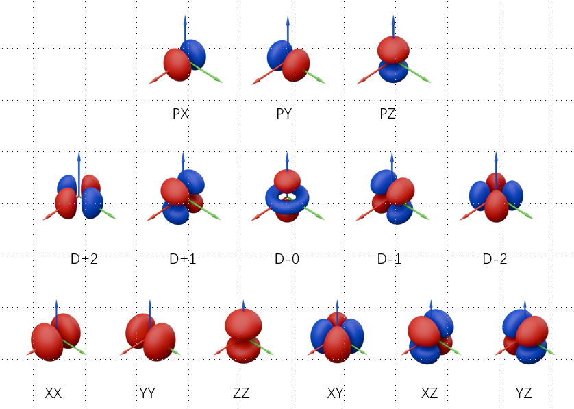
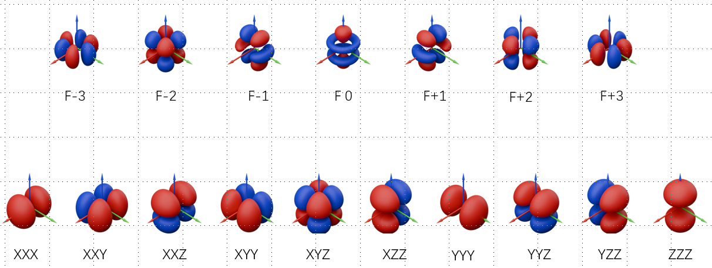

```python
from pywfn.datas import btrans
```


```python
print(btrans.MIX_S_SYMS)
print(btrans.MIX_P_SYMS)

print(btrans.SPH_D_SYMS)
print(btrans.SPH_F_SYMS)
print(btrans.SPH_G_SYMS)
print(btrans.SPH_H_SYMS)

print(btrans.CAR_D_SYMS)
print(btrans.CAR_F_SYMS)
print(btrans.CAR_G_SYMS)
print(btrans.CAR_H_SYMS)
```

    ['S']
    ['PX', 'PY', 'PZ']
    ['D 0', 'D+1', 'D-1', 'D+2', 'D-2']
    ['F 0', 'F+1', 'F-1', 'F+2', 'F-2', 'F+3', 'F-3']
    ['G 0', 'G+1', 'G-1', 'G+2', 'G-2', 'G+3', 'G-3', 'G+4', 'G-4']
    ['H 0', 'H+1', 'H-1', 'H+2', 'H-2', 'H+3', 'H-3', 'H+4', 'H-4', 'H+5', 'H-5']
    ['XX', 'YY', 'ZZ', 'XY', 'XZ', 'YZ']
    ['XXX', 'YYY', 'ZZZ', 'XYY', 'XXY', 'XXZ', 'XZZ', 'YZZ', 'YYZ', 'XYZ']
    ['ZZZZ', 'YZZZ', 'YYZZ', 'YYYZ', 'YYYY', 'XZZZ', 'XYZZ', 'XYYZ', 'XYYY', 'XXZZ', 'XXYZ', 'XXYY', 'XXXZ', 'XXXY', 'XXXX']
    ['ZZZZZ', 'YZZZZ', 'YYZZZ', 'YYYZZ', 'YYYYZ', 'YYYYY', 'XZZZZ', 'XYZZZ', 'XYYZZ', 'XYYYZ', 'XYYYY', 'XXZZZ', 'XXYZZ', 'XXYYZ', 'XXYYY', 'XXXZZ', 'XXXYZ', 'XXXYY', 'XXXXZ', 'XXXXY', 'XXXXX']
    



