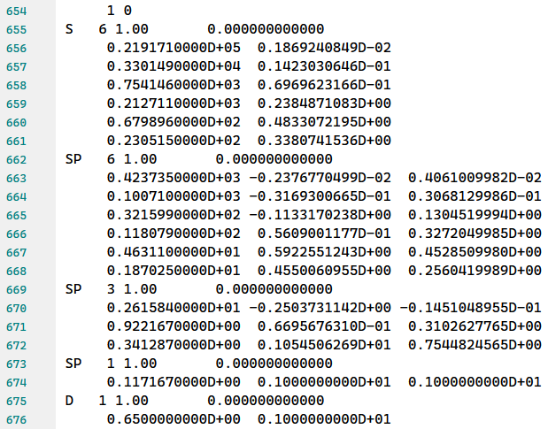

# 文件读取
文件读取的核心任务是从化学文件中提取出计算分子性质时需要的信息，主要分为三类

- 结构信息
- 基组信息
- 轨道信息

所有的读取器都包含在`pywfn.reader`中，当前支持的读取器及支持的信息如下：

|读取类|结构信息|基组信息|轨道信息|说明|
|:---:|:---:|:---:|:---:|:---:|
|`LogReader`|√|?|?|读取高斯的输出文件|
|`GjfReader`|√|×|×|读取高斯的输入文件|
|`FchReader`|√|√|√|读取高斯的检查点文件|
|`ModReader`|√|√|√|读取`.molden`文件|
|`XyzReader`|√|×|×|读取`.sdf`文件|
|`MolReader`|√|×|×|读取`.mol`文件|
|`SdfReader`|√|×|×|读取`.sdf`文件|
|`AnyReader`|?|?|?|可自定义信息|

## 信息详情

### 结构信息

包含原子的`类型`和`坐标`，以常见的高斯输入文件类型`gjf`为例

```
%chk=D:\gfile\C6H6.chk
# b3lyp/6-31g(d) pop=full gfinput iop(3/33=1)

Title Card Required

0 1
 C                  0.00000000    1.40140000   -0.00000000
 C                 -1.21364800    0.70070000   -0.00000000
 C                 -1.21364800   -0.70070000   -0.00000000
 C                  0.00000000   -1.40140000   -0.00000000
 C                  1.21364800   -0.70070000   -0.00000000
 C                  1.21364800    0.70070000   -0.00000000
 H                  0.00000000    2.47140000   -0.00000000
 H                 -2.14029518    1.23570000   -0.00000000
 H                 -2.14029518   -1.23570000   -0.00000000
 H                  0.00000000   -2.47140000   -0.00000000
 H                  2.14029518   -1.23570000   -0.00000000
 H                  2.14029518    1.23570000   -0.00000000


```

其中存储着原子的元素符号，即为原子类型，以及原子的xyz坐标，即原子坐标。

不同类型的文件存储使用的原子坐标的单位不同，可以为`Angstorm`或`Borh`，pywfn内部统一转为`Borh`单位。

### 基组信息
包含高斯型基函数的系数和指数

以`6-31g(d)`基组为例：

<!--  -->

```
      1 0
 S   6 1.00       0.000000000000
      0.3047524880D+04  0.1834737132D-02
      0.4573695180D+03  0.1403732281D-01
      0.1039486850D+03  0.6884262226D-01
      0.2921015530D+02  0.2321844432D+00
      0.9286662960D+01  0.4679413484D+00
      0.3163926960D+01  0.3623119853D+00
 SP   3 1.00       0.000000000000
      0.7868272350D+01 -0.1193324198D+00  0.6899906659D-01
      0.1881288540D+01 -0.1608541517D+00  0.3164239610D+00
      0.5442492580D+00  0.1143456438D+01  0.7443082909D+00
 SP   1 1.00       0.000000000000
      0.1687144782D+00  0.1000000000D+01  0.1000000000D+01
 D   1 1.00       0.000000000000
      0.8000000000D+00  0.1000000000D+01
```


- `1`行中的`1`代表当前基组信息属于第一个原子
- `2`行中`S`代表`1S`轨道，`6`代表`1S`轨道有`6`个GTO函数线性组合而成
- `3-8`中两列数据分别代表GTO函数的`指数`和`系数`
- `9`行中的`SP`代表`2S`和`2P`轨道，分别也是有`6`个GTO函数线性组合而成
- `10-12`中，第一列和第二列为`2S`和`2P`的GTO指数，第三列代表两者共享的系数
- 其它的也都是类似的

### 轨道信息


轨道信息主要就是与分子轨道相关的信息，主要包含：

- **轨道系数矩阵**。分为开窍层和闭壳层。形状为[nato,nobt]，对于闭壳层，nato=nobt；对于开窍层，nato*2=nobt
- **分子轨道-能量**。长度为nobt的浮点数列表。
- **分子轨道-占据**。长度为nobt的布尔值列表。表示分子轨道是否占据
- **原子轨道-原子索引**。每个原子轨道对应的原子索引
- **原子轨道-轨道壳层**。原子轨道对应的壳层索引。
- **原子轨道-轨道符号**。每个原子轨道的轨道符号。可以为：`S`、`PX`、`PY`、`PZ` 等等

这些信息都存储在`base.Coef`类型中

直接读取到的原子轨道信息混合了`笛卡尔型基函数`和`球谐型基函数`，在Coef类型中可以将转为全部为笛卡尔型或者全部为球谐型。

## fch文件

**示例代码**


```python
from pywfn.base import Mole
mole=Mole.from_file('./mols/C6H6.fch')
print(mole)
```

      0  1
    atm             x             y             z       crg
      C   -0.00000000    2.64826219    0.00000000    6.0000
      C    2.29346233    1.32413110    0.00000000    6.0000
      C    2.29346233   -1.32413109    0.00000000    6.0000
      C    0.00000000   -2.64826219    0.00000000    6.0000
      C   -2.29346233   -1.32413110    0.00000000    6.0000
      C   -2.29346233    1.32413109    0.00000000    6.0000
      H   -0.00000000    4.67026914    0.00000000    1.0000
      H    4.04457172    2.33513457    0.00000000    1.0000
      H    4.04457172   -2.33513457    0.00000000    1.0000
      H    0.00000000   -4.67026914    0.00000000    1.0000
      H   -4.04457172   -2.33513457    0.00000000    1.0000
      H   -4.04457172    2.33513457    0.00000000    1.0000
    idx  atm  shl  ang        form
    0    0    0    0           sph(6)
           3.047525E3   1.834737E-3
           4.573695E2   1.403732E-2
           1.039487E2   6.884262E-2
           2.921016E1   2.321844E-1
           9.286663E0   4.679413E-1
           3.163927E0   3.623120E-1
    1    0    1    0           sph(3)
           7.868272E0  -1.193324E-1
           1.881289E0  -1.608542E-1
          5.442493E-1    1.143456E0
    2    0    1    1           sph(3)
           7.868272E0   6.899907E-2
           1.881289E0   3.164240E-1
          5.442493E-1   7.443083E-1
    3    0    2    0           sph(1)
          1.687145E-1    1.000000E0
    4    0    2    1           sph(1)
          1.687145E-1    1.000000E0
    5    0    3    2           car(1)
          8.000000E-1    1.000000E0
    6    1    0    0           sph(6)
           3.047525E3   1.834737E-3
           4.573695E2   1.403732E-2
           1.039487E2   6.884262E-2
           2.921016E1   2.321844E-1
           9.286663E0   4.679413E-1
           3.163927E0   3.623120E-1
    7    1    1    0           sph(3)
           7.868272E0  -1.193324E-1
           1.881289E0  -1.608542E-1
          5.442493E-1    1.143456E0
    8    1    1    1           sph(3)
           7.868272E0   6.899907E-2
           1.881289E0   3.164240E-1
          5.442493E-1   7.443083E-1
    9    1    2    0           sph(1)
          1.687145E-1    1.000000E0
    10   1    2    1           sph(1)
          1.687145E-1    1.000000E0
    11   1    3    2           car(1)
          8.000000E-1    1.000000E0
    12   2    0    0           sph(6)
           3.047525E3   1.834737E-3
           4.573695E2   1.403732E-2
           1.039487E2   6.884262E-2
           2.921016E1   2.321844E-1
           9.286663E0   4.679413E-1
           3.163927E0   3.623120E-1
    13   2    1    0           sph(3)
           7.868272E0  -1.193324E-1
           1.881289E0  -1.608542E-1
          5.442493E-1    1.143456E0
    14   2    1    1           sph(3)
           7.868272E0   6.899907E-2
           1.881289E0   3.164240E-1
          5.442493E-1   7.443083E-1
    15   2    2    0           sph(1)
          1.687145E-1    1.000000E0
    16   2    2    1           sph(1)
          1.687145E-1    1.000000E0
    17   2    3    2           car(1)
          8.000000E-1    1.000000E0
    18   3    0    0           sph(6)
           3.047525E3   1.834737E-3
           4.573695E2   1.403732E-2
           1.039487E2   6.884262E-2
           2.921016E1   2.321844E-1
           9.286663E0   4.679413E-1
           3.163927E0   3.623120E-1
    19   3    1    0           sph(3)
           7.868272E0  -1.193324E-1
           1.881289E0  -1.608542E-1
          5.442493E-1    1.143456E0
    20   3    1    1           sph(3)
           7.868272E0   6.899907E-2
           1.881289E0   3.164240E-1
          5.442493E-1   7.443083E-1
    21   3    2    0           sph(1)
          1.687145E-1    1.000000E0
    22   3    2    1           sph(1)
          1.687145E-1    1.000000E0
    23   3    3    2           car(1)
          8.000000E-1    1.000000E0
    24   4    0    0           sph(6)
           3.047525E3   1.834737E-3
           4.573695E2   1.403732E-2
           1.039487E2   6.884262E-2
           2.921016E1   2.321844E-1
           9.286663E0   4.679413E-1
           3.163927E0   3.623120E-1
    25   4    1    0           sph(3)
           7.868272E0  -1.193324E-1
           1.881289E0  -1.608542E-1
          5.442493E-1    1.143456E0
    26   4    1    1           sph(3)
           7.868272E0   6.899907E-2
           1.881289E0   3.164240E-1
          5.442493E-1   7.443083E-1
    27   4    2    0           sph(1)
          1.687145E-1    1.000000E0
    28   4    2    1           sph(1)
          1.687145E-1    1.000000E0
    29   4    3    2           car(1)
          8.000000E-1    1.000000E0
    30   5    0    0           sph(6)
           3.047525E3   1.834737E-3
           4.573695E2   1.403732E-2
           1.039487E2   6.884262E-2
           2.921016E1   2.321844E-1
           9.286663E0   4.679413E-1
           3.163927E0   3.623120E-1
    31   5    1    0           sph(3)
           7.868272E0  -1.193324E-1
           1.881289E0  -1.608542E-1
          5.442493E-1    1.143456E0
    32   5    1    1           sph(3)
           7.868272E0   6.899907E-2
           1.881289E0   3.164240E-1
          5.442493E-1   7.443083E-1
    33   5    2    0           sph(1)
          1.687145E-1    1.000000E0
    34   5    2    1           sph(1)
          1.687145E-1    1.000000E0
    35   5    3    2           car(1)
          8.000000E-1    1.000000E0
    36   6    0    0           sph(3)
           1.873114E1   3.349460E-2
           2.825394E0   2.347270E-1
          6.401217E-1   8.137573E-1
    37   6    1    0           sph(1)
          1.612778E-1    1.000000E0
    38   7    0    0           sph(3)
           1.873114E1   3.349460E-2
           2.825394E0   2.347270E-1
          6.401217E-1   8.137573E-1
    39   7    1    0           sph(1)
          1.612778E-1    1.000000E0
    40   8    0    0           sph(3)
           1.873114E1   3.349460E-2
           2.825394E0   2.347270E-1
          6.401217E-1   8.137573E-1
    41   8    1    0           sph(1)
          1.612778E-1    1.000000E0
    42   9    0    0           sph(3)
           1.873114E1   3.349460E-2
           2.825394E0   2.347270E-1
          6.401217E-1   8.137573E-1
    43   9    1    0           sph(1)
          1.612778E-1    1.000000E0
    44   10   0    0           sph(3)
           1.873114E1   3.349460E-2
           2.825394E0   2.347270E-1
          6.401217E-1   8.137573E-1
    45   10   1    0           sph(1)
          1.612778E-1    1.000000E0
    46   11   0    0           sph(3)
           1.873114E1   3.349460E-2
           2.825394E0   2.347270E-1
          6.401217E-1   8.137573E-1
    47   11   1    0           sph(1)
          1.612778E-1    1.000000E0
                             1  2      2  2      3  2      4  2      5  2      6  2      7  2      8  2      9  2     10  2
                         -10.1865  -10.1863  -10.1863  -10.1857  -10.1857  -10.1855   -0.8438   -0.7396   -0.7396   -0.5992
      1  1 C  1    S  0    0.4051    0.5731    0.0000    0.0000    0.5733    0.4056   -0.0940    0.0000   -0.1304   -0.1026
      2  1 C  2    S  1    0.0198    0.0284    0.0000    0.0000    0.0289    0.0211    0.1797    0.0000    0.2575    0.2122
      3  1 C  2   PX  1    0.0000    0.0000   -0.0003   -0.0002    0.0000    0.0000    0.0000    0.1134    0.0000    0.0000
      4  1 C  2   PY  1    0.0001   -0.0000    0.0000    0.0000   -0.0002   -0.0003   -0.0583    0.0000   -0.0181    0.0744
      5  1 C  2   PZ  1    0.0000    0.0000    0.0000    0.0000    0.0000    0.0000    0.0000    0.0000    0.0000    0.0000
      6  1 C  3    S  1   -0.0026   -0.0059    0.0000    0.0000   -0.0114   -0.0200    0.1146    0.0000    0.1910    0.1613
      7  1 C  3   PX  1    0.0000    0.0000    0.0015    0.0014    0.0000    0.0000    0.0000    0.0196    0.0000    0.0000
      8  1 C  3   PY  1   -0.0004    0.0003    0.0000    0.0000    0.0023    0.0084   -0.0069    0.0000    0.0096    0.0546
      9  1 C  3   PZ  1    0.0000    0.0000    0.0000    0.0000    0.0000    0.0000    0.0000    0.0000    0.0000    0.0000
     10  1 C  4   XX  1   -0.0040   -0.0056    0.0000    0.0000   -0.0051   -0.0033    0.0031    0.0000    0.0025   -0.0076
     11  1 C  4   YY  1   -0.0039   -0.0055    0.0000    0.0000   -0.0053   -0.0035    0.0030    0.0000    0.0015    0.0038
     12  1 C  4   ZZ  1   -0.0041   -0.0056    0.0000    0.0000   -0.0055   -0.0036   -0.0107    0.0000   -0.0127   -0.0083
     13  1 C  4   XY  1    0.0000    0.0000    0.0001    0.0001    0.0000    0.0000    0.0000   -0.0104    0.0000    0.0000
     14  1 C  4   XZ  1    0.0000    0.0000    0.0000    0.0000    0.0000    0.0000    0.0000    0.0000    0.0000    0.0000
     15  1 C  4   YZ  1    0.0000    0.0000    0.0000    0.0000    0.0000    0.0000    0.0000    0.0000    0.0000    0.0000
     16  2 C  1    S  0    0.4051    0.2865    0.4963    0.4965   -0.2866   -0.4056   -0.0940   -0.1130   -0.0652    0.0513
     17  2 C  2    S  1    0.0198    0.0142    0.0246    0.0250   -0.0144   -0.0211    0.1797    0.2230    0.1288   -0.1061
     18  2 C  2   PX  1    0.0001    0.0001   -0.0001   -0.0001    0.0002    0.0002   -0.0505    0.0148   -0.0570   -0.1189
     19  2 C  2   PY  1    0.0001   -0.0002    0.0001   -0.0002   -0.0001    0.0001   -0.0291   -0.0570    0.0805    0.1317
     20  2 C  2   PZ  1    0.0000    0.0000    0.0000    0.0000    0.0000    0.0000    0.0000    0.0000    0.0000    0.0000
     21  2 C  3    S  1   -0.0026   -0.0029   -0.0051   -0.0099    0.0057    0.0200    0.1146    0.1654    0.0955   -0.0806
     22  2 C  3   PX  1   -0.0003   -0.0005    0.0006    0.0014   -0.0016   -0.0073   -0.0060    0.0121   -0.0043   -0.0467
     23  2 C  3   PY  1   -0.0002    0.0012   -0.0005    0.0016    0.0005   -0.0042   -0.0034   -0.0043    0.0171    0.0263
     24  2 C  3   PZ  1    0.0000    0.0000    0.0000    0.0000    0.0000    0.0000    0.0000    0.0000    0.0000    0.0000
     25  2 C  4   XX  1   -0.0040   -0.0028   -0.0048   -0.0046    0.0025    0.0035    0.0030   -0.0024    0.0077    0.0053
     26  2 C  4   YY  1   -0.0040   -0.0027   -0.0048   -0.0044    0.0026    0.0034    0.0031    0.0059   -0.0057   -0.0034
     27  2 C  4   ZZ  1   -0.0041   -0.0028   -0.0048   -0.0047    0.0027    0.0036   -0.0107   -0.0110   -0.0064    0.0041
     28  2 C  4   XY  1    0.0001    0.0000    0.0000   -0.0001    0.0001    0.0001   -0.0000    0.0022   -0.0048   -0.0067
     29  2 C  4   XZ  1    0.0000    0.0000    0.0000    0.0000    0.0000    0.0000    0.0000    0.0000    0.0000    0.0000
     30  2 C  4   YZ  1    0.0000    0.0000    0.0000    0.0000    0.0000    0.0000    0.0000    0.0000    0.0000    0.0000
     31  3 C  1    S  0    0.4051   -0.2865    0.4963   -0.4965   -0.2866    0.4056   -0.0940   -0.1130    0.0652    0.0513
     32  3 C  2    S  1    0.0198   -0.0142    0.0246   -0.0250   -0.0144    0.0211    0.1797    0.2230   -0.1288   -0.1061
     33  3 C  2   PX  1    0.0001   -0.0001   -0.0001    0.0001    0.0002   -0.0002   -0.0505    0.0148    0.0570   -0.1189
     34  3 C  2   PY  1   -0.0001   -0.0002   -0.0001   -0.0002    0.0001    0.0001    0.0291    0.0570    0.0805   -0.1317
     35  3 C  2   PZ  1    0.0000    0.0000    0.0000    0.0000    0.0000    0.0000    0.0000    0.0000    0.0000    0.0000
     36  3 C  3    S  1   -0.0026    0.0029   -0.0051    0.0099    0.0057   -0.0200    0.1146    0.1654   -0.0955   -0.0806
     37  3 C  3   PX  1   -0.0003    0.0005    0.0006   -0.0014   -0.0016    0.0073   -0.0060    0.0121    0.0043   -0.0467
     38  3 C  3   PY  1    0.0002    0.0012    0.0005    0.0016   -0.0005   -0.0042    0.0034    0.0043    0.0171   -0.0263
     39  3 C  3   PZ  1    0.0000    0.0000    0.0000    0.0000    0.0000    0.0000    0.0000    0.0000    0.0000    0.0000
     40  3 C  4   XX  1   -0.0040    0.0028   -0.0048    0.0046    0.0025   -0.0035    0.0030   -0.0024   -0.0077    0.0053
     41  3 C  4   YY  1   -0.0040    0.0027   -0.0048    0.0044    0.0026   -0.0034    0.0031    0.0059    0.0057   -0.0034
     42  3 C  4   ZZ  1   -0.0041    0.0028   -0.0048    0.0047    0.0027   -0.0036   -0.0107   -0.0110    0.0064    0.0041
     43  3 C  4   XY  1   -0.0001    0.0000   -0.0000   -0.0001   -0.0001    0.0001    0.0000   -0.0022   -0.0048    0.0067
     44  3 C  4   XZ  1    0.0000    0.0000    0.0000    0.0000    0.0000    0.0000    0.0000    0.0000    0.0000    0.0000
     45  3 C  4   YZ  1    0.0000    0.0000    0.0000    0.0000    0.0000    0.0000    0.0000    0.0000    0.0000    0.0000
     46  4 C  1    S  0    0.4051   -0.5731    0.0000    0.0000    0.5733   -0.4056   -0.0940    0.0000    0.1304   -0.1026
     47  4 C  2    S  1    0.0198   -0.0284    0.0000    0.0000    0.0289   -0.0211    0.1797    0.0000   -0.2575    0.2122
     48  4 C  2   PX  1    0.0000    0.0000   -0.0003    0.0002    0.0000    0.0000    0.0000    0.1134    0.0000    0.0000
     49  4 C  2   PY  1   -0.0001   -0.0000    0.0000    0.0000    0.0002   -0.0003    0.0583    0.0000   -0.0181   -0.0744
     50  4 C  2   PZ  1    0.0000    0.0000    0.0000    0.0000    0.0000    0.0000    0.0000    0.0000    0.0000    0.0000
     51  4 C  3    S  1   -0.0026    0.0059    0.0000    0.0000   -0.0114    0.0200    0.1146    0.0000   -0.1910    0.1613
     52  4 C  3   PX  1    0.0000    0.0000    0.0015   -0.0014    0.0000    0.0000    0.0000    0.0196    0.0000    0.0000
     53  4 C  3   PY  1    0.0004    0.0003    0.0000    0.0000   -0.0023    0.0084    0.0069    0.0000    0.0096   -0.0546
     54  4 C  3   PZ  1    0.0000    0.0000    0.0000    0.0000    0.0000    0.0000    0.0000    0.0000    0.0000    0.0000
     55  4 C  4   XX  1   -0.0040    0.0056    0.0000    0.0000   -0.0051    0.0033    0.0031    0.0000   -0.0025   -0.0076
     56  4 C  4   YY  1   -0.0039    0.0055    0.0000    0.0000   -0.0053    0.0035    0.0030    0.0000   -0.0015    0.0038
     57  4 C  4   ZZ  1   -0.0041    0.0056    0.0000    0.0000   -0.0055    0.0036   -0.0107    0.0000    0.0127   -0.0083
     58  4 C  4   XY  1    0.0000    0.0000   -0.0001    0.0001    0.0000    0.0000    0.0000    0.0104    0.0000    0.0000
     59  4 C  4   XZ  1    0.0000    0.0000    0.0000    0.0000    0.0000    0.0000    0.0000    0.0000    0.0000    0.0000
     60  4 C  4   YZ  1    0.0000    0.0000    0.0000    0.0000    0.0000    0.0000    0.0000    0.0000    0.0000    0.0000
     61  5 C  1    S  0    0.4051   -0.2865   -0.4963    0.4965   -0.2866    0.4056   -0.0940    0.1130    0.0652    0.0513
     62  5 C  2    S  1    0.0198   -0.0142   -0.0246    0.0250   -0.0144    0.0211    0.1797   -0.2230   -0.1288   -0.1061
     63  5 C  2   PX  1   -0.0001    0.0001   -0.0001    0.0001   -0.0002    0.0002    0.0505    0.0148   -0.0570    0.1189
     64  5 C  2   PY  1   -0.0001   -0.0002    0.0001    0.0002    0.0001    0.0001    0.0291   -0.0570    0.0805   -0.1317
     65  5 C  2   PZ  1    0.0000    0.0000    0.0000    0.0000    0.0000    0.0000    0.0000    0.0000    0.0000    0.0000
     66  5 C  3    S  1   -0.0026    0.0029    0.0051   -0.0099    0.0057   -0.0200    0.1146   -0.1654   -0.0955   -0.0806
     67  5 C  3   PX  1    0.0003   -0.0005    0.0006   -0.0014    0.0016   -0.0073    0.0060    0.0121   -0.0043    0.0467
     68  5 C  3   PY  1    0.0002    0.0012   -0.0005   -0.0016   -0.0005   -0.0042    0.0034   -0.0043    0.0171   -0.0263
     69  5 C  3   PZ  1    0.0000    0.0000    0.0000    0.0000    0.0000    0.0000    0.0000    0.0000    0.0000    0.0000
     70  5 C  4   XX  1   -0.0040    0.0028    0.0048   -0.0046    0.0025   -0.0035    0.0030    0.0024   -0.0077    0.0053
     71  5 C  4   YY  1   -0.0040    0.0027    0.0048   -0.0044    0.0026   -0.0034    0.0031   -0.0059    0.0057   -0.0034
     72  5 C  4   ZZ  1   -0.0041    0.0028    0.0048   -0.0047    0.0027   -0.0036   -0.0107    0.0110    0.0064    0.0041
     73  5 C  4   XY  1    0.0001   -0.0000   -0.0000   -0.0001    0.0001   -0.0001   -0.0000   -0.0022    0.0048   -0.0067
     74  5 C  4   XZ  1    0.0000    0.0000    0.0000    0.0000    0.0000    0.0000    0.0000    0.0000    0.0000    0.0000
     75  5 C  4   YZ  1    0.0000    0.0000    0.0000    0.0000    0.0000    0.0000    0.0000    0.0000    0.0000    0.0000
     76  6 C  1    S  0    0.4051    0.2865   -0.4963   -0.4965   -0.2866   -0.4056   -0.0940    0.1130   -0.0652    0.0513
     77  6 C  2    S  1    0.0198    0.0142   -0.0246   -0.0250   -0.0144   -0.0211    0.1797   -0.2230    0.1288   -0.1061
     78  6 C  2   PX  1   -0.0001   -0.0001   -0.0001   -0.0001   -0.0002   -0.0002    0.0505    0.0148    0.0570    0.1189
     79  6 C  2   PY  1    0.0001   -0.0002   -0.0001    0.0002   -0.0001    0.0001   -0.0291    0.0570    0.0805    0.1317
     80  6 C  2   PZ  1    0.0000    0.0000    0.0000    0.0000    0.0000    0.0000    0.0000    0.0000    0.0000    0.0000
     81  6 C  3    S  1   -0.0026   -0.0029    0.0051    0.0099    0.0057    0.0200    0.1146   -0.1654    0.0955   -0.0806
     82  6 C  3   PX  1    0.0003    0.0005    0.0006    0.0014    0.0016    0.0073    0.0060    0.0121    0.0043    0.0467
     83  6 C  3   PY  1   -0.0002    0.0012    0.0005   -0.0016    0.0005   -0.0042   -0.0034    0.0043    0.0171    0.0263
     84  6 C  3   PZ  1    0.0000    0.0000    0.0000    0.0000    0.0000    0.0000    0.0000    0.0000    0.0000    0.0000
     85  6 C  4   XX  1   -0.0040   -0.0028    0.0048    0.0046    0.0025    0.0035    0.0030    0.0024    0.0077    0.0053
     86  6 C  4   YY  1   -0.0040   -0.0027    0.0048    0.0044    0.0026    0.0034    0.0031   -0.0059   -0.0057   -0.0034
     87  6 C  4   ZZ  1   -0.0041   -0.0028    0.0048    0.0047    0.0027    0.0036   -0.0107    0.0110   -0.0064    0.0041
     88  6 C  4   XY  1   -0.0001   -0.0000    0.0000   -0.0001   -0.0001   -0.0001    0.0000    0.0022    0.0048    0.0067
     89  6 C  4   XZ  1    0.0000    0.0000    0.0000    0.0000    0.0000    0.0000    0.0000    0.0000    0.0000    0.0000
     90  6 C  4   YZ  1    0.0000    0.0000    0.0000    0.0000    0.0000    0.0000    0.0000    0.0000    0.0000    0.0000
     91  7 H  1    S  0   -0.0002   -0.0003    0.0000    0.0000   -0.0002   -0.0003    0.0372    0.0000    0.0810    0.1176
     92  7 H  2    S  1    0.0009    0.0010    0.0000    0.0000    0.0007   -0.0010    0.0044    0.0000    0.0154    0.0402
     93  8 H  1    S  0   -0.0002   -0.0001   -0.0002   -0.0002    0.0001    0.0003    0.0372    0.0702    0.0405   -0.0588
     94  8 H  2    S  1    0.0009    0.0005    0.0008    0.0006   -0.0004    0.0010    0.0044    0.0133    0.0077   -0.0201
     95  9 H  1    S  0   -0.0002    0.0001   -0.0002    0.0002    0.0001   -0.0003    0.0372    0.0702   -0.0405   -0.0588
     96  9 H  2    S  1    0.0009   -0.0005    0.0008   -0.0006   -0.0004   -0.0010    0.0044    0.0133   -0.0077   -0.0201
     97 10 H  1    S  0   -0.0002    0.0003    0.0000    0.0000   -0.0002    0.0003    0.0372    0.0000   -0.0810    0.1176
     98 10 H  2    S  1    0.0009   -0.0010    0.0000    0.0000    0.0007    0.0010    0.0044    0.0000   -0.0154    0.0402
     99 11 H  1    S  0   -0.0002    0.0001    0.0002   -0.0002    0.0001   -0.0003    0.0372   -0.0702   -0.0405   -0.0588
    100 11 H  2    S  1    0.0009   -0.0005   -0.0008    0.0006   -0.0004   -0.0010    0.0044   -0.0133   -0.0077   -0.0201
    101 12 H  1    S  0   -0.0002   -0.0001    0.0002    0.0002    0.0001    0.0003    0.0372   -0.0702    0.0405   -0.0588
    102 12 H  2    S  1    0.0009    0.0005   -0.0008   -0.0006   -0.0004    0.0010    0.0044   -0.0133    0.0077   -0.0201
                            11  2     12  2     13  2     14  2     15  2     16  2     17  2     18  2     19  2     20  2
                          -0.5992   -0.5204   -0.4651   -0.4361   -0.4188   -0.4188   -0.3572   -0.3416   -0.3416   -0.2451
      1  1 C  1    S  0    0.0000   -0.0079   -0.0597    0.0000    0.0000    0.0244    0.0000   -0.0057    0.0000    0.0000
      2  1 C  2    S  1    0.0000    0.0166    0.1223    0.0000    0.0000   -0.0559    0.0000    0.0218    0.0000    0.0000
      3  1 C  2   PX  1    0.2003    0.0000    0.0000    0.2746   -0.0876    0.0000    0.0000    0.0000    0.2711    0.0000
      4  1 C  2   PY  1    0.0000    0.2001    0.1347    0.0000    0.0000    0.3073    0.0000   -0.2264    0.0000    0.0000
      5  1 C  2   PZ  1    0.0000    0.0000    0.0000    0.0000    0.0000    0.0000    0.2218    0.0000    0.0000    0.3393
      6  1 C  3    S  1    0.0000    0.0278    0.1640    0.0000    0.0000   -0.0995    0.0000   -0.0217    0.0000    0.0000
      7  1 C  3   PX  1    0.0533    0.0000    0.0000    0.0933    0.0191    0.0000    0.0000    0.0000    0.1071    0.0000
      8  1 C  3   PY  1    0.0000    0.0677    0.0332    0.0000    0.0000    0.0932    0.0000   -0.0352    0.0000    0.0000
      9  1 C  3   PZ  1    0.0000    0.0000    0.0000    0.0000    0.0000    0.0000    0.1296    0.0000    0.0000    0.2447
     10  1 C  4   XX  1    0.0000    0.0033   -0.0158    0.0000    0.0000   -0.0034    0.0000    0.0149    0.0000    0.0000
     11  1 C  4   YY  1    0.0000    0.0007    0.0127    0.0000    0.0000    0.0118    0.0000   -0.0233    0.0000    0.0000
     12  1 C  4   ZZ  1    0.0000   -0.0002   -0.0049    0.0000    0.0000    0.0007    0.0000    0.0012    0.0000    0.0000
     13  1 C  4   XY  1   -0.0089    0.0000    0.0000   -0.0037    0.0134    0.0000    0.0000    0.0000   -0.0114    0.0000
     14  1 C  4   XZ  1    0.0000    0.0000    0.0000    0.0000    0.0000    0.0000    0.0000    0.0000    0.0000    0.0000
     15  1 C  4   YZ  1    0.0000    0.0000    0.0000    0.0000    0.0000    0.0000   -0.0093    0.0000    0.0000   -0.0045
     16  2 C  1    S  0   -0.0889   -0.0079    0.0597   -0.0000    0.0211    0.0122    0.0000    0.0028   -0.0049    0.0000
     17  2 C  2    S  1    0.1838    0.0166   -0.1223    0.0000   -0.0484   -0.0280    0.0000   -0.0109    0.0189    0.0000
     18  2 C  2   PX  1    0.0057    0.1733   -0.1167   -0.1373    0.2086    0.1710    0.0000   -0.0194   -0.2376    0.0000
     19  2 C  2   PY  1    0.1189    0.1000   -0.0674    0.2378    0.1710    0.0112    0.0000    0.2599    0.0194    0.0000
     20  2 C  2   PZ  1    0.0000    0.0000    0.0000    0.0000    0.0000    0.0000    0.2218    0.0000    0.0000    0.1697
     21  2 C  3    S  1    0.1397    0.0278   -0.1640   -0.0000   -0.0861   -0.0497    0.0000    0.0108   -0.0188    0.0000
     22  2 C  3   PX  1    0.0276    0.0586   -0.0287   -0.0467    0.0747    0.0321    0.0000   -0.0311   -0.0532    0.0000
     23  2 C  3   PY  1    0.0467    0.0338   -0.0166    0.0808    0.0321    0.0377    0.0000    0.0891    0.0311    0.0000
     24  2 C  3   PZ  1    0.0000    0.0000    0.0000    0.0000    0.0000    0.0000    0.1296    0.0000    0.0000    0.1223
     25  2 C  4   XX  1    0.0042    0.0013   -0.0056    0.0027    0.0119   -0.0047    0.0000    0.0143   -0.0076    0.0000
     26  2 C  4   YY  1   -0.0074    0.0026    0.0087   -0.0027   -0.0047    0.0089    0.0000   -0.0101    0.0004    0.0000
     27  2 C  4   ZZ  1   -0.0072   -0.0002    0.0049    0.0000    0.0006    0.0003    0.0000   -0.0006    0.0010    0.0000
     28  2 C  4   XY  1    0.0027   -0.0013   -0.0143   -0.0018    0.0033    0.0096    0.0000    0.0046   -0.0194    0.0000
     29  2 C  4   XZ  1    0.0000    0.0000    0.0000    0.0000    0.0000    0.0000   -0.0080    0.0000    0.0000   -0.0101
     30  2 C  4   YZ  1    0.0000    0.0000    0.0000    0.0000    0.0000    0.0000   -0.0046    0.0000    0.0000    0.0129
     31  3 C  1    S  0    0.0889   -0.0079   -0.0597   -0.0000    0.0211   -0.0122    0.0000    0.0028    0.0049    0.0000
     32  3 C  2    S  1   -0.1838    0.0166    0.1223    0.0000   -0.0484    0.0280    0.0000   -0.0109   -0.0189    0.0000
     33  3 C  2   PX  1   -0.0057    0.1733    0.1167   -0.1373    0.2086   -0.1710    0.0000   -0.0194    0.2376    0.0000
     34  3 C  2   PY  1    0.1189   -0.1000   -0.0674   -0.2378   -0.1710    0.0112    0.0000   -0.2599    0.0194    0.0000
     35  3 C  2   PZ  1    0.0000    0.0000    0.0000    0.0000    0.0000    0.0000    0.2218    0.0000    0.0000   -0.1697
     36  3 C  3    S  1   -0.1397    0.0278    0.1640   -0.0000   -0.0861    0.0497    0.0000    0.0108    0.0188    0.0000
     37  3 C  3   PX  1   -0.0276    0.0586    0.0287   -0.0467    0.0747   -0.0321    0.0000   -0.0311    0.0532    0.0000
     38  3 C  3   PY  1    0.0467   -0.0338   -0.0166   -0.0808   -0.0321    0.0377    0.0000   -0.0891    0.0311    0.0000
     39  3 C  3   PZ  1    0.0000    0.0000    0.0000    0.0000    0.0000    0.0000    0.1296    0.0000    0.0000   -0.1223
     40  3 C  4   XX  1   -0.0042    0.0013    0.0056    0.0027    0.0119    0.0047    0.0000    0.0143    0.0076    0.0000
     41  3 C  4   YY  1    0.0074    0.0026   -0.0087   -0.0027   -0.0047   -0.0089    0.0000   -0.0101   -0.0004    0.0000
     42  3 C  4   ZZ  1    0.0072   -0.0002   -0.0049    0.0000    0.0006   -0.0003    0.0000   -0.0006   -0.0010    0.0000
     43  3 C  4   XY  1    0.0027    0.0013   -0.0143    0.0018   -0.0033    0.0096    0.0000   -0.0046   -0.0194    0.0000
     44  3 C  4   XZ  1    0.0000    0.0000    0.0000    0.0000    0.0000    0.0000   -0.0080    0.0000    0.0000    0.0101
     45  3 C  4   YZ  1    0.0000    0.0000    0.0000    0.0000    0.0000    0.0000    0.0046    0.0000    0.0000    0.0129
     46  4 C  1    S  0    0.0000   -0.0079    0.0597    0.0000    0.0000   -0.0244    0.0000   -0.0057    0.0000    0.0000
     47  4 C  2    S  1    0.0000    0.0166   -0.1223    0.0000    0.0000    0.0559    0.0000    0.0218    0.0000    0.0000
     48  4 C  2   PX  1   -0.2003    0.0000    0.0000    0.2746   -0.0876    0.0000    0.0000    0.0000   -0.2711    0.0000
     49  4 C  2   PY  1    0.0000   -0.2001    0.1347    0.0000    0.0000    0.3073    0.0000    0.2264    0.0000    0.0000
     50  4 C  2   PZ  1    0.0000    0.0000    0.0000    0.0000    0.0000    0.0000    0.2218    0.0000    0.0000   -0.3393
     51  4 C  3    S  1    0.0000    0.0278   -0.1640    0.0000    0.0000    0.0995    0.0000   -0.0217    0.0000    0.0000
     52  4 C  3   PX  1   -0.0533    0.0000    0.0000    0.0933    0.0191    0.0000    0.0000    0.0000   -0.1071    0.0000
     53  4 C  3   PY  1    0.0000   -0.0677    0.0332    0.0000    0.0000    0.0932    0.0000    0.0352    0.0000    0.0000
     54  4 C  3   PZ  1    0.0000    0.0000    0.0000    0.0000    0.0000    0.0000    0.1296    0.0000    0.0000   -0.2447
     55  4 C  4   XX  1    0.0000    0.0033    0.0158    0.0000    0.0000    0.0034    0.0000    0.0149    0.0000    0.0000
     56  4 C  4   YY  1    0.0000    0.0007   -0.0127    0.0000    0.0000   -0.0118    0.0000   -0.0233    0.0000    0.0000
     57  4 C  4   ZZ  1    0.0000   -0.0002    0.0049    0.0000    0.0000   -0.0007    0.0000    0.0012    0.0000    0.0000
     58  4 C  4   XY  1   -0.0089    0.0000    0.0000    0.0037   -0.0134    0.0000    0.0000    0.0000   -0.0114    0.0000
     59  4 C  4   XZ  1    0.0000    0.0000    0.0000    0.0000    0.0000    0.0000    0.0000    0.0000    0.0000    0.0000
     60  4 C  4   YZ  1    0.0000    0.0000    0.0000    0.0000    0.0000    0.0000    0.0093    0.0000    0.0000   -0.0045
     61  5 C  1    S  0   -0.0889   -0.0079   -0.0597    0.0000   -0.0211   -0.0122    0.0000    0.0028   -0.0049    0.0000
     62  5 C  2    S  1    0.1838    0.0166    0.1223   -0.0000    0.0484    0.0280    0.0000   -0.0109    0.0189    0.0000
     63  5 C  2   PX  1   -0.0057   -0.1733   -0.1167   -0.1373    0.2086    0.1710    0.0000    0.0194    0.2376    0.0000
     64  5 C  2   PY  1   -0.1189   -0.1000   -0.0674    0.2378    0.1710    0.0112    0.0000   -0.2599   -0.0194    0.0000
     65  5 C  2   PZ  1    0.0000    0.0000    0.0000    0.0000    0.0000    0.0000    0.2218    0.0000    0.0000   -0.1697
     66  5 C  3    S  1    0.1397    0.0278    0.1640    0.0000    0.0861    0.0497    0.0000    0.0108   -0.0188    0.0000
     67  5 C  3   PX  1   -0.0276   -0.0586   -0.0287   -0.0467    0.0747    0.0321    0.0000    0.0311    0.0532    0.0000
     68  5 C  3   PY  1   -0.0467   -0.0338   -0.0166    0.0808    0.0321    0.0377    0.0000   -0.0891   -0.0311    0.0000
     69  5 C  3   PZ  1    0.0000    0.0000    0.0000    0.0000    0.0000    0.0000    0.1296    0.0000    0.0000   -0.1223
     70  5 C  4   XX  1    0.0042    0.0013    0.0056   -0.0027   -0.0119    0.0047    0.0000    0.0143   -0.0076    0.0000
     71  5 C  4   YY  1   -0.0074    0.0026   -0.0087    0.0027    0.0047   -0.0089    0.0000   -0.0101    0.0004    0.0000
     72  5 C  4   ZZ  1   -0.0072   -0.0002   -0.0049   -0.0000   -0.0006   -0.0003    0.0000   -0.0006    0.0010    0.0000
     73  5 C  4   XY  1    0.0027   -0.0013    0.0143    0.0018   -0.0033   -0.0096    0.0000    0.0046   -0.0194    0.0000
     74  5 C  4   XZ  1    0.0000    0.0000    0.0000    0.0000    0.0000    0.0000    0.0080    0.0000    0.0000   -0.0101
     75  5 C  4   YZ  1    0.0000    0.0000    0.0000    0.0000    0.0000    0.0000    0.0046    0.0000    0.0000    0.0129
     76  6 C  1    S  0    0.0889   -0.0079    0.0597    0.0000   -0.0211    0.0122    0.0000    0.0028    0.0049    0.0000
     77  6 C  2    S  1   -0.1838    0.0166   -0.1223   -0.0000    0.0484   -0.0280    0.0000   -0.0109   -0.0189    0.0000
     78  6 C  2   PX  1    0.0057   -0.1733    0.1167   -0.1373    0.2086   -0.1710    0.0000    0.0194   -0.2376    0.0000
     79  6 C  2   PY  1   -0.1189    0.1000   -0.0674   -0.2378   -0.1710    0.0112    0.0000    0.2599   -0.0194    0.0000
     80  6 C  2   PZ  1    0.0000    0.0000    0.0000    0.0000    0.0000    0.0000    0.2218    0.0000    0.0000    0.1697
     81  6 C  3    S  1   -0.1397    0.0278   -0.1640    0.0000    0.0861   -0.0497    0.0000    0.0108    0.0188    0.0000
     82  6 C  3   PX  1    0.0276   -0.0586    0.0287   -0.0467    0.0747   -0.0321    0.0000    0.0311   -0.0532    0.0000
     83  6 C  3   PY  1   -0.0467    0.0338   -0.0166   -0.0808   -0.0321    0.0377    0.0000    0.0891   -0.0311    0.0000
     84  6 C  3   PZ  1    0.0000    0.0000    0.0000    0.0000    0.0000    0.0000    0.1296    0.0000    0.0000    0.1223
     85  6 C  4   XX  1   -0.0042    0.0013   -0.0056   -0.0027   -0.0119   -0.0047    0.0000    0.0143    0.0076    0.0000
     86  6 C  4   YY  1    0.0074    0.0026    0.0087    0.0027    0.0047    0.0089    0.0000   -0.0101   -0.0004    0.0000
     87  6 C  4   ZZ  1    0.0072   -0.0002    0.0049   -0.0000   -0.0006    0.0003    0.0000   -0.0006   -0.0010    0.0000
     88  6 C  4   XY  1    0.0027    0.0013    0.0143   -0.0018    0.0033   -0.0096    0.0000   -0.0046   -0.0194    0.0000
     89  6 C  4   XZ  1    0.0000    0.0000    0.0000    0.0000    0.0000    0.0000    0.0080    0.0000    0.0000    0.0101
     90  6 C  4   YZ  1    0.0000    0.0000    0.0000    0.0000    0.0000    0.0000   -0.0046    0.0000    0.0000    0.0129
     91  7 H  1    S  0    0.0000    0.1089    0.1412    0.0000    0.0000    0.1661    0.0000   -0.1692    0.0000    0.0000
     92  7 H  2    S  1    0.0000    0.0667    0.0979    0.0000    0.0000    0.1571    0.0000   -0.1938    0.0000    0.0000
     93  8 H  1    S  0    0.1018    0.1089   -0.1412   -0.0000    0.1438    0.0831    0.0000    0.0846   -0.1465    0.0000
     94  8 H  2    S  1    0.0348    0.0667   -0.0979   -0.0000    0.1360    0.0785    0.0000    0.0969   -0.1679    0.0000
     95  9 H  1    S  0   -0.1018    0.1089    0.1412   -0.0000    0.1438   -0.0831    0.0000    0.0846    0.1465    0.0000
     96  9 H  2    S  1   -0.0348    0.0667    0.0979   -0.0000    0.1360   -0.0785    0.0000    0.0969    0.1679    0.0000
     97 10 H  1    S  0    0.0000    0.1089   -0.1412    0.0000    0.0000   -0.1661    0.0000   -0.1692    0.0000    0.0000
     98 10 H  2    S  1    0.0000    0.0667   -0.0979    0.0000    0.0000   -0.1571    0.0000   -0.1938    0.0000    0.0000
     99 11 H  1    S  0    0.1018    0.1089    0.1412    0.0000   -0.1438   -0.0831    0.0000    0.0846   -0.1465    0.0000
    100 11 H  2    S  1    0.0348    0.0667    0.0979    0.0000   -0.1360   -0.0785    0.0000    0.0969   -0.1679    0.0000
    101 12 H  1    S  0   -0.1018    0.1089   -0.1412    0.0000   -0.1438    0.0831    0.0000    0.0846    0.1465    0.0000
    102 12 H  2    S  1   -0.0348    0.0667   -0.0979    0.0000   -0.1360    0.0785    0.0000    0.0969    0.1679    0.0000
                            21  2     22  0     23  0     24  0     25  0     26  0     27  0     28  0     29  0     30  0
                          -0.2451    0.0029    0.0029    0.0969    0.1495    0.1495    0.1617    0.1840    0.1840    0.1945
      1  1 C  1    S  0    0.0000    0.0000    0.0000    0.0393    0.0391    0.0000    0.0000    0.0000   -0.0902   -0.0544
      2  1 C  2    S  1    0.0000    0.0000    0.0000   -0.0676   -0.0388    0.0000    0.0000    0.0000    0.1340    0.1593
      3  1 C  2   PX  1    0.0000    0.0000    0.0000    0.0000    0.0000   -0.0260    0.0000   -0.0803    0.0000    0.0000
      4  1 C  2   PY  1    0.0000    0.0000    0.0000   -0.1256   -0.2459    0.0000    0.0000    0.0000    0.1115    0.0741
      5  1 C  2   PZ  1    0.0000    0.3644    0.0000    0.0000    0.0000    0.0000    0.2916    0.0000    0.0000    0.0000
      6  1 C  3    S  1    0.0000    0.0000    0.0000   -0.5313   -1.0124    0.0000    0.0000    0.0000    1.6352   -0.1892
      7  1 C  3   PX  1    0.0000    0.0000    0.0000    0.0000    0.0000    0.2317    0.0000   -0.4456    0.0000    0.0000
      8  1 C  3   PY  1    0.0000    0.0000    0.0000   -0.2886   -0.6155    0.0000    0.0000    0.0000    0.5339    1.2738
      9  1 C  3   PZ  1    0.0000    0.4833    0.0000    0.0000    0.0000    0.0000    0.5351    0.0000    0.0000    0.0000
     10  1 C  4   XX  1    0.0000    0.0000    0.0000   -0.0119   -0.0088    0.0000    0.0000    0.0000   -0.0143   -0.0192
     11  1 C  4   YY  1    0.0000    0.0000    0.0000    0.0194    0.0083    0.0000    0.0000    0.0000    0.0056   -0.0037
     12  1 C  4   ZZ  1    0.0000    0.0000    0.0000    0.0004    0.0041    0.0000    0.0000    0.0000   -0.0035    0.0075
     13  1 C  4   XY  1    0.0000    0.0000    0.0000    0.0000    0.0000   -0.0120    0.0000   -0.0141    0.0000    0.0000
     14  1 C  4   XZ  1    0.0187    0.0000    0.0298    0.0000    0.0000    0.0000    0.0000    0.0000    0.0000    0.0000
     15  1 C  4   YZ  1    0.0000    0.0113    0.0000    0.0000    0.0000    0.0000    0.0172    0.0000    0.0000    0.0000
     16  2 C  1    S  0    0.0000    0.0000    0.0000    0.0393    0.0196    0.0339    0.0000   -0.0781    0.0451    0.0544
     17  2 C  2    S  1    0.0000    0.0000    0.0000   -0.0676   -0.0194   -0.0336    0.0000    0.1160   -0.0670   -0.1593
     18  2 C  2   PX  1    0.0000    0.0000    0.0000   -0.1087   -0.0952   -0.1909    0.0000    0.1037   -0.0135   -0.0641
     19  2 C  2   PY  1    0.0000    0.0000    0.0000   -0.0628   -0.0809   -0.0952    0.0000    0.0135   -0.0881   -0.0370
     20  2 C  2   PZ  1    0.2939   -0.1822    0.3156    0.0000    0.0000    0.0000   -0.2916    0.0000    0.0000    0.0000
     21  2 C  3    S  1    0.0000    0.0000    0.0000   -0.5313   -0.5062   -0.8767    0.0000    1.4161   -0.8176    0.1892
     22  2 C  3   PX  1    0.0000    0.0000    0.0000   -0.2500   -0.3668   -0.4037    0.0000    0.5118   -0.0383   -1.1032
     23  2 C  3   PY  1    0.0000    0.0000    0.0000   -0.1443    0.0199   -0.3668    0.0000    0.0383   -0.4676   -0.6369
     24  2 C  3   PZ  1    0.2119   -0.2416    0.4185    0.0000    0.0000    0.0000   -0.5351    0.0000    0.0000    0.0000
     25  2 C  4   XX  1    0.0000    0.0000    0.0000    0.0116    0.0098   -0.0010    0.0000    0.0059    0.0089    0.0076
     26  2 C  4   YY  1    0.0000    0.0000    0.0000   -0.0041   -0.0100    0.0006    0.0000   -0.0134   -0.0045    0.0153
     27  2 C  4   ZZ  1    0.0000    0.0000    0.0000    0.0004    0.0020    0.0035    0.0000   -0.0030    0.0018   -0.0075
     28  2 C  4   XY  1    0.0000    0.0000    0.0000    0.0157   -0.0009    0.0104    0.0000    0.0051   -0.0111   -0.0077
     29  2 C  4   XZ  1    0.0013   -0.0178    0.0010    0.0000    0.0000    0.0000   -0.0149    0.0000    0.0000    0.0000
     30  2 C  4   YZ  1   -0.0101    0.0195    0.0178    0.0000    0.0000    0.0000   -0.0086    0.0000    0.0000    0.0000
     31  3 C  1    S  0    0.0000    0.0000    0.0000    0.0393   -0.0196    0.0339    0.0000    0.0781    0.0451   -0.0544
     32  3 C  2    S  1    0.0000    0.0000    0.0000   -0.0676    0.0194   -0.0336    0.0000   -0.1160   -0.0670    0.1593
     33  3 C  2   PX  1    0.0000    0.0000    0.0000   -0.1087    0.0952   -0.1909    0.0000   -0.1037   -0.0135    0.0641
     34  3 C  2   PY  1    0.0000    0.0000    0.0000    0.0628   -0.0809    0.0952    0.0000    0.0135    0.0881   -0.0370
     35  3 C  2   PZ  1    0.2939   -0.1822   -0.3156    0.0000    0.0000    0.0000    0.2916    0.0000    0.0000    0.0000
     36  3 C  3    S  1    0.0000    0.0000    0.0000   -0.5313    0.5062   -0.8767    0.0000   -1.4161   -0.8176   -0.1892
     37  3 C  3   PX  1    0.0000    0.0000    0.0000   -0.2500    0.3668   -0.4037    0.0000   -0.5118   -0.0383    1.1032
     38  3 C  3   PY  1    0.0000    0.0000    0.0000    0.1443    0.0199    0.3668    0.0000    0.0383    0.4676   -0.6369
     39  3 C  3   PZ  1    0.2119   -0.2416   -0.4185    0.0000    0.0000    0.0000    0.5351    0.0000    0.0000    0.0000
     40  3 C  4   XX  1    0.0000    0.0000    0.0000    0.0116   -0.0098   -0.0010    0.0000   -0.0059    0.0089   -0.0076
     41  3 C  4   YY  1    0.0000    0.0000    0.0000   -0.0041    0.0100    0.0006    0.0000    0.0134   -0.0045   -0.0153
     42  3 C  4   ZZ  1    0.0000    0.0000    0.0000    0.0004   -0.0020    0.0035    0.0000    0.0030    0.0018    0.0075
     43  3 C  4   XY  1    0.0000    0.0000    0.0000   -0.0157   -0.0009   -0.0104    0.0000    0.0051    0.0111   -0.0077
     44  3 C  4   XZ  1    0.0013   -0.0178   -0.0010    0.0000    0.0000    0.0000    0.0149    0.0000    0.0000    0.0000
     45  3 C  4   YZ  1    0.0101   -0.0195    0.0178    0.0000    0.0000    0.0000   -0.0086    0.0000    0.0000    0.0000
     46  4 C  1    S  0    0.0000    0.0000    0.0000    0.0393   -0.0391    0.0000    0.0000    0.0000   -0.0902    0.0544
     47  4 C  2    S  1    0.0000    0.0000    0.0000   -0.0676    0.0388    0.0000    0.0000    0.0000    0.1340   -0.1593
     48  4 C  2   PX  1    0.0000    0.0000    0.0000    0.0000    0.0000   -0.0260    0.0000    0.0803    0.0000    0.0000
     49  4 C  2   PY  1    0.0000    0.0000    0.0000    0.1256   -0.2459    0.0000    0.0000    0.0000   -0.1115    0.0741
     50  4 C  2   PZ  1    0.0000    0.3644    0.0000    0.0000    0.0000    0.0000   -0.2916    0.0000    0.0000    0.0000
     51  4 C  3    S  1    0.0000    0.0000    0.0000   -0.5313    1.0124    0.0000    0.0000    0.0000    1.6352    0.1892
     52  4 C  3   PX  1    0.0000    0.0000    0.0000    0.0000    0.0000    0.2317    0.0000    0.4456    0.0000    0.0000
     53  4 C  3   PY  1    0.0000    0.0000    0.0000    0.2886   -0.6155    0.0000    0.0000    0.0000   -0.5339    1.2738
     54  4 C  3   PZ  1    0.0000    0.4833    0.0000    0.0000    0.0000    0.0000   -0.5351    0.0000    0.0000    0.0000
     55  4 C  4   XX  1    0.0000    0.0000    0.0000   -0.0119    0.0088    0.0000    0.0000    0.0000   -0.0143    0.0192
     56  4 C  4   YY  1    0.0000    0.0000    0.0000    0.0194   -0.0083    0.0000    0.0000    0.0000    0.0056    0.0037
     57  4 C  4   ZZ  1    0.0000    0.0000    0.0000    0.0004   -0.0041    0.0000    0.0000    0.0000   -0.0035   -0.0075
     58  4 C  4   XY  1    0.0000    0.0000    0.0000    0.0000    0.0000    0.0120    0.0000   -0.0141    0.0000    0.0000
     59  4 C  4   XZ  1    0.0187    0.0000   -0.0298    0.0000    0.0000    0.0000    0.0000    0.0000    0.0000    0.0000
     60  4 C  4   YZ  1    0.0000   -0.0113    0.0000    0.0000    0.0000    0.0000    0.0172    0.0000    0.0000    0.0000
     61  5 C  1    S  0    0.0000    0.0000    0.0000    0.0393   -0.0196   -0.0339    0.0000   -0.0781    0.0451   -0.0544
     62  5 C  2    S  1    0.0000    0.0000    0.0000   -0.0676    0.0194    0.0336    0.0000    0.1160   -0.0670    0.1593
     63  5 C  2   PX  1    0.0000    0.0000    0.0000    0.1087   -0.0952   -0.1909    0.0000   -0.1037    0.0135   -0.0641
     64  5 C  2   PY  1    0.0000    0.0000    0.0000    0.0628   -0.0809   -0.0952    0.0000   -0.0135    0.0881   -0.0370
     65  5 C  2   PZ  1   -0.2939   -0.1822    0.3156    0.0000    0.0000    0.0000    0.2916    0.0000    0.0000    0.0000
     66  5 C  3    S  1    0.0000    0.0000    0.0000   -0.5313    0.5062    0.8767    0.0000    1.4161   -0.8176   -0.1892
     67  5 C  3   PX  1    0.0000    0.0000    0.0000    0.2500   -0.3668   -0.4037    0.0000   -0.5118    0.0383   -1.1032
     68  5 C  3   PY  1    0.0000    0.0000    0.0000    0.1443    0.0199   -0.3668    0.0000   -0.0383    0.4676   -0.6369
     69  5 C  3   PZ  1   -0.2119   -0.2416    0.4185    0.0000    0.0000    0.0000    0.5351    0.0000    0.0000    0.0000
     70  5 C  4   XX  1    0.0000    0.0000    0.0000    0.0116   -0.0098    0.0010    0.0000    0.0059    0.0089   -0.0076
     71  5 C  4   YY  1    0.0000    0.0000    0.0000   -0.0041    0.0100   -0.0006    0.0000   -0.0134   -0.0045   -0.0153
     72  5 C  4   ZZ  1    0.0000    0.0000    0.0000    0.0004   -0.0020   -0.0035    0.0000   -0.0030    0.0018    0.0075
     73  5 C  4   XY  1    0.0000    0.0000    0.0000    0.0157    0.0009   -0.0104    0.0000    0.0051   -0.0111    0.0077
     74  5 C  4   XZ  1    0.0013    0.0178   -0.0010    0.0000    0.0000    0.0000   -0.0149    0.0000    0.0000    0.0000
     75  5 C  4   YZ  1   -0.0101   -0.0195   -0.0178    0.0000    0.0000    0.0000   -0.0086    0.0000    0.0000    0.0000
     76  6 C  1    S  0    0.0000    0.0000    0.0000    0.0393    0.0196   -0.0339    0.0000    0.0781    0.0451    0.0544
     77  6 C  2    S  1    0.0000    0.0000    0.0000   -0.0676   -0.0194    0.0336    0.0000   -0.1160   -0.0670   -0.1593
     78  6 C  2   PX  1    0.0000    0.0000    0.0000    0.1087    0.0952   -0.1909    0.0000    0.1037    0.0135    0.0641
     79  6 C  2   PY  1    0.0000    0.0000    0.0000   -0.0628   -0.0809    0.0952    0.0000   -0.0135   -0.0881   -0.0370
     80  6 C  2   PZ  1   -0.2939   -0.1822   -0.3156    0.0000    0.0000    0.0000   -0.2916    0.0000    0.0000    0.0000
     81  6 C  3    S  1    0.0000    0.0000    0.0000   -0.5313   -0.5062    0.8767    0.0000   -1.4161   -0.8176    0.1892
     82  6 C  3   PX  1    0.0000    0.0000    0.0000    0.2500    0.3668   -0.4037    0.0000    0.5118    0.0383    1.1032
     83  6 C  3   PY  1    0.0000    0.0000    0.0000   -0.1443    0.0199    0.3668    0.0000   -0.0383   -0.4676   -0.6369
     84  6 C  3   PZ  1   -0.2119   -0.2416   -0.4185    0.0000    0.0000    0.0000   -0.5351    0.0000    0.0000    0.0000
     85  6 C  4   XX  1    0.0000    0.0000    0.0000    0.0116    0.0098    0.0010    0.0000   -0.0059    0.0089    0.0076
     86  6 C  4   YY  1    0.0000    0.0000    0.0000   -0.0041   -0.0100   -0.0006    0.0000    0.0134   -0.0045    0.0153
     87  6 C  4   ZZ  1    0.0000    0.0000    0.0000    0.0004    0.0020   -0.0035    0.0000    0.0030    0.0018   -0.0075
     88  6 C  4   XY  1    0.0000    0.0000    0.0000   -0.0157    0.0009    0.0104    0.0000    0.0051    0.0111    0.0077
     89  6 C  4   XZ  1    0.0013    0.0178    0.0010    0.0000    0.0000    0.0000    0.0149    0.0000    0.0000    0.0000
     90  6 C  4   YZ  1    0.0101    0.0195   -0.0178    0.0000    0.0000    0.0000   -0.0086    0.0000    0.0000    0.0000
     91  7 H  1    S  0    0.0000    0.0000    0.0000    0.0562    0.0393    0.0000    0.0000    0.0000   -0.0129   -0.0453
     92  7 H  2    S  1    0.0000    0.0000    0.0000    0.7533    1.2656    0.0000    0.0000    0.0000   -1.2782   -1.2624
     93  8 H  1    S  0    0.0000    0.0000    0.0000    0.0562    0.0197    0.0341    0.0000   -0.0112    0.0065    0.0453
     94  8 H  2    S  1    0.0000    0.0000    0.0000    0.7533    0.6328    1.0960    0.0000   -1.1070    0.6391    1.2624
     95  9 H  1    S  0    0.0000    0.0000    0.0000    0.0562   -0.0197    0.0341    0.0000    0.0112    0.0065   -0.0453
     96  9 H  2    S  1    0.0000    0.0000    0.0000    0.7533   -0.6328    1.0960    0.0000    1.1070    0.6391   -1.2624
     97 10 H  1    S  0    0.0000    0.0000    0.0000    0.0562   -0.0393    0.0000    0.0000    0.0000   -0.0129    0.0453
     98 10 H  2    S  1    0.0000    0.0000    0.0000    0.7533   -1.2656    0.0000    0.0000    0.0000   -1.2782    1.2624
     99 11 H  1    S  0    0.0000    0.0000    0.0000    0.0562   -0.0197   -0.0341    0.0000   -0.0112    0.0065   -0.0453
    100 11 H  2    S  1    0.0000    0.0000    0.0000    0.7533   -0.6328   -1.0960    0.0000   -1.1070    0.6391   -1.2624
    101 12 H  1    S  0    0.0000    0.0000    0.0000    0.0562    0.0197   -0.0341    0.0000    0.0112    0.0065    0.0453
    102 12 H  2    S  1    0.0000    0.0000    0.0000    0.7533    0.6328   -1.0960    0.0000    1.1070    0.6391    1.2624
                            31  0     32  0     33  0     34  0     35  0     36  0     37  0     38  0     39  0     40  0
                           0.3024    0.3024    0.3163    0.3163    0.4766    0.5286    0.5458    0.5481    0.5595    0.5920
      1  1 C  1    S  0   -0.0717    0.0000   -0.0517    0.0000    0.0000    0.0000   -0.1095   -0.0030    0.0000   -0.0121
      2  1 C  2    S  1    0.0810    0.0000    0.0447    0.0000    0.0000    0.0000    0.1082    0.2847    0.0000   -0.4569
      3  1 C  2   PX  1    0.0000   -0.0208    0.0000    0.2950   -0.3297    0.0000    0.0000    0.0000    0.3076    0.0000
      4  1 C  2   PY  1   -0.2667    0.0000   -0.0496    0.0000    0.0000    0.0000   -0.1897   -0.2361    0.0000    0.0272
      5  1 C  2   PZ  1    0.0000    0.0000    0.0000    0.0000    0.0000    0.4256    0.0000    0.0000    0.0000    0.0000
      6  1 C  3    S  1    1.8477    0.0000    1.9026    0.0000    0.0000    0.0000    3.6005   -0.1986    0.0000    0.5731
      7  1 C  3   PX  1    0.0000   -0.8335    0.0000    1.9193    0.5006    0.0000    0.0000    0.0000    3.2287    0.0000
      8  1 C  3   PY  1   -1.5499    0.0000   -0.2098    0.0000    0.0000    0.0000   -2.7550    0.2171    0.0000    0.1310
      9  1 C  3   PZ  1    0.0000    0.0000    0.0000    0.0000    0.0000   -0.3055    0.0000    0.0000    0.0000    0.0000
     10  1 C  4   XX  1   -0.0039    0.0000   -0.0367    0.0000    0.0000    0.0000   -0.0028    0.0830    0.0000   -0.0358
     11  1 C  4   YY  1   -0.0039    0.0000    0.0321    0.0000    0.0000    0.0000   -0.0164   -0.0453    0.0000   -0.0888
     12  1 C  4   ZZ  1   -0.0005    0.0000    0.0005    0.0000    0.0000    0.0000    0.0203    0.0045    0.0000    0.0308
     13  1 C  4   XY  1    0.0000   -0.0383    0.0000    0.0278    0.0496    0.0000    0.0000    0.0000    0.0198    0.0000
     14  1 C  4   XZ  1    0.0000    0.0000    0.0000    0.0000    0.0000    0.0000    0.0000    0.0000    0.0000    0.0000
     15  1 C  4   YZ  1    0.0000    0.0000    0.0000    0.0000    0.0000   -0.0151    0.0000    0.0000    0.0000    0.0000
     16  2 C  1    S  0    0.0359   -0.0621   -0.0258    0.0447    0.0000    0.0000    0.1095   -0.0030   -0.0000   -0.0121
     17  2 C  2    S  1   -0.0405    0.0702    0.0224   -0.0387    0.0000    0.0000   -0.1082    0.2847    0.0000   -0.4569
     18  2 C  2   PX  1    0.1245   -0.1948    0.1063    0.1109    0.1648    0.0000    0.1643   -0.2044    0.1538    0.0235
     19  2 C  2   PY  1    0.0511   -0.1245   -0.2336   -0.1063   -0.2855    0.0000    0.0948   -0.1180   -0.2664    0.0136
     20  2 C  2   PZ  1    0.0000    0.0000    0.0000    0.0000    0.0000    0.4256    0.0000    0.0000    0.0000    0.0000
     21  2 C  3    S  1   -0.9238    1.6001    0.9513   -1.6477   -0.0000    0.0000   -3.6005   -0.1986   -0.0000    0.5731
     22  2 C  3   PX  1    1.0320   -0.9540    0.7402    0.6372   -0.2503    0.0000    2.3859    0.1881    1.6144    0.1135
     23  2 C  3   PY  1   -0.2377   -1.0320   -1.4919   -0.7402    0.4335    0.0000    1.3775    0.1086   -2.7962    0.0655
     24  2 C  3   PZ  1    0.0000    0.0000    0.0000    0.0000    0.0000   -0.3055    0.0000    0.0000    0.0000    0.0000
     25  2 C  4   XX  1    0.0268    0.0110    0.0255   -0.0025   -0.0372    0.0000    0.0130   -0.0132    0.0148   -0.0755
     26  2 C  4   YY  1   -0.0229   -0.0177   -0.0278    0.0065    0.0372    0.0000    0.0062    0.0509   -0.0148   -0.0490
     27  2 C  4   ZZ  1    0.0002   -0.0004    0.0002   -0.0004    0.0000    0.0000   -0.0203    0.0045    0.0000    0.0308
     28  2 C  4   XY  1   -0.0166   -0.0096    0.0052   -0.0368    0.0248    0.0000    0.0068   -0.0642   -0.0099   -0.0265
     29  2 C  4   XZ  1    0.0000    0.0000    0.0000    0.0000    0.0000   -0.0131    0.0000    0.0000    0.0000    0.0000
     30  2 C  4   YZ  1    0.0000    0.0000    0.0000    0.0000    0.0000   -0.0076    0.0000    0.0000    0.0000    0.0000
     31  3 C  1    S  0    0.0359    0.0621    0.0258    0.0447    0.0000    0.0000   -0.1095   -0.0030    0.0000   -0.0121
     32  3 C  2    S  1   -0.0405   -0.0702   -0.0224   -0.0387    0.0000    0.0000    0.1082    0.2847   -0.0000   -0.4569
     33  3 C  2   PX  1    0.1245    0.1948   -0.1063    0.1109    0.1648    0.0000   -0.1643   -0.2044   -0.1538    0.0235
     34  3 C  2   PY  1   -0.0511   -0.1245   -0.2336    0.1063    0.2855    0.0000    0.0948    0.1180   -0.2664   -0.0136
     35  3 C  2   PZ  1    0.0000    0.0000    0.0000    0.0000    0.0000    0.4256    0.0000    0.0000    0.0000    0.0000
     36  3 C  3    S  1   -0.9238   -1.6001   -0.9513   -1.6477   -0.0000    0.0000    3.6005   -0.1986    0.0000    0.5731
     37  3 C  3   PX  1    1.0320    0.9540   -0.7402    0.6372   -0.2503    0.0000   -2.3859    0.1881   -1.6144    0.1135
     38  3 C  3   PY  1    0.2377   -1.0320   -1.4919    0.7402   -0.4335    0.0000    1.3775   -0.1086   -2.7962   -0.0655
     39  3 C  3   PZ  1    0.0000    0.0000    0.0000    0.0000    0.0000   -0.3055    0.0000    0.0000    0.0000    0.0000
     40  3 C  4   XX  1    0.0268   -0.0110   -0.0255   -0.0025   -0.0372    0.0000   -0.0130   -0.0132   -0.0148   -0.0755
     41  3 C  4   YY  1   -0.0229    0.0177    0.0278    0.0065    0.0372    0.0000   -0.0062    0.0509    0.0148   -0.0490
     42  3 C  4   ZZ  1    0.0002    0.0004   -0.0002   -0.0004    0.0000    0.0000    0.0203    0.0045   -0.0000    0.0308
     43  3 C  4   XY  1    0.0166   -0.0096    0.0052    0.0368   -0.0248    0.0000    0.0068    0.0642   -0.0099    0.0265
     44  3 C  4   XZ  1    0.0000    0.0000    0.0000    0.0000    0.0000   -0.0131    0.0000    0.0000    0.0000    0.0000
     45  3 C  4   YZ  1    0.0000    0.0000    0.0000    0.0000    0.0000    0.0076    0.0000    0.0000    0.0000    0.0000
     46  4 C  1    S  0   -0.0717    0.0000    0.0517    0.0000    0.0000    0.0000    0.1095   -0.0030    0.0000   -0.0121
     47  4 C  2    S  1    0.0810    0.0000   -0.0447    0.0000    0.0000    0.0000   -0.1082    0.2847    0.0000   -0.4569
     48  4 C  2   PX  1    0.0000    0.0208    0.0000    0.2950   -0.3297    0.0000    0.0000    0.0000   -0.3076    0.0000
     49  4 C  2   PY  1    0.2667    0.0000   -0.0496    0.0000    0.0000    0.0000   -0.1897    0.2361    0.0000   -0.0272
     50  4 C  2   PZ  1    0.0000    0.0000    0.0000    0.0000    0.0000    0.4256    0.0000    0.0000    0.0000    0.0000
     51  4 C  3    S  1    1.8477    0.0000   -1.9026    0.0000    0.0000    0.0000   -3.6005   -0.1986    0.0000    0.5731
     52  4 C  3   PX  1    0.0000    0.8335    0.0000    1.9193    0.5006    0.0000    0.0000    0.0000   -3.2287    0.0000
     53  4 C  3   PY  1    1.5499    0.0000   -0.2098    0.0000    0.0000    0.0000   -2.7550   -0.2171    0.0000   -0.1310
     54  4 C  3   PZ  1    0.0000    0.0000    0.0000    0.0000    0.0000   -0.3055    0.0000    0.0000    0.0000    0.0000
     55  4 C  4   XX  1   -0.0039    0.0000    0.0367    0.0000    0.0000    0.0000    0.0028    0.0830    0.0000   -0.0358
     56  4 C  4   YY  1   -0.0039    0.0000   -0.0321    0.0000    0.0000    0.0000    0.0164   -0.0453    0.0000   -0.0888
     57  4 C  4   ZZ  1   -0.0005    0.0000   -0.0005    0.0000    0.0000    0.0000   -0.0203    0.0045    0.0000    0.0308
     58  4 C  4   XY  1    0.0000   -0.0383    0.0000   -0.0278   -0.0496    0.0000    0.0000    0.0000    0.0198    0.0000
     59  4 C  4   XZ  1    0.0000    0.0000    0.0000    0.0000    0.0000    0.0000    0.0000    0.0000    0.0000    0.0000
     60  4 C  4   YZ  1    0.0000    0.0000    0.0000    0.0000    0.0000    0.0151    0.0000    0.0000    0.0000    0.0000
     61  5 C  1    S  0    0.0359   -0.0621    0.0258   -0.0447   -0.0000    0.0000   -0.1095   -0.0030   -0.0000   -0.0121
     62  5 C  2    S  1   -0.0405    0.0702   -0.0224    0.0387   -0.0000    0.0000    0.1082    0.2847    0.0000   -0.4569
     63  5 C  2   PX  1   -0.1245    0.1948    0.1063    0.1109    0.1648    0.0000    0.1643    0.2044   -0.1538   -0.0235
     64  5 C  2   PY  1   -0.0511    0.1245   -0.2336   -0.1063   -0.2855    0.0000    0.0948    0.1180    0.2664   -0.0136
     65  5 C  2   PZ  1    0.0000    0.0000    0.0000    0.0000    0.0000    0.4256    0.0000    0.0000    0.0000    0.0000
     66  5 C  3    S  1   -0.9238    1.6001   -0.9513    1.6477    0.0000    0.0000    3.6005   -0.1986   -0.0000    0.5731
     67  5 C  3   PX  1   -1.0320    0.9540    0.7402    0.6372   -0.2503    0.0000    2.3859   -0.1881   -1.6144   -0.1135
     68  5 C  3   PY  1    0.2377    1.0320   -1.4919   -0.7402    0.4335    0.0000    1.3775   -0.1086    2.7962   -0.0655
     69  5 C  3   PZ  1    0.0000    0.0000    0.0000    0.0000    0.0000   -0.3055    0.0000    0.0000    0.0000    0.0000
     70  5 C  4   XX  1    0.0268    0.0110   -0.0255    0.0025    0.0372    0.0000   -0.0130   -0.0132    0.0148   -0.0755
     71  5 C  4   YY  1   -0.0229   -0.0177    0.0278   -0.0065   -0.0372    0.0000   -0.0062    0.0509   -0.0148   -0.0490
     72  5 C  4   ZZ  1    0.0002   -0.0004   -0.0002    0.0004   -0.0000    0.0000    0.0203    0.0045    0.0000    0.0308
     73  5 C  4   XY  1   -0.0166   -0.0096   -0.0052    0.0368   -0.0248    0.0000   -0.0068   -0.0642   -0.0099   -0.0265
     74  5 C  4   XZ  1    0.0000    0.0000    0.0000    0.0000    0.0000    0.0131    0.0000    0.0000    0.0000    0.0000
     75  5 C  4   YZ  1    0.0000    0.0000    0.0000    0.0000    0.0000    0.0076    0.0000    0.0000    0.0000    0.0000
     76  6 C  1    S  0    0.0359    0.0621   -0.0258   -0.0447   -0.0000    0.0000    0.1095   -0.0030    0.0000   -0.0121
     77  6 C  2    S  1   -0.0405   -0.0702    0.0224    0.0387   -0.0000    0.0000   -0.1082    0.2847   -0.0000   -0.4569
     78  6 C  2   PX  1   -0.1245   -0.1948   -0.1063    0.1109    0.1648    0.0000   -0.1643    0.2044    0.1538   -0.0235
     79  6 C  2   PY  1    0.0511    0.1245   -0.2336    0.1063    0.2855    0.0000    0.0948   -0.1180    0.2664    0.0136
     80  6 C  2   PZ  1    0.0000    0.0000    0.0000    0.0000    0.0000    0.4256    0.0000    0.0000    0.0000    0.0000
     81  6 C  3    S  1   -0.9238   -1.6001    0.9513    1.6477    0.0000    0.0000   -3.6005   -0.1986    0.0000    0.5731
     82  6 C  3   PX  1   -1.0320   -0.9540   -0.7402    0.6372   -0.2503    0.0000   -2.3859   -0.1881    1.6144   -0.1135
     83  6 C  3   PY  1   -0.2377    1.0320   -1.4919    0.7402   -0.4335    0.0000    1.3775    0.1086    2.7962    0.0655
     84  6 C  3   PZ  1    0.0000    0.0000    0.0000    0.0000    0.0000   -0.3055    0.0000    0.0000    0.0000    0.0000
     85  6 C  4   XX  1    0.0268   -0.0110    0.0255    0.0025    0.0372    0.0000    0.0130   -0.0132   -0.0148   -0.0755
     86  6 C  4   YY  1   -0.0229    0.0177   -0.0278   -0.0065   -0.0372    0.0000    0.0062    0.0509    0.0148   -0.0490
     87  6 C  4   ZZ  1    0.0002    0.0004    0.0002    0.0004   -0.0000    0.0000   -0.0203    0.0045   -0.0000    0.0308
     88  6 C  4   XY  1    0.0166   -0.0096   -0.0052   -0.0368    0.0248    0.0000   -0.0068    0.0642   -0.0099    0.0265
     89  6 C  4   XZ  1    0.0000    0.0000    0.0000    0.0000    0.0000    0.0131    0.0000    0.0000    0.0000    0.0000
     90  6 C  4   YZ  1    0.0000    0.0000    0.0000    0.0000    0.0000   -0.0076    0.0000    0.0000    0.0000    0.0000
     91  7 H  1    S  0    0.0160    0.0000    0.1379    0.0000    0.0000    0.0000   -0.1569   -0.2207    0.0000   -0.2888
     92  7 H  2    S  1    1.0205    0.0000   -0.1424    0.0000    0.0000    0.0000    1.1510    0.1794    0.0000   -0.0617
     93  8 H  1    S  0   -0.0080    0.0139    0.0689   -0.1194    0.0000    0.0000    0.1569   -0.2207   -0.0000   -0.2888
     94  8 H  2    S  1   -0.5102    0.8838   -0.0712    0.1233   -0.0000    0.0000   -1.1510    0.1794   -0.0000   -0.0617
     95  9 H  1    S  0   -0.0080   -0.0139   -0.0689   -0.1194    0.0000    0.0000   -0.1569   -0.2207    0.0000   -0.2888
     96  9 H  2    S  1   -0.5102   -0.8838    0.0712    0.1233   -0.0000    0.0000    1.1510    0.1794    0.0000   -0.0617
     97 10 H  1    S  0    0.0160    0.0000   -0.1379    0.0000    0.0000    0.0000    0.1569   -0.2207    0.0000   -0.2888
     98 10 H  2    S  1    1.0205    0.0000    0.1424    0.0000    0.0000    0.0000   -1.1510    0.1794    0.0000   -0.0617
     99 11 H  1    S  0   -0.0080    0.0139   -0.0689    0.1194   -0.0000    0.0000   -0.1569   -0.2207   -0.0000   -0.2888
    100 11 H  2    S  1   -0.5102    0.8838    0.0712   -0.1233    0.0000    0.0000    1.1510    0.1794   -0.0000   -0.0617
    101 12 H  1    S  0   -0.0080   -0.0139    0.0689    0.1194   -0.0000    0.0000    0.1569   -0.2207    0.0000   -0.2888
    102 12 H  2    S  1   -0.5102   -0.8838   -0.0712   -0.1233    0.0000    0.0000   -1.1510    0.1794    0.0000   -0.0617
                            41  0     42  0     43  0     44  0     45  0     46  0     47  0     48  0     49  0     50  0
                           0.6010    0.6010    0.6033    0.6033    0.6277    0.6277    0.6679    0.6679    0.7449    0.8466
      1  1 C  1    S  0   -0.0681    0.0000    0.0000    0.0000    0.0000   -0.0449    0.0000    0.0000    0.0000    0.0095
      2  1 C  2    S  1    0.0845    0.0000    0.0000    0.0000    0.0000   -0.4231    0.0000    0.0000    0.0000    0.0133
      3  1 C  2   PX  1    0.0000   -0.5263    0.0000    0.0000   -0.4672    0.0000    0.0000    0.0000    0.0000    0.0000
      4  1 C  2   PY  1   -0.2175    0.0000    0.0000    0.0000    0.0000    0.0245    0.0000    0.0000    0.0000   -0.5294
      5  1 C  2   PZ  1    0.0000    0.0000    0.0000    0.6069    0.0000    0.0000    0.0000   -0.6301   -0.4469    0.0000
      6  1 C  3    S  1   -0.1975    0.0000    0.0000    0.0000    0.0000    0.3307    0.0000    0.0000    0.0000   -2.7322
      7  1 C  3   PX  1    0.0000    0.6163    0.0000    0.0000    0.6138    0.0000    0.0000    0.0000    0.0000    0.0000
      8  1 C  3   PY  1    0.1219    0.0000    0.0000    0.0000    0.0000    0.0370    0.0000    0.0000    0.0000    3.4069
      9  1 C  3   PZ  1    0.0000    0.0000    0.0000   -0.6039    0.0000    0.0000    0.0000    1.0345    1.1677    0.0000
     10  1 C  4   XX  1   -0.0994    0.0000    0.0000    0.0000    0.0000   -0.1038    0.0000    0.0000    0.0000   -0.0499
     11  1 C  4   YY  1   -0.0377    0.0000    0.0000    0.0000    0.0000   -0.0902    0.0000    0.0000    0.0000   -0.0412
     12  1 C  4   ZZ  1    0.0591    0.0000    0.0000    0.0000    0.0000    0.0552    0.0000    0.0000    0.0000    0.0198
     13  1 C  4   XY  1    0.0000   -0.0217    0.0000    0.0000   -0.0309    0.0000    0.0000    0.0000    0.0000    0.0000
     14  1 C  4   XZ  1    0.0000    0.0000    0.0321    0.0000    0.0000    0.0000   -0.0255    0.0000    0.0000    0.0000
     15  1 C  4   YZ  1    0.0000    0.0000    0.0000   -0.0472    0.0000    0.0000    0.0000    0.0143   -0.0002    0.0000
     16  2 C  1    S  0    0.0341   -0.0590    0.0000    0.0000   -0.0389   -0.0224    0.0000    0.0000    0.0000   -0.0095
     17  2 C  2    S  1   -0.0422    0.0732    0.0000    0.0000   -0.3665   -0.2116    0.0000    0.0000    0.0000   -0.0133
     18  2 C  2   PX  1    0.3221   -0.0315    0.0000    0.0000   -0.0985    0.2129    0.0000    0.0000    0.0000    0.4585
     19  2 C  2   PY  1   -0.3403   -0.3221    0.0000    0.0000    0.2129   -0.3443    0.0000    0.0000    0.0000    0.2647
     20  2 C  2   PZ  1    0.0000    0.0000    0.5256    0.3034    0.0000    0.0000   -0.5457    0.3151    0.4469    0.0000
     21  2 C  3    S  1    0.0987   -0.1710    0.0000    0.0000    0.2864    0.1654    0.0000    0.0000    0.0000    2.7322
     22  2 C  3   PX  1   -0.3197   -0.0626    0.0000    0.0000    0.1812   -0.2498    0.0000    0.0000    0.0000   -2.9505
     23  2 C  3   PY  1    0.4317    0.3197    0.0000    0.0000   -0.2498    0.4696    0.0000    0.0000    0.0000   -1.7034
     24  2 C  3   PZ  1    0.0000    0.0000   -0.5230   -0.3019    0.0000    0.0000    0.8959   -0.5173   -1.1677    0.0000
     25  2 C  4   XX  1    0.0406   -0.0379    0.0000    0.0000   -0.0927   -0.0267    0.0000    0.0000    0.0000    0.0434
     26  2 C  4   YY  1    0.0279   -0.0809    0.0000    0.0000   -0.0754   -0.0703    0.0000    0.0000    0.0000    0.0477
     27  2 C  4   ZZ  1   -0.0295    0.0512    0.0000    0.0000    0.0478    0.0276    0.0000    0.0000    0.0000   -0.0198
     28  2 C  4   XY  1   -0.0248    0.0213    0.0000    0.0000    0.0136   -0.0100    0.0000    0.0000    0.0000   -0.0043
     29  2 C  4   XZ  1    0.0000    0.0000   -0.0274   -0.0343    0.0000    0.0000    0.0171    0.0049    0.0002    0.0000
     30  2 C  4   YZ  1    0.0000    0.0000   -0.0343    0.0123    0.0000    0.0000   -0.0049   -0.0227    0.0001    0.0000
     31  3 C  1    S  0    0.0341    0.0590    0.0000    0.0000   -0.0389    0.0224    0.0000    0.0000    0.0000    0.0095
     32  3 C  2    S  1   -0.0422   -0.0732    0.0000    0.0000   -0.3665    0.2116    0.0000    0.0000    0.0000    0.0133
     33  3 C  2   PX  1    0.3221    0.0315    0.0000    0.0000   -0.0985   -0.2129    0.0000    0.0000    0.0000   -0.4585
     34  3 C  2   PY  1    0.3403   -0.3221    0.0000    0.0000   -0.2129   -0.3443    0.0000    0.0000    0.0000    0.2647
     35  3 C  2   PZ  1    0.0000    0.0000    0.5256   -0.3034    0.0000    0.0000    0.5457    0.3151   -0.4469    0.0000
     36  3 C  3    S  1    0.0987    0.1710    0.0000    0.0000    0.2864   -0.1654    0.0000    0.0000    0.0000   -2.7322
     37  3 C  3   PX  1   -0.3197    0.0626    0.0000    0.0000    0.1812    0.2498    0.0000    0.0000    0.0000    2.9505
     38  3 C  3   PY  1   -0.4317    0.3197    0.0000    0.0000    0.2498    0.4696    0.0000    0.0000    0.0000   -1.7034
     39  3 C  3   PZ  1    0.0000    0.0000   -0.5230    0.3019    0.0000    0.0000   -0.8959   -0.5173    1.1677    0.0000
     40  3 C  4   XX  1    0.0406    0.0379    0.0000    0.0000   -0.0927    0.0267    0.0000    0.0000    0.0000   -0.0434
     41  3 C  4   YY  1    0.0279    0.0809    0.0000    0.0000   -0.0754    0.0703    0.0000    0.0000    0.0000   -0.0477
     42  3 C  4   ZZ  1   -0.0295   -0.0512    0.0000    0.0000    0.0478   -0.0276    0.0000    0.0000    0.0000    0.0198
     43  3 C  4   XY  1    0.0248    0.0213    0.0000    0.0000   -0.0136   -0.0100    0.0000    0.0000    0.0000   -0.0043
     44  3 C  4   XZ  1    0.0000    0.0000   -0.0274    0.0343    0.0000    0.0000   -0.0171    0.0049   -0.0002    0.0000
     45  3 C  4   YZ  1    0.0000    0.0000    0.0343    0.0123    0.0000    0.0000   -0.0049    0.0227    0.0001    0.0000
     46  4 C  1    S  0   -0.0681    0.0000    0.0000    0.0000    0.0000    0.0449    0.0000    0.0000    0.0000   -0.0095
     47  4 C  2    S  1    0.0845    0.0000    0.0000    0.0000    0.0000    0.4231    0.0000    0.0000    0.0000   -0.0133
     48  4 C  2   PX  1    0.0000    0.5263    0.0000    0.0000   -0.4672    0.0000    0.0000    0.0000    0.0000    0.0000
     49  4 C  2   PY  1    0.2175    0.0000    0.0000    0.0000    0.0000    0.0245    0.0000    0.0000    0.0000   -0.5294
     50  4 C  2   PZ  1    0.0000    0.0000    0.0000   -0.6069    0.0000    0.0000    0.0000   -0.6301    0.4469    0.0000
     51  4 C  3    S  1   -0.1975    0.0000    0.0000    0.0000    0.0000   -0.3307    0.0000    0.0000    0.0000    2.7322
     52  4 C  3   PX  1    0.0000   -0.6163    0.0000    0.0000    0.6138    0.0000    0.0000    0.0000    0.0000    0.0000
     53  4 C  3   PY  1   -0.1219    0.0000    0.0000    0.0000    0.0000    0.0370    0.0000    0.0000    0.0000    3.4069
     54  4 C  3   PZ  1    0.0000    0.0000    0.0000    0.6039    0.0000    0.0000    0.0000    1.0345   -1.1677    0.0000
     55  4 C  4   XX  1   -0.0994    0.0000    0.0000    0.0000    0.0000    0.1038    0.0000    0.0000    0.0000    0.0499
     56  4 C  4   YY  1   -0.0377    0.0000    0.0000    0.0000    0.0000    0.0902    0.0000    0.0000    0.0000    0.0412
     57  4 C  4   ZZ  1    0.0591    0.0000    0.0000    0.0000    0.0000   -0.0552    0.0000    0.0000    0.0000   -0.0198
     58  4 C  4   XY  1    0.0000   -0.0217    0.0000    0.0000    0.0309    0.0000    0.0000    0.0000    0.0000    0.0000
     59  4 C  4   XZ  1    0.0000    0.0000    0.0321    0.0000    0.0000    0.0000    0.0255    0.0000    0.0000    0.0000
     60  4 C  4   YZ  1    0.0000    0.0000    0.0000   -0.0472    0.0000    0.0000    0.0000   -0.0143   -0.0002    0.0000
     61  5 C  1    S  0    0.0341   -0.0590    0.0000    0.0000    0.0389    0.0224    0.0000    0.0000    0.0000    0.0095
     62  5 C  2    S  1   -0.0422    0.0732    0.0000    0.0000    0.3665    0.2116    0.0000    0.0000    0.0000    0.0133
     63  5 C  2   PX  1   -0.3221    0.0315    0.0000    0.0000   -0.0985    0.2129    0.0000    0.0000    0.0000    0.4585
     64  5 C  2   PY  1    0.3403    0.3221    0.0000    0.0000    0.2129   -0.3443    0.0000    0.0000    0.0000    0.2647
     65  5 C  2   PZ  1    0.0000    0.0000   -0.5256   -0.3034    0.0000    0.0000   -0.5457    0.3151   -0.4469    0.0000
     66  5 C  3    S  1    0.0987   -0.1710    0.0000    0.0000   -0.2864   -0.1654    0.0000    0.0000    0.0000   -2.7322
     67  5 C  3   PX  1    0.3197    0.0626    0.0000    0.0000    0.1812   -0.2498    0.0000    0.0000    0.0000   -2.9505
     68  5 C  3   PY  1   -0.4317   -0.3197    0.0000    0.0000   -0.2498    0.4696    0.0000    0.0000    0.0000   -1.7034
     69  5 C  3   PZ  1    0.0000    0.0000    0.5230    0.3019    0.0000    0.0000    0.8959   -0.5173    1.1677    0.0000
     70  5 C  4   XX  1    0.0406   -0.0379    0.0000    0.0000    0.0927    0.0267    0.0000    0.0000    0.0000   -0.0434
     71  5 C  4   YY  1    0.0279   -0.0809    0.0000    0.0000    0.0754    0.0703    0.0000    0.0000    0.0000   -0.0477
     72  5 C  4   ZZ  1   -0.0295    0.0512    0.0000    0.0000   -0.0478   -0.0276    0.0000    0.0000    0.0000    0.0198
     73  5 C  4   XY  1   -0.0248    0.0213    0.0000    0.0000   -0.0136    0.0100    0.0000    0.0000    0.0000    0.0043
     74  5 C  4   XZ  1    0.0000    0.0000   -0.0274   -0.0343    0.0000    0.0000   -0.0171   -0.0049    0.0002    0.0000
     75  5 C  4   YZ  1    0.0000    0.0000   -0.0343    0.0123    0.0000    0.0000    0.0049    0.0227    0.0001    0.0000
     76  6 C  1    S  0    0.0341    0.0590    0.0000    0.0000    0.0389   -0.0224    0.0000    0.0000    0.0000   -0.0095
     77  6 C  2    S  1   -0.0422   -0.0732    0.0000    0.0000    0.3665   -0.2116    0.0000    0.0000    0.0000   -0.0133
     78  6 C  2   PX  1   -0.3221   -0.0315    0.0000    0.0000   -0.0985   -0.2129    0.0000    0.0000    0.0000   -0.4585
     79  6 C  2   PY  1   -0.3403    0.3221    0.0000    0.0000   -0.2129   -0.3443    0.0000    0.0000    0.0000    0.2647
     80  6 C  2   PZ  1    0.0000    0.0000   -0.5256    0.3034    0.0000    0.0000    0.5457    0.3151    0.4469    0.0000
     81  6 C  3    S  1    0.0987    0.1710    0.0000    0.0000   -0.2864    0.1654    0.0000    0.0000    0.0000    2.7322
     82  6 C  3   PX  1    0.3197   -0.0626    0.0000    0.0000    0.1812    0.2498    0.0000    0.0000    0.0000    2.9505
     83  6 C  3   PY  1    0.4317   -0.3197    0.0000    0.0000    0.2498    0.4696    0.0000    0.0000    0.0000   -1.7034
     84  6 C  3   PZ  1    0.0000    0.0000    0.5230   -0.3019    0.0000    0.0000   -0.8959   -0.5173   -1.1677    0.0000
     85  6 C  4   XX  1    0.0406    0.0379    0.0000    0.0000    0.0927   -0.0267    0.0000    0.0000    0.0000    0.0434
     86  6 C  4   YY  1    0.0279    0.0809    0.0000    0.0000    0.0754   -0.0703    0.0000    0.0000    0.0000    0.0477
     87  6 C  4   ZZ  1   -0.0295   -0.0512    0.0000    0.0000   -0.0478    0.0276    0.0000    0.0000    0.0000   -0.0198
     88  6 C  4   XY  1    0.0248    0.0213    0.0000    0.0000    0.0136    0.0100    0.0000    0.0000    0.0000    0.0043
     89  6 C  4   XZ  1    0.0000    0.0000   -0.0274    0.0343    0.0000    0.0000    0.0171   -0.0049   -0.0002    0.0000
     90  6 C  4   YZ  1    0.0000    0.0000    0.0343    0.0123    0.0000    0.0000    0.0049   -0.0227    0.0001    0.0000
     91  7 H  1    S  0   -0.2379    0.0000    0.0000    0.0000    0.0000   -0.3041    0.0000    0.0000    0.0000    0.1039
     92  7 H  2    S  1    0.0153    0.0000    0.0000    0.0000    0.0000   -0.0738    0.0000    0.0000    0.0000   -1.5623
     93  8 H  1    S  0    0.1189   -0.2060    0.0000    0.0000   -0.2634   -0.1521    0.0000    0.0000    0.0000   -0.1039
     94  8 H  2    S  1   -0.0076    0.0132    0.0000    0.0000   -0.0639   -0.0369    0.0000    0.0000    0.0000    1.5623
     95  9 H  1    S  0    0.1189    0.2060    0.0000    0.0000   -0.2634    0.1521    0.0000    0.0000    0.0000    0.1039
     96  9 H  2    S  1   -0.0076   -0.0132    0.0000    0.0000   -0.0639    0.0369    0.0000    0.0000    0.0000   -1.5623
     97 10 H  1    S  0   -0.2379    0.0000    0.0000    0.0000    0.0000    0.3041    0.0000    0.0000    0.0000   -0.1039
     98 10 H  2    S  1    0.0153    0.0000    0.0000    0.0000    0.0000    0.0738    0.0000    0.0000    0.0000    1.5623
     99 11 H  1    S  0    0.1189   -0.2060    0.0000    0.0000    0.2634    0.1521    0.0000    0.0000    0.0000    0.1039
    100 11 H  2    S  1   -0.0076    0.0132    0.0000    0.0000    0.0639    0.0369    0.0000    0.0000    0.0000   -1.5623
    101 12 H  1    S  0    0.1189    0.2060    0.0000    0.0000    0.2634   -0.1521    0.0000    0.0000    0.0000   -0.1039
    102 12 H  2    S  1   -0.0076   -0.0132    0.0000    0.0000    0.0639   -0.0369    0.0000    0.0000    0.0000    1.5623
                            51  0     52  0     53  0     54  0     55  0     56  0     57  0     58  0     59  0     60  0
                           0.8525    0.8525    0.8776    0.8776    0.9371    0.9371    0.9529    0.9559    1.0787    1.0787
      1  1 C  1    S  0    0.0350    0.0000    0.0000   -0.0276   -0.0138    0.0000   -0.0021    0.0000   -0.0398    0.0000
      2  1 C  2    S  1   -0.0792    0.0000    0.0000    0.2712   -0.8864    0.0000   -0.3674    0.0000   -1.1307    0.0000
      3  1 C  2   PX  1    0.0000    0.0320    0.1228    0.0000    0.0000    0.4768    0.0000   -0.5182    0.0000    0.1553
      4  1 C  2   PY  1   -0.6339    0.0000    0.0000    0.5120   -0.0888    0.0000   -0.4001    0.0000   -0.0579    0.0000
      5  1 C  2   PZ  1    0.0000    0.0000    0.0000    0.0000    0.0000    0.0000    0.0000    0.0000    0.0000    0.0000
      6  1 C  3    S  1   -0.7978    0.0000    0.0000   -0.0896    3.6197    0.0000    0.8983    0.0000    4.2494    0.0000
      7  1 C  3   PX  1    0.0000    0.1750   -0.9182    0.0000    0.0000   -2.8185    0.0000    4.2932    0.0000   -1.0963
      8  1 C  3   PY  1    2.5863    0.0000    0.0000   -1.1599    0.1874    0.0000    0.5752    0.0000    0.1202    0.0000
      9  1 C  3   PZ  1    0.0000    0.0000    0.0000    0.0000    0.0000    0.0000    0.0000    0.0000    0.0000    0.0000
     10  1 C  4   XX  1   -0.0548    0.0000    0.0000    0.1035   -0.0008    0.0000   -0.0699    0.0000   -0.0002    0.0000
     11  1 C  4   YY  1    0.0465    0.0000    0.0000   -0.1363   -0.1270    0.0000    0.0449    0.0000   -0.1446    0.0000
     12  1 C  4   ZZ  1   -0.0308    0.0000    0.0000    0.0599    0.0053    0.0000   -0.0338    0.0000    0.0061    0.0000
     13  1 C  4   XY  1    0.0000   -0.0722    0.0378    0.0000    0.0000    0.0724    0.0000   -0.0744    0.0000    0.0638
     14  1 C  4   XZ  1    0.0000    0.0000    0.0000    0.0000    0.0000    0.0000    0.0000    0.0000    0.0000    0.0000
     15  1 C  4   YZ  1    0.0000    0.0000    0.0000    0.0000    0.0000    0.0000    0.0000    0.0000    0.0000    0.0000
     16  2 C  1    S  0   -0.0175    0.0303   -0.0239   -0.0138   -0.0069   -0.0120   -0.0021    0.0000    0.0199   -0.0345
     17  2 C  2    S  1    0.0396   -0.0686    0.2349    0.1356   -0.4432   -0.7676   -0.3674    0.0000    0.5653   -0.9792
     18  2 C  2   PX  1    0.2607   -0.4834    0.4147    0.1685   -0.2449    0.0526   -0.3465   -0.2591   -0.0422   -0.0822
     19  2 C  2   PY  1    0.1825   -0.2607    0.1685    0.2201    0.3354   -0.2449   -0.2000    0.4488    0.1309    0.0422
     20  2 C  2   PZ  1    0.0000    0.0000    0.0000    0.0000    0.0000    0.0000    0.0000    0.0000    0.0000    0.0000
     21  2 C  3    S  1    0.3989   -0.6909   -0.0776   -0.0448    1.8099    3.1348    0.8983   -0.0000   -2.1247    3.6801
     22  2 C  3   PX  1   -1.1957    1.8960   -1.0995   -0.1047    1.3016   -0.5641    0.4981    2.1466    0.4226    0.3642
     23  2 C  3   PY  1   -0.5153    1.1957   -0.1047   -0.9786   -2.0670    1.3016    0.2876   -3.7181   -0.8523   -0.4226
     24  2 C  3   PZ  1    0.0000    0.0000    0.0000    0.0000    0.0000    0.0000    0.0000    0.0000    0.0000    0.0000
     25  2 C  4   XX  1    0.0363    0.0454   -0.0520   -0.0627   -0.0948   -0.0555    0.0162   -0.0558    0.0128   -0.1179
     26  2 C  4   YY  1   -0.0321   -0.0526    0.0236    0.0463    0.0309   -0.0552   -0.0412    0.0558    0.0596   -0.0075
     27  2 C  4   ZZ  1    0.0154   -0.0267    0.0519    0.0299    0.0026    0.0046   -0.0338    0.0000   -0.0031    0.0053
     28  2 C  4   XY  1   -0.0566    0.0258   -0.1133   -0.0436   -0.0002   -0.0727    0.0574    0.0372    0.0637   -0.0466
     29  2 C  4   XZ  1    0.0000    0.0000    0.0000    0.0000    0.0000    0.0000    0.0000    0.0000    0.0000    0.0000
     30  2 C  4   YZ  1    0.0000    0.0000    0.0000    0.0000    0.0000    0.0000    0.0000    0.0000    0.0000    0.0000
     31  3 C  1    S  0   -0.0175   -0.0303   -0.0239    0.0138    0.0069   -0.0120   -0.0021   -0.0000    0.0199    0.0345
     32  3 C  2    S  1    0.0396    0.0686    0.2349   -0.1356    0.4432   -0.7676   -0.3674   -0.0000    0.5653    0.9792
     33  3 C  2   PX  1    0.2607    0.4834    0.4147   -0.1685    0.2449    0.0526   -0.3465    0.2591   -0.0422    0.0822
     34  3 C  2   PY  1   -0.1825   -0.2607   -0.1685    0.2201    0.3354    0.2449    0.2000    0.4488   -0.1309    0.0422
     35  3 C  2   PZ  1    0.0000    0.0000    0.0000    0.0000    0.0000    0.0000    0.0000    0.0000    0.0000    0.0000
     36  3 C  3    S  1    0.3989    0.6909   -0.0776    0.0448   -1.8099    3.1348    0.8983    0.0000   -2.1247   -3.6801
     37  3 C  3   PX  1   -1.1957   -1.8960   -1.0995    0.1047   -1.3016   -0.5641    0.4981   -2.1466    0.4226   -0.3642
     38  3 C  3   PY  1    0.5153    1.1957    0.1047   -0.9786   -2.0670   -1.3016   -0.2876   -3.7181    0.8523   -0.4226
     39  3 C  3   PZ  1    0.0000    0.0000    0.0000    0.0000    0.0000    0.0000    0.0000    0.0000    0.0000    0.0000
     40  3 C  4   XX  1    0.0363   -0.0454   -0.0520    0.0627    0.0948   -0.0555    0.0162    0.0558    0.0128    0.1179
     41  3 C  4   YY  1   -0.0321    0.0526    0.0236   -0.0463   -0.0309   -0.0552   -0.0412   -0.0558    0.0596    0.0075
     42  3 C  4   ZZ  1    0.0154    0.0267    0.0519   -0.0299   -0.0026    0.0046   -0.0338   -0.0000   -0.0031   -0.0053
     43  3 C  4   XY  1    0.0566    0.0258    0.1133   -0.0436   -0.0002    0.0727   -0.0574    0.0372   -0.0637   -0.0466
     44  3 C  4   XZ  1    0.0000    0.0000    0.0000    0.0000    0.0000    0.0000    0.0000    0.0000    0.0000    0.0000
     45  3 C  4   YZ  1    0.0000    0.0000    0.0000    0.0000    0.0000    0.0000    0.0000    0.0000    0.0000    0.0000
     46  4 C  1    S  0    0.0350    0.0000    0.0000    0.0276    0.0138    0.0000   -0.0021    0.0000   -0.0398    0.0000
     47  4 C  2    S  1   -0.0792    0.0000    0.0000   -0.2712    0.8864    0.0000   -0.3674    0.0000   -1.1307    0.0000
     48  4 C  2   PX  1    0.0000   -0.0320    0.1228    0.0000    0.0000    0.4768    0.0000    0.5182    0.0000   -0.1553
     49  4 C  2   PY  1    0.6339    0.0000    0.0000    0.5120   -0.0888    0.0000    0.4001    0.0000    0.0579    0.0000
     50  4 C  2   PZ  1    0.0000    0.0000    0.0000    0.0000    0.0000    0.0000    0.0000    0.0000    0.0000    0.0000
     51  4 C  3    S  1   -0.7978    0.0000    0.0000    0.0896   -3.6197    0.0000    0.8983    0.0000    4.2494    0.0000
     52  4 C  3   PX  1    0.0000   -0.1750   -0.9182    0.0000    0.0000   -2.8185    0.0000   -4.2932    0.0000    1.0963
     53  4 C  3   PY  1   -2.5863    0.0000    0.0000   -1.1599    0.1874    0.0000   -0.5752    0.0000   -0.1202    0.0000
     54  4 C  3   PZ  1    0.0000    0.0000    0.0000    0.0000    0.0000    0.0000    0.0000    0.0000    0.0000    0.0000
     55  4 C  4   XX  1   -0.0548    0.0000    0.0000   -0.1035    0.0008    0.0000   -0.0699    0.0000   -0.0002    0.0000
     56  4 C  4   YY  1    0.0465    0.0000    0.0000    0.1363    0.1270    0.0000    0.0449    0.0000   -0.1446    0.0000
     57  4 C  4   ZZ  1   -0.0308    0.0000    0.0000   -0.0599   -0.0053    0.0000   -0.0338    0.0000    0.0061    0.0000
     58  4 C  4   XY  1    0.0000   -0.0722   -0.0378    0.0000    0.0000   -0.0724    0.0000   -0.0744    0.0000    0.0638
     59  4 C  4   XZ  1    0.0000    0.0000    0.0000    0.0000    0.0000    0.0000    0.0000    0.0000    0.0000    0.0000
     60  4 C  4   YZ  1    0.0000    0.0000    0.0000    0.0000    0.0000    0.0000    0.0000    0.0000    0.0000    0.0000
     61  5 C  1    S  0   -0.0175    0.0303    0.0239    0.0138    0.0069    0.0120   -0.0021    0.0000    0.0199   -0.0345
     62  5 C  2    S  1    0.0396   -0.0686   -0.2349   -0.1356    0.4432    0.7676   -0.3674    0.0000    0.5653   -0.9792
     63  5 C  2   PX  1   -0.2607    0.4834    0.4147    0.1685   -0.2449    0.0526    0.3465    0.2591    0.0422    0.0822
     64  5 C  2   PY  1   -0.1825    0.2607    0.1685    0.2201    0.3354   -0.2449    0.2000   -0.4488   -0.1309   -0.0422
     65  5 C  2   PZ  1    0.0000    0.0000    0.0000    0.0000    0.0000    0.0000    0.0000    0.0000    0.0000    0.0000
     66  5 C  3    S  1    0.3989   -0.6909    0.0776    0.0448   -1.8099   -3.1348    0.8983   -0.0000   -2.1247    3.6801
     67  5 C  3   PX  1    1.1957   -1.8960   -1.0995   -0.1047    1.3016   -0.5641   -0.4981   -2.1466   -0.4226   -0.3642
     68  5 C  3   PY  1    0.5153   -1.1957   -0.1047   -0.9786   -2.0670    1.3016   -0.2876    3.7181    0.8523    0.4226
     69  5 C  3   PZ  1    0.0000    0.0000    0.0000    0.0000    0.0000    0.0000    0.0000    0.0000    0.0000    0.0000
     70  5 C  4   XX  1    0.0363    0.0454    0.0520    0.0627    0.0948    0.0555    0.0162   -0.0558    0.0128   -0.1179
     71  5 C  4   YY  1   -0.0321   -0.0526   -0.0236   -0.0463   -0.0309    0.0552   -0.0412    0.0558    0.0596   -0.0075
     72  5 C  4   ZZ  1    0.0154   -0.0267   -0.0519   -0.0299   -0.0026   -0.0046   -0.0338    0.0000   -0.0031    0.0053
     73  5 C  4   XY  1   -0.0566    0.0258    0.1133    0.0436    0.0002    0.0727    0.0574    0.0372    0.0637   -0.0466
     74  5 C  4   XZ  1    0.0000    0.0000    0.0000    0.0000    0.0000    0.0000    0.0000    0.0000    0.0000    0.0000
     75  5 C  4   YZ  1    0.0000    0.0000    0.0000    0.0000    0.0000    0.0000    0.0000    0.0000    0.0000    0.0000
     76  6 C  1    S  0   -0.0175   -0.0303    0.0239   -0.0138   -0.0069    0.0120   -0.0021   -0.0000    0.0199    0.0345
     77  6 C  2    S  1    0.0396    0.0686   -0.2349    0.1356   -0.4432    0.7676   -0.3674   -0.0000    0.5653    0.9792
     78  6 C  2   PX  1   -0.2607   -0.4834    0.4147   -0.1685    0.2449    0.0526    0.3465   -0.2591    0.0422   -0.0822
     79  6 C  2   PY  1    0.1825    0.2607   -0.1685    0.2201    0.3354    0.2449   -0.2000   -0.4488    0.1309   -0.0422
     80  6 C  2   PZ  1    0.0000    0.0000    0.0000    0.0000    0.0000    0.0000    0.0000    0.0000    0.0000    0.0000
     81  6 C  3    S  1    0.3989    0.6909    0.0776   -0.0448    1.8099   -3.1348    0.8983    0.0000   -2.1247   -3.6801
     82  6 C  3   PX  1    1.1957    1.8960   -1.0995    0.1047   -1.3016   -0.5641   -0.4981    2.1466   -0.4226    0.3642
     83  6 C  3   PY  1   -0.5153   -1.1957    0.1047   -0.9786   -2.0670   -1.3016    0.2876    3.7181   -0.8523    0.4226
     84  6 C  3   PZ  1    0.0000    0.0000    0.0000    0.0000    0.0000    0.0000    0.0000    0.0000    0.0000    0.0000
     85  6 C  4   XX  1    0.0363   -0.0454    0.0520   -0.0627   -0.0948    0.0555    0.0162    0.0558    0.0128    0.1179
     86  6 C  4   YY  1   -0.0321    0.0526   -0.0236    0.0463    0.0309    0.0552   -0.0412   -0.0558    0.0596    0.0075
     87  6 C  4   ZZ  1    0.0154    0.0267   -0.0519    0.0299    0.0026   -0.0046   -0.0338   -0.0000   -0.0031   -0.0053
     88  6 C  4   XY  1    0.0566    0.0258   -0.1133    0.0436    0.0002   -0.0727   -0.0574    0.0372   -0.0637   -0.0466
     89  6 C  4   XZ  1    0.0000    0.0000    0.0000    0.0000    0.0000    0.0000    0.0000    0.0000    0.0000    0.0000
     90  6 C  4   YZ  1    0.0000    0.0000    0.0000    0.0000    0.0000    0.0000    0.0000    0.0000    0.0000    0.0000
     91  7 H  1    S  0    0.3781    0.0000    0.0000   -0.4257   -0.0558    0.0000    0.2726    0.0000   -0.2935    0.0000
     92  7 H  2    S  1   -1.7789    0.0000    0.0000    1.3471   -0.4853    0.0000   -0.8655    0.0000   -0.6184    0.0000
     93  8 H  1    S  0   -0.1890    0.3274   -0.3687   -0.2129   -0.0279   -0.0483    0.2726    0.0000    0.1468   -0.2542
     94  8 H  2    S  1    0.8894   -1.5406    1.1666    0.6736   -0.2426   -0.4203   -0.8655    0.0000    0.3092   -0.5356
     95  9 H  1    S  0   -0.1890   -0.3274   -0.3687    0.2129    0.0279   -0.0483    0.2726   -0.0000    0.1468    0.2542
     96  9 H  2    S  1    0.8894    1.5406    1.1666   -0.6736    0.2426   -0.4203   -0.8655   -0.0000    0.3092    0.5356
     97 10 H  1    S  0    0.3781    0.0000    0.0000    0.4257    0.0558    0.0000    0.2726    0.0000   -0.2935    0.0000
     98 10 H  2    S  1   -1.7789    0.0000    0.0000   -1.3471    0.4853    0.0000   -0.8655    0.0000   -0.6184    0.0000
     99 11 H  1    S  0   -0.1890    0.3274    0.3687    0.2129    0.0279    0.0483    0.2726    0.0000    0.1468   -0.2542
    100 11 H  2    S  1    0.8894   -1.5406   -1.1666   -0.6736    0.2426    0.4203   -0.8655    0.0000    0.3092   -0.5356
    101 12 H  1    S  0   -0.1890   -0.3274    0.3687   -0.2129   -0.0279    0.0483    0.2726   -0.0000    0.1468    0.2542
    102 12 H  2    S  1    0.8894    1.5406   -1.1666    0.6736   -0.2426    0.4203   -0.8655   -0.0000    0.3092    0.5356
                            61  0     62  0     63  0     64  0     65  0     66  0     67  0     68  0     69  0     70  0
                           1.1394    1.1394    1.2001    1.2627    1.3973    1.4427    1.4427    1.4856    1.4856    1.5140
      1  1 C  1    S  0    0.0000   -0.0007   -0.0128    0.0000    0.0000    0.0346    0.0000    0.0000    0.0000    0.0000
      2  1 C  2    S  1    0.0000    0.3562   -0.5868    0.0000    0.0000    0.7504    0.0000    0.0000    0.0000    0.0000
      3  1 C  2   PX  1    0.0112    0.0000    0.0000    0.0000    0.0000    0.0000    0.2839    0.0000    0.0000    0.0000
      4  1 C  2   PY  1    0.0000   -0.4689    0.0792    0.0000    0.0000   -0.2336    0.0000    0.0000    0.0000    0.0000
      5  1 C  2   PZ  1    0.0000    0.0000    0.0000    0.0000    0.0531    0.0000    0.0000   -0.0945    0.0000    0.1301
      6  1 C  3    S  1    0.0000    1.6292    0.9450    0.0000    0.0000   -2.9967    0.0000    0.0000    0.0000    0.0000
      7  1 C  3   PX  1    1.6141    0.0000    0.0000    0.0000    0.0000    0.0000   -0.0293    0.0000    0.0000    0.0000
      8  1 C  3   PY  1    0.0000    1.5524    1.1808    0.0000    0.0000    3.9070    0.0000    0.0000    0.0000    0.0000
      9  1 C  3   PZ  1    0.0000    0.0000    0.0000    0.0000    0.0125    0.0000    0.0000   -0.1047    0.0000   -0.0567
     10  1 C  4   XX  1    0.0000    0.1322   -0.0094    0.0000    0.0000    0.0751    0.0000    0.0000    0.0000    0.0000
     11  1 C  4   YY  1    0.0000   -0.0475   -0.0883    0.0000    0.0000   -0.0272    0.0000    0.0000    0.0000    0.0000
     12  1 C  4   ZZ  1    0.0000   -0.0475    0.0244    0.0000    0.0000   -0.0201    0.0000    0.0000    0.0000    0.0000
     13  1 C  4   XY  1    0.0530    0.0000    0.0000    0.0000    0.0000    0.0000   -0.0951    0.0000    0.0000    0.0000
     14  1 C  4   XZ  1    0.0000    0.0000    0.0000    0.3394    0.0000    0.0000    0.0000    0.0000    0.4540    0.0000
     15  1 C  4   YZ  1    0.0000    0.0000    0.0000    0.0000    0.3709    0.0000    0.0000   -0.2514    0.0000    0.5221
     16  2 C  1    S  0    0.0006   -0.0004    0.0128    0.0000    0.0000   -0.0173    0.0299    0.0000    0.0000    0.0000
     17  2 C  2    S  1   -0.3085    0.1781    0.5868    0.0000    0.0000   -0.3752    0.6499    0.0000    0.0000    0.0000
     18  2 C  2   PX  1    0.3545   -0.1982   -0.0686    0.0000    0.0000   -0.0218   -0.2461    0.0000    0.0000    0.0000
     19  2 C  2   PY  1    0.1982   -0.1256   -0.0396    0.0000    0.0000    0.2713    0.0218    0.0000    0.0000    0.0000
     20  2 C  2   PZ  1    0.0000    0.0000    0.0000    0.0000    0.0531    0.0000    0.0000    0.0473   -0.0819    0.0650
     21  2 C  3    S  1   -1.4109    0.8146   -0.9450    0.0000    0.0000    1.4984   -2.5952    0.0000    0.0000    0.0000
     22  2 C  3   PX  1   -0.7608    1.3711   -1.0226    0.0000    0.0000   -1.6791    2.9376    0.0000    0.0000    0.0000
     23  2 C  3   PY  1   -1.3711   -0.8225   -0.5904    0.0000    0.0000   -0.9988    1.6791    0.0000    0.0000    0.0000
     24  2 C  3   PZ  1    0.0000    0.0000    0.0000    0.0000    0.0125    0.0000    0.0000    0.0523   -0.0907   -0.0284
     25  2 C  4   XX  1    0.0221    0.0331    0.0686    0.0000    0.0000    0.0626    0.0342    0.0000    0.0000    0.0000
     26  2 C  4   YY  1   -0.0954    0.0092    0.0291    0.0000    0.0000   -0.0866    0.0072    0.0000    0.0000    0.0000
     27  2 C  4   ZZ  1    0.0411   -0.0238   -0.0244    0.0000    0.0000    0.0100   -0.0174    0.0000    0.0000    0.0000
     28  2 C  4   XY  1    0.0645   -0.0678    0.0395    0.0000    0.0000   -0.0156   -0.0681    0.0000    0.0000    0.0000
     29  2 C  4   XZ  1    0.0000    0.0000    0.0000   -0.1697    0.3212    0.0000    0.0000   -0.0877   -0.3021    0.2767
     30  2 C  4   YZ  1    0.0000    0.0000    0.0000    0.2940    0.1855    0.0000    0.0000    0.4034    0.0877    0.0429
     31  3 C  1    S  0    0.0006    0.0004   -0.0128    0.0000    0.0000   -0.0173   -0.0299    0.0000    0.0000    0.0000
     32  3 C  2    S  1   -0.3085   -0.1781   -0.5868    0.0000    0.0000   -0.3752   -0.6499    0.0000    0.0000    0.0000
     33  3 C  2   PX  1    0.3545    0.1982    0.0686    0.0000    0.0000   -0.0218    0.2461    0.0000    0.0000    0.0000
     34  3 C  2   PY  1   -0.1982   -0.1256   -0.0396    0.0000    0.0000   -0.2713    0.0218    0.0000    0.0000    0.0000
     35  3 C  2   PZ  1    0.0000    0.0000    0.0000    0.0000    0.0531    0.0000    0.0000    0.0473    0.0819   -0.0650
     36  3 C  3    S  1   -1.4109   -0.8146    0.9450    0.0000    0.0000    1.4984    2.5952    0.0000    0.0000    0.0000
     37  3 C  3   PX  1   -0.7608   -1.3711    1.0226    0.0000    0.0000   -1.6791   -2.9376    0.0000    0.0000    0.0000
     38  3 C  3   PY  1    1.3711   -0.8225   -0.5904    0.0000    0.0000    0.9988    1.6791    0.0000    0.0000    0.0000
     39  3 C  3   PZ  1    0.0000    0.0000    0.0000    0.0000    0.0125    0.0000    0.0000    0.0523    0.0907    0.0284
     40  3 C  4   XX  1    0.0221   -0.0331   -0.0686    0.0000    0.0000    0.0626   -0.0342    0.0000    0.0000    0.0000
     41  3 C  4   YY  1   -0.0954   -0.0092   -0.0291    0.0000    0.0000   -0.0866   -0.0072    0.0000    0.0000    0.0000
     42  3 C  4   ZZ  1    0.0411    0.0238    0.0244    0.0000    0.0000    0.0100    0.0174    0.0000    0.0000    0.0000
     43  3 C  4   XY  1   -0.0645   -0.0678    0.0395    0.0000    0.0000    0.0156   -0.0681    0.0000    0.0000    0.0000
     44  3 C  4   XZ  1    0.0000    0.0000    0.0000   -0.1697    0.3212    0.0000    0.0000   -0.0877    0.3021   -0.2767
     45  3 C  4   YZ  1    0.0000    0.0000    0.0000   -0.2940   -0.1855    0.0000    0.0000   -0.4034    0.0877    0.0429
     46  4 C  1    S  0    0.0000    0.0007    0.0128    0.0000    0.0000    0.0346    0.0000    0.0000    0.0000    0.0000
     47  4 C  2    S  1    0.0000   -0.3562    0.5868    0.0000    0.0000    0.7504    0.0000    0.0000    0.0000    0.0000
     48  4 C  2   PX  1    0.0112    0.0000    0.0000    0.0000    0.0000    0.0000   -0.2839    0.0000    0.0000    0.0000
     49  4 C  2   PY  1    0.0000   -0.4689    0.0792    0.0000    0.0000    0.2336    0.0000    0.0000    0.0000    0.0000
     50  4 C  2   PZ  1    0.0000    0.0000    0.0000    0.0000    0.0531    0.0000    0.0000   -0.0945    0.0000   -0.1301
     51  4 C  3    S  1    0.0000   -1.6292   -0.9450    0.0000    0.0000   -2.9967    0.0000    0.0000    0.0000    0.0000
     52  4 C  3   PX  1    1.6141    0.0000    0.0000    0.0000    0.0000    0.0000    0.0293    0.0000    0.0000    0.0000
     53  4 C  3   PY  1    0.0000    1.5524    1.1808    0.0000    0.0000   -3.9070    0.0000    0.0000    0.0000    0.0000
     54  4 C  3   PZ  1    0.0000    0.0000    0.0000    0.0000    0.0125    0.0000    0.0000   -0.1047    0.0000    0.0567
     55  4 C  4   XX  1    0.0000   -0.1322    0.0094    0.0000    0.0000    0.0751    0.0000    0.0000    0.0000    0.0000
     56  4 C  4   YY  1    0.0000    0.0475    0.0883    0.0000    0.0000   -0.0272    0.0000    0.0000    0.0000    0.0000
     57  4 C  4   ZZ  1    0.0000    0.0475   -0.0244    0.0000    0.0000   -0.0201    0.0000    0.0000    0.0000    0.0000
     58  4 C  4   XY  1   -0.0530    0.0000    0.0000    0.0000    0.0000    0.0000   -0.0951    0.0000    0.0000    0.0000
     59  4 C  4   XZ  1    0.0000    0.0000    0.0000    0.3394    0.0000    0.0000    0.0000    0.0000   -0.4540    0.0000
     60  4 C  4   YZ  1    0.0000    0.0000    0.0000    0.0000   -0.3709    0.0000    0.0000    0.2514    0.0000    0.5221
     61  5 C  1    S  0   -0.0006    0.0004   -0.0128    0.0000    0.0000   -0.0173    0.0299    0.0000    0.0000    0.0000
     62  5 C  2    S  1    0.3085   -0.1781   -0.5868    0.0000    0.0000   -0.3752    0.6499    0.0000    0.0000    0.0000
     63  5 C  2   PX  1    0.3545   -0.1982   -0.0686    0.0000    0.0000    0.0218    0.2461    0.0000    0.0000    0.0000
     64  5 C  2   PY  1    0.1982   -0.1256   -0.0396    0.0000    0.0000   -0.2713   -0.0218    0.0000    0.0000    0.0000
     65  5 C  2   PZ  1    0.0000    0.0000    0.0000   -0.0000    0.0531    0.0000    0.0000    0.0473   -0.0819   -0.0650
     66  5 C  3    S  1    1.4109   -0.8146    0.9450    0.0000    0.0000    1.4984   -2.5952    0.0000    0.0000    0.0000
     67  5 C  3   PX  1   -0.7608    1.3711   -1.0226    0.0000    0.0000    1.6791   -2.9376    0.0000    0.0000    0.0000
     68  5 C  3   PY  1   -1.3711   -0.8225   -0.5904    0.0000    0.0000    0.9988   -1.6791    0.0000    0.0000    0.0000
     69  5 C  3   PZ  1    0.0000    0.0000    0.0000   -0.0000    0.0125    0.0000    0.0000    0.0523   -0.0907    0.0284
     70  5 C  4   XX  1   -0.0221   -0.0331   -0.0686    0.0000    0.0000    0.0626    0.0342    0.0000    0.0000    0.0000
     71  5 C  4   YY  1    0.0954   -0.0092   -0.0291    0.0000    0.0000   -0.0866    0.0072    0.0000    0.0000    0.0000
     72  5 C  4   ZZ  1   -0.0411    0.0238    0.0244    0.0000    0.0000    0.0100   -0.0174    0.0000    0.0000    0.0000
     73  5 C  4   XY  1   -0.0645    0.0678   -0.0395    0.0000    0.0000   -0.0156   -0.0681    0.0000    0.0000    0.0000
     74  5 C  4   XZ  1    0.0000    0.0000    0.0000   -0.1697   -0.3212    0.0000    0.0000    0.0877    0.3021    0.2767
     75  5 C  4   YZ  1    0.0000    0.0000    0.0000    0.2940   -0.1855    0.0000    0.0000   -0.4034   -0.0877    0.0429
     76  6 C  1    S  0   -0.0006   -0.0004    0.0128    0.0000    0.0000   -0.0173   -0.0299    0.0000    0.0000    0.0000
     77  6 C  2    S  1    0.3085    0.1781    0.5868    0.0000    0.0000   -0.3752   -0.6499    0.0000    0.0000    0.0000
     78  6 C  2   PX  1    0.3545    0.1982    0.0686    0.0000    0.0000    0.0218   -0.2461    0.0000    0.0000    0.0000
     79  6 C  2   PY  1   -0.1982   -0.1256   -0.0396    0.0000    0.0000    0.2713   -0.0218    0.0000    0.0000    0.0000
     80  6 C  2   PZ  1    0.0000    0.0000    0.0000   -0.0000    0.0531    0.0000    0.0000    0.0473    0.0819    0.0650
     81  6 C  3    S  1    1.4109    0.8146   -0.9450    0.0000    0.0000    1.4984    2.5952    0.0000    0.0000    0.0000
     82  6 C  3   PX  1   -0.7608   -1.3711    1.0226    0.0000    0.0000    1.6791    2.9376    0.0000    0.0000    0.0000
     83  6 C  3   PY  1    1.3711   -0.8225   -0.5904    0.0000    0.0000   -0.9988   -1.6791    0.0000    0.0000    0.0000
     84  6 C  3   PZ  1    0.0000    0.0000    0.0000   -0.0000    0.0125    0.0000    0.0000    0.0523    0.0907   -0.0284
     85  6 C  4   XX  1   -0.0221    0.0331    0.0686    0.0000    0.0000    0.0626   -0.0342    0.0000    0.0000    0.0000
     86  6 C  4   YY  1    0.0954    0.0092    0.0291    0.0000    0.0000   -0.0866   -0.0072    0.0000    0.0000    0.0000
     87  6 C  4   ZZ  1   -0.0411   -0.0238   -0.0244    0.0000    0.0000    0.0100    0.0174    0.0000    0.0000    0.0000
     88  6 C  4   XY  1    0.0645    0.0678   -0.0395    0.0000    0.0000    0.0156   -0.0681    0.0000    0.0000    0.0000
     89  6 C  4   XZ  1    0.0000    0.0000    0.0000   -0.1697   -0.3212    0.0000    0.0000    0.0877   -0.3021   -0.2767
     90  6 C  4   YZ  1    0.0000    0.0000    0.0000   -0.2940    0.1855    0.0000    0.0000    0.4034   -0.0877    0.0429
     91  7 H  1    S  0    0.0000   -0.4432   -0.4542    0.0000    0.0000   -0.6538    0.0000    0.0000    0.0000    0.0000
     92  7 H  2    S  1    0.0000   -0.7871   -0.5835    0.0000    0.0000   -1.2171    0.0000    0.0000    0.0000    0.0000
     93  8 H  1    S  0    0.3838   -0.2216    0.4542    0.0000    0.0000    0.3269   -0.5662    0.0000    0.0000    0.0000
     94  8 H  2    S  1    0.6817   -0.3936    0.5835    0.0000    0.0000    0.6085   -1.0540    0.0000    0.0000    0.0000
     95  9 H  1    S  0    0.3838    0.2216   -0.4542    0.0000    0.0000    0.3269    0.5662    0.0000    0.0000    0.0000
     96  9 H  2    S  1    0.6817    0.3936   -0.5835    0.0000    0.0000    0.6085    1.0540    0.0000    0.0000    0.0000
     97 10 H  1    S  0    0.0000    0.4432    0.4542    0.0000    0.0000   -0.6538    0.0000    0.0000    0.0000    0.0000
     98 10 H  2    S  1    0.0000    0.7871    0.5835    0.0000    0.0000   -1.2171    0.0000    0.0000    0.0000    0.0000
     99 11 H  1    S  0   -0.3838    0.2216   -0.4542    0.0000    0.0000    0.3269   -0.5662    0.0000    0.0000    0.0000
    100 11 H  2    S  1   -0.6817    0.3936   -0.5835    0.0000    0.0000    0.6085   -1.0540    0.0000    0.0000    0.0000
    101 12 H  1    S  0   -0.3838   -0.2216    0.4542    0.0000    0.0000    0.3269    0.5662    0.0000    0.0000    0.0000
    102 12 H  2    S  1   -0.6817   -0.3936    0.5835    0.0000    0.0000    0.6085    1.0540    0.0000    0.0000    0.0000
                            71  0     72  0     73  0     74  0     75  0     76  0     77  0     78  0     79  0     80  0
                           1.5140    1.7601    1.7853    1.8748    1.9014    1.9921    1.9921    2.0603    2.0603    2.1475
      1  1 C  1    S  0    0.0000    0.0139    0.0000   -0.0110   -0.0743    0.0000   -0.0110   -0.0030    0.0000    0.0000
      2  1 C  2    S  1    0.0000    0.2434    0.0000    0.1757   -1.2107    0.0000   -0.1540    0.4822    0.0000    0.0000
      3  1 C  2   PX  1    0.0000    0.0000    0.2214    0.0000    0.0000    0.2219    0.0000    0.0000    0.1059    0.0000
      4  1 C  2   PY  1    0.0000   -0.0811    0.0000    0.0149    0.0699    0.0000    0.1698   -0.3232    0.0000    0.0000
      5  1 C  2   PZ  1    0.0000    0.0000    0.0000    0.0000    0.0000    0.0000    0.0000    0.0000    0.0000   -0.0436
      6  1 C  3    S  1    0.0000   -0.3187    0.0000    0.0904   10.6880    0.0000    0.8799   -0.4575    0.0000    0.0000
      7  1 C  3   PX  1    0.0000    0.0000   -0.2654    0.0000    0.0000   -0.6931    0.0000    0.0000   -0.2793    0.0000
      8  1 C  3   PY  1    0.0000   -0.0441    0.0000    0.2201   -6.9302    0.0000    0.2237    0.3669    0.0000    0.0000
      9  1 C  3   PZ  1    0.0000    0.0000    0.0000    0.0000    0.0000    0.0000    0.0000    0.0000    0.0000   -0.3177
     10  1 C  4   XX  1    0.0000   -0.1791    0.0000   -0.2844   -0.0003    0.0000   -0.2639    0.1013    0.0000    0.0000
     11  1 C  4   YY  1    0.0000   -0.1324    0.0000    0.3714    0.0419    0.0000    0.5846   -0.1785    0.0000    0.0000
     12  1 C  4   ZZ  1    0.0000    0.4247    0.0000   -0.0572    0.0926    0.0000   -0.2828    0.1805    0.0000    0.0000
     13  1 C  4   XY  1    0.0000    0.0000    0.3674    0.0000    0.0000   -0.0410    0.0000    0.0000    0.5360    0.0000
     14  1 C  4   XZ  1   -0.1168    0.0000    0.0000    0.0000    0.0000    0.0000    0.0000    0.0000    0.0000    0.0000
     15  1 C  4   YZ  1    0.0000    0.0000    0.0000    0.0000    0.0000    0.0000    0.0000    0.0000    0.0000    0.5864
     16  2 C  1    S  0    0.0000    0.0139   -0.0000   -0.0110    0.0743   -0.0095   -0.0055    0.0015   -0.0026    0.0000
     17  2 C  2    S  1    0.0000    0.2434   -0.0000    0.1757    1.2107   -0.1334   -0.0770   -0.2411    0.4176    0.0000
     18  2 C  2   PX  1    0.0000   -0.0703   -0.1107    0.0129   -0.0605    0.1828   -0.0226    0.0941   -0.2689    0.0000
     19  2 C  2   PY  1    0.0000   -0.0406    0.1918    0.0075   -0.0350   -0.0226    0.2089    0.1602   -0.0941    0.0000
     20  2 C  2   PZ  1    0.1126    0.0000    0.0000    0.0000    0.0000    0.0000    0.0000    0.0000    0.0000    0.0218
     21  2 C  3    S  1    0.0000   -0.3187    0.0000    0.0904  -10.6880    0.7620    0.4399    0.2288   -0.3962    0.0000
     22  2 C  3   PX  1    0.0000   -0.0382    0.1327    0.1907    6.0017   -0.0055    0.3970   -0.0379    0.3450    0.0000
     23  2 C  3   PY  1    0.0000   -0.0221   -0.2298    0.1101    3.4651    0.3970   -0.4639   -0.3012    0.0379    0.0000
     24  2 C  3   PZ  1   -0.0491    0.0000    0.0000    0.0000    0.0000    0.0000    0.0000    0.0000    0.0000    0.1589
     25  2 C  4   XX  1    0.0000   -0.1441   -0.2756    0.2074   -0.0313    0.3072    0.2129   -0.2939   -0.2950    0.0000
     26  2 C  4   YY  1    0.0000   -0.1674    0.2756   -0.1205   -0.0103   -0.0294   -0.0525    0.3325    0.2281    0.0000
     27  2 C  4   ZZ  1    0.0000    0.4247   -0.0000   -0.0572   -0.0926   -0.2449   -0.1414   -0.0903    0.1563    0.0000
     28  2 C  4   XY  1    0.0000    0.0233    0.1837    0.3279   -0.0211    0.3777    0.1944    0.3020    0.0129    0.0000
     29  2 C  4   XZ  1    0.3624    0.0000    0.0000    0.0000    0.0000    0.0000    0.0000    0.0000    0.0000   -0.3957
     30  2 C  4   YZ  1    0.2767    0.0000    0.0000    0.0000    0.0000    0.0000    0.0000    0.0000    0.0000    0.0989
     31  3 C  1    S  0    0.0000    0.0139   -0.0000   -0.0110   -0.0743   -0.0095    0.0055    0.0015    0.0026    0.0000
     32  3 C  2    S  1    0.0000    0.2434   -0.0000    0.1757   -1.2107   -0.1334    0.0770   -0.2411   -0.4176    0.0000
     33  3 C  2   PX  1    0.0000   -0.0703   -0.1107    0.0129    0.0605    0.1828    0.0226    0.0941    0.2689    0.0000
     34  3 C  2   PY  1    0.0000    0.0406   -0.1918   -0.0075   -0.0350    0.0226    0.2089   -0.1602   -0.0941    0.0000
     35  3 C  2   PZ  1    0.1126    0.0000    0.0000    0.0000    0.0000    0.0000    0.0000    0.0000    0.0000    0.0218
     36  3 C  3    S  1    0.0000   -0.3187    0.0000    0.0904   10.6880    0.7620   -0.4399    0.2288    0.3962    0.0000
     37  3 C  3   PX  1    0.0000   -0.0382    0.1327    0.1907   -6.0017   -0.0055   -0.3970   -0.0379   -0.3450    0.0000
     38  3 C  3   PY  1    0.0000    0.0221    0.2298   -0.1101    3.4651   -0.3970   -0.4639    0.3012    0.0379    0.0000
     39  3 C  3   PZ  1   -0.0491    0.0000    0.0000    0.0000    0.0000    0.0000    0.0000    0.0000    0.0000    0.1589
     40  3 C  4   XX  1    0.0000   -0.1441   -0.2756    0.2074    0.0313    0.3072   -0.2129   -0.2939    0.2950    0.0000
     41  3 C  4   YY  1    0.0000   -0.1674    0.2756   -0.1205    0.0103   -0.0294    0.0525    0.3325   -0.2281    0.0000
     42  3 C  4   ZZ  1    0.0000    0.4247   -0.0000   -0.0572    0.0926   -0.2449    0.1414   -0.0903   -0.1563    0.0000
     43  3 C  4   XY  1    0.0000   -0.0233   -0.1837   -0.3279   -0.0211   -0.3777    0.1944   -0.3020    0.0129    0.0000
     44  3 C  4   XZ  1    0.3624    0.0000    0.0000    0.0000    0.0000    0.0000    0.0000    0.0000    0.0000   -0.3957
     45  3 C  4   YZ  1   -0.2767    0.0000    0.0000    0.0000    0.0000    0.0000    0.0000    0.0000    0.0000   -0.0989
     46  4 C  1    S  0    0.0000    0.0139    0.0000   -0.0110    0.0743    0.0000    0.0110   -0.0030    0.0000    0.0000
     47  4 C  2    S  1    0.0000    0.2434    0.0000    0.1757    1.2107    0.0000    0.1540    0.4822    0.0000    0.0000
     48  4 C  2   PX  1    0.0000    0.0000    0.2214    0.0000    0.0000    0.2219    0.0000    0.0000   -0.1059    0.0000
     49  4 C  2   PY  1    0.0000    0.0811    0.0000   -0.0149    0.0699    0.0000    0.1698    0.3232    0.0000    0.0000
     50  4 C  2   PZ  1    0.0000    0.0000    0.0000    0.0000    0.0000    0.0000    0.0000    0.0000    0.0000   -0.0436
     51  4 C  3    S  1    0.0000   -0.3187    0.0000    0.0904  -10.6880    0.0000   -0.8799   -0.4575    0.0000    0.0000
     52  4 C  3   PX  1    0.0000    0.0000   -0.2654    0.0000    0.0000   -0.6931    0.0000    0.0000    0.2793    0.0000
     53  4 C  3   PY  1    0.0000    0.0441    0.0000   -0.2201   -6.9302    0.0000    0.2237   -0.3669    0.0000    0.0000
     54  4 C  3   PZ  1    0.0000    0.0000    0.0000    0.0000    0.0000    0.0000    0.0000    0.0000    0.0000   -0.3177
     55  4 C  4   XX  1    0.0000   -0.1791    0.0000   -0.2844    0.0003    0.0000    0.2639    0.1013    0.0000    0.0000
     56  4 C  4   YY  1    0.0000   -0.1324    0.0000    0.3714   -0.0419    0.0000   -0.5846   -0.1785    0.0000    0.0000
     57  4 C  4   ZZ  1    0.0000    0.4247    0.0000   -0.0572   -0.0926    0.0000    0.2828    0.1805    0.0000    0.0000
     58  4 C  4   XY  1    0.0000    0.0000   -0.3674    0.0000    0.0000    0.0410    0.0000    0.0000    0.5360    0.0000
     59  4 C  4   XZ  1   -0.1168    0.0000    0.0000    0.0000    0.0000    0.0000    0.0000    0.0000    0.0000    0.0000
     60  4 C  4   YZ  1    0.0000    0.0000    0.0000    0.0000    0.0000    0.0000    0.0000    0.0000    0.0000   -0.5864
     61  5 C  1    S  0    0.0000    0.0139    0.0000   -0.0110   -0.0743    0.0095    0.0055    0.0015   -0.0026    0.0000
     62  5 C  2    S  1    0.0000    0.2434    0.0000    0.1757   -1.2107    0.1334    0.0770   -0.2411    0.4176    0.0000
     63  5 C  2   PX  1    0.0000    0.0703   -0.1107   -0.0129   -0.0605    0.1828   -0.0226   -0.0941    0.2689    0.0000
     64  5 C  2   PY  1    0.0000    0.0406    0.1918   -0.0075   -0.0350   -0.0226    0.2089   -0.1602    0.0941    0.0000
     65  5 C  2   PZ  1   -0.1126    0.0000    0.0000    0.0000    0.0000    0.0000    0.0000    0.0000    0.0000    0.0218
     66  5 C  3    S  1    0.0000   -0.3187   -0.0000    0.0904   10.6880   -0.7620   -0.4399    0.2288   -0.3962    0.0000
     67  5 C  3   PX  1    0.0000    0.0382    0.1327   -0.1907    6.0017   -0.0055    0.3970    0.0379   -0.3450    0.0000
     68  5 C  3   PY  1    0.0000    0.0221   -0.2298   -0.1101    3.4651    0.3970   -0.4639    0.3012   -0.0379    0.0000
     69  5 C  3   PZ  1    0.0491    0.0000    0.0000    0.0000    0.0000    0.0000    0.0000    0.0000    0.0000    0.1589
     70  5 C  4   XX  1    0.0000   -0.1441    0.2756    0.2074    0.0313   -0.3072   -0.2129   -0.2939   -0.2950    0.0000
     71  5 C  4   YY  1    0.0000   -0.1674   -0.2756   -0.1205    0.0103    0.0294    0.0525    0.3325    0.2281    0.0000
     72  5 C  4   ZZ  1    0.0000    0.4247    0.0000   -0.0572    0.0926    0.2449    0.1414   -0.0903    0.1563    0.0000
     73  5 C  4   XY  1    0.0000    0.0233   -0.1837    0.3279    0.0211   -0.3777   -0.1944    0.3020    0.0129    0.0000
     74  5 C  4   XZ  1    0.3624    0.0000    0.0000    0.0000    0.0000    0.0000    0.0000    0.0000    0.0000    0.3957
     75  5 C  4   YZ  1    0.2767    0.0000    0.0000    0.0000    0.0000    0.0000    0.0000    0.0000    0.0000   -0.0989
     76  6 C  1    S  0    0.0000    0.0139    0.0000   -0.0110    0.0743    0.0095   -0.0055    0.0015    0.0026    0.0000
     77  6 C  2    S  1    0.0000    0.2434    0.0000    0.1757    1.2107    0.1334   -0.0770   -0.2411   -0.4176    0.0000
     78  6 C  2   PX  1    0.0000    0.0703   -0.1107   -0.0129    0.0605    0.1828    0.0226   -0.0941   -0.2689    0.0000
     79  6 C  2   PY  1    0.0000   -0.0406   -0.1918    0.0075   -0.0350    0.0226    0.2089    0.1602    0.0941    0.0000
     80  6 C  2   PZ  1   -0.1126    0.0000    0.0000    0.0000    0.0000    0.0000    0.0000    0.0000    0.0000    0.0218
     81  6 C  3    S  1    0.0000   -0.3187   -0.0000    0.0904  -10.6880   -0.7620    0.4399    0.2288    0.3962    0.0000
     82  6 C  3   PX  1    0.0000    0.0382    0.1327   -0.1907   -6.0017   -0.0055   -0.3970    0.0379    0.3450    0.0000
     83  6 C  3   PY  1    0.0000   -0.0221    0.2298    0.1101    3.4651   -0.3970   -0.4639   -0.3012   -0.0379    0.0000
     84  6 C  3   PZ  1    0.0491    0.0000    0.0000    0.0000    0.0000    0.0000    0.0000    0.0000    0.0000    0.1589
     85  6 C  4   XX  1    0.0000   -0.1441    0.2756    0.2074   -0.0313   -0.3072    0.2129   -0.2939    0.2950    0.0000
     86  6 C  4   YY  1    0.0000   -0.1674   -0.2756   -0.1205   -0.0103    0.0294   -0.0525    0.3325   -0.2281    0.0000
     87  6 C  4   ZZ  1    0.0000    0.4247    0.0000   -0.0572   -0.0926    0.2449   -0.1414   -0.0903   -0.1563    0.0000
     88  6 C  4   XY  1    0.0000   -0.0233    0.1837   -0.3279    0.0211    0.3777   -0.1944   -0.3020    0.0129    0.0000
     89  6 C  4   XZ  1    0.3624    0.0000    0.0000    0.0000    0.0000    0.0000    0.0000    0.0000    0.0000    0.3957
     90  6 C  4   YZ  1   -0.2767    0.0000    0.0000    0.0000    0.0000    0.0000    0.0000    0.0000    0.0000    0.0989
     91  7 H  1    S  0    0.0000    0.1143    0.0000   -0.3678    0.4610    0.0000   -0.5826    0.1575    0.0000    0.0000
     92  7 H  2    S  1    0.0000    0.1209    0.0000   -0.0367    1.6073    0.0000   -0.0101   -0.0957    0.0000    0.0000
     93  8 H  1    S  0    0.0000    0.1143    0.0000   -0.3678   -0.4610   -0.5045   -0.2913   -0.0787    0.1364    0.0000
     94  8 H  2    S  1    0.0000    0.1209   -0.0000   -0.0367   -1.6073   -0.0087   -0.0050    0.0478   -0.0828    0.0000
     95  9 H  1    S  0    0.0000    0.1143    0.0000   -0.3678    0.4610   -0.5045    0.2913   -0.0787   -0.1364    0.0000
     96  9 H  2    S  1    0.0000    0.1209   -0.0000   -0.0367    1.6073   -0.0087    0.0050    0.0478    0.0828    0.0000
     97 10 H  1    S  0    0.0000    0.1143    0.0000   -0.3678   -0.4610    0.0000    0.5826    0.1575    0.0000    0.0000
     98 10 H  2    S  1    0.0000    0.1209    0.0000   -0.0367   -1.6073    0.0000    0.0101   -0.0957    0.0000    0.0000
     99 11 H  1    S  0    0.0000    0.1143   -0.0000   -0.3678    0.4610    0.5045    0.2913   -0.0787    0.1364    0.0000
    100 11 H  2    S  1    0.0000    0.1209    0.0000   -0.0367    1.6073    0.0087    0.0050    0.0478   -0.0828    0.0000
    101 12 H  1    S  0    0.0000    0.1143   -0.0000   -0.3678   -0.4610    0.5045   -0.2913   -0.0787   -0.1364    0.0000
    102 12 H  2    S  1    0.0000    0.1209    0.0000   -0.0367   -1.6073    0.0087   -0.0050    0.0478    0.0828    0.0000
                            81  0     82  0     83  0     84  0     85  0     86  0     87  0     88  0     89  0     90  0
                           2.1475    2.1483    2.1483    2.3052    2.3052    2.3142    2.5499    2.5499    2.6480    2.7060
      1  1 C  1    S  0    0.0000   -0.0374    0.0000    0.0000    0.0000    0.0000   -0.0878    0.0000    0.0000   -0.0360
      2  1 C  2    S  1    0.0000   -0.5491    0.0000    0.0000    0.0000    0.0000   -0.2654    0.0000    0.0000    0.0634
      3  1 C  2   PX  1    0.0000    0.0000   -0.3203    0.0000    0.0000    0.0000    0.0000   -0.2691    0.0000    0.0000
      4  1 C  2   PY  1    0.0000    0.1882    0.0000    0.0000    0.0000    0.0000   -0.1392    0.0000    0.0000   -0.0996
      5  1 C  2   PZ  1    0.0000    0.0000    0.0000   -0.0965    0.0000   -0.0262    0.0000    0.0000    0.0000    0.0000
      6  1 C  3    S  1    0.0000    0.7481    0.0000    0.0000    0.0000    0.0000    3.0361    0.0000    0.0000    0.7498
      7  1 C  3   PX  1    0.0000    0.0000   -0.2177    0.0000    0.0000    0.0000    0.0000   -0.6082    0.0000    0.0000
      8  1 C  3   PY  1    0.0000   -0.6859    0.0000    0.0000    0.0000    0.0000   -1.4432    0.0000    0.0000   -0.5264
      9  1 C  3   PZ  1    0.0000    0.0000    0.0000   -0.0850    0.0000   -0.3745    0.0000    0.0000    0.0000    0.0000
     10  1 C  4   XX  1    0.0000    0.4717    0.0000    0.0000    0.0000    0.0000    0.3062    0.0000    0.0000    0.7290
     11  1 C  4   YY  1    0.0000   -0.0452    0.0000    0.0000    0.0000    0.0000    0.4081    0.0000    0.0000   -0.6029
     12  1 C  4   ZZ  1    0.0000   -0.5398    0.0000    0.0000    0.0000    0.0000   -0.7112    0.0000    0.0000   -0.2133
     13  1 C  4   XY  1    0.0000    0.0000   -0.0432    0.0000    0.0000    0.0000    0.0000    0.3394    0.0000    0.0000
     14  1 C  4   XZ  1    0.3273    0.0000    0.0000    0.0000    0.6842    0.0000    0.0000    0.0000    0.5508    0.0000
     15  1 C  4   YZ  1    0.0000    0.0000    0.0000    0.1890    0.0000    0.4901    0.0000    0.0000    0.0000    0.0000
     16  2 C  1    S  0    0.0000   -0.0187   -0.0324    0.0000    0.0000    0.0000    0.0439   -0.0761    0.0000    0.0180
     17  2 C  2    S  1    0.0000   -0.2746   -0.4756    0.0000    0.0000    0.0000    0.1327   -0.2299    0.0000   -0.0317
     18  2 C  2   PX  1    0.0000    0.2202    0.0611    0.0000    0.0000    0.0000    0.1768   -0.0371    0.0000    0.2036
     19  2 C  2   PY  1    0.0000   -0.1932    0.2202    0.0000    0.0000    0.0000   -0.1670   -0.1768    0.0000   -0.2531
     20  2 C  2   PZ  1   -0.0378    0.0000    0.0000   -0.0482   -0.0836    0.0262    0.0000    0.0000   -0.0000    0.0000
     21  2 C  3    S  1    0.0000    0.3740    0.6478    0.0000    0.0000    0.0000   -1.5181    2.6294    0.0000   -0.3749
     22  2 C  3   PX  1    0.0000   -0.2027   -0.5688    0.0000    0.0000    0.0000    0.8883   -0.9303    0.0000    0.2346
     23  2 C  3   PY  1    0.0000   -0.3348   -0.2027    0.0000    0.0000    0.0000   -0.0954   -0.8883    0.0000    0.1200
     24  2 C  3   PZ  1   -0.2751    0.0000    0.0000   -0.0425   -0.0736    0.3745    0.0000    0.0000   -0.0000    0.0000
     25  2 C  4   XX  1    0.0000    0.0700    0.0566    0.0000    0.0000    0.0000   -0.4118    0.2041    0.0000    0.1717
     26  2 C  4   YY  1    0.0000    0.1432    0.3128    0.0000    0.0000    0.0000    0.0546    0.4145    0.0000   -0.2347
     27  2 C  4   ZZ  1    0.0000   -0.2699   -0.4675    0.0000    0.0000    0.0000    0.3556   -0.6159    0.0000    0.1066
     28  2 C  4   XY  1    0.0000   -0.1479   -0.2130    0.0000    0.0000    0.0000    0.1215    0.1290    0.0000    0.3085
     29  2 C  4   XZ  1    0.3580    0.0000    0.0000   -0.2144    0.3128   -0.4245    0.0000    0.0000    0.2754    0.0000
     30  2 C  4   YZ  1    0.3957    0.0000    0.0000    0.5604   -0.2144   -0.2451    0.0000    0.0000   -0.4770    0.0000
     31  3 C  1    S  0    0.0000    0.0187   -0.0324    0.0000    0.0000    0.0000    0.0439    0.0761    0.0000    0.0180
     32  3 C  2    S  1    0.0000    0.2746   -0.4756    0.0000    0.0000    0.0000    0.1327    0.2299    0.0000   -0.0317
     33  3 C  2   PX  1    0.0000   -0.2202    0.0611    0.0000    0.0000    0.0000    0.1768    0.0371    0.0000    0.2036
     34  3 C  2   PY  1    0.0000   -0.1932   -0.2202    0.0000    0.0000    0.0000    0.1670   -0.1768    0.0000    0.2531
     35  3 C  2   PZ  1    0.0378    0.0000    0.0000    0.0482   -0.0836   -0.0262    0.0000    0.0000    0.0000    0.0000
     36  3 C  3    S  1    0.0000   -0.3740    0.6478    0.0000    0.0000    0.0000   -1.5181   -2.6294    0.0000   -0.3749
     37  3 C  3   PX  1    0.0000    0.2027   -0.5688    0.0000    0.0000    0.0000    0.8883    0.9303    0.0000    0.2346
     38  3 C  3   PY  1    0.0000   -0.3348    0.2027    0.0000    0.0000    0.0000    0.0954   -0.8883    0.0000   -0.1200
     39  3 C  3   PZ  1    0.2751    0.0000    0.0000    0.0425   -0.0736   -0.3745    0.0000    0.0000    0.0000    0.0000
     40  3 C  4   XX  1    0.0000   -0.0700    0.0566    0.0000    0.0000    0.0000   -0.4118   -0.2041    0.0000    0.1717
     41  3 C  4   YY  1    0.0000   -0.1432    0.3128    0.0000    0.0000    0.0000    0.0546   -0.4145    0.0000   -0.2347
     42  3 C  4   ZZ  1    0.0000    0.2699   -0.4675    0.0000    0.0000    0.0000    0.3556    0.6159    0.0000    0.1066
     43  3 C  4   XY  1    0.0000   -0.1479    0.2130    0.0000    0.0000    0.0000   -0.1215    0.1290    0.0000   -0.3085
     44  3 C  4   XZ  1   -0.3580    0.0000    0.0000    0.2144    0.3128    0.4245    0.0000    0.0000   -0.2754    0.0000
     45  3 C  4   YZ  1    0.3957    0.0000    0.0000    0.5604    0.2144   -0.2451    0.0000    0.0000   -0.4770    0.0000
     46  4 C  1    S  0    0.0000    0.0374    0.0000    0.0000    0.0000    0.0000   -0.0878    0.0000    0.0000   -0.0360
     47  4 C  2    S  1    0.0000    0.5491    0.0000    0.0000    0.0000    0.0000   -0.2654    0.0000    0.0000    0.0634
     48  4 C  2   PX  1    0.0000    0.0000   -0.3203    0.0000    0.0000    0.0000    0.0000    0.2691    0.0000    0.0000
     49  4 C  2   PY  1    0.0000    0.1882    0.0000    0.0000    0.0000    0.0000    0.1392    0.0000    0.0000    0.0996
     50  4 C  2   PZ  1    0.0000    0.0000    0.0000    0.0965    0.0000    0.0262    0.0000    0.0000    0.0000    0.0000
     51  4 C  3    S  1    0.0000   -0.7481    0.0000    0.0000    0.0000    0.0000    3.0361    0.0000    0.0000    0.7498
     52  4 C  3   PX  1    0.0000    0.0000   -0.2177    0.0000    0.0000    0.0000    0.0000    0.6082    0.0000    0.0000
     53  4 C  3   PY  1    0.0000   -0.6859    0.0000    0.0000    0.0000    0.0000    1.4432    0.0000    0.0000    0.5264
     54  4 C  3   PZ  1    0.0000    0.0000    0.0000    0.0850    0.0000    0.3745    0.0000    0.0000    0.0000    0.0000
     55  4 C  4   XX  1    0.0000   -0.4717    0.0000    0.0000    0.0000    0.0000    0.3062    0.0000    0.0000    0.7290
     56  4 C  4   YY  1    0.0000    0.0452    0.0000    0.0000    0.0000    0.0000    0.4081    0.0000    0.0000   -0.6029
     57  4 C  4   ZZ  1    0.0000    0.5398    0.0000    0.0000    0.0000    0.0000   -0.7112    0.0000    0.0000   -0.2133
     58  4 C  4   XY  1    0.0000    0.0000    0.0432    0.0000    0.0000    0.0000    0.0000    0.3394    0.0000    0.0000
     59  4 C  4   XZ  1   -0.3273    0.0000    0.0000    0.0000    0.6842    0.0000    0.0000    0.0000   -0.5508    0.0000
     60  4 C  4   YZ  1    0.0000    0.0000    0.0000    0.1890    0.0000    0.4901    0.0000    0.0000    0.0000    0.0000
     61  5 C  1    S  0    0.0000    0.0187    0.0324    0.0000    0.0000    0.0000    0.0439   -0.0761    0.0000    0.0180
     62  5 C  2    S  1    0.0000    0.2746    0.4756    0.0000    0.0000    0.0000    0.1327   -0.2299    0.0000   -0.0317
     63  5 C  2   PX  1    0.0000    0.2202    0.0611    0.0000    0.0000    0.0000   -0.1768    0.0371    0.0000   -0.2036
     64  5 C  2   PY  1    0.0000   -0.1932    0.2202    0.0000    0.0000    0.0000    0.1670    0.1768    0.0000    0.2531
     65  5 C  2   PZ  1   -0.0378    0.0000    0.0000    0.0482    0.0836   -0.0262    0.0000    0.0000   -0.0000    0.0000
     66  5 C  3    S  1    0.0000   -0.3740   -0.6478    0.0000    0.0000    0.0000   -1.5181    2.6294    0.0000   -0.3749
     67  5 C  3   PX  1    0.0000   -0.2027   -0.5688    0.0000    0.0000    0.0000   -0.8883    0.9303    0.0000   -0.2346
     68  5 C  3   PY  1    0.0000   -0.3348   -0.2027    0.0000    0.0000    0.0000    0.0954    0.8883    0.0000   -0.1200
     69  5 C  3   PZ  1   -0.2751    0.0000    0.0000    0.0425    0.0736   -0.3745    0.0000    0.0000   -0.0000    0.0000
     70  5 C  4   XX  1    0.0000   -0.0700   -0.0566    0.0000    0.0000    0.0000   -0.4118    0.2041    0.0000    0.1717
     71  5 C  4   YY  1    0.0000   -0.1432   -0.3128    0.0000    0.0000    0.0000    0.0546    0.4145    0.0000   -0.2347
     72  5 C  4   ZZ  1    0.0000    0.2699    0.4675    0.0000    0.0000    0.0000    0.3556   -0.6159    0.0000    0.1066
     73  5 C  4   XY  1    0.0000    0.1479    0.2130    0.0000    0.0000    0.0000    0.1215    0.1290    0.0000    0.3085
     74  5 C  4   XZ  1   -0.3580    0.0000    0.0000   -0.2144    0.3128   -0.4245    0.0000    0.0000   -0.2754    0.0000
     75  5 C  4   YZ  1   -0.3957    0.0000    0.0000    0.5604   -0.2144   -0.2451    0.0000    0.0000    0.4770    0.0000
     76  6 C  1    S  0    0.0000   -0.0187    0.0324    0.0000    0.0000    0.0000    0.0439    0.0761    0.0000    0.0180
     77  6 C  2    S  1    0.0000   -0.2746    0.4756    0.0000    0.0000    0.0000    0.1327    0.2299    0.0000   -0.0317
     78  6 C  2   PX  1    0.0000   -0.2202    0.0611    0.0000    0.0000    0.0000   -0.1768   -0.0371    0.0000   -0.2036
     79  6 C  2   PY  1    0.0000   -0.1932   -0.2202    0.0000    0.0000    0.0000   -0.1670    0.1768    0.0000   -0.2531
     80  6 C  2   PZ  1    0.0378    0.0000    0.0000   -0.0482    0.0836    0.0262    0.0000    0.0000    0.0000    0.0000
     81  6 C  3    S  1    0.0000    0.3740   -0.6478    0.0000    0.0000    0.0000   -1.5181   -2.6294    0.0000   -0.3749
     82  6 C  3   PX  1    0.0000    0.2027   -0.5688    0.0000    0.0000    0.0000   -0.8883   -0.9303    0.0000   -0.2346
     83  6 C  3   PY  1    0.0000   -0.3348    0.2027    0.0000    0.0000    0.0000   -0.0954    0.8883    0.0000    0.1200
     84  6 C  3   PZ  1    0.2751    0.0000    0.0000   -0.0425    0.0736    0.3745    0.0000    0.0000    0.0000    0.0000
     85  6 C  4   XX  1    0.0000    0.0700   -0.0566    0.0000    0.0000    0.0000   -0.4118   -0.2041    0.0000    0.1717
     86  6 C  4   YY  1    0.0000    0.1432   -0.3128    0.0000    0.0000    0.0000    0.0546   -0.4145    0.0000   -0.2347
     87  6 C  4   ZZ  1    0.0000   -0.2699    0.4675    0.0000    0.0000    0.0000    0.3556    0.6159    0.0000    0.1066
     88  6 C  4   XY  1    0.0000    0.1479   -0.2130    0.0000    0.0000    0.0000   -0.1215    0.1290    0.0000   -0.3085
     89  6 C  4   XZ  1    0.3580    0.0000    0.0000    0.2144    0.3128    0.4245    0.0000    0.0000    0.2754    0.0000
     90  6 C  4   YZ  1   -0.3957    0.0000    0.0000    0.5604    0.2144   -0.2451    0.0000    0.0000    0.4770    0.0000
     91  7 H  1    S  0    0.0000    0.0737    0.0000    0.0000    0.0000    0.0000   -0.2589    0.0000    0.0000    0.3512
     92  7 H  2    S  1    0.0000    0.2084    0.0000    0.0000    0.0000    0.0000    0.4194    0.0000    0.0000   -0.0063
     93  8 H  1    S  0    0.0000    0.0369    0.0638    0.0000    0.0000    0.0000    0.1295   -0.2243    0.0000   -0.1756
     94  8 H  2    S  1    0.0000    0.1042    0.1805    0.0000    0.0000    0.0000   -0.2097    0.3632    0.0000    0.0032
     95  9 H  1    S  0    0.0000   -0.0369    0.0638    0.0000    0.0000    0.0000    0.1295    0.2243    0.0000   -0.1756
     96  9 H  2    S  1    0.0000   -0.1042    0.1805    0.0000    0.0000    0.0000   -0.2097   -0.3632    0.0000    0.0032
     97 10 H  1    S  0    0.0000   -0.0737    0.0000    0.0000    0.0000    0.0000   -0.2589    0.0000    0.0000    0.3512
     98 10 H  2    S  1    0.0000   -0.2084    0.0000    0.0000    0.0000    0.0000    0.4194    0.0000    0.0000   -0.0063
     99 11 H  1    S  0    0.0000   -0.0369   -0.0638    0.0000    0.0000    0.0000    0.1295   -0.2243    0.0000   -0.1756
    100 11 H  2    S  1    0.0000   -0.1042   -0.1805    0.0000    0.0000    0.0000   -0.2097    0.3632    0.0000    0.0032
    101 12 H  1    S  0    0.0000    0.0369   -0.0638    0.0000    0.0000    0.0000    0.1295    0.2243    0.0000   -0.1756
    102 12 H  2    S  1    0.0000    0.1042   -0.1805    0.0000    0.0000    0.0000   -0.2097   -0.3632    0.0000    0.0032
                            91  0     92  0     93  0     94  0     95  0     96  0     97  0     98  0     99  0    100  0
                           2.7060    2.7157    2.7157    2.7656    3.0101    3.4095    4.0841    4.1203    4.1203    4.3331
      1  1 C  1    S  0    0.0000    0.0000   -0.0278   -0.0997    0.0000   -0.0743   -0.1903   -0.2807    0.0000   -0.2810
      2  1 C  2    S  1    0.0000    0.0000    0.1775   -0.6128    0.0000   -0.0889    1.3004    1.7241    0.0000    1.6543
      3  1 C  2   PX  1   -0.3707    0.3964    0.0000    0.0000    0.3983    0.0000    0.0000    0.0000    0.1842    0.0000
      4  1 C  2   PY  1    0.0000    0.0000   -0.2474   -0.1196    0.0000   -0.1067   -0.0568    0.0332    0.0000    0.1526
      5  1 C  2   PZ  1    0.0000    0.0000    0.0000    0.0000    0.0000    0.0000    0.0000    0.0000    0.0000    0.0000
      6  1 C  3    S  1    0.0000    0.0000    1.2081    7.2170    0.0000    4.0936    0.3715    0.8091    0.0000    1.7690
      7  1 C  3   PX  1   -0.0155    1.2835    0.0000    0.0000    1.7610    0.0000    0.0000    0.0000   -0.1167    0.0000
      8  1 C  3   PY  1    0.0000    0.0000   -0.1062   -4.0613    0.0000   -2.3495    0.0629   -0.0917    0.0000   -0.3547
      9  1 C  3   PZ  1    0.0000    0.0000    0.0000    0.0000    0.0000    0.0000    0.0000    0.0000    0.0000    0.0000
     10  1 C  4   XX  1    0.0000    0.0000    0.1885    0.1497    0.0000    0.6866   -0.6650   -1.0481    0.0000   -1.3452
     11  1 C  4   YY  1    0.0000    0.0000    0.1023    0.4315    0.0000   -0.4766   -0.7473   -1.0658    0.0000   -1.1237
     12  1 C  4   ZZ  1    0.0000    0.0000   -0.1715   -0.5349    0.0000   -0.3025   -0.7355   -1.0911    0.0000   -1.0491
     13  1 C  4   XY  1   -0.0565   -0.8652    0.0000    0.0000   -0.7124    0.0000    0.0000    0.0000   -0.1486    0.0000
     14  1 C  4   XZ  1    0.0000    0.0000    0.0000    0.0000    0.0000    0.0000    0.0000    0.0000    0.0000    0.0000
     15  1 C  4   YZ  1    0.0000    0.0000    0.0000    0.0000    0.0000    0.0000    0.0000    0.0000    0.0000    0.0000
     16  2 C  1    S  0   -0.0311    0.0241   -0.0139    0.0997   -0.0000    0.0743   -0.1903   -0.1403   -0.2431    0.1405
     17  2 C  2    S  1    0.0549   -0.1537    0.0888    0.6128   -0.0000    0.0889    1.3004    0.8620    1.4931   -0.8272
     18  2 C  2   PX  1    0.0180    0.2847    0.0645    0.1035    0.1992    0.0924   -0.0492   -0.0654    0.0709   -0.1462
     19  2 C  2   PY  1   -0.2036   -0.0645   -0.3592    0.0598   -0.3450    0.0534   -0.0284    0.1464   -0.0654    0.1006
     20  2 C  2   PZ  1    0.0000    0.0000    0.0000    0.0000    0.0000    0.0000    0.0000    0.0000    0.0000    0.0000
     21  2 C  3    S  1    0.6494   -1.0462    0.6040   -7.2170    0.0000   -4.0936    0.3715    0.4046    0.7007   -0.8845
     22  2 C  3   PX  1   -0.3909    0.4006    0.5098    3.5172    0.8805    2.0347    0.0544    0.0108   -0.0980    0.2346
     23  2 C  3   PY  1   -0.2346   -0.5098   -0.9892    2.0307   -1.5251    1.1748    0.0314   -0.1104    0.0108   -0.0517
     24  2 C  3   PZ  1    0.0000    0.0000    0.0000    0.0000    0.0000    0.0000    0.0000    0.0000    0.0000    0.0000
     25  2 C  4   XX  1   -0.2126   -0.4317   -0.5001   -0.3611   -0.5343    0.1858   -0.7267   -0.4342   -0.9749    0.6856
     26  2 C  4   YY  1    0.3217    0.1799    0.6454   -0.2201    0.5343   -0.3958   -0.6856   -0.6228   -0.8558    0.5488
     27  2 C  4   ZZ  1   -0.1847    0.1485   -0.0857    0.5349   -0.0000    0.3025   -0.7355   -0.5456   -0.9449    0.5245
     28  2 C  4   XY  1   -0.5909    0.2537    0.3531   -0.1409    0.3562    0.5816   -0.0411   -0.0688    0.0295   -0.1194
     29  2 C  4   XZ  1    0.0000    0.0000    0.0000    0.0000    0.0000    0.0000    0.0000    0.0000    0.0000    0.0000
     30  2 C  4   YZ  1    0.0000    0.0000    0.0000    0.0000    0.0000    0.0000    0.0000    0.0000    0.0000    0.0000
     31  3 C  1    S  0    0.0311    0.0241    0.0139   -0.0997    0.0000   -0.0743   -0.1903    0.1403   -0.2431    0.1405
     32  3 C  2    S  1   -0.0549   -0.1537   -0.0888   -0.6128    0.0000   -0.0889    1.3004   -0.8620    1.4931   -0.8272
     33  3 C  2   PX  1   -0.0180    0.2847   -0.0645   -0.1035   -0.1992   -0.0924   -0.0492    0.0654    0.0709   -0.1462
     34  3 C  2   PY  1   -0.2036    0.0645   -0.3592    0.0598   -0.3450    0.0534    0.0284    0.1464    0.0654   -0.1006
     35  3 C  2   PZ  1    0.0000    0.0000    0.0000    0.0000    0.0000    0.0000    0.0000    0.0000    0.0000    0.0000
     36  3 C  3    S  1   -0.6494   -1.0462   -0.6040    7.2170   -0.0000    4.0936    0.3715   -0.4046    0.7007   -0.8845
     37  3 C  3   PX  1    0.3909    0.4006   -0.5098   -3.5172   -0.8805   -2.0347    0.0544   -0.0108   -0.0980    0.2346
     38  3 C  3   PY  1   -0.2346    0.5098   -0.9892    2.0307   -1.5251    1.1748   -0.0314   -0.1104   -0.0108    0.0517
     39  3 C  3   PZ  1    0.0000    0.0000    0.0000    0.0000    0.0000    0.0000    0.0000    0.0000    0.0000    0.0000
     40  3 C  4   XX  1    0.2126   -0.4317    0.5001    0.3611    0.5343   -0.1858   -0.7267    0.4342   -0.9749    0.6856
     41  3 C  4   YY  1   -0.3217    0.1799   -0.6454    0.2201   -0.5343    0.3958   -0.6856    0.6228   -0.8558    0.5488
     42  3 C  4   ZZ  1    0.1847    0.1485    0.0857   -0.5349    0.0000   -0.3025   -0.7355    0.5456   -0.9449    0.5245
     43  3 C  4   XY  1   -0.5909   -0.2537    0.3531   -0.1409    0.3562    0.5816    0.0411   -0.0688   -0.0295    0.1194
     44  3 C  4   XZ  1    0.0000    0.0000    0.0000    0.0000    0.0000    0.0000    0.0000    0.0000    0.0000    0.0000
     45  3 C  4   YZ  1    0.0000    0.0000    0.0000    0.0000    0.0000    0.0000    0.0000    0.0000    0.0000    0.0000
     46  4 C  1    S  0    0.0000    0.0000    0.0278    0.0997    0.0000    0.0743   -0.1903    0.2807    0.0000   -0.2810
     47  4 C  2    S  1    0.0000    0.0000   -0.1775    0.6128    0.0000    0.0889    1.3004   -1.7241    0.0000    1.6543
     48  4 C  2   PX  1    0.3707    0.3964    0.0000    0.0000   -0.3983    0.0000    0.0000    0.0000    0.1842    0.0000
     49  4 C  2   PY  1    0.0000    0.0000   -0.2474   -0.1196    0.0000   -0.1067    0.0568    0.0332    0.0000   -0.1526
     50  4 C  2   PZ  1    0.0000    0.0000    0.0000    0.0000    0.0000    0.0000    0.0000    0.0000    0.0000    0.0000
     51  4 C  3    S  1    0.0000    0.0000   -1.2081   -7.2170    0.0000   -4.0936    0.3715   -0.8091    0.0000    1.7690
     52  4 C  3   PX  1    0.0155    1.2835    0.0000    0.0000   -1.7610    0.0000    0.0000    0.0000   -0.1167    0.0000
     53  4 C  3   PY  1    0.0000    0.0000   -0.1062   -4.0613    0.0000   -2.3495   -0.0629   -0.0917    0.0000    0.3547
     54  4 C  3   PZ  1    0.0000    0.0000    0.0000    0.0000    0.0000    0.0000    0.0000    0.0000    0.0000    0.0000
     55  4 C  4   XX  1    0.0000    0.0000   -0.1885   -0.1497    0.0000   -0.6866   -0.6650    1.0481    0.0000   -1.3452
     56  4 C  4   YY  1    0.0000    0.0000   -0.1023   -0.4315    0.0000    0.4766   -0.7473    1.0658    0.0000   -1.1237
     57  4 C  4   ZZ  1    0.0000    0.0000    0.1715    0.5349    0.0000    0.3025   -0.7355    1.0911    0.0000   -1.0491
     58  4 C  4   XY  1   -0.0565    0.8652    0.0000    0.0000   -0.7124    0.0000    0.0000    0.0000    0.1486    0.0000
     59  4 C  4   XZ  1    0.0000    0.0000    0.0000    0.0000    0.0000    0.0000    0.0000    0.0000    0.0000    0.0000
     60  4 C  4   YZ  1    0.0000    0.0000    0.0000    0.0000    0.0000    0.0000    0.0000    0.0000    0.0000    0.0000
     61  5 C  1    S  0   -0.0311   -0.0241    0.0139   -0.0997   -0.0000   -0.0743   -0.1903    0.1403    0.2431    0.1405
     62  5 C  2    S  1    0.0549    0.1537   -0.0888   -0.6128   -0.0000   -0.0889    1.3004   -0.8620   -1.4931   -0.8272
     63  5 C  2   PX  1   -0.0180    0.2847    0.0645    0.1035   -0.1992    0.0924    0.0492   -0.0654    0.0709    0.1462
     64  5 C  2   PY  1    0.2036   -0.0645   -0.3592    0.0598    0.3450    0.0534    0.0284    0.1464   -0.0654   -0.1006
     65  5 C  2   PZ  1    0.0000    0.0000    0.0000    0.0000    0.0000    0.0000    0.0000    0.0000    0.0000    0.0000
     66  5 C  3    S  1    0.6494    1.0462   -0.6040    7.2170    0.0000    4.0936    0.3715   -0.4046   -0.7007   -0.8845
     67  5 C  3   PX  1    0.3909    0.4006    0.5098    3.5172   -0.8805    2.0347   -0.0544    0.0108   -0.0980   -0.2346
     68  5 C  3   PY  1    0.2346   -0.5098   -0.9892    2.0307    1.5251    1.1748   -0.0314   -0.1104    0.0108    0.0517
     69  5 C  3   PZ  1    0.0000    0.0000    0.0000    0.0000    0.0000    0.0000    0.0000    0.0000    0.0000    0.0000
     70  5 C  4   XX  1   -0.2126    0.4317    0.5001    0.3611   -0.5343   -0.1858   -0.7267    0.4342    0.9749    0.6856
     71  5 C  4   YY  1    0.3217   -0.1799   -0.6454    0.2201    0.5343    0.3958   -0.6856    0.6228    0.8558    0.5488
     72  5 C  4   ZZ  1   -0.1847   -0.1485    0.0857   -0.5349   -0.0000   -0.3025   -0.7355    0.5456    0.9449    0.5245
     73  5 C  4   XY  1   -0.5909   -0.2537   -0.3531    0.1409    0.3562   -0.5816   -0.0411    0.0688   -0.0295   -0.1194
     74  5 C  4   XZ  1    0.0000    0.0000    0.0000    0.0000    0.0000    0.0000    0.0000    0.0000    0.0000    0.0000
     75  5 C  4   YZ  1    0.0000    0.0000    0.0000    0.0000    0.0000    0.0000    0.0000    0.0000    0.0000    0.0000
     76  6 C  1    S  0    0.0311   -0.0241   -0.0139    0.0997    0.0000    0.0743   -0.1903   -0.1403    0.2431    0.1405
     77  6 C  2    S  1   -0.0549    0.1537    0.0888    0.6128    0.0000    0.0889    1.3004    0.8620   -1.4931   -0.8272
     78  6 C  2   PX  1    0.0180    0.2847   -0.0645   -0.1035    0.1992   -0.0924    0.0492    0.0654    0.0709    0.1462
     79  6 C  2   PY  1    0.2036    0.0645   -0.3592    0.0598    0.3450    0.0534   -0.0284    0.1464    0.0654    0.1006
     80  6 C  2   PZ  1    0.0000    0.0000    0.0000    0.0000    0.0000    0.0000    0.0000    0.0000    0.0000    0.0000
     81  6 C  3    S  1   -0.6494    1.0462    0.6040   -7.2170   -0.0000   -4.0936    0.3715    0.4046   -0.7007   -0.8845
     82  6 C  3   PX  1   -0.3909    0.4006   -0.5098   -3.5172    0.8805   -2.0347   -0.0544   -0.0108   -0.0980   -0.2346
     83  6 C  3   PY  1    0.2346    0.5098   -0.9892    2.0307    1.5251    1.1748    0.0314   -0.1104   -0.0108   -0.0517
     84  6 C  3   PZ  1    0.0000    0.0000    0.0000    0.0000    0.0000    0.0000    0.0000    0.0000    0.0000    0.0000
     85  6 C  4   XX  1    0.2126    0.4317   -0.5001   -0.3611    0.5343    0.1858   -0.7267   -0.4342    0.9749    0.6856
     86  6 C  4   YY  1   -0.3217   -0.1799    0.6454   -0.2201   -0.5343   -0.3958   -0.6856   -0.6228    0.8558    0.5488
     87  6 C  4   ZZ  1    0.1847   -0.1485   -0.0857    0.5349    0.0000    0.3025   -0.7355   -0.5456    0.9449    0.5245
     88  6 C  4   XY  1   -0.5909    0.2537   -0.3531    0.1409    0.3562   -0.5816    0.0411    0.0688    0.0295    0.1194
     89  6 C  4   XZ  1    0.0000    0.0000    0.0000    0.0000    0.0000    0.0000    0.0000    0.0000    0.0000    0.0000
     90  6 C  4   YZ  1    0.0000    0.0000    0.0000    0.0000    0.0000    0.0000    0.0000    0.0000    0.0000    0.0000
     91  7 H  1    S  0    0.0000    0.0000   -0.0953   -0.1257    0.0000    0.2769    0.0928    0.1223    0.0000    0.0991
     92  7 H  2    S  1    0.0000    0.0000    0.0575    0.9668    0.0000    0.4217   -0.1786   -0.1835    0.0000   -0.1784
     93  8 H  1    S  0    0.3042    0.0825   -0.0476    0.1257   -0.0000   -0.2769    0.0928    0.0611    0.1059   -0.0495
     94  8 H  2    S  1   -0.0055   -0.0498    0.0287   -0.9668    0.0000   -0.4217   -0.1786   -0.0917   -0.1589    0.0892
     95  9 H  1    S  0   -0.3042    0.0825    0.0476   -0.1257    0.0000    0.2769    0.0928   -0.0611    0.1059   -0.0495
     96  9 H  2    S  1    0.0055   -0.0498   -0.0287    0.9668   -0.0000    0.4217   -0.1786    0.0917   -0.1589    0.0892
     97 10 H  1    S  0    0.0000    0.0000    0.0953    0.1257    0.0000   -0.2769    0.0928   -0.1223    0.0000    0.0991
     98 10 H  2    S  1    0.0000    0.0000   -0.0575   -0.9668    0.0000   -0.4217   -0.1786    0.1835    0.0000   -0.1784
     99 11 H  1    S  0    0.3042   -0.0825    0.0476   -0.1257   -0.0000    0.2769    0.0928   -0.0611   -0.1059   -0.0495
    100 11 H  2    S  1   -0.0055    0.0498   -0.0287    0.9668    0.0000    0.4217   -0.1786    0.0917    0.1589    0.0892
    101 12 H  1    S  0   -0.3042   -0.0825   -0.0476    0.1257    0.0000   -0.2769    0.0928    0.0611   -0.1059   -0.0495
    102 12 H  2    S  1    0.0055    0.0498    0.0287   -0.9668   -0.0000   -0.4217   -0.1786   -0.0917    0.1589    0.0892
                           101  0    102  0
                           4.3331    4.6661
      1  1 C  1    S  0    0.0000   -0.2153
      2  1 C  2    S  1    0.0000    1.0179
      3  1 C  2   PX  1    0.1850    0.0000
      4  1 C  2   PY  1    0.0000    0.1565
      5  1 C  2   PZ  1    0.0000    0.0000
      6  1 C  3    S  1    0.0000    3.5062
      7  1 C  3   PX  1   -0.1871    0.0000
      8  1 C  3   PY  1    0.0000   -1.4811
      9  1 C  3   PZ  1    0.0000    0.0000
     10  1 C  4   XX  1    0.0000   -1.1208
     11  1 C  4   YY  1    0.0000   -0.8057
     12  1 C  4   ZZ  1    0.0000   -0.7368
     13  1 C  4   XY  1   -0.1480    0.0000
     14  1 C  4   XZ  1    0.0000    0.0000
     15  1 C  4   YZ  1    0.0000    0.0000
     16  2 C  1    S  0   -0.2433    0.2153
     17  2 C  2    S  1    1.4327   -1.0179
     18  2 C  2   PX  1    0.0682   -0.1355
     19  2 C  2   PY  1    0.1462   -0.0783
     20  2 C  2   PZ  1    0.0000    0.0000
     21  2 C  3    S  1    1.5320   -3.5062
     22  2 C  3   PX  1   -0.2192    1.2827
     23  2 C  3   PY  1   -0.2346    0.7406
     24  2 C  3   PZ  1    0.0000    0.0000
     25  2 C  4   XX  1   -0.9656    0.8845
     26  2 C  4   YY  1   -1.1725    1.0421
     27  2 C  4   ZZ  1   -0.9085    0.7368
     28  2 C  4   XY  1    0.0589   -0.1576
     29  2 C  4   XZ  1    0.0000    0.0000
     30  2 C  4   YZ  1    0.0000    0.0000
     31  3 C  1    S  0    0.2433   -0.2153
     32  3 C  2    S  1   -1.4327    1.0179
     33  3 C  2   PX  1   -0.0682    0.1355
     34  3 C  2   PY  1    0.1462   -0.0783
     35  3 C  2   PZ  1    0.0000    0.0000
     36  3 C  3    S  1   -1.5320    3.5062
     37  3 C  3   PX  1    0.2192   -1.2827
     38  3 C  3   PY  1   -0.2346    0.7406
     39  3 C  3   PZ  1    0.0000    0.0000
     40  3 C  4   XX  1    0.9656   -0.8845
     41  3 C  4   YY  1    1.1725   -1.0421
     42  3 C  4   ZZ  1    0.9085   -0.7368
     43  3 C  4   XY  1    0.0589   -0.1576
     44  3 C  4   XZ  1    0.0000    0.0000
     45  3 C  4   YZ  1    0.0000    0.0000
     46  4 C  1    S  0    0.0000    0.2153
     47  4 C  2    S  1    0.0000   -1.0179
     48  4 C  2   PX  1   -0.1850    0.0000
     49  4 C  2   PY  1    0.0000    0.1565
     50  4 C  2   PZ  1    0.0000    0.0000
     51  4 C  3    S  1    0.0000   -3.5062
     52  4 C  3   PX  1    0.1871    0.0000
     53  4 C  3   PY  1    0.0000   -1.4811
     54  4 C  3   PZ  1    0.0000    0.0000
     55  4 C  4   XX  1    0.0000    1.1208
     56  4 C  4   YY  1    0.0000    0.8057
     57  4 C  4   ZZ  1    0.0000    0.7368
     58  4 C  4   XY  1   -0.1480    0.0000
     59  4 C  4   XZ  1    0.0000    0.0000
     60  4 C  4   YZ  1    0.0000    0.0000
     61  5 C  1    S  0   -0.2433   -0.2153
     62  5 C  2    S  1    1.4327    1.0179
     63  5 C  2   PX  1   -0.0682   -0.1355
     64  5 C  2   PY  1   -0.1462   -0.0783
     65  5 C  2   PZ  1    0.0000    0.0000
     66  5 C  3    S  1    1.5320    3.5062
     67  5 C  3   PX  1    0.2192    1.2827
     68  5 C  3   PY  1    0.2346    0.7406
     69  5 C  3   PZ  1    0.0000    0.0000
     70  5 C  4   XX  1   -0.9656   -0.8845
     71  5 C  4   YY  1   -1.1725   -1.0421
     72  5 C  4   ZZ  1   -0.9085   -0.7368
     73  5 C  4   XY  1    0.0589    0.1576
     74  5 C  4   XZ  1    0.0000    0.0000
     75  5 C  4   YZ  1    0.0000    0.0000
     76  6 C  1    S  0    0.2433    0.2153
     77  6 C  2    S  1   -1.4327   -1.0179
     78  6 C  2   PX  1    0.0682    0.1355
     79  6 C  2   PY  1   -0.1462   -0.0783
     80  6 C  2   PZ  1    0.0000    0.0000
     81  6 C  3    S  1   -1.5320   -3.5062
     82  6 C  3   PX  1   -0.2192   -1.2827
     83  6 C  3   PY  1    0.2346    0.7406
     84  6 C  3   PZ  1    0.0000    0.0000
     85  6 C  4   XX  1    0.9656    0.8845
     86  6 C  4   YY  1    1.1725    1.0421
     87  6 C  4   ZZ  1    0.9085    0.7368
     88  6 C  4   XY  1    0.0589    0.1576
     89  6 C  4   XZ  1    0.0000    0.0000
     90  6 C  4   YZ  1    0.0000    0.0000
     91  7 H  1    S  0    0.0000    0.0919
     92  7 H  2    S  1    0.0000    0.1325
     93  8 H  1    S  0    0.0858   -0.0919
     94  8 H  2    S  1   -0.1545   -0.1325
     95  9 H  1    S  0   -0.0858    0.0919
     96  9 H  2    S  1    0.1545    0.1325
     97 10 H  1    S  0    0.0000   -0.0919
     98 10 H  2    S  1    0.0000   -0.1325
     99 11 H  1    S  0    0.0858    0.0919
    100 11 H  2    S  1   -0.1545    0.1325
    101 12 H  1    S  0   -0.0858   -0.0919
    102 12 H  2    S  1    0.1545   -0.1325
                       
    
    


```python
from pywfn.reader import FchReader
reader=FchReader('./mols/C6H6.fch')
```

## gjf文件

**示例代码**


```python
from pywfn.base import Mole
mole=Mole.from_file("./mols/C6H6.gjf")
print(mole)
```

      0  1
    atm             x             y             z       crg
      C    0.00000000    2.64826219    0.00000000    6.0000
      C    2.29346233    1.32413110    0.00000000    6.0000
      C    2.29346233   -1.32413110    0.00000000    6.0000
      C    0.00000000   -2.64826219    0.00000000    6.0000
      C   -2.29346233   -1.32413110    0.00000000    6.0000
      C   -2.29346233    1.32413110    0.00000000    6.0000
      H    0.00000000    4.67026915    0.00000000    1.0000
      H    4.04457138    2.33513457    0.00000000    1.0000
      H    4.04457138   -2.33513457    0.00000000    1.0000
      H    0.00000000   -4.67026915    0.00000000    1.0000
      H   -4.04457138   -2.33513457    0.00000000    1.0000
      H   -4.04457138    2.33513457    0.00000000    1.0000
    
    

gjf文件仅包含结构信息，所以打印分子的时候只包含结构信息

## log文件
高斯的输出文件，后缀可以为`.log`或`.out`，进行波函数分析时需要加入关键词：`pop=full gfinput iop(3/33=1)`

其中

- `pop=full` 用于打印完整的分子轨道系数矩阵
- `gfinput` 用于打印 基组信息
- `iop(3/33=1)` 用于打印 重叠矩阵 等

**示例代码**


```python
from pywfn.base import Mole
mole=Mole.from_file('./mols/C6H6.out')
print(mole)
```

      0  1
    atm             x             y             z       crg
      C    0.00000000    2.64826219    0.00000000    6.0000
      C    2.29346233    1.32413110    0.00000000    6.0000
      C    2.29346233   -1.32413110    0.00000000    6.0000
      C    0.00000000   -2.64826219    0.00000000    6.0000
      C   -2.29346233   -1.32413110    0.00000000    6.0000
      C   -2.29346233    1.32413110    0.00000000    6.0000
      H    0.00000000    4.67026915    0.00000000    1.0000
      H    4.04457138    2.33513457    0.00000000    1.0000
      H    4.04457138   -2.33513457    0.00000000    1.0000
      H    0.00000000   -4.67026915    0.00000000    1.0000
      H   -4.04457138   -2.33513457    0.00000000    1.0000
      H   -4.04457138    2.33513457    0.00000000    1.0000
    idx  atm  shl  ang        form
    0    0    0    0           sph(6)
           3.047525E3   1.834737E-3
           4.573695E2   1.403732E-2
           1.039487E2   6.884262E-2
           2.921016E1   2.321844E-1
           9.286663E0   4.679413E-1
           3.163927E0   3.623120E-1
    1    0    1    0           sph(3)
           7.868272E0  -1.193324E-1
           1.881289E0  -1.608542E-1
          5.442493E-1    1.143456E0
    2    0    1    1           sph(3)
           7.868272E0   6.899907E-2
           1.881289E0   3.164240E-1
          5.442493E-1   7.443083E-1
    3    0    2    0           sph(1)
          1.687145E-1    1.000000E0
    4    0    2    1           sph(1)
          1.687145E-1    1.000000E0
    5    0    3    2           car(1)
          8.000000E-1    1.000000E0
    6    1    0    0           sph(6)
           3.047525E3   1.834737E-3
           4.573695E2   1.403732E-2
           1.039487E2   6.884262E-2
           2.921016E1   2.321844E-1
           9.286663E0   4.679413E-1
           3.163927E0   3.623120E-1
    7    1    1    0           sph(3)
           7.868272E0  -1.193324E-1
           1.881289E0  -1.608542E-1
          5.442493E-1    1.143456E0
    8    1    1    1           sph(3)
           7.868272E0   6.899907E-2
           1.881289E0   3.164240E-1
          5.442493E-1   7.443083E-1
    9    1    2    0           sph(1)
          1.687145E-1    1.000000E0
    10   1    2    1           sph(1)
          1.687145E-1    1.000000E0
    11   1    3    2           car(1)
          8.000000E-1    1.000000E0
    12   2    0    0           sph(6)
           3.047525E3   1.834737E-3
           4.573695E2   1.403732E-2
           1.039487E2   6.884262E-2
           2.921016E1   2.321844E-1
           9.286663E0   4.679413E-1
           3.163927E0   3.623120E-1
    13   2    1    0           sph(3)
           7.868272E0  -1.193324E-1
           1.881289E0  -1.608542E-1
          5.442493E-1    1.143456E0
    14   2    1    1           sph(3)
           7.868272E0   6.899907E-2
           1.881289E0   3.164240E-1
          5.442493E-1   7.443083E-1
    15   2    2    0           sph(1)
          1.687145E-1    1.000000E0
    16   2    2    1           sph(1)
          1.687145E-1    1.000000E0
    17   2    3    2           car(1)
          8.000000E-1    1.000000E0
    18   3    0    0           sph(6)
           3.047525E3   1.834737E-3
           4.573695E2   1.403732E-2
           1.039487E2   6.884262E-2
           2.921016E1   2.321844E-1
           9.286663E0   4.679413E-1
           3.163927E0   3.623120E-1
    19   3    1    0           sph(3)
           7.868272E0  -1.193324E-1
           1.881289E0  -1.608542E-1
          5.442493E-1    1.143456E0
    20   3    1    1           sph(3)
           7.868272E0   6.899907E-2
           1.881289E0   3.164240E-1
          5.442493E-1   7.443083E-1
    21   3    2    0           sph(1)
          1.687145E-1    1.000000E0
    22   3    2    1           sph(1)
          1.687145E-1    1.000000E0
    23   3    3    2           car(1)
          8.000000E-1    1.000000E0
    24   4    0    0           sph(6)
           3.047525E3   1.834737E-3
           4.573695E2   1.403732E-2
           1.039487E2   6.884262E-2
           2.921016E1   2.321844E-1
           9.286663E0   4.679413E-1
           3.163927E0   3.623120E-1
    25   4    1    0           sph(3)
           7.868272E0  -1.193324E-1
           1.881289E0  -1.608542E-1
          5.442493E-1    1.143456E0
    26   4    1    1           sph(3)
           7.868272E0   6.899907E-2
           1.881289E0   3.164240E-1
          5.442493E-1   7.443083E-1
    27   4    2    0           sph(1)
          1.687145E-1    1.000000E0
    28   4    2    1           sph(1)
          1.687145E-1    1.000000E0
    29   4    3    2           car(1)
          8.000000E-1    1.000000E0
    30   5    0    0           sph(6)
           3.047525E3   1.834737E-3
           4.573695E2   1.403732E-2
           1.039487E2   6.884262E-2
           2.921016E1   2.321844E-1
           9.286663E0   4.679413E-1
           3.163927E0   3.623120E-1
    31   5    1    0           sph(3)
           7.868272E0  -1.193324E-1
           1.881289E0  -1.608542E-1
          5.442493E-1    1.143456E0
    32   5    1    1           sph(3)
           7.868272E0   6.899907E-2
           1.881289E0   3.164240E-1
          5.442493E-1   7.443083E-1
    33   5    2    0           sph(1)
          1.687145E-1    1.000000E0
    34   5    2    1           sph(1)
          1.687145E-1    1.000000E0
    35   5    3    2           car(1)
          8.000000E-1    1.000000E0
    36   6    0    0           sph(3)
           1.873114E1   3.349460E-2
           2.825394E0   2.347270E-1
          6.401217E-1   8.137573E-1
    37   6    1    0           sph(1)
          1.612778E-1    1.000000E0
    38   7    0    0           sph(3)
           1.873114E1   3.349460E-2
           2.825394E0   2.347270E-1
          6.401217E-1   8.137573E-1
    39   7    1    0           sph(1)
          1.612778E-1    1.000000E0
    40   8    0    0           sph(3)
           1.873114E1   3.349460E-2
           2.825394E0   2.347270E-1
          6.401217E-1   8.137573E-1
    41   8    1    0           sph(1)
          1.612778E-1    1.000000E0
    42   9    0    0           sph(3)
           1.873114E1   3.349460E-2
           2.825394E0   2.347270E-1
          6.401217E-1   8.137573E-1
    43   9    1    0           sph(1)
          1.612778E-1    1.000000E0
    44   10   0    0           sph(3)
           1.873114E1   3.349460E-2
           2.825394E0   2.347270E-1
          6.401217E-1   8.137573E-1
    45   10   1    0           sph(1)
          1.612778E-1    1.000000E0
    46   11   0    0           sph(3)
           1.873114E1   3.349460E-2
           2.825394E0   2.347270E-1
          6.401217E-1   8.137573E-1
    47   11   1    0           sph(1)
          1.612778E-1    1.000000E0
                             1  2      2  2      3  2      4  2      5  2      6  2      7  2      8  2      9  2     10  2
                         -10.1865  -10.1862  -10.1862  -10.1857  -10.1857  -10.1855   -0.8438   -0.7396   -0.7396   -0.5992
      1  1 C  1    S  0    0.4051    0.5731    0.0000    0.0000    0.5733    0.4056   -0.0940    0.0000   -0.1304   -0.1026
      2  1 C  2    S  1    0.0198    0.0284    0.0000    0.0000    0.0289    0.0210    0.1797    0.0000    0.2575    0.2122
      3  1 C  2   PX  1    0.0000    0.0000   -0.0003   -0.0002    0.0000    0.0000    0.0000    0.1134    0.0000    0.0000
      4  1 C  2   PY  1    0.0001   -0.0000    0.0000    0.0000   -0.0002   -0.0003   -0.0583    0.0000   -0.0181    0.0743
      5  1 C  2   PZ  1    0.0000    0.0000    0.0000    0.0000    0.0000    0.0000    0.0000    0.0000    0.0000    0.0000
      6  1 C  3    S  1   -0.0026   -0.0059    0.0000    0.0000   -0.0114   -0.0200    0.1146    0.0000    0.1910    0.1613
      7  1 C  3   PX  1    0.0000    0.0000    0.0015    0.0014    0.0000    0.0000    0.0000    0.0196    0.0000    0.0000
      8  1 C  3   PY  1   -0.0004    0.0003    0.0000    0.0000    0.0023    0.0084   -0.0069    0.0000    0.0096    0.0546
      9  1 C  3   PZ  1    0.0000    0.0000    0.0000    0.0000    0.0000    0.0000    0.0000    0.0000    0.0000    0.0000
     10  1 C  4   XX  1   -0.0040   -0.0056    0.0000    0.0000   -0.0050   -0.0034    0.0031    0.0000    0.0025   -0.0076
     11  1 C  4   YY  1   -0.0039   -0.0055    0.0000    0.0000   -0.0053   -0.0035    0.0030    0.0000    0.0015    0.0038
     12  1 C  4   ZZ  1   -0.0041   -0.0056    0.0000    0.0000   -0.0054   -0.0036   -0.0107    0.0000   -0.0127   -0.0083
     13  1 C  4   XY  1    0.0000    0.0000    0.0001    0.0001    0.0000    0.0000    0.0000   -0.0104    0.0000    0.0000
     14  1 C  4   XZ  1    0.0000    0.0000    0.0000    0.0000    0.0000    0.0000    0.0000    0.0000    0.0000    0.0000
     15  1 C  4   YZ  1    0.0000    0.0000    0.0000    0.0000    0.0000    0.0000    0.0000    0.0000    0.0000    0.0000
     16  2 C  1    S  0    0.4051    0.2865    0.4963    0.4965   -0.2866   -0.4056   -0.0940   -0.1130   -0.0652    0.0513
     17  2 C  2    S  1    0.0198    0.0142    0.0246    0.0250   -0.0144   -0.0210    0.1797    0.2230    0.1288   -0.1061
     18  2 C  2   PX  1    0.0001    0.0001   -0.0001   -0.0001    0.0002    0.0002   -0.0505    0.0148   -0.0570   -0.1189
     19  2 C  2   PY  1    0.0001   -0.0002    0.0001   -0.0002   -0.0001    0.0001   -0.0291   -0.0570    0.0805    0.1317
     20  2 C  2   PZ  1    0.0000    0.0000    0.0000    0.0000    0.0000    0.0000    0.0000    0.0000    0.0000    0.0000
     21  2 C  3    S  1   -0.0026   -0.0029   -0.0051   -0.0099    0.0057    0.0200    0.1146    0.1654    0.0955   -0.0806
     22  2 C  3   PX  1   -0.0003   -0.0005    0.0006    0.0014   -0.0016   -0.0073   -0.0060    0.0121   -0.0043   -0.0467
     23  2 C  3   PY  1   -0.0002    0.0012   -0.0005    0.0016    0.0005   -0.0042   -0.0034   -0.0043    0.0171    0.0263
     24  2 C  3   PZ  1    0.0000    0.0000    0.0000    0.0000    0.0000    0.0000    0.0000    0.0000    0.0000    0.0000
     25  2 C  4   XX  1   -0.0040   -0.0028   -0.0048   -0.0046    0.0025    0.0035    0.0031   -0.0024    0.0077    0.0053
     26  2 C  4   YY  1   -0.0040   -0.0027   -0.0048   -0.0044    0.0026    0.0034    0.0031    0.0059   -0.0057   -0.0034
     27  2 C  4   ZZ  1   -0.0041   -0.0028   -0.0048   -0.0047    0.0027    0.0036   -0.0107   -0.0110   -0.0064    0.0041
     28  2 C  4   XY  1    0.0001    0.0000    0.0000   -0.0001    0.0001    0.0001   -0.0000    0.0022   -0.0048   -0.0067
     29  2 C  4   XZ  1    0.0000    0.0000    0.0000    0.0000    0.0000    0.0000    0.0000    0.0000    0.0000    0.0000
     30  2 C  4   YZ  1    0.0000    0.0000    0.0000    0.0000    0.0000    0.0000    0.0000    0.0000    0.0000    0.0000
     31  3 C  1    S  0    0.4051   -0.2865    0.4963   -0.4965   -0.2866    0.4056   -0.0940   -0.1130    0.0652    0.0513
     32  3 C  2    S  1    0.0198   -0.0142    0.0246   -0.0250   -0.0144    0.0210    0.1797    0.2230   -0.1288   -0.1061
     33  3 C  2   PX  1    0.0001   -0.0001   -0.0001    0.0001    0.0002   -0.0002   -0.0505    0.0148    0.0570   -0.1189
     34  3 C  2   PY  1   -0.0001   -0.0002   -0.0001   -0.0002    0.0001    0.0001    0.0291    0.0570    0.0805   -0.1317
     35  3 C  2   PZ  1    0.0000    0.0000    0.0000    0.0000    0.0000    0.0000    0.0000    0.0000    0.0000    0.0000
     36  3 C  3    S  1   -0.0026    0.0029   -0.0051    0.0099    0.0057   -0.0200    0.1146    0.1654   -0.0955   -0.0806
     37  3 C  3   PX  1   -0.0003    0.0005    0.0006   -0.0014   -0.0016    0.0073   -0.0060    0.0121    0.0043   -0.0467
     38  3 C  3   PY  1    0.0002    0.0012    0.0005    0.0016   -0.0005   -0.0042    0.0034    0.0043    0.0171   -0.0263
     39  3 C  3   PZ  1    0.0000    0.0000    0.0000    0.0000    0.0000    0.0000    0.0000    0.0000    0.0000    0.0000
     40  3 C  4   XX  1   -0.0040    0.0028   -0.0048    0.0046    0.0025   -0.0035    0.0031   -0.0024   -0.0077    0.0053
     41  3 C  4   YY  1   -0.0040    0.0027   -0.0048    0.0044    0.0026   -0.0034    0.0031    0.0059    0.0057   -0.0034
     42  3 C  4   ZZ  1   -0.0041    0.0028   -0.0048    0.0047    0.0027   -0.0036   -0.0107   -0.0110    0.0064    0.0041
     43  3 C  4   XY  1   -0.0001    0.0000   -0.0000   -0.0001   -0.0001    0.0001    0.0000   -0.0022   -0.0048    0.0067
     44  3 C  4   XZ  1    0.0000    0.0000    0.0000    0.0000    0.0000    0.0000    0.0000    0.0000    0.0000    0.0000
     45  3 C  4   YZ  1    0.0000    0.0000    0.0000    0.0000    0.0000    0.0000    0.0000    0.0000    0.0000    0.0000
     46  4 C  1    S  0    0.4051   -0.5731    0.0000    0.0000    0.5733   -0.4056   -0.0940    0.0000    0.1304   -0.1026
     47  4 C  2    S  1    0.0198   -0.0284    0.0000    0.0000    0.0289   -0.0210    0.1797    0.0000   -0.2575    0.2122
     48  4 C  2   PX  1    0.0000    0.0000   -0.0003    0.0002    0.0000    0.0000    0.0000    0.1134    0.0000    0.0000
     49  4 C  2   PY  1   -0.0001   -0.0000    0.0000    0.0000    0.0002   -0.0003    0.0583    0.0000   -0.0181   -0.0743
     50  4 C  2   PZ  1    0.0000    0.0000    0.0000    0.0000    0.0000    0.0000    0.0000    0.0000    0.0000    0.0000
     51  4 C  3    S  1   -0.0026    0.0059    0.0000    0.0000   -0.0114    0.0200    0.1146    0.0000   -0.1910    0.1613
     52  4 C  3   PX  1    0.0000    0.0000    0.0015   -0.0014    0.0000    0.0000    0.0000    0.0196    0.0000    0.0000
     53  4 C  3   PY  1    0.0004    0.0003    0.0000    0.0000   -0.0023    0.0084    0.0069    0.0000    0.0096   -0.0546
     54  4 C  3   PZ  1    0.0000    0.0000    0.0000    0.0000    0.0000    0.0000    0.0000    0.0000    0.0000    0.0000
     55  4 C  4   XX  1   -0.0040    0.0056    0.0000    0.0000   -0.0050    0.0034    0.0031    0.0000   -0.0025   -0.0076
     56  4 C  4   YY  1   -0.0039    0.0055    0.0000    0.0000   -0.0053    0.0035    0.0030    0.0000   -0.0015    0.0038
     57  4 C  4   ZZ  1   -0.0041    0.0056    0.0000    0.0000   -0.0054    0.0036   -0.0107    0.0000    0.0127   -0.0083
     58  4 C  4   XY  1    0.0000    0.0000   -0.0001    0.0001    0.0000    0.0000    0.0000    0.0104    0.0000    0.0000
     59  4 C  4   XZ  1    0.0000    0.0000    0.0000    0.0000    0.0000    0.0000    0.0000    0.0000    0.0000    0.0000
     60  4 C  4   YZ  1    0.0000    0.0000    0.0000    0.0000    0.0000    0.0000    0.0000    0.0000    0.0000    0.0000
     61  5 C  1    S  0    0.4051   -0.2865   -0.4963    0.4965   -0.2866    0.4056   -0.0940    0.1130    0.0652    0.0513
     62  5 C  2    S  1    0.0198   -0.0142   -0.0246    0.0250   -0.0144    0.0210    0.1797   -0.2230   -0.1288   -0.1061
     63  5 C  2   PX  1   -0.0001    0.0001   -0.0001    0.0001   -0.0002    0.0002    0.0505    0.0148   -0.0570    0.1189
     64  5 C  2   PY  1   -0.0001   -0.0002    0.0001    0.0002    0.0001    0.0001    0.0291   -0.0570    0.0805   -0.1317
     65  5 C  2   PZ  1    0.0000    0.0000    0.0000    0.0000    0.0000    0.0000    0.0000    0.0000    0.0000    0.0000
     66  5 C  3    S  1   -0.0026    0.0029    0.0051   -0.0099    0.0057   -0.0200    0.1146   -0.1654   -0.0955   -0.0806
     67  5 C  3   PX  1    0.0003   -0.0005    0.0006   -0.0014    0.0016   -0.0073    0.0060    0.0121   -0.0043    0.0467
     68  5 C  3   PY  1    0.0002    0.0012   -0.0005   -0.0016   -0.0005   -0.0042    0.0034   -0.0043    0.0171   -0.0263
     69  5 C  3   PZ  1    0.0000    0.0000    0.0000    0.0000    0.0000    0.0000    0.0000    0.0000    0.0000    0.0000
     70  5 C  4   XX  1   -0.0040    0.0028    0.0048   -0.0046    0.0025   -0.0035    0.0031    0.0024   -0.0077    0.0053
     71  5 C  4   YY  1   -0.0040    0.0027    0.0048   -0.0044    0.0026   -0.0034    0.0031   -0.0059    0.0057   -0.0034
     72  5 C  4   ZZ  1   -0.0041    0.0028    0.0048   -0.0047    0.0027   -0.0036   -0.0107    0.0110    0.0064    0.0041
     73  5 C  4   XY  1    0.0001   -0.0000   -0.0000   -0.0001    0.0001   -0.0001   -0.0000   -0.0022    0.0048   -0.0067
     74  5 C  4   XZ  1    0.0000    0.0000    0.0000    0.0000    0.0000    0.0000    0.0000    0.0000    0.0000    0.0000
     75  5 C  4   YZ  1    0.0000    0.0000    0.0000    0.0000    0.0000    0.0000    0.0000    0.0000    0.0000    0.0000
     76  6 C  1    S  0    0.4051    0.2865   -0.4963   -0.4965   -0.2866   -0.4056   -0.0940    0.1130   -0.0652    0.0513
     77  6 C  2    S  1    0.0198    0.0142   -0.0246   -0.0250   -0.0144   -0.0210    0.1797   -0.2230    0.1288   -0.1061
     78  6 C  2   PX  1   -0.0001   -0.0001   -0.0001   -0.0001   -0.0002   -0.0002    0.0505    0.0148    0.0570    0.1189
     79  6 C  2   PY  1    0.0001   -0.0002   -0.0001    0.0002   -0.0001    0.0001   -0.0291    0.0570    0.0805    0.1317
     80  6 C  2   PZ  1    0.0000    0.0000    0.0000    0.0000    0.0000    0.0000    0.0000    0.0000    0.0000    0.0000
     81  6 C  3    S  1   -0.0026   -0.0029    0.0051    0.0099    0.0057    0.0200    0.1146   -0.1654    0.0955   -0.0806
     82  6 C  3   PX  1    0.0003    0.0005    0.0006    0.0014    0.0016    0.0073    0.0060    0.0121    0.0043    0.0467
     83  6 C  3   PY  1   -0.0002    0.0012    0.0005   -0.0016    0.0005   -0.0042   -0.0034    0.0043    0.0171    0.0263
     84  6 C  3   PZ  1    0.0000    0.0000    0.0000    0.0000    0.0000    0.0000    0.0000    0.0000    0.0000    0.0000
     85  6 C  4   XX  1   -0.0040   -0.0028    0.0048    0.0046    0.0025    0.0035    0.0031    0.0024    0.0077    0.0053
     86  6 C  4   YY  1   -0.0040   -0.0027    0.0048    0.0044    0.0026    0.0034    0.0031   -0.0059   -0.0057   -0.0034
     87  6 C  4   ZZ  1   -0.0041   -0.0028    0.0048    0.0047    0.0027    0.0036   -0.0107    0.0110   -0.0064    0.0041
     88  6 C  4   XY  1   -0.0001   -0.0000    0.0000   -0.0001   -0.0001   -0.0001    0.0000    0.0022    0.0048    0.0067
     89  6 C  4   XZ  1    0.0000    0.0000    0.0000    0.0000    0.0000    0.0000    0.0000    0.0000    0.0000    0.0000
     90  6 C  4   YZ  1    0.0000    0.0000    0.0000    0.0000    0.0000    0.0000    0.0000    0.0000    0.0000    0.0000
     91  7 H  1    S  0   -0.0002   -0.0003    0.0000    0.0000   -0.0002   -0.0003    0.0372    0.0000    0.0810    0.1176
     92  7 H  2    S  1    0.0009    0.0010    0.0000    0.0000    0.0007   -0.0010    0.0044    0.0000    0.0154    0.0402
     93  8 H  1    S  0   -0.0002   -0.0001   -0.0002   -0.0002    0.0001    0.0003    0.0372    0.0702    0.0405   -0.0588
     94  8 H  2    S  1    0.0009    0.0005    0.0008    0.0006   -0.0003    0.0010    0.0044    0.0133    0.0077   -0.0201
     95  9 H  1    S  0   -0.0002    0.0001   -0.0002    0.0002    0.0001   -0.0003    0.0372    0.0702   -0.0405   -0.0588
     96  9 H  2    S  1    0.0009   -0.0005    0.0008   -0.0006   -0.0003   -0.0010    0.0044    0.0133   -0.0077   -0.0201
     97 10 H  1    S  0   -0.0002    0.0003    0.0000    0.0000   -0.0002    0.0003    0.0372    0.0000   -0.0810    0.1176
     98 10 H  2    S  1    0.0009   -0.0010    0.0000    0.0000    0.0007    0.0010    0.0044    0.0000   -0.0154    0.0402
     99 11 H  1    S  0   -0.0002    0.0001    0.0002   -0.0002    0.0001   -0.0003    0.0372   -0.0702   -0.0405   -0.0588
    100 11 H  2    S  1    0.0009   -0.0005   -0.0008    0.0006   -0.0003   -0.0010    0.0044   -0.0133   -0.0077   -0.0201
    101 12 H  1    S  0   -0.0002   -0.0001    0.0002    0.0002    0.0001    0.0003    0.0372   -0.0702    0.0405   -0.0588
    102 12 H  2    S  1    0.0009    0.0005   -0.0008   -0.0006   -0.0003    0.0010    0.0044   -0.0133    0.0077   -0.0201
                            11  2     12  2     13  2     14  2     15  2     16  2     17  2     18  2     19  2     20  2
                          -0.5992   -0.5204   -0.4652   -0.4361   -0.4188   -0.4188   -0.3572   -0.3416   -0.3416   -0.2451
      1  1 C  1    S  0    0.0000   -0.0078   -0.0597    0.0000    0.0000    0.0244    0.0000   -0.0057    0.0000    0.0000
      2  1 C  2    S  1    0.0000    0.0166    0.1223    0.0000    0.0000   -0.0559    0.0000    0.0218    0.0000    0.0000
      3  1 C  2   PX  1    0.2003    0.0000    0.0000    0.2746   -0.0876    0.0000    0.0000    0.0000    0.2711    0.0000
      4  1 C  2   PY  1    0.0000    0.2001    0.1347    0.0000    0.0000    0.3073    0.0000   -0.2264    0.0000    0.0000
      5  1 C  2   PZ  1    0.0000    0.0000    0.0000    0.0000    0.0000    0.0000    0.2218    0.0000    0.0000    0.3393
      6  1 C  3    S  1    0.0000    0.0278    0.1640    0.0000    0.0000   -0.0995    0.0000   -0.0217    0.0000    0.0000
      7  1 C  3   PX  1    0.0533    0.0000    0.0000    0.0933    0.0191    0.0000    0.0000    0.0000    0.1071    0.0000
      8  1 C  3   PY  1    0.0000    0.0677    0.0332    0.0000    0.0000    0.0932    0.0000   -0.0352    0.0000    0.0000
      9  1 C  3   PZ  1    0.0000    0.0000    0.0000    0.0000    0.0000    0.0000    0.1295    0.0000    0.0000    0.2447
     10  1 C  4   XX  1    0.0000    0.0033   -0.0158    0.0000    0.0000   -0.0034    0.0000    0.0149    0.0000    0.0000
     11  1 C  4   YY  1    0.0000    0.0006    0.0127    0.0000    0.0000    0.0118    0.0000   -0.0233    0.0000    0.0000
     12  1 C  4   ZZ  1    0.0000   -0.0002   -0.0049    0.0000    0.0000    0.0007    0.0000    0.0012    0.0000    0.0000
     13  1 C  4   XY  1   -0.0089    0.0000    0.0000   -0.0037    0.0134    0.0000    0.0000    0.0000   -0.0114    0.0000
     14  1 C  4   XZ  1    0.0000    0.0000    0.0000    0.0000    0.0000    0.0000    0.0000    0.0000    0.0000    0.0000
     15  1 C  4   YZ  1    0.0000    0.0000    0.0000    0.0000    0.0000    0.0000   -0.0092    0.0000    0.0000   -0.0045
     16  2 C  1    S  0   -0.0889   -0.0078    0.0597    0.0000    0.0211    0.0122    0.0000    0.0028   -0.0049    0.0000
     17  2 C  2    S  1    0.1838    0.0166   -0.1223    0.0000   -0.0484   -0.0280    0.0000   -0.0109    0.0189    0.0000
     18  2 C  2   PX  1    0.0057    0.1733   -0.1167   -0.1373    0.2086    0.1710    0.0000   -0.0194   -0.2376    0.0000
     19  2 C  2   PY  1    0.1189    0.1000   -0.0674    0.2378    0.1710    0.0112    0.0000    0.2600    0.0194    0.0000
     20  2 C  2   PZ  1    0.0000    0.0000    0.0000    0.0000    0.0000    0.0000    0.2218    0.0000    0.0000    0.1697
     21  2 C  3    S  1    0.1397    0.0278   -0.1640    0.0000   -0.0861   -0.0497    0.0000    0.0108   -0.0188    0.0000
     22  2 C  3   PX  1    0.0276    0.0586   -0.0287   -0.0467    0.0747    0.0321    0.0000   -0.0311   -0.0532    0.0000
     23  2 C  3   PY  1    0.0467    0.0338   -0.0166    0.0808    0.0321    0.0377    0.0000    0.0891    0.0311    0.0000
     24  2 C  3   PZ  1    0.0000    0.0000    0.0000    0.0000    0.0000    0.0000    0.1295    0.0000    0.0000    0.1223
     25  2 C  4   XX  1    0.0042    0.0013   -0.0056    0.0027    0.0119   -0.0047    0.0000    0.0143   -0.0076    0.0000
     26  2 C  4   YY  1   -0.0074    0.0026    0.0087   -0.0027   -0.0047    0.0089    0.0000   -0.0101    0.0004    0.0000
     27  2 C  4   ZZ  1   -0.0072   -0.0002    0.0049    0.0000    0.0006    0.0003    0.0000   -0.0006    0.0010    0.0000
     28  2 C  4   XY  1    0.0027   -0.0013   -0.0143   -0.0018    0.0032    0.0096    0.0000    0.0046   -0.0194    0.0000
     29  2 C  4   XZ  1    0.0000    0.0000    0.0000    0.0000    0.0000    0.0000   -0.0080    0.0000    0.0000   -0.0100
     30  2 C  4   YZ  1    0.0000    0.0000    0.0000    0.0000    0.0000    0.0000   -0.0046    0.0000    0.0000    0.0129
     31  3 C  1    S  0    0.0889   -0.0078   -0.0597    0.0000    0.0211   -0.0122    0.0000    0.0028    0.0049    0.0000
     32  3 C  2    S  1   -0.1838    0.0166    0.1223    0.0000   -0.0484    0.0280    0.0000   -0.0109   -0.0189    0.0000
     33  3 C  2   PX  1   -0.0057    0.1733    0.1167   -0.1373    0.2086   -0.1710    0.0000   -0.0194    0.2376    0.0000
     34  3 C  2   PY  1    0.1189   -0.1000   -0.0674   -0.2378   -0.1710    0.0112    0.0000   -0.2600    0.0194    0.0000
     35  3 C  2   PZ  1    0.0000    0.0000    0.0000    0.0000    0.0000    0.0000    0.2218    0.0000    0.0000   -0.1697
     36  3 C  3    S  1   -0.1397    0.0278    0.1640    0.0000   -0.0861    0.0497    0.0000    0.0108    0.0188    0.0000
     37  3 C  3   PX  1   -0.0276    0.0586    0.0287   -0.0467    0.0747   -0.0321    0.0000   -0.0311    0.0532    0.0000
     38  3 C  3   PY  1    0.0467   -0.0338   -0.0166   -0.0808   -0.0321    0.0377    0.0000   -0.0891    0.0311    0.0000
     39  3 C  3   PZ  1    0.0000    0.0000    0.0000    0.0000    0.0000    0.0000    0.1295    0.0000    0.0000   -0.1223
     40  3 C  4   XX  1   -0.0042    0.0013    0.0056    0.0027    0.0119    0.0047    0.0000    0.0143    0.0076    0.0000
     41  3 C  4   YY  1    0.0074    0.0026   -0.0087   -0.0027   -0.0047   -0.0089    0.0000   -0.0101   -0.0004    0.0000
     42  3 C  4   ZZ  1    0.0072   -0.0002   -0.0049    0.0000    0.0006   -0.0003    0.0000   -0.0006   -0.0010    0.0000
     43  3 C  4   XY  1    0.0027    0.0013   -0.0143    0.0018   -0.0032    0.0096    0.0000   -0.0046   -0.0194    0.0000
     44  3 C  4   XZ  1    0.0000    0.0000    0.0000    0.0000    0.0000    0.0000   -0.0080    0.0000    0.0000    0.0100
     45  3 C  4   YZ  1    0.0000    0.0000    0.0000    0.0000    0.0000    0.0000    0.0046    0.0000    0.0000    0.0129
     46  4 C  1    S  0    0.0000   -0.0078    0.0597    0.0000    0.0000   -0.0244    0.0000   -0.0057    0.0000    0.0000
     47  4 C  2    S  1    0.0000    0.0166   -0.1223    0.0000    0.0000    0.0559    0.0000    0.0218    0.0000    0.0000
     48  4 C  2   PX  1   -0.2003    0.0000    0.0000    0.2746   -0.0876    0.0000    0.0000    0.0000   -0.2711    0.0000
     49  4 C  2   PY  1    0.0000   -0.2001    0.1347    0.0000    0.0000    0.3073    0.0000    0.2264    0.0000    0.0000
     50  4 C  2   PZ  1    0.0000    0.0000    0.0000    0.0000    0.0000    0.0000    0.2218    0.0000    0.0000   -0.3393
     51  4 C  3    S  1    0.0000    0.0278   -0.1640    0.0000    0.0000    0.0995    0.0000   -0.0217    0.0000    0.0000
     52  4 C  3   PX  1   -0.0533    0.0000    0.0000    0.0933    0.0191    0.0000    0.0000    0.0000   -0.1071    0.0000
     53  4 C  3   PY  1    0.0000   -0.0677    0.0332    0.0000    0.0000    0.0932    0.0000    0.0352    0.0000    0.0000
     54  4 C  3   PZ  1    0.0000    0.0000    0.0000    0.0000    0.0000    0.0000    0.1295    0.0000    0.0000   -0.2447
     55  4 C  4   XX  1    0.0000    0.0033    0.0158    0.0000    0.0000    0.0034    0.0000    0.0149    0.0000    0.0000
     56  4 C  4   YY  1    0.0000    0.0006   -0.0127    0.0000    0.0000   -0.0118    0.0000   -0.0233    0.0000    0.0000
     57  4 C  4   ZZ  1    0.0000   -0.0002    0.0049    0.0000    0.0000   -0.0007    0.0000    0.0012    0.0000    0.0000
     58  4 C  4   XY  1   -0.0089    0.0000    0.0000    0.0037   -0.0134    0.0000    0.0000    0.0000   -0.0114    0.0000
     59  4 C  4   XZ  1    0.0000    0.0000    0.0000    0.0000    0.0000    0.0000    0.0000    0.0000    0.0000    0.0000
     60  4 C  4   YZ  1    0.0000    0.0000    0.0000    0.0000    0.0000    0.0000    0.0092    0.0000    0.0000   -0.0045
     61  5 C  1    S  0   -0.0889   -0.0078   -0.0597    0.0000   -0.0211   -0.0122    0.0000    0.0028   -0.0049    0.0000
     62  5 C  2    S  1    0.1838    0.0166    0.1223    0.0000    0.0484    0.0280    0.0000   -0.0109    0.0189    0.0000
     63  5 C  2   PX  1   -0.0057   -0.1733   -0.1167   -0.1373    0.2086    0.1710    0.0000    0.0194    0.2376    0.0000
     64  5 C  2   PY  1   -0.1189   -0.1000   -0.0674    0.2378    0.1710    0.0112    0.0000   -0.2600   -0.0194    0.0000
     65  5 C  2   PZ  1    0.0000    0.0000    0.0000    0.0000    0.0000    0.0000    0.2218    0.0000    0.0000   -0.1697
     66  5 C  3    S  1    0.1397    0.0278    0.1640    0.0000    0.0861    0.0497    0.0000    0.0108   -0.0188    0.0000
     67  5 C  3   PX  1   -0.0276   -0.0586   -0.0287   -0.0467    0.0747    0.0321    0.0000    0.0311    0.0532    0.0000
     68  5 C  3   PY  1   -0.0467   -0.0338   -0.0166    0.0808    0.0321    0.0377    0.0000   -0.0891   -0.0311    0.0000
     69  5 C  3   PZ  1    0.0000    0.0000    0.0000    0.0000    0.0000    0.0000    0.1295    0.0000    0.0000   -0.1223
     70  5 C  4   XX  1    0.0042    0.0013    0.0056   -0.0027   -0.0119    0.0047    0.0000    0.0143   -0.0076    0.0000
     71  5 C  4   YY  1   -0.0074    0.0026   -0.0087    0.0027    0.0047   -0.0089    0.0000   -0.0101    0.0004    0.0000
     72  5 C  4   ZZ  1   -0.0072   -0.0002   -0.0049    0.0000   -0.0006   -0.0003    0.0000   -0.0006    0.0010    0.0000
     73  5 C  4   XY  1    0.0027   -0.0013    0.0143    0.0018   -0.0032   -0.0096    0.0000    0.0046   -0.0194    0.0000
     74  5 C  4   XZ  1    0.0000    0.0000    0.0000    0.0000    0.0000    0.0000    0.0080    0.0000    0.0000   -0.0100
     75  5 C  4   YZ  1    0.0000    0.0000    0.0000    0.0000    0.0000    0.0000    0.0046    0.0000    0.0000    0.0129
     76  6 C  1    S  0    0.0889   -0.0078    0.0597    0.0000   -0.0211    0.0122    0.0000    0.0028    0.0049    0.0000
     77  6 C  2    S  1   -0.1838    0.0166   -0.1223    0.0000    0.0484   -0.0280    0.0000   -0.0109   -0.0189    0.0000
     78  6 C  2   PX  1    0.0057   -0.1733    0.1167   -0.1373    0.2086   -0.1710    0.0000    0.0194   -0.2376    0.0000
     79  6 C  2   PY  1   -0.1189    0.1000   -0.0674   -0.2378   -0.1710    0.0112    0.0000    0.2600   -0.0194    0.0000
     80  6 C  2   PZ  1    0.0000    0.0000    0.0000    0.0000    0.0000    0.0000    0.2218    0.0000    0.0000    0.1697
     81  6 C  3    S  1   -0.1397    0.0278   -0.1640    0.0000    0.0861   -0.0497    0.0000    0.0108    0.0188    0.0000
     82  6 C  3   PX  1    0.0276   -0.0586    0.0287   -0.0467    0.0747   -0.0321    0.0000    0.0311   -0.0532    0.0000
     83  6 C  3   PY  1   -0.0467    0.0338   -0.0166   -0.0808   -0.0321    0.0377    0.0000    0.0891   -0.0311    0.0000
     84  6 C  3   PZ  1    0.0000    0.0000    0.0000    0.0000    0.0000    0.0000    0.1295    0.0000    0.0000    0.1223
     85  6 C  4   XX  1   -0.0042    0.0013   -0.0056   -0.0027   -0.0119   -0.0047    0.0000    0.0143    0.0076    0.0000
     86  6 C  4   YY  1    0.0074    0.0026    0.0087    0.0027    0.0047    0.0089    0.0000   -0.0101   -0.0004    0.0000
     87  6 C  4   ZZ  1    0.0072   -0.0002    0.0049    0.0000   -0.0006    0.0003    0.0000   -0.0006   -0.0010    0.0000
     88  6 C  4   XY  1    0.0027    0.0013    0.0143   -0.0018    0.0032   -0.0096    0.0000   -0.0046   -0.0194    0.0000
     89  6 C  4   XZ  1    0.0000    0.0000    0.0000    0.0000    0.0000    0.0000    0.0080    0.0000    0.0000    0.0100
     90  6 C  4   YZ  1    0.0000    0.0000    0.0000    0.0000    0.0000    0.0000   -0.0046    0.0000    0.0000    0.0129
     91  7 H  1    S  0    0.0000    0.1089    0.1412    0.0000    0.0000    0.1661    0.0000   -0.1692    0.0000    0.0000
     92  7 H  2    S  1    0.0000    0.0667    0.0979    0.0000    0.0000    0.1571    0.0000   -0.1938    0.0000    0.0000
     93  8 H  1    S  0    0.1018    0.1089   -0.1412    0.0000    0.1439    0.0830    0.0000    0.0846   -0.1465    0.0000
     94  8 H  2    S  1    0.0348    0.0667   -0.0979    0.0000    0.1360    0.0785    0.0000    0.0969   -0.1679    0.0000
     95  9 H  1    S  0   -0.1018    0.1089    0.1412    0.0000    0.1439   -0.0830    0.0000    0.0846    0.1465    0.0000
     96  9 H  2    S  1   -0.0348    0.0667    0.0979    0.0000    0.1360   -0.0785    0.0000    0.0969    0.1679    0.0000
     97 10 H  1    S  0    0.0000    0.1089   -0.1412    0.0000    0.0000   -0.1661    0.0000   -0.1692    0.0000    0.0000
     98 10 H  2    S  1    0.0000    0.0667   -0.0979    0.0000    0.0000   -0.1571    0.0000   -0.1938    0.0000    0.0000
     99 11 H  1    S  0    0.1018    0.1089    0.1412    0.0000   -0.1439   -0.0830    0.0000    0.0846   -0.1465    0.0000
    100 11 H  2    S  1    0.0348    0.0667    0.0979    0.0000   -0.1360   -0.0785    0.0000    0.0969   -0.1679    0.0000
    101 12 H  1    S  0   -0.1018    0.1089   -0.1412    0.0000   -0.1439    0.0830    0.0000    0.0846    0.1465    0.0000
    102 12 H  2    S  1   -0.0348    0.0667   -0.0979    0.0000   -0.1360    0.0785    0.0000    0.0969    0.1679    0.0000
                            21  2     22  0     23  0     24  0     25  0     26  0     27  0     28  0     29  0     30  0
                          -0.2451    0.0029    0.0029    0.0969    0.1495    0.1495    0.1617    0.1840    0.1840    0.1945
      1  1 C  1    S  0    0.0000    0.0000    0.0000    0.0393    0.0391    0.0000    0.0000    0.0000   -0.0902   -0.0544
      2  1 C  2    S  1    0.0000    0.0000    0.0000   -0.0676   -0.0388    0.0000    0.0000    0.0000    0.1340    0.1593
      3  1 C  2   PX  1    0.0000    0.0000    0.0000    0.0000    0.0000   -0.0260    0.0000   -0.0803    0.0000    0.0000
      4  1 C  2   PY  1    0.0000    0.0000    0.0000   -0.1255   -0.2459    0.0000    0.0000    0.0000    0.1115    0.0741
      5  1 C  2   PZ  1    0.0000    0.3644    0.0000    0.0000    0.0000    0.0000    0.2916    0.0000    0.0000    0.0000
      6  1 C  3    S  1    0.0000    0.0000    0.0000   -0.5313   -1.0124    0.0000    0.0000    0.0000    1.6352   -0.1892
      7  1 C  3   PX  1    0.0000    0.0000    0.0000    0.0000    0.0000    0.2317    0.0000   -0.4456    0.0000    0.0000
      8  1 C  3   PY  1    0.0000    0.0000    0.0000   -0.2886   -0.6155    0.0000    0.0000    0.0000    0.5339    1.2738
      9  1 C  3   PZ  1    0.0000    0.4833    0.0000    0.0000    0.0000    0.0000    0.5351    0.0000    0.0000    0.0000
     10  1 C  4   XX  1    0.0000    0.0000    0.0000   -0.0120   -0.0088    0.0000    0.0000    0.0000   -0.0143   -0.0192
     11  1 C  4   YY  1    0.0000    0.0000    0.0000    0.0194    0.0083    0.0000    0.0000    0.0000    0.0056   -0.0037
     12  1 C  4   ZZ  1    0.0000    0.0000    0.0000    0.0004    0.0041    0.0000    0.0000    0.0000   -0.0035    0.0075
     13  1 C  4   XY  1    0.0000    0.0000    0.0000    0.0000    0.0000   -0.0120    0.0000   -0.0141    0.0000    0.0000
     14  1 C  4   XZ  1    0.0187    0.0000    0.0298    0.0000    0.0000    0.0000    0.0000    0.0000    0.0000    0.0000
     15  1 C  4   YZ  1    0.0000    0.0113    0.0000    0.0000    0.0000    0.0000    0.0172    0.0000    0.0000    0.0000
     16  2 C  1    S  0    0.0000    0.0000    0.0000    0.0393    0.0196    0.0339    0.0000   -0.0781    0.0451    0.0544
     17  2 C  2    S  1    0.0000    0.0000    0.0000   -0.0676   -0.0194   -0.0336    0.0000    0.1160   -0.0670   -0.1593
     18  2 C  2   PX  1    0.0000    0.0000    0.0000   -0.1087   -0.0952   -0.1909    0.0000    0.1037   -0.0135   -0.0641
     19  2 C  2   PY  1    0.0000    0.0000    0.0000   -0.0628   -0.0809   -0.0952    0.0000    0.0135   -0.0881   -0.0370
     20  2 C  2   PZ  1    0.2939   -0.1822    0.3156    0.0000    0.0000    0.0000   -0.2916    0.0000    0.0000    0.0000
     21  2 C  3    S  1    0.0000    0.0000    0.0000   -0.5313   -0.5062   -0.8767    0.0000    1.4162   -0.8176    0.1892
     22  2 C  3   PX  1    0.0000    0.0000    0.0000   -0.2500   -0.3668   -0.4037    0.0000    0.5118   -0.0383   -1.1032
     23  2 C  3   PY  1    0.0000    0.0000    0.0000   -0.1443    0.0199   -0.3668    0.0000    0.0383   -0.4677   -0.6369
     24  2 C  3   PZ  1    0.2119   -0.2416    0.4185    0.0000    0.0000    0.0000   -0.5351    0.0000    0.0000    0.0000
     25  2 C  4   XX  1    0.0000    0.0000    0.0000    0.0116    0.0098   -0.0010    0.0000    0.0059    0.0089    0.0076
     26  2 C  4   YY  1    0.0000    0.0000    0.0000   -0.0041   -0.0100    0.0006    0.0000   -0.0134   -0.0045    0.0153
     27  2 C  4   ZZ  1    0.0000    0.0000    0.0000    0.0004    0.0020    0.0035    0.0000   -0.0030    0.0018   -0.0075
     28  2 C  4   XY  1    0.0000    0.0000    0.0000    0.0157   -0.0009    0.0104    0.0000    0.0051   -0.0111   -0.0077
     29  2 C  4   XZ  1    0.0013   -0.0178    0.0010    0.0000    0.0000    0.0000   -0.0149    0.0000    0.0000    0.0000
     30  2 C  4   YZ  1   -0.0100    0.0195    0.0178    0.0000    0.0000    0.0000   -0.0086    0.0000    0.0000    0.0000
     31  3 C  1    S  0    0.0000    0.0000    0.0000    0.0393   -0.0196    0.0339    0.0000    0.0781    0.0451   -0.0544
     32  3 C  2    S  1    0.0000    0.0000    0.0000   -0.0676    0.0194   -0.0336    0.0000   -0.1160   -0.0670    0.1593
     33  3 C  2   PX  1    0.0000    0.0000    0.0000   -0.1087    0.0952   -0.1909    0.0000   -0.1037   -0.0135    0.0641
     34  3 C  2   PY  1    0.0000    0.0000    0.0000    0.0628   -0.0809    0.0952    0.0000    0.0135    0.0881   -0.0370
     35  3 C  2   PZ  1    0.2939   -0.1822   -0.3156    0.0000    0.0000    0.0000    0.2916    0.0000    0.0000    0.0000
     36  3 C  3    S  1    0.0000    0.0000    0.0000   -0.5313    0.5062   -0.8767    0.0000   -1.4162   -0.8176   -0.1892
     37  3 C  3   PX  1    0.0000    0.0000    0.0000   -0.2500    0.3668   -0.4037    0.0000   -0.5118   -0.0383    1.1032
     38  3 C  3   PY  1    0.0000    0.0000    0.0000    0.1443    0.0199    0.3668    0.0000    0.0383    0.4677   -0.6369
     39  3 C  3   PZ  1    0.2119   -0.2416   -0.4185    0.0000    0.0000    0.0000    0.5351    0.0000    0.0000    0.0000
     40  3 C  4   XX  1    0.0000    0.0000    0.0000    0.0116   -0.0098   -0.0010    0.0000   -0.0059    0.0089   -0.0076
     41  3 C  4   YY  1    0.0000    0.0000    0.0000   -0.0041    0.0100    0.0006    0.0000    0.0134   -0.0045   -0.0153
     42  3 C  4   ZZ  1    0.0000    0.0000    0.0000    0.0004   -0.0020    0.0035    0.0000    0.0030    0.0018    0.0075
     43  3 C  4   XY  1    0.0000    0.0000    0.0000   -0.0157   -0.0009   -0.0104    0.0000    0.0051    0.0111   -0.0077
     44  3 C  4   XZ  1    0.0013   -0.0178   -0.0010    0.0000    0.0000    0.0000    0.0149    0.0000    0.0000    0.0000
     45  3 C  4   YZ  1    0.0100   -0.0195    0.0178    0.0000    0.0000    0.0000   -0.0086    0.0000    0.0000    0.0000
     46  4 C  1    S  0    0.0000    0.0000    0.0000    0.0393   -0.0391    0.0000    0.0000    0.0000   -0.0902    0.0544
     47  4 C  2    S  1    0.0000    0.0000    0.0000   -0.0676    0.0388    0.0000    0.0000    0.0000    0.1340   -0.1593
     48  4 C  2   PX  1    0.0000    0.0000    0.0000    0.0000    0.0000   -0.0260    0.0000    0.0803    0.0000    0.0000
     49  4 C  2   PY  1    0.0000    0.0000    0.0000    0.1255   -0.2459    0.0000    0.0000    0.0000   -0.1115    0.0741
     50  4 C  2   PZ  1    0.0000    0.3644    0.0000    0.0000    0.0000    0.0000   -0.2916    0.0000    0.0000    0.0000
     51  4 C  3    S  1    0.0000    0.0000    0.0000   -0.5313    1.0124    0.0000    0.0000    0.0000    1.6352    0.1892
     52  4 C  3   PX  1    0.0000    0.0000    0.0000    0.0000    0.0000    0.2317    0.0000    0.4456    0.0000    0.0000
     53  4 C  3   PY  1    0.0000    0.0000    0.0000    0.2886   -0.6155    0.0000    0.0000    0.0000   -0.5339    1.2738
     54  4 C  3   PZ  1    0.0000    0.4833    0.0000    0.0000    0.0000    0.0000   -0.5351    0.0000    0.0000    0.0000
     55  4 C  4   XX  1    0.0000    0.0000    0.0000   -0.0120    0.0088    0.0000    0.0000    0.0000   -0.0143    0.0192
     56  4 C  4   YY  1    0.0000    0.0000    0.0000    0.0194   -0.0083    0.0000    0.0000    0.0000    0.0056    0.0037
     57  4 C  4   ZZ  1    0.0000    0.0000    0.0000    0.0004   -0.0041    0.0000    0.0000    0.0000   -0.0035   -0.0075
     58  4 C  4   XY  1    0.0000    0.0000    0.0000    0.0000    0.0000    0.0120    0.0000   -0.0141    0.0000    0.0000
     59  4 C  4   XZ  1    0.0187    0.0000   -0.0298    0.0000    0.0000    0.0000    0.0000    0.0000    0.0000    0.0000
     60  4 C  4   YZ  1    0.0000   -0.0113    0.0000    0.0000    0.0000    0.0000    0.0172    0.0000    0.0000    0.0000
     61  5 C  1    S  0    0.0000    0.0000    0.0000    0.0393   -0.0196   -0.0339    0.0000   -0.0781    0.0451   -0.0544
     62  5 C  2    S  1    0.0000    0.0000    0.0000   -0.0676    0.0194    0.0336    0.0000    0.1160   -0.0670    0.1593
     63  5 C  2   PX  1    0.0000    0.0000    0.0000    0.1087   -0.0952   -0.1909    0.0000   -0.1037    0.0135   -0.0641
     64  5 C  2   PY  1    0.0000    0.0000    0.0000    0.0628   -0.0809   -0.0952    0.0000   -0.0135    0.0881   -0.0370
     65  5 C  2   PZ  1   -0.2939   -0.1822    0.3156    0.0000    0.0000    0.0000    0.2916    0.0000    0.0000    0.0000
     66  5 C  3    S  1    0.0000    0.0000    0.0000   -0.5313    0.5062    0.8767    0.0000    1.4162   -0.8176   -0.1892
     67  5 C  3   PX  1    0.0000    0.0000    0.0000    0.2500   -0.3668   -0.4037    0.0000   -0.5118    0.0383   -1.1032
     68  5 C  3   PY  1    0.0000    0.0000    0.0000    0.1443    0.0199   -0.3668    0.0000   -0.0383    0.4677   -0.6369
     69  5 C  3   PZ  1   -0.2119   -0.2416    0.4185    0.0000    0.0000    0.0000    0.5351    0.0000    0.0000    0.0000
     70  5 C  4   XX  1    0.0000    0.0000    0.0000    0.0116   -0.0098    0.0010    0.0000    0.0059    0.0089   -0.0076
     71  5 C  4   YY  1    0.0000    0.0000    0.0000   -0.0041    0.0100   -0.0006    0.0000   -0.0134   -0.0045   -0.0153
     72  5 C  4   ZZ  1    0.0000    0.0000    0.0000    0.0004   -0.0020   -0.0035    0.0000   -0.0030    0.0018    0.0075
     73  5 C  4   XY  1    0.0000    0.0000    0.0000    0.0157    0.0009   -0.0104    0.0000    0.0051   -0.0111    0.0077
     74  5 C  4   XZ  1    0.0013    0.0178   -0.0010    0.0000    0.0000    0.0000   -0.0149    0.0000    0.0000    0.0000
     75  5 C  4   YZ  1   -0.0100   -0.0195   -0.0178    0.0000    0.0000    0.0000   -0.0086    0.0000    0.0000    0.0000
     76  6 C  1    S  0    0.0000    0.0000    0.0000    0.0393    0.0196   -0.0339    0.0000    0.0781    0.0451    0.0544
     77  6 C  2    S  1    0.0000    0.0000    0.0000   -0.0676   -0.0194    0.0336    0.0000   -0.1160   -0.0670   -0.1593
     78  6 C  2   PX  1    0.0000    0.0000    0.0000    0.1087    0.0952   -0.1909    0.0000    0.1037    0.0135    0.0641
     79  6 C  2   PY  1    0.0000    0.0000    0.0000   -0.0628   -0.0809    0.0952    0.0000   -0.0135   -0.0881   -0.0370
     80  6 C  2   PZ  1   -0.2939   -0.1822   -0.3156    0.0000    0.0000    0.0000   -0.2916    0.0000    0.0000    0.0000
     81  6 C  3    S  1    0.0000    0.0000    0.0000   -0.5313   -0.5062    0.8767    0.0000   -1.4162   -0.8176    0.1892
     82  6 C  3   PX  1    0.0000    0.0000    0.0000    0.2500    0.3668   -0.4037    0.0000    0.5118    0.0383    1.1032
     83  6 C  3   PY  1    0.0000    0.0000    0.0000   -0.1443    0.0199    0.3668    0.0000   -0.0383   -0.4677   -0.6369
     84  6 C  3   PZ  1   -0.2119   -0.2416   -0.4185    0.0000    0.0000    0.0000   -0.5351    0.0000    0.0000    0.0000
     85  6 C  4   XX  1    0.0000    0.0000    0.0000    0.0116    0.0098    0.0010    0.0000   -0.0059    0.0089    0.0076
     86  6 C  4   YY  1    0.0000    0.0000    0.0000   -0.0041   -0.0100   -0.0006    0.0000    0.0134   -0.0045    0.0153
     87  6 C  4   ZZ  1    0.0000    0.0000    0.0000    0.0004    0.0020   -0.0035    0.0000    0.0030    0.0018   -0.0075
     88  6 C  4   XY  1    0.0000    0.0000    0.0000   -0.0157    0.0009    0.0104    0.0000    0.0051    0.0111    0.0077
     89  6 C  4   XZ  1    0.0013    0.0178    0.0010    0.0000    0.0000    0.0000    0.0149    0.0000    0.0000    0.0000
     90  6 C  4   YZ  1    0.0100    0.0195   -0.0178    0.0000    0.0000    0.0000   -0.0086    0.0000    0.0000    0.0000
     91  7 H  1    S  0    0.0000    0.0000    0.0000    0.0562    0.0393    0.0000    0.0000    0.0000   -0.0129   -0.0453
     92  7 H  2    S  1    0.0000    0.0000    0.0000    0.7533    1.2656    0.0000    0.0000    0.0000   -1.2783   -1.2624
     93  8 H  1    S  0    0.0000    0.0000    0.0000    0.0562    0.0197    0.0341    0.0000   -0.0112    0.0065    0.0453
     94  8 H  2    S  1    0.0000    0.0000    0.0000    0.7533    0.6328    1.0960    0.0000   -1.1070    0.6391    1.2624
     95  9 H  1    S  0    0.0000    0.0000    0.0000    0.0562   -0.0197    0.0341    0.0000    0.0112    0.0065   -0.0453
     96  9 H  2    S  1    0.0000    0.0000    0.0000    0.7533   -0.6328    1.0960    0.0000    1.1070    0.6391   -1.2624
     97 10 H  1    S  0    0.0000    0.0000    0.0000    0.0562   -0.0393    0.0000    0.0000    0.0000   -0.0129    0.0453
     98 10 H  2    S  1    0.0000    0.0000    0.0000    0.7533   -1.2656    0.0000    0.0000    0.0000   -1.2783    1.2624
     99 11 H  1    S  0    0.0000    0.0000    0.0000    0.0562   -0.0197   -0.0341    0.0000   -0.0112    0.0065   -0.0453
    100 11 H  2    S  1    0.0000    0.0000    0.0000    0.7533   -0.6328   -1.0960    0.0000   -1.1070    0.6391   -1.2624
    101 12 H  1    S  0    0.0000    0.0000    0.0000    0.0562    0.0197   -0.0341    0.0000    0.0112    0.0065    0.0453
    102 12 H  2    S  1    0.0000    0.0000    0.0000    0.7533    0.6328   -1.0960    0.0000    1.1070    0.6391    1.2624
                            31  0     32  0     33  0     34  0     35  0     36  0     37  0     38  0     39  0     40  0
                           0.3024    0.3024    0.3163    0.3163    0.4766    0.5286    0.5458    0.5481    0.5595    0.5920
      1  1 C  1    S  0   -0.0717    0.0000   -0.0517    0.0000    0.0000    0.0000   -0.1095   -0.0030    0.0000   -0.0121
      2  1 C  2    S  1    0.0810    0.0000    0.0447    0.0000    0.0000    0.0000    0.1082    0.2847    0.0000   -0.4570
      3  1 C  2   PX  1    0.0000   -0.0208    0.0000    0.2950   -0.3297    0.0000    0.0000    0.0000    0.3076    0.0000
      4  1 C  2   PY  1   -0.2667    0.0000   -0.0496    0.0000    0.0000    0.0000   -0.1897   -0.2361    0.0000    0.0272
      5  1 C  2   PZ  1    0.0000    0.0000    0.0000    0.0000    0.0000    0.4256    0.0000    0.0000    0.0000    0.0000
      6  1 C  3    S  1    1.8477    0.0000    1.9026    0.0000    0.0000    0.0000    3.6005   -0.1986    0.0000    0.5731
      7  1 C  3   PX  1    0.0000   -0.8335    0.0000    1.9193    0.5006    0.0000    0.0000    0.0000    3.2287    0.0000
      8  1 C  3   PY  1   -1.5499    0.0000   -0.2098    0.0000    0.0000    0.0000   -2.7550    0.2171    0.0000    0.1310
      9  1 C  3   PZ  1    0.0000    0.0000    0.0000    0.0000    0.0000   -0.3055    0.0000    0.0000    0.0000    0.0000
     10  1 C  4   XX  1   -0.0039    0.0000   -0.0367    0.0000    0.0000    0.0000   -0.0029    0.0830    0.0000   -0.0358
     11  1 C  4   YY  1   -0.0039    0.0000    0.0321    0.0000    0.0000    0.0000   -0.0164   -0.0453    0.0000   -0.0888
     12  1 C  4   ZZ  1   -0.0004    0.0000    0.0005    0.0000    0.0000    0.0000    0.0203    0.0045    0.0000    0.0308
     13  1 C  4   XY  1    0.0000   -0.0383    0.0000    0.0278    0.0496    0.0000    0.0000    0.0000    0.0198    0.0000
     14  1 C  4   XZ  1    0.0000    0.0000    0.0000    0.0000    0.0000    0.0000    0.0000    0.0000    0.0000    0.0000
     15  1 C  4   YZ  1    0.0000    0.0000    0.0000    0.0000    0.0000   -0.0151    0.0000    0.0000    0.0000    0.0000
     16  2 C  1    S  0    0.0359   -0.0621   -0.0258    0.0447    0.0000    0.0000    0.1095   -0.0030    0.0000   -0.0121
     17  2 C  2    S  1   -0.0405    0.0702    0.0224   -0.0387    0.0000    0.0000   -0.1082    0.2847    0.0000   -0.4570
     18  2 C  2   PX  1    0.1245   -0.1948    0.1063    0.1109    0.1648    0.0000    0.1643   -0.2044    0.1538    0.0235
     19  2 C  2   PY  1    0.0511   -0.1245   -0.2336   -0.1063   -0.2855    0.0000    0.0949   -0.1180   -0.2664    0.0136
     20  2 C  2   PZ  1    0.0000    0.0000    0.0000    0.0000    0.0000    0.4256    0.0000    0.0000    0.0000    0.0000
     21  2 C  3    S  1   -0.9238    1.6001    0.9513   -1.6477    0.0000    0.0000   -3.6005   -0.1986    0.0000    0.5731
     22  2 C  3   PX  1    1.0320   -0.9540    0.7402    0.6372   -0.2503    0.0000    2.3859    0.1880    1.6144    0.1135
     23  2 C  3   PY  1   -0.2377   -1.0320   -1.4920   -0.7402    0.4335    0.0000    1.3775    0.1086   -2.7962    0.0655
     24  2 C  3   PZ  1    0.0000    0.0000    0.0000    0.0000    0.0000   -0.3055    0.0000    0.0000    0.0000    0.0000
     25  2 C  4   XX  1    0.0268    0.0110    0.0255   -0.0025   -0.0372    0.0000    0.0130   -0.0132    0.0148   -0.0755
     26  2 C  4   YY  1   -0.0229   -0.0177   -0.0278    0.0065    0.0372    0.0000    0.0062    0.0509   -0.0148   -0.0490
     27  2 C  4   ZZ  1    0.0002   -0.0004    0.0002   -0.0004    0.0000    0.0000   -0.0203    0.0045    0.0000    0.0308
     28  2 C  4   XY  1   -0.0166   -0.0096    0.0052   -0.0368    0.0248    0.0000    0.0068   -0.0641   -0.0099   -0.0265
     29  2 C  4   XZ  1    0.0000    0.0000    0.0000    0.0000    0.0000   -0.0131    0.0000    0.0000    0.0000    0.0000
     30  2 C  4   YZ  1    0.0000    0.0000    0.0000    0.0000    0.0000   -0.0076    0.0000    0.0000    0.0000    0.0000
     31  3 C  1    S  0    0.0359    0.0621    0.0258    0.0447    0.0000    0.0000   -0.1095   -0.0030    0.0000   -0.0121
     32  3 C  2    S  1   -0.0405   -0.0702   -0.0224   -0.0387    0.0000    0.0000    0.1082    0.2847    0.0000   -0.4570
     33  3 C  2   PX  1    0.1245    0.1948   -0.1063    0.1109    0.1648    0.0000   -0.1643   -0.2044   -0.1538    0.0235
     34  3 C  2   PY  1   -0.0511   -0.1245   -0.2336    0.1063    0.2855    0.0000    0.0949    0.1180   -0.2664   -0.0136
     35  3 C  2   PZ  1    0.0000    0.0000    0.0000    0.0000    0.0000    0.4256    0.0000    0.0000    0.0000    0.0000
     36  3 C  3    S  1   -0.9238   -1.6001   -0.9513   -1.6477    0.0000    0.0000    3.6005   -0.1986    0.0000    0.5731
     37  3 C  3   PX  1    1.0320    0.9540   -0.7402    0.6372   -0.2503    0.0000   -2.3859    0.1880   -1.6144    0.1135
     38  3 C  3   PY  1    0.2377   -1.0320   -1.4920    0.7402   -0.4335    0.0000    1.3775   -0.1086   -2.7962   -0.0655
     39  3 C  3   PZ  1    0.0000    0.0000    0.0000    0.0000    0.0000   -0.3055    0.0000    0.0000    0.0000    0.0000
     40  3 C  4   XX  1    0.0268   -0.0110   -0.0255   -0.0025   -0.0372    0.0000   -0.0130   -0.0132   -0.0148   -0.0755
     41  3 C  4   YY  1   -0.0229    0.0177    0.0278    0.0065    0.0372    0.0000   -0.0062    0.0509    0.0148   -0.0490
     42  3 C  4   ZZ  1    0.0002    0.0004   -0.0002   -0.0004    0.0000    0.0000    0.0203    0.0045    0.0000    0.0308
     43  3 C  4   XY  1    0.0166   -0.0096    0.0052    0.0368   -0.0248    0.0000    0.0068    0.0641   -0.0099    0.0265
     44  3 C  4   XZ  1    0.0000    0.0000    0.0000    0.0000    0.0000   -0.0131    0.0000    0.0000    0.0000    0.0000
     45  3 C  4   YZ  1    0.0000    0.0000    0.0000    0.0000    0.0000    0.0076    0.0000    0.0000    0.0000    0.0000
     46  4 C  1    S  0   -0.0717    0.0000    0.0517    0.0000    0.0000    0.0000    0.1095   -0.0030    0.0000   -0.0121
     47  4 C  2    S  1    0.0810    0.0000   -0.0447    0.0000    0.0000    0.0000   -0.1082    0.2847    0.0000   -0.4570
     48  4 C  2   PX  1    0.0000    0.0208    0.0000    0.2950   -0.3297    0.0000    0.0000    0.0000   -0.3076    0.0000
     49  4 C  2   PY  1    0.2667    0.0000   -0.0496    0.0000    0.0000    0.0000   -0.1897    0.2361    0.0000   -0.0272
     50  4 C  2   PZ  1    0.0000    0.0000    0.0000    0.0000    0.0000    0.4256    0.0000    0.0000    0.0000    0.0000
     51  4 C  3    S  1    1.8477    0.0000   -1.9026    0.0000    0.0000    0.0000   -3.6005   -0.1986    0.0000    0.5731
     52  4 C  3   PX  1    0.0000    0.8335    0.0000    1.9193    0.5006    0.0000    0.0000    0.0000   -3.2287    0.0000
     53  4 C  3   PY  1    1.5499    0.0000   -0.2098    0.0000    0.0000    0.0000   -2.7550   -0.2171    0.0000   -0.1310
     54  4 C  3   PZ  1    0.0000    0.0000    0.0000    0.0000    0.0000   -0.3055    0.0000    0.0000    0.0000    0.0000
     55  4 C  4   XX  1   -0.0039    0.0000    0.0367    0.0000    0.0000    0.0000    0.0029    0.0830    0.0000   -0.0358
     56  4 C  4   YY  1   -0.0039    0.0000   -0.0321    0.0000    0.0000    0.0000    0.0164   -0.0453    0.0000   -0.0888
     57  4 C  4   ZZ  1   -0.0004    0.0000   -0.0005    0.0000    0.0000    0.0000   -0.0203    0.0045    0.0000    0.0308
     58  4 C  4   XY  1    0.0000   -0.0383    0.0000   -0.0278   -0.0496    0.0000    0.0000    0.0000    0.0198    0.0000
     59  4 C  4   XZ  1    0.0000    0.0000    0.0000    0.0000    0.0000    0.0000    0.0000    0.0000    0.0000    0.0000
     60  4 C  4   YZ  1    0.0000    0.0000    0.0000    0.0000    0.0000    0.0151    0.0000    0.0000    0.0000    0.0000
     61  5 C  1    S  0    0.0359   -0.0621    0.0258   -0.0447    0.0000    0.0000   -0.1095   -0.0030    0.0000   -0.0121
     62  5 C  2    S  1   -0.0405    0.0702   -0.0224    0.0387    0.0000    0.0000    0.1082    0.2847    0.0000   -0.4570
     63  5 C  2   PX  1   -0.1245    0.1948    0.1063    0.1109    0.1648    0.0000    0.1643    0.2044   -0.1538   -0.0235
     64  5 C  2   PY  1   -0.0511    0.1245   -0.2336   -0.1063   -0.2855    0.0000    0.0949    0.1180    0.2664   -0.0136
     65  5 C  2   PZ  1    0.0000    0.0000    0.0000    0.0000    0.0000    0.4256    0.0000    0.0000    0.0000    0.0000
     66  5 C  3    S  1   -0.9238    1.6001   -0.9513    1.6477    0.0000    0.0000    3.6005   -0.1986    0.0000    0.5731
     67  5 C  3   PX  1   -1.0320    0.9540    0.7402    0.6372   -0.2503    0.0000    2.3859   -0.1880   -1.6144   -0.1135
     68  5 C  3   PY  1    0.2377    1.0320   -1.4920   -0.7402    0.4335    0.0000    1.3775   -0.1086    2.7962   -0.0655
     69  5 C  3   PZ  1    0.0000    0.0000    0.0000    0.0000    0.0000   -0.3055    0.0000    0.0000    0.0000    0.0000
     70  5 C  4   XX  1    0.0268    0.0110   -0.0255    0.0025    0.0372    0.0000   -0.0130   -0.0132    0.0148   -0.0755
     71  5 C  4   YY  1   -0.0229   -0.0177    0.0278   -0.0065   -0.0372    0.0000   -0.0062    0.0509   -0.0148   -0.0490
     72  5 C  4   ZZ  1    0.0002   -0.0004   -0.0002    0.0004    0.0000    0.0000    0.0203    0.0045    0.0000    0.0308
     73  5 C  4   XY  1   -0.0166   -0.0096   -0.0052    0.0368   -0.0248    0.0000   -0.0068   -0.0641   -0.0099   -0.0265
     74  5 C  4   XZ  1    0.0000    0.0000    0.0000    0.0000    0.0000    0.0131    0.0000    0.0000    0.0000    0.0000
     75  5 C  4   YZ  1    0.0000    0.0000    0.0000    0.0000    0.0000    0.0076    0.0000    0.0000    0.0000    0.0000
     76  6 C  1    S  0    0.0359    0.0621   -0.0258   -0.0447    0.0000    0.0000    0.1095   -0.0030    0.0000   -0.0121
     77  6 C  2    S  1   -0.0405   -0.0702    0.0224    0.0387    0.0000    0.0000   -0.1082    0.2847    0.0000   -0.4570
     78  6 C  2   PX  1   -0.1245   -0.1948   -0.1063    0.1109    0.1648    0.0000   -0.1643    0.2044    0.1538   -0.0235
     79  6 C  2   PY  1    0.0511    0.1245   -0.2336    0.1063    0.2855    0.0000    0.0949   -0.1180    0.2664    0.0136
     80  6 C  2   PZ  1    0.0000    0.0000    0.0000    0.0000    0.0000    0.4256    0.0000    0.0000    0.0000    0.0000
     81  6 C  3    S  1   -0.9238   -1.6001    0.9513    1.6477    0.0000    0.0000   -3.6005   -0.1986    0.0000    0.5731
     82  6 C  3   PX  1   -1.0320   -0.9540   -0.7402    0.6372   -0.2503    0.0000   -2.3859   -0.1880    1.6144   -0.1135
     83  6 C  3   PY  1   -0.2377    1.0320   -1.4920    0.7402   -0.4335    0.0000    1.3775    0.1086    2.7962    0.0655
     84  6 C  3   PZ  1    0.0000    0.0000    0.0000    0.0000    0.0000   -0.3055    0.0000    0.0000    0.0000    0.0000
     85  6 C  4   XX  1    0.0268   -0.0110    0.0255    0.0025    0.0372    0.0000    0.0130   -0.0132   -0.0148   -0.0755
     86  6 C  4   YY  1   -0.0229    0.0177   -0.0278   -0.0065   -0.0372    0.0000    0.0062    0.0509    0.0148   -0.0490
     87  6 C  4   ZZ  1    0.0002    0.0004    0.0002    0.0004    0.0000    0.0000   -0.0203    0.0045    0.0000    0.0308
     88  6 C  4   XY  1    0.0166   -0.0096   -0.0052   -0.0368    0.0248    0.0000   -0.0068    0.0641   -0.0099    0.0265
     89  6 C  4   XZ  1    0.0000    0.0000    0.0000    0.0000    0.0000    0.0131    0.0000    0.0000    0.0000    0.0000
     90  6 C  4   YZ  1    0.0000    0.0000    0.0000    0.0000    0.0000   -0.0076    0.0000    0.0000    0.0000    0.0000
     91  7 H  1    S  0    0.0160    0.0000    0.1379    0.0000    0.0000    0.0000   -0.1569   -0.2207    0.0000   -0.2888
     92  7 H  2    S  1    1.0205    0.0000   -0.1424    0.0000    0.0000    0.0000    1.1510    0.1794    0.0000   -0.0617
     93  8 H  1    S  0   -0.0080    0.0139    0.0689   -0.1194    0.0000    0.0000    0.1569   -0.2207    0.0000   -0.2888
     94  8 H  2    S  1   -0.5102    0.8838   -0.0712    0.1233    0.0000    0.0000   -1.1510    0.1794    0.0000   -0.0617
     95  9 H  1    S  0   -0.0080   -0.0139   -0.0689   -0.1194    0.0000    0.0000   -0.1569   -0.2207    0.0000   -0.2888
     96  9 H  2    S  1   -0.5102   -0.8838    0.0712    0.1233    0.0000    0.0000    1.1510    0.1794    0.0000   -0.0617
     97 10 H  1    S  0    0.0160    0.0000   -0.1379    0.0000    0.0000    0.0000    0.1569   -0.2207    0.0000   -0.2888
     98 10 H  2    S  1    1.0205    0.0000    0.1424    0.0000    0.0000    0.0000   -1.1510    0.1794    0.0000   -0.0617
     99 11 H  1    S  0   -0.0080    0.0139   -0.0689    0.1194    0.0000    0.0000   -0.1569   -0.2207    0.0000   -0.2888
    100 11 H  2    S  1   -0.5102    0.8838    0.0712   -0.1233    0.0000    0.0000    1.1510    0.1794    0.0000   -0.0617
    101 12 H  1    S  0   -0.0080   -0.0139    0.0689    0.1194    0.0000    0.0000    0.1569   -0.2207    0.0000   -0.2888
    102 12 H  2    S  1   -0.5102   -0.8838   -0.0712   -0.1233    0.0000    0.0000   -1.1510    0.1794    0.0000   -0.0617
                            41  0     42  0     43  0     44  0     45  0     46  0     47  0     48  0     49  0     50  0
                           0.6010    0.6010    0.6033    0.6033    0.6277    0.6277    0.6679    0.6679    0.7449    0.8466
      1  1 C  1    S  0   -0.0681    0.0000    0.0000    0.0000    0.0000   -0.0449    0.0000    0.0000    0.0000    0.0095
      2  1 C  2    S  1    0.0845    0.0000    0.0000    0.0000    0.0000   -0.4232    0.0000    0.0000    0.0000    0.0133
      3  1 C  2   PX  1    0.0000   -0.5263    0.0000    0.0000   -0.4672    0.0000    0.0000    0.0000    0.0000    0.0000
      4  1 C  2   PY  1   -0.2175    0.0000    0.0000    0.0000    0.0000    0.0245    0.0000    0.0000    0.0000   -0.5294
      5  1 C  2   PZ  1    0.0000    0.0000    0.0000    0.6069    0.0000    0.0000    0.0000   -0.6301   -0.4469    0.0000
      6  1 C  3    S  1   -0.1975    0.0000    0.0000    0.0000    0.0000    0.3307    0.0000    0.0000    0.0000   -2.7322
      7  1 C  3   PX  1    0.0000    0.6163    0.0000    0.0000    0.6138    0.0000    0.0000    0.0000    0.0000    0.0000
      8  1 C  3   PY  1    0.1220    0.0000    0.0000    0.0000    0.0000    0.0370    0.0000    0.0000    0.0000    3.4069
      9  1 C  3   PZ  1    0.0000    0.0000    0.0000   -0.6039    0.0000    0.0000    0.0000    1.0345    1.1677    0.0000
     10  1 C  4   XX  1   -0.0994    0.0000    0.0000    0.0000    0.0000   -0.1038    0.0000    0.0000    0.0000   -0.0499
     11  1 C  4   YY  1   -0.0377    0.0000    0.0000    0.0000    0.0000   -0.0902    0.0000    0.0000    0.0000   -0.0412
     12  1 C  4   ZZ  1    0.0591    0.0000    0.0000    0.0000    0.0000    0.0552    0.0000    0.0000    0.0000    0.0198
     13  1 C  4   XY  1    0.0000   -0.0217    0.0000    0.0000   -0.0309    0.0000    0.0000    0.0000    0.0000    0.0000
     14  1 C  4   XZ  1    0.0000    0.0000    0.0321    0.0000    0.0000    0.0000   -0.0255    0.0000    0.0000    0.0000
     15  1 C  4   YZ  1    0.0000    0.0000    0.0000   -0.0472    0.0000    0.0000    0.0000    0.0143   -0.0002    0.0000
     16  2 C  1    S  0    0.0341   -0.0590    0.0000    0.0000   -0.0389   -0.0224    0.0000    0.0000    0.0000   -0.0095
     17  2 C  2    S  1   -0.0423    0.0732    0.0000    0.0000   -0.3664   -0.2116    0.0000    0.0000    0.0000   -0.0133
     18  2 C  2   PX  1    0.3221   -0.0316    0.0000    0.0000   -0.0984    0.2129    0.0000    0.0000    0.0000    0.4585
     19  2 C  2   PY  1   -0.3403   -0.3221    0.0000    0.0000    0.2129   -0.3443    0.0000    0.0000    0.0000    0.2647
     20  2 C  2   PZ  1    0.0000    0.0000    0.5256    0.3034    0.0000    0.0000   -0.5457    0.3151    0.4469    0.0000
     21  2 C  3    S  1    0.0987   -0.1710    0.0000    0.0000    0.2864    0.1654    0.0000    0.0000    0.0000    2.7322
     22  2 C  3   PX  1   -0.3197   -0.0626    0.0000    0.0000    0.1812   -0.2498    0.0000    0.0000    0.0000   -2.9505
     23  2 C  3   PY  1    0.4317    0.3197    0.0000    0.0000   -0.2498    0.4696    0.0000    0.0000    0.0000   -1.7034
     24  2 C  3   PZ  1    0.0000    0.0000   -0.5230   -0.3019    0.0000    0.0000    0.8959   -0.5172   -1.1677    0.0000
     25  2 C  4   XX  1    0.0406   -0.0379    0.0000    0.0000   -0.0926   -0.0267    0.0000    0.0000    0.0000    0.0434
     26  2 C  4   YY  1    0.0279   -0.0809    0.0000    0.0000   -0.0754   -0.0703    0.0000    0.0000    0.0000    0.0477
     27  2 C  4   ZZ  1   -0.0295    0.0512    0.0000    0.0000    0.0478    0.0276    0.0000    0.0000    0.0000   -0.0198
     28  2 C  4   XY  1   -0.0248    0.0213    0.0000    0.0000    0.0136   -0.0100    0.0000    0.0000    0.0000   -0.0043
     29  2 C  4   XZ  1    0.0000    0.0000   -0.0274   -0.0343    0.0000    0.0000    0.0171    0.0049    0.0002    0.0000
     30  2 C  4   YZ  1    0.0000    0.0000   -0.0343    0.0123    0.0000    0.0000   -0.0049   -0.0227    0.0001    0.0000
     31  3 C  1    S  0    0.0341    0.0590    0.0000    0.0000   -0.0389    0.0224    0.0000    0.0000    0.0000    0.0095
     32  3 C  2    S  1   -0.0423   -0.0732    0.0000    0.0000   -0.3664    0.2116    0.0000    0.0000    0.0000    0.0133
     33  3 C  2   PX  1    0.3221    0.0316    0.0000    0.0000   -0.0984   -0.2129    0.0000    0.0000    0.0000   -0.4585
     34  3 C  2   PY  1    0.3403   -0.3221    0.0000    0.0000   -0.2129   -0.3443    0.0000    0.0000    0.0000    0.2647
     35  3 C  2   PZ  1    0.0000    0.0000    0.5256   -0.3034    0.0000    0.0000    0.5457    0.3151   -0.4469    0.0000
     36  3 C  3    S  1    0.0987    0.1710    0.0000    0.0000    0.2864   -0.1654    0.0000    0.0000    0.0000   -2.7322
     37  3 C  3   PX  1   -0.3197    0.0626    0.0000    0.0000    0.1812    0.2498    0.0000    0.0000    0.0000    2.9505
     38  3 C  3   PY  1   -0.4317    0.3197    0.0000    0.0000    0.2498    0.4696    0.0000    0.0000    0.0000   -1.7034
     39  3 C  3   PZ  1    0.0000    0.0000   -0.5230    0.3019    0.0000    0.0000   -0.8959   -0.5172    1.1677    0.0000
     40  3 C  4   XX  1    0.0406    0.0379    0.0000    0.0000   -0.0926    0.0267    0.0000    0.0000    0.0000   -0.0434
     41  3 C  4   YY  1    0.0279    0.0809    0.0000    0.0000   -0.0754    0.0703    0.0000    0.0000    0.0000   -0.0477
     42  3 C  4   ZZ  1   -0.0295   -0.0512    0.0000    0.0000    0.0478   -0.0276    0.0000    0.0000    0.0000    0.0198
     43  3 C  4   XY  1    0.0248    0.0213    0.0000    0.0000   -0.0136   -0.0100    0.0000    0.0000    0.0000   -0.0043
     44  3 C  4   XZ  1    0.0000    0.0000   -0.0274    0.0343    0.0000    0.0000   -0.0171    0.0049   -0.0002    0.0000
     45  3 C  4   YZ  1    0.0000    0.0000    0.0343    0.0123    0.0000    0.0000   -0.0049    0.0227    0.0001    0.0000
     46  4 C  1    S  0   -0.0681    0.0000    0.0000    0.0000    0.0000    0.0449    0.0000    0.0000    0.0000   -0.0095
     47  4 C  2    S  1    0.0845    0.0000    0.0000    0.0000    0.0000    0.4232    0.0000    0.0000    0.0000   -0.0133
     48  4 C  2   PX  1    0.0000    0.5263    0.0000    0.0000   -0.4672    0.0000    0.0000    0.0000    0.0000    0.0000
     49  4 C  2   PY  1    0.2175    0.0000    0.0000    0.0000    0.0000    0.0245    0.0000    0.0000    0.0000   -0.5294
     50  4 C  2   PZ  1    0.0000    0.0000    0.0000   -0.6069    0.0000    0.0000    0.0000   -0.6301    0.4469    0.0000
     51  4 C  3    S  1   -0.1975    0.0000    0.0000    0.0000    0.0000   -0.3307    0.0000    0.0000    0.0000    2.7322
     52  4 C  3   PX  1    0.0000   -0.6163    0.0000    0.0000    0.6138    0.0000    0.0000    0.0000    0.0000    0.0000
     53  4 C  3   PY  1   -0.1220    0.0000    0.0000    0.0000    0.0000    0.0370    0.0000    0.0000    0.0000    3.4069
     54  4 C  3   PZ  1    0.0000    0.0000    0.0000    0.6039    0.0000    0.0000    0.0000    1.0345   -1.1677    0.0000
     55  4 C  4   XX  1   -0.0994    0.0000    0.0000    0.0000    0.0000    0.1038    0.0000    0.0000    0.0000    0.0499
     56  4 C  4   YY  1   -0.0377    0.0000    0.0000    0.0000    0.0000    0.0902    0.0000    0.0000    0.0000    0.0412
     57  4 C  4   ZZ  1    0.0591    0.0000    0.0000    0.0000    0.0000   -0.0552    0.0000    0.0000    0.0000   -0.0198
     58  4 C  4   XY  1    0.0000   -0.0217    0.0000    0.0000    0.0309    0.0000    0.0000    0.0000    0.0000    0.0000
     59  4 C  4   XZ  1    0.0000    0.0000    0.0321    0.0000    0.0000    0.0000    0.0255    0.0000    0.0000    0.0000
     60  4 C  4   YZ  1    0.0000    0.0000    0.0000   -0.0472    0.0000    0.0000    0.0000   -0.0143   -0.0002    0.0000
     61  5 C  1    S  0    0.0341   -0.0590    0.0000    0.0000    0.0389    0.0224    0.0000    0.0000    0.0000    0.0095
     62  5 C  2    S  1   -0.0423    0.0732    0.0000    0.0000    0.3664    0.2116    0.0000    0.0000    0.0000    0.0133
     63  5 C  2   PX  1   -0.3221    0.0316    0.0000    0.0000   -0.0984    0.2129    0.0000    0.0000    0.0000    0.4585
     64  5 C  2   PY  1    0.3403    0.3221    0.0000    0.0000    0.2129   -0.3443    0.0000    0.0000    0.0000    0.2647
     65  5 C  2   PZ  1    0.0000    0.0000   -0.5256   -0.3034    0.0000    0.0000   -0.5457    0.3151   -0.4469    0.0000
     66  5 C  3    S  1    0.0987   -0.1710    0.0000    0.0000   -0.2864   -0.1654    0.0000    0.0000    0.0000   -2.7322
     67  5 C  3   PX  1    0.3197    0.0626    0.0000    0.0000    0.1812   -0.2498    0.0000    0.0000    0.0000   -2.9505
     68  5 C  3   PY  1   -0.4317   -0.3197    0.0000    0.0000   -0.2498    0.4696    0.0000    0.0000    0.0000   -1.7034
     69  5 C  3   PZ  1    0.0000    0.0000    0.5230    0.3019    0.0000    0.0000    0.8959   -0.5172    1.1677    0.0000
     70  5 C  4   XX  1    0.0406   -0.0379    0.0000    0.0000    0.0926    0.0267    0.0000    0.0000    0.0000   -0.0434
     71  5 C  4   YY  1    0.0279   -0.0809    0.0000    0.0000    0.0754    0.0703    0.0000    0.0000    0.0000   -0.0477
     72  5 C  4   ZZ  1   -0.0295    0.0512    0.0000    0.0000   -0.0478   -0.0276    0.0000    0.0000    0.0000    0.0198
     73  5 C  4   XY  1   -0.0248    0.0213    0.0000    0.0000   -0.0136    0.0100    0.0000    0.0000    0.0000    0.0043
     74  5 C  4   XZ  1    0.0000    0.0000   -0.0274   -0.0343    0.0000    0.0000   -0.0171   -0.0049    0.0002    0.0000
     75  5 C  4   YZ  1    0.0000    0.0000   -0.0343    0.0123    0.0000    0.0000    0.0049    0.0227    0.0001    0.0000
     76  6 C  1    S  0    0.0341    0.0590    0.0000    0.0000    0.0389   -0.0224    0.0000    0.0000    0.0000   -0.0095
     77  6 C  2    S  1   -0.0423   -0.0732    0.0000    0.0000    0.3664   -0.2116    0.0000    0.0000    0.0000   -0.0133
     78  6 C  2   PX  1   -0.3221   -0.0316    0.0000    0.0000   -0.0984   -0.2129    0.0000    0.0000    0.0000   -0.4585
     79  6 C  2   PY  1   -0.3403    0.3221    0.0000    0.0000   -0.2129   -0.3443    0.0000    0.0000    0.0000    0.2647
     80  6 C  2   PZ  1    0.0000    0.0000   -0.5256    0.3034    0.0000    0.0000    0.5457    0.3151    0.4469    0.0000
     81  6 C  3    S  1    0.0987    0.1710    0.0000    0.0000   -0.2864    0.1654    0.0000    0.0000    0.0000    2.7322
     82  6 C  3   PX  1    0.3197   -0.0626    0.0000    0.0000    0.1812    0.2498    0.0000    0.0000    0.0000    2.9505
     83  6 C  3   PY  1    0.4317   -0.3197    0.0000    0.0000    0.2498    0.4696    0.0000    0.0000    0.0000   -1.7034
     84  6 C  3   PZ  1    0.0000    0.0000    0.5230   -0.3019    0.0000    0.0000   -0.8959   -0.5172   -1.1677    0.0000
     85  6 C  4   XX  1    0.0406    0.0379    0.0000    0.0000    0.0926   -0.0267    0.0000    0.0000    0.0000    0.0434
     86  6 C  4   YY  1    0.0279    0.0809    0.0000    0.0000    0.0754   -0.0703    0.0000    0.0000    0.0000    0.0477
     87  6 C  4   ZZ  1   -0.0295   -0.0512    0.0000    0.0000   -0.0478    0.0276    0.0000    0.0000    0.0000   -0.0198
     88  6 C  4   XY  1    0.0248    0.0213    0.0000    0.0000    0.0136    0.0100    0.0000    0.0000    0.0000    0.0043
     89  6 C  4   XZ  1    0.0000    0.0000   -0.0274    0.0343    0.0000    0.0000    0.0171   -0.0049   -0.0002    0.0000
     90  6 C  4   YZ  1    0.0000    0.0000    0.0343    0.0123    0.0000    0.0000    0.0049   -0.0227    0.0001    0.0000
     91  7 H  1    S  0   -0.2379    0.0000    0.0000    0.0000    0.0000   -0.3041    0.0000    0.0000    0.0000    0.1039
     92  7 H  2    S  1    0.0153    0.0000    0.0000    0.0000    0.0000   -0.0738    0.0000    0.0000    0.0000   -1.5623
     93  8 H  1    S  0    0.1189   -0.2060    0.0000    0.0000   -0.2634   -0.1521    0.0000    0.0000    0.0000   -0.1039
     94  8 H  2    S  1   -0.0076    0.0132    0.0000    0.0000   -0.0639   -0.0369    0.0000    0.0000    0.0000    1.5623
     95  9 H  1    S  0    0.1189    0.2060    0.0000    0.0000   -0.2634    0.1521    0.0000    0.0000    0.0000    0.1039
     96  9 H  2    S  1   -0.0076   -0.0132    0.0000    0.0000   -0.0639    0.0369    0.0000    0.0000    0.0000   -1.5623
     97 10 H  1    S  0   -0.2379    0.0000    0.0000    0.0000    0.0000    0.3041    0.0000    0.0000    0.0000   -0.1039
     98 10 H  2    S  1    0.0153    0.0000    0.0000    0.0000    0.0000    0.0738    0.0000    0.0000    0.0000    1.5623
     99 11 H  1    S  0    0.1189   -0.2060    0.0000    0.0000    0.2634    0.1521    0.0000    0.0000    0.0000    0.1039
    100 11 H  2    S  1   -0.0076    0.0132    0.0000    0.0000    0.0639    0.0369    0.0000    0.0000    0.0000   -1.5623
    101 12 H  1    S  0    0.1189    0.2060    0.0000    0.0000    0.2634   -0.1521    0.0000    0.0000    0.0000   -0.1039
    102 12 H  2    S  1   -0.0076   -0.0132    0.0000    0.0000    0.0639   -0.0369    0.0000    0.0000    0.0000    1.5623
                            51  0     52  0     53  0     54  0     55  0     56  0     57  0     58  0     59  0     60  0
                           0.8525    0.8525    0.8776    0.8776    0.9371    0.9371    0.9529    0.9559    1.0788    1.0788
      1  1 C  1    S  0    0.0350    0.0000    0.0000   -0.0276   -0.0138    0.0000   -0.0021    0.0000   -0.0398    0.0000
      2  1 C  2    S  1   -0.0792    0.0000    0.0000    0.2712   -0.8863    0.0000   -0.3674    0.0000   -1.1307    0.0000
      3  1 C  2   PX  1    0.0000    0.0320    0.1228    0.0000    0.0000    0.4768    0.0000   -0.5182    0.0000    0.1553
      4  1 C  2   PY  1   -0.6339    0.0000    0.0000    0.5120   -0.0888    0.0000   -0.4001    0.0000   -0.0579    0.0000
      5  1 C  2   PZ  1    0.0000    0.0000    0.0000    0.0000    0.0000    0.0000    0.0000    0.0000    0.0000    0.0000
      6  1 C  3    S  1   -0.7978    0.0000    0.0000   -0.0896    3.6197    0.0000    0.8983    0.0000    4.2494    0.0000
      7  1 C  3   PX  1    0.0000    0.1750   -0.9182    0.0000    0.0000   -2.8185    0.0000    4.2932    0.0000   -1.0963
      8  1 C  3   PY  1    2.5863    0.0000    0.0000   -1.1600    0.1874    0.0000    0.5752    0.0000    0.1202    0.0000
      9  1 C  3   PZ  1    0.0000    0.0000    0.0000    0.0000    0.0000    0.0000    0.0000    0.0000    0.0000    0.0000
     10  1 C  4   XX  1   -0.0548    0.0000    0.0000    0.1035   -0.0008    0.0000   -0.0699    0.0000   -0.0001    0.0000
     11  1 C  4   YY  1    0.0465    0.0000    0.0000   -0.1363   -0.1270    0.0000    0.0449    0.0000   -0.1446    0.0000
     12  1 C  4   ZZ  1   -0.0308    0.0000    0.0000    0.0599    0.0053    0.0000   -0.0338    0.0000    0.0061    0.0000
     13  1 C  4   XY  1    0.0000   -0.0722    0.0378    0.0000    0.0000    0.0724    0.0000   -0.0744    0.0000    0.0638
     14  1 C  4   XZ  1    0.0000    0.0000    0.0000    0.0000    0.0000    0.0000    0.0000    0.0000    0.0000    0.0000
     15  1 C  4   YZ  1    0.0000    0.0000    0.0000    0.0000    0.0000    0.0000    0.0000    0.0000    0.0000    0.0000
     16  2 C  1    S  0   -0.0175    0.0303   -0.0239   -0.0138   -0.0069   -0.0120   -0.0021    0.0000    0.0199   -0.0345
     17  2 C  2    S  1    0.0396   -0.0686    0.2349    0.1356   -0.4432   -0.7676   -0.3674    0.0000    0.5653   -0.9792
     18  2 C  2   PX  1    0.2606   -0.4834    0.4147    0.1685   -0.2449    0.0526   -0.3465   -0.2591   -0.0422   -0.0822
     19  2 C  2   PY  1    0.1825   -0.2606    0.1685    0.2201    0.3354   -0.2449   -0.2001    0.4488    0.1310    0.0422
     20  2 C  2   PZ  1    0.0000    0.0000    0.0000    0.0000    0.0000    0.0000    0.0000    0.0000    0.0000    0.0000
     21  2 C  3    S  1    0.3989   -0.6909   -0.0776   -0.0448    1.8098    3.1347    0.8983    0.0000   -2.1247    3.6801
     22  2 C  3   PX  1   -1.1957    1.8960   -1.0995   -0.1047    1.3016   -0.5641    0.4981    2.1466    0.4227    0.3642
     23  2 C  3   PY  1   -0.5153    1.1957   -0.1047   -0.9786   -2.0670    1.3016    0.2876   -3.7181   -0.8523   -0.4227
     24  2 C  3   PZ  1    0.0000    0.0000    0.0000    0.0000    0.0000    0.0000    0.0000    0.0000    0.0000    0.0000
     25  2 C  4   XX  1    0.0363    0.0454   -0.0520   -0.0627   -0.0948   -0.0555    0.0162   -0.0558    0.0128   -0.1179
     26  2 C  4   YY  1   -0.0321   -0.0526    0.0236    0.0463    0.0309   -0.0552   -0.0412    0.0558    0.0596   -0.0075
     27  2 C  4   ZZ  1    0.0154   -0.0267    0.0519    0.0300    0.0026    0.0046   -0.0338    0.0000   -0.0031    0.0053
     28  2 C  4   XY  1   -0.0566    0.0258   -0.1133   -0.0436   -0.0002   -0.0727    0.0574    0.0372    0.0637   -0.0466
     29  2 C  4   XZ  1    0.0000    0.0000    0.0000    0.0000    0.0000    0.0000    0.0000    0.0000    0.0000    0.0000
     30  2 C  4   YZ  1    0.0000    0.0000    0.0000    0.0000    0.0000    0.0000    0.0000    0.0000    0.0000    0.0000
     31  3 C  1    S  0   -0.0175   -0.0303   -0.0239    0.0138    0.0069   -0.0120   -0.0021    0.0000    0.0199    0.0345
     32  3 C  2    S  1    0.0396    0.0686    0.2349   -0.1356    0.4432   -0.7676   -0.3674    0.0000    0.5653    0.9792
     33  3 C  2   PX  1    0.2606    0.4834    0.4147   -0.1685    0.2449    0.0526   -0.3465    0.2591   -0.0422    0.0822
     34  3 C  2   PY  1   -0.1825   -0.2606   -0.1685    0.2201    0.3354    0.2449    0.2001    0.4488   -0.1310    0.0422
     35  3 C  2   PZ  1    0.0000    0.0000    0.0000    0.0000    0.0000    0.0000    0.0000    0.0000    0.0000    0.0000
     36  3 C  3    S  1    0.3989    0.6909   -0.0776    0.0448   -1.8098    3.1347    0.8983    0.0000   -2.1247   -3.6801
     37  3 C  3   PX  1   -1.1957   -1.8960   -1.0995    0.1047   -1.3016   -0.5641    0.4981   -2.1466    0.4227   -0.3642
     38  3 C  3   PY  1    0.5153    1.1957    0.1047   -0.9786   -2.0670   -1.3016   -0.2876   -3.7181    0.8523   -0.4227
     39  3 C  3   PZ  1    0.0000    0.0000    0.0000    0.0000    0.0000    0.0000    0.0000    0.0000    0.0000    0.0000
     40  3 C  4   XX  1    0.0363   -0.0454   -0.0520    0.0627    0.0948   -0.0555    0.0162    0.0558    0.0128    0.1179
     41  3 C  4   YY  1   -0.0321    0.0526    0.0236   -0.0463   -0.0309   -0.0552   -0.0412   -0.0558    0.0596    0.0075
     42  3 C  4   ZZ  1    0.0154    0.0267    0.0519   -0.0300   -0.0026    0.0046   -0.0338    0.0000   -0.0031   -0.0053
     43  3 C  4   XY  1    0.0566    0.0258    0.1133   -0.0436   -0.0002    0.0727   -0.0574    0.0372   -0.0637   -0.0466
     44  3 C  4   XZ  1    0.0000    0.0000    0.0000    0.0000    0.0000    0.0000    0.0000    0.0000    0.0000    0.0000
     45  3 C  4   YZ  1    0.0000    0.0000    0.0000    0.0000    0.0000    0.0000    0.0000    0.0000    0.0000    0.0000
     46  4 C  1    S  0    0.0350    0.0000    0.0000    0.0276    0.0138    0.0000   -0.0021    0.0000   -0.0398    0.0000
     47  4 C  2    S  1   -0.0792    0.0000    0.0000   -0.2712    0.8863    0.0000   -0.3674    0.0000   -1.1307    0.0000
     48  4 C  2   PX  1    0.0000   -0.0320    0.1228    0.0000    0.0000    0.4768    0.0000    0.5182    0.0000   -0.1553
     49  4 C  2   PY  1    0.6339    0.0000    0.0000    0.5120   -0.0888    0.0000    0.4001    0.0000    0.0579    0.0000
     50  4 C  2   PZ  1    0.0000    0.0000    0.0000    0.0000    0.0000    0.0000    0.0000    0.0000    0.0000    0.0000
     51  4 C  3    S  1   -0.7978    0.0000    0.0000    0.0896   -3.6197    0.0000    0.8983    0.0000    4.2494    0.0000
     52  4 C  3   PX  1    0.0000   -0.1750   -0.9182    0.0000    0.0000   -2.8185    0.0000   -4.2932    0.0000    1.0963
     53  4 C  3   PY  1   -2.5863    0.0000    0.0000   -1.1600    0.1874    0.0000   -0.5752    0.0000   -0.1202    0.0000
     54  4 C  3   PZ  1    0.0000    0.0000    0.0000    0.0000    0.0000    0.0000    0.0000    0.0000    0.0000    0.0000
     55  4 C  4   XX  1   -0.0548    0.0000    0.0000   -0.1035    0.0008    0.0000   -0.0699    0.0000   -0.0001    0.0000
     56  4 C  4   YY  1    0.0465    0.0000    0.0000    0.1363    0.1270    0.0000    0.0449    0.0000   -0.1446    0.0000
     57  4 C  4   ZZ  1   -0.0308    0.0000    0.0000   -0.0599   -0.0053    0.0000   -0.0338    0.0000    0.0061    0.0000
     58  4 C  4   XY  1    0.0000   -0.0722   -0.0378    0.0000    0.0000   -0.0724    0.0000   -0.0744    0.0000    0.0638
     59  4 C  4   XZ  1    0.0000    0.0000    0.0000    0.0000    0.0000    0.0000    0.0000    0.0000    0.0000    0.0000
     60  4 C  4   YZ  1    0.0000    0.0000    0.0000    0.0000    0.0000    0.0000    0.0000    0.0000    0.0000    0.0000
     61  5 C  1    S  0   -0.0175    0.0303    0.0239    0.0138    0.0069    0.0120   -0.0021    0.0000    0.0199   -0.0345
     62  5 C  2    S  1    0.0396   -0.0686   -0.2349   -0.1356    0.4432    0.7676   -0.3674    0.0000    0.5653   -0.9792
     63  5 C  2   PX  1   -0.2606    0.4834    0.4147    0.1685   -0.2449    0.0526    0.3465    0.2591    0.0422    0.0822
     64  5 C  2   PY  1   -0.1825    0.2606    0.1685    0.2201    0.3354   -0.2449    0.2001   -0.4488   -0.1310   -0.0422
     65  5 C  2   PZ  1    0.0000    0.0000    0.0000    0.0000    0.0000    0.0000    0.0000    0.0000    0.0000    0.0000
     66  5 C  3    S  1    0.3989   -0.6909    0.0776    0.0448   -1.8098   -3.1347    0.8983    0.0000   -2.1247    3.6801
     67  5 C  3   PX  1    1.1957   -1.8960   -1.0995   -0.1047    1.3016   -0.5641   -0.4981   -2.1466   -0.4227   -0.3642
     68  5 C  3   PY  1    0.5153   -1.1957   -0.1047   -0.9786   -2.0670    1.3016   -0.2876    3.7181    0.8523    0.4227
     69  5 C  3   PZ  1    0.0000    0.0000    0.0000    0.0000    0.0000    0.0000    0.0000    0.0000    0.0000    0.0000
     70  5 C  4   XX  1    0.0363    0.0454    0.0520    0.0627    0.0948    0.0555    0.0162   -0.0558    0.0128   -0.1179
     71  5 C  4   YY  1   -0.0321   -0.0526   -0.0236   -0.0463   -0.0309    0.0552   -0.0412    0.0558    0.0596   -0.0075
     72  5 C  4   ZZ  1    0.0154   -0.0267   -0.0519   -0.0300   -0.0026   -0.0046   -0.0338    0.0000   -0.0031    0.0053
     73  5 C  4   XY  1   -0.0566    0.0258    0.1133    0.0436    0.0002    0.0727    0.0574    0.0372    0.0637   -0.0466
     74  5 C  4   XZ  1    0.0000    0.0000    0.0000    0.0000    0.0000    0.0000    0.0000    0.0000    0.0000    0.0000
     75  5 C  4   YZ  1    0.0000    0.0000    0.0000    0.0000    0.0000    0.0000    0.0000    0.0000    0.0000    0.0000
     76  6 C  1    S  0   -0.0175   -0.0303    0.0239   -0.0138   -0.0069    0.0120   -0.0021    0.0000    0.0199    0.0345
     77  6 C  2    S  1    0.0396    0.0686   -0.2349    0.1356   -0.4432    0.7676   -0.3674    0.0000    0.5653    0.9792
     78  6 C  2   PX  1   -0.2606   -0.4834    0.4147   -0.1685    0.2449    0.0526    0.3465   -0.2591    0.0422   -0.0822
     79  6 C  2   PY  1    0.1825    0.2606   -0.1685    0.2201    0.3354    0.2449   -0.2001   -0.4488    0.1310   -0.0422
     80  6 C  2   PZ  1    0.0000    0.0000    0.0000    0.0000    0.0000    0.0000    0.0000    0.0000    0.0000    0.0000
     81  6 C  3    S  1    0.3989    0.6909    0.0776   -0.0448    1.8098   -3.1347    0.8983    0.0000   -2.1247   -3.6801
     82  6 C  3   PX  1    1.1957    1.8960   -1.0995    0.1047   -1.3016   -0.5641   -0.4981    2.1466   -0.4227    0.3642
     83  6 C  3   PY  1   -0.5153   -1.1957    0.1047   -0.9786   -2.0670   -1.3016    0.2876    3.7181   -0.8523    0.4227
     84  6 C  3   PZ  1    0.0000    0.0000    0.0000    0.0000    0.0000    0.0000    0.0000    0.0000    0.0000    0.0000
     85  6 C  4   XX  1    0.0363   -0.0454    0.0520   -0.0627   -0.0948    0.0555    0.0162    0.0558    0.0128    0.1179
     86  6 C  4   YY  1   -0.0321    0.0526   -0.0236    0.0463    0.0309    0.0552   -0.0412   -0.0558    0.0596    0.0075
     87  6 C  4   ZZ  1    0.0154    0.0267   -0.0519    0.0300    0.0026   -0.0046   -0.0338    0.0000   -0.0031   -0.0053
     88  6 C  4   XY  1    0.0566    0.0258   -0.1133    0.0436    0.0002   -0.0727   -0.0574    0.0372   -0.0637   -0.0466
     89  6 C  4   XZ  1    0.0000    0.0000    0.0000    0.0000    0.0000    0.0000    0.0000    0.0000    0.0000    0.0000
     90  6 C  4   YZ  1    0.0000    0.0000    0.0000    0.0000    0.0000    0.0000    0.0000    0.0000    0.0000    0.0000
     91  7 H  1    S  0    0.3781    0.0000    0.0000   -0.4258   -0.0558    0.0000    0.2726    0.0000   -0.2935    0.0000
     92  7 H  2    S  1   -1.7789    0.0000    0.0000    1.3471   -0.4853    0.0000   -0.8655    0.0000   -0.6184    0.0000
     93  8 H  1    S  0   -0.1890    0.3274   -0.3687   -0.2129   -0.0279   -0.0483    0.2726    0.0000    0.1468   -0.2542
     94  8 H  2    S  1    0.8894   -1.5406    1.1666    0.6736   -0.2426   -0.4203   -0.8655    0.0000    0.3092   -0.5356
     95  9 H  1    S  0   -0.1890   -0.3274   -0.3687    0.2129    0.0279   -0.0483    0.2726    0.0000    0.1468    0.2542
     96  9 H  2    S  1    0.8894    1.5406    1.1666   -0.6736    0.2426   -0.4203   -0.8655    0.0000    0.3092    0.5356
     97 10 H  1    S  0    0.3781    0.0000    0.0000    0.4258    0.0558    0.0000    0.2726    0.0000   -0.2935    0.0000
     98 10 H  2    S  1   -1.7789    0.0000    0.0000   -1.3471    0.4853    0.0000   -0.8655    0.0000   -0.6184    0.0000
     99 11 H  1    S  0   -0.1890    0.3274    0.3687    0.2129    0.0279    0.0483    0.2726    0.0000    0.1468   -0.2542
    100 11 H  2    S  1    0.8894   -1.5406   -1.1666   -0.6736    0.2426    0.4203   -0.8655    0.0000    0.3092   -0.5356
    101 12 H  1    S  0   -0.1890   -0.3274    0.3687   -0.2129   -0.0279    0.0483    0.2726    0.0000    0.1468    0.2542
    102 12 H  2    S  1    0.8894    1.5406   -1.1666    0.6736   -0.2426    0.4203   -0.8655    0.0000    0.3092    0.5356
                            61  0     62  0     63  0     64  0     65  0     66  0     67  0     68  0     69  0     70  0
                           1.1394    1.1394    1.2001    1.2627    1.3973    1.4427    1.4427    1.4856    1.4856    1.5140
      1  1 C  1    S  0    0.0000   -0.0007   -0.0128    0.0000    0.0000    0.0346    0.0000    0.0000    0.0000    0.0000
      2  1 C  2    S  1    0.0000    0.3562   -0.5868    0.0000    0.0000    0.7504    0.0000    0.0000    0.0000    0.0000
      3  1 C  2   PX  1    0.0112    0.0000    0.0000    0.0000    0.0000    0.0000    0.2839    0.0000    0.0000    0.0000
      4  1 C  2   PY  1    0.0000   -0.4689    0.0792    0.0000    0.0000   -0.2336    0.0000    0.0000    0.0000    0.0000
      5  1 C  2   PZ  1    0.0000    0.0000    0.0000    0.0000    0.0531    0.0000    0.0000   -0.0945    0.0000    0.1301
      6  1 C  3    S  1    0.0000    1.6292    0.9450    0.0000    0.0000   -2.9967    0.0000    0.0000    0.0000    0.0000
      7  1 C  3   PX  1    1.6141    0.0000    0.0000    0.0000    0.0000    0.0000   -0.0293    0.0000    0.0000    0.0000
      8  1 C  3   PY  1    0.0000    1.5524    1.1808    0.0000    0.0000    3.9070    0.0000    0.0000    0.0000    0.0000
      9  1 C  3   PZ  1    0.0000    0.0000    0.0000    0.0000    0.0125    0.0000    0.0000   -0.1047    0.0000   -0.0567
     10  1 C  4   XX  1    0.0000    0.1322   -0.0094    0.0000    0.0000    0.0751    0.0000    0.0000    0.0000    0.0000
     11  1 C  4   YY  1    0.0000   -0.0475   -0.0883    0.0000    0.0000   -0.0272    0.0000    0.0000    0.0000    0.0000
     12  1 C  4   ZZ  1    0.0000   -0.0475    0.0244    0.0000    0.0000   -0.0201    0.0000    0.0000    0.0000    0.0000
     13  1 C  4   XY  1    0.0530    0.0000    0.0000    0.0000    0.0000    0.0000   -0.0951    0.0000    0.0000    0.0000
     14  1 C  4   XZ  1    0.0000    0.0000    0.0000    0.3394    0.0000    0.0000    0.0000    0.0000    0.4540    0.0000
     15  1 C  4   YZ  1    0.0000    0.0000    0.0000    0.0000    0.3709    0.0000    0.0000   -0.2514    0.0000    0.5221
     16  2 C  1    S  0    0.0006   -0.0003    0.0128    0.0000    0.0000   -0.0173    0.0299    0.0000    0.0000    0.0000
     17  2 C  2    S  1   -0.3085    0.1781    0.5868    0.0000    0.0000   -0.3752    0.6499    0.0000    0.0000    0.0000
     18  2 C  2   PX  1    0.3545   -0.1982   -0.0686    0.0000    0.0000   -0.0218   -0.2461    0.0000    0.0000    0.0000
     19  2 C  2   PY  1    0.1982   -0.1256   -0.0396    0.0000    0.0000    0.2713    0.0218    0.0000    0.0000    0.0000
     20  2 C  2   PZ  1    0.0000    0.0000    0.0000    0.0000    0.0531    0.0000    0.0000    0.0473   -0.0819    0.0650
     21  2 C  3    S  1   -1.4109    0.8146   -0.9450    0.0000    0.0000    1.4984   -2.5952    0.0000    0.0000    0.0000
     22  2 C  3   PX  1   -0.7608    1.3711   -1.0226    0.0000    0.0000   -1.6791    2.9376    0.0000    0.0000    0.0000
     23  2 C  3   PY  1   -1.3711   -0.8225   -0.5904    0.0000    0.0000   -0.9988    1.6791    0.0000    0.0000    0.0000
     24  2 C  3   PZ  1    0.0000    0.0000    0.0000    0.0000    0.0125    0.0000    0.0000    0.0524   -0.0907   -0.0284
     25  2 C  4   XX  1    0.0221    0.0331    0.0686    0.0000    0.0000    0.0626    0.0343    0.0000    0.0000    0.0000
     26  2 C  4   YY  1   -0.0954    0.0092    0.0291    0.0000    0.0000   -0.0866    0.0072    0.0000    0.0000    0.0000
     27  2 C  4   ZZ  1    0.0411   -0.0238   -0.0244    0.0000    0.0000    0.0100   -0.0174    0.0000    0.0000    0.0000
     28  2 C  4   XY  1    0.0645   -0.0678    0.0395    0.0000    0.0000   -0.0156   -0.0681    0.0000    0.0000    0.0000
     29  2 C  4   XZ  1    0.0000    0.0000    0.0000   -0.1697    0.3212    0.0000    0.0000   -0.0877   -0.3021    0.2767
     30  2 C  4   YZ  1    0.0000    0.0000    0.0000    0.2940    0.1855    0.0000    0.0000    0.4034    0.0877    0.0429
     31  3 C  1    S  0    0.0006    0.0003   -0.0128    0.0000    0.0000   -0.0173   -0.0299    0.0000    0.0000    0.0000
     32  3 C  2    S  1   -0.3085   -0.1781   -0.5868    0.0000    0.0000   -0.3752   -0.6499    0.0000    0.0000    0.0000
     33  3 C  2   PX  1    0.3545    0.1982    0.0686    0.0000    0.0000   -0.0218    0.2461    0.0000    0.0000    0.0000
     34  3 C  2   PY  1   -0.1982   -0.1256   -0.0396    0.0000    0.0000   -0.2713    0.0218    0.0000    0.0000    0.0000
     35  3 C  2   PZ  1    0.0000    0.0000    0.0000    0.0000    0.0531    0.0000    0.0000    0.0473    0.0819   -0.0650
     36  3 C  3    S  1   -1.4109   -0.8146    0.9450    0.0000    0.0000    1.4984    2.5952    0.0000    0.0000    0.0000
     37  3 C  3   PX  1   -0.7608   -1.3711    1.0226    0.0000    0.0000   -1.6791   -2.9376    0.0000    0.0000    0.0000
     38  3 C  3   PY  1    1.3711   -0.8225   -0.5904    0.0000    0.0000    0.9988    1.6791    0.0000    0.0000    0.0000
     39  3 C  3   PZ  1    0.0000    0.0000    0.0000    0.0000    0.0125    0.0000    0.0000    0.0524    0.0907    0.0284
     40  3 C  4   XX  1    0.0221   -0.0331   -0.0686    0.0000    0.0000    0.0626   -0.0343    0.0000    0.0000    0.0000
     41  3 C  4   YY  1   -0.0954   -0.0092   -0.0291    0.0000    0.0000   -0.0866   -0.0072    0.0000    0.0000    0.0000
     42  3 C  4   ZZ  1    0.0411    0.0238    0.0244    0.0000    0.0000    0.0100    0.0174    0.0000    0.0000    0.0000
     43  3 C  4   XY  1   -0.0645   -0.0678    0.0395    0.0000    0.0000    0.0156   -0.0681    0.0000    0.0000    0.0000
     44  3 C  4   XZ  1    0.0000    0.0000    0.0000   -0.1697    0.3212    0.0000    0.0000   -0.0877    0.3021   -0.2767
     45  3 C  4   YZ  1    0.0000    0.0000    0.0000   -0.2940   -0.1855    0.0000    0.0000   -0.4034    0.0877    0.0429
     46  4 C  1    S  0    0.0000    0.0007    0.0128    0.0000    0.0000    0.0346    0.0000    0.0000    0.0000    0.0000
     47  4 C  2    S  1    0.0000   -0.3562    0.5868    0.0000    0.0000    0.7504    0.0000    0.0000    0.0000    0.0000
     48  4 C  2   PX  1    0.0112    0.0000    0.0000    0.0000    0.0000    0.0000   -0.2839    0.0000    0.0000    0.0000
     49  4 C  2   PY  1    0.0000   -0.4689    0.0792    0.0000    0.0000    0.2336    0.0000    0.0000    0.0000    0.0000
     50  4 C  2   PZ  1    0.0000    0.0000    0.0000    0.0000    0.0531    0.0000    0.0000   -0.0945    0.0000   -0.1301
     51  4 C  3    S  1    0.0000   -1.6292   -0.9450    0.0000    0.0000   -2.9967    0.0000    0.0000    0.0000    0.0000
     52  4 C  3   PX  1    1.6141    0.0000    0.0000    0.0000    0.0000    0.0000    0.0293    0.0000    0.0000    0.0000
     53  4 C  3   PY  1    0.0000    1.5524    1.1808    0.0000    0.0000   -3.9070    0.0000    0.0000    0.0000    0.0000
     54  4 C  3   PZ  1    0.0000    0.0000    0.0000    0.0000    0.0125    0.0000    0.0000   -0.1047    0.0000    0.0567
     55  4 C  4   XX  1    0.0000   -0.1322    0.0094    0.0000    0.0000    0.0751    0.0000    0.0000    0.0000    0.0000
     56  4 C  4   YY  1    0.0000    0.0475    0.0883    0.0000    0.0000   -0.0272    0.0000    0.0000    0.0000    0.0000
     57  4 C  4   ZZ  1    0.0000    0.0475   -0.0244    0.0000    0.0000   -0.0201    0.0000    0.0000    0.0000    0.0000
     58  4 C  4   XY  1   -0.0530    0.0000    0.0000    0.0000    0.0000    0.0000   -0.0951    0.0000    0.0000    0.0000
     59  4 C  4   XZ  1    0.0000    0.0000    0.0000    0.3394    0.0000    0.0000    0.0000    0.0000   -0.4540    0.0000
     60  4 C  4   YZ  1    0.0000    0.0000    0.0000    0.0000   -0.3709    0.0000    0.0000    0.2514    0.0000    0.5221
     61  5 C  1    S  0   -0.0006    0.0003   -0.0128    0.0000    0.0000   -0.0173    0.0299    0.0000    0.0000    0.0000
     62  5 C  2    S  1    0.3085   -0.1781   -0.5868    0.0000    0.0000   -0.3752    0.6499    0.0000    0.0000    0.0000
     63  5 C  2   PX  1    0.3545   -0.1982   -0.0686    0.0000    0.0000    0.0218    0.2461    0.0000    0.0000    0.0000
     64  5 C  2   PY  1    0.1982   -0.1256   -0.0396    0.0000    0.0000   -0.2713   -0.0218    0.0000    0.0000    0.0000
     65  5 C  2   PZ  1    0.0000    0.0000    0.0000    0.0000    0.0531    0.0000    0.0000    0.0473   -0.0819   -0.0650
     66  5 C  3    S  1    1.4109   -0.8146    0.9450    0.0000    0.0000    1.4984   -2.5952    0.0000    0.0000    0.0000
     67  5 C  3   PX  1   -0.7608    1.3711   -1.0226    0.0000    0.0000    1.6791   -2.9376    0.0000    0.0000    0.0000
     68  5 C  3   PY  1   -1.3711   -0.8225   -0.5904    0.0000    0.0000    0.9988   -1.6791    0.0000    0.0000    0.0000
     69  5 C  3   PZ  1    0.0000    0.0000    0.0000    0.0000    0.0125    0.0000    0.0000    0.0524   -0.0907    0.0284
     70  5 C  4   XX  1   -0.0221   -0.0331   -0.0686    0.0000    0.0000    0.0626    0.0343    0.0000    0.0000    0.0000
     71  5 C  4   YY  1    0.0954   -0.0092   -0.0291    0.0000    0.0000   -0.0866    0.0072    0.0000    0.0000    0.0000
     72  5 C  4   ZZ  1   -0.0411    0.0238    0.0244    0.0000    0.0000    0.0100   -0.0174    0.0000    0.0000    0.0000
     73  5 C  4   XY  1   -0.0645    0.0678   -0.0395    0.0000    0.0000   -0.0156   -0.0681    0.0000    0.0000    0.0000
     74  5 C  4   XZ  1    0.0000    0.0000    0.0000   -0.1697   -0.3212    0.0000    0.0000    0.0877    0.3021    0.2767
     75  5 C  4   YZ  1    0.0000    0.0000    0.0000    0.2940   -0.1855    0.0000    0.0000   -0.4034   -0.0877    0.0429
     76  6 C  1    S  0   -0.0006   -0.0003    0.0128    0.0000    0.0000   -0.0173   -0.0299    0.0000    0.0000    0.0000
     77  6 C  2    S  1    0.3085    0.1781    0.5868    0.0000    0.0000   -0.3752   -0.6499    0.0000    0.0000    0.0000
     78  6 C  2   PX  1    0.3545    0.1982    0.0686    0.0000    0.0000    0.0218   -0.2461    0.0000    0.0000    0.0000
     79  6 C  2   PY  1   -0.1982   -0.1256   -0.0396    0.0000    0.0000    0.2713   -0.0218    0.0000    0.0000    0.0000
     80  6 C  2   PZ  1    0.0000    0.0000    0.0000    0.0000    0.0531    0.0000    0.0000    0.0473    0.0819    0.0650
     81  6 C  3    S  1    1.4109    0.8146   -0.9450    0.0000    0.0000    1.4984    2.5952    0.0000    0.0000    0.0000
     82  6 C  3   PX  1   -0.7608   -1.3711    1.0226    0.0000    0.0000    1.6791    2.9376    0.0000    0.0000    0.0000
     83  6 C  3   PY  1    1.3711   -0.8225   -0.5904    0.0000    0.0000   -0.9988   -1.6791    0.0000    0.0000    0.0000
     84  6 C  3   PZ  1    0.0000    0.0000    0.0000    0.0000    0.0125    0.0000    0.0000    0.0524    0.0907   -0.0284
     85  6 C  4   XX  1   -0.0221    0.0331    0.0686    0.0000    0.0000    0.0626   -0.0343    0.0000    0.0000    0.0000
     86  6 C  4   YY  1    0.0954    0.0092    0.0291    0.0000    0.0000   -0.0866   -0.0072    0.0000    0.0000    0.0000
     87  6 C  4   ZZ  1   -0.0411   -0.0238   -0.0244    0.0000    0.0000    0.0100    0.0174    0.0000    0.0000    0.0000
     88  6 C  4   XY  1    0.0645    0.0678   -0.0395    0.0000    0.0000    0.0156   -0.0681    0.0000    0.0000    0.0000
     89  6 C  4   XZ  1    0.0000    0.0000    0.0000   -0.1697   -0.3212    0.0000    0.0000    0.0877   -0.3021   -0.2767
     90  6 C  4   YZ  1    0.0000    0.0000    0.0000   -0.2940    0.1855    0.0000    0.0000    0.4034   -0.0877    0.0429
     91  7 H  1    S  0    0.0000   -0.4432   -0.4542    0.0000    0.0000   -0.6538    0.0000    0.0000    0.0000    0.0000
     92  7 H  2    S  1    0.0000   -0.7871   -0.5835    0.0000    0.0000   -1.2170    0.0000    0.0000    0.0000    0.0000
     93  8 H  1    S  0    0.3838   -0.2216    0.4542    0.0000    0.0000    0.3269   -0.5662    0.0000    0.0000    0.0000
     94  8 H  2    S  1    0.6817   -0.3936    0.5835    0.0000    0.0000    0.6085   -1.0540    0.0000    0.0000    0.0000
     95  9 H  1    S  0    0.3838    0.2216   -0.4542    0.0000    0.0000    0.3269    0.5662    0.0000    0.0000    0.0000
     96  9 H  2    S  1    0.6817    0.3936   -0.5835    0.0000    0.0000    0.6085    1.0540    0.0000    0.0000    0.0000
     97 10 H  1    S  0    0.0000    0.4432    0.4542    0.0000    0.0000   -0.6538    0.0000    0.0000    0.0000    0.0000
     98 10 H  2    S  1    0.0000    0.7871    0.5835    0.0000    0.0000   -1.2170    0.0000    0.0000    0.0000    0.0000
     99 11 H  1    S  0   -0.3838    0.2216   -0.4542    0.0000    0.0000    0.3269   -0.5662    0.0000    0.0000    0.0000
    100 11 H  2    S  1   -0.6817    0.3936   -0.5835    0.0000    0.0000    0.6085   -1.0540    0.0000    0.0000    0.0000
    101 12 H  1    S  0   -0.3838   -0.2216    0.4542    0.0000    0.0000    0.3269    0.5662    0.0000    0.0000    0.0000
    102 12 H  2    S  1   -0.6817   -0.3936    0.5835    0.0000    0.0000    0.6085    1.0540    0.0000    0.0000    0.0000
                            71  0     72  0     73  0     74  0     75  0     76  0     77  0     78  0     79  0     80  0
                           1.5140    1.7601    1.7853    1.8748    1.9014    1.9921    1.9921    2.0603    2.0603    2.1475
      1  1 C  1    S  0    0.0000    0.0139    0.0000   -0.0110   -0.0743    0.0000   -0.0110   -0.0030    0.0000    0.0000
      2  1 C  2    S  1    0.0000    0.2434    0.0000    0.1757   -1.2107    0.0000   -0.1540    0.4822    0.0000    0.0000
      3  1 C  2   PX  1    0.0000    0.0000    0.2214    0.0000    0.0000    0.2219    0.0000    0.0000    0.1059    0.0000
      4  1 C  2   PY  1    0.0000   -0.0811    0.0000    0.0149    0.0699    0.0000    0.1698   -0.3232    0.0000    0.0000
      5  1 C  2   PZ  1    0.0000    0.0000    0.0000    0.0000    0.0000    0.0000    0.0000    0.0000    0.0000   -0.0436
      6  1 C  3    S  1    0.0000   -0.3187    0.0000    0.0904   10.6880    0.0000    0.8799   -0.4575    0.0000    0.0000
      7  1 C  3   PX  1    0.0000    0.0000   -0.2654    0.0000    0.0000   -0.6931    0.0000    0.0000   -0.2793    0.0000
      8  1 C  3   PY  1    0.0000   -0.0441    0.0000    0.2202   -6.9302    0.0000    0.2237    0.3669    0.0000    0.0000
      9  1 C  3   PZ  1    0.0000    0.0000    0.0000    0.0000    0.0000    0.0000    0.0000    0.0000    0.0000   -0.3177
     10  1 C  4   XX  1    0.0000   -0.1791    0.0000   -0.2844   -0.0003    0.0000   -0.2639    0.1013    0.0000    0.0000
     11  1 C  4   YY  1    0.0000   -0.1324    0.0000    0.3714    0.0419    0.0000    0.5846   -0.1785    0.0000    0.0000
     12  1 C  4   ZZ  1    0.0000    0.4247    0.0000   -0.0572    0.0926    0.0000   -0.2828    0.1805    0.0000    0.0000
     13  1 C  4   XY  1    0.0000    0.0000    0.3674    0.0000    0.0000   -0.0410    0.0000    0.0000    0.5360    0.0000
     14  1 C  4   XZ  1   -0.1168    0.0000    0.0000    0.0000    0.0000    0.0000    0.0000    0.0000    0.0000    0.0000
     15  1 C  4   YZ  1    0.0000    0.0000    0.0000    0.0000    0.0000    0.0000    0.0000    0.0000    0.0000    0.5865
     16  2 C  1    S  0    0.0000    0.0139    0.0000   -0.0110    0.0743   -0.0095   -0.0055    0.0015   -0.0026    0.0000
     17  2 C  2    S  1    0.0000    0.2434    0.0000    0.1757    1.2107   -0.1334   -0.0770   -0.2411    0.4176    0.0000
     18  2 C  2   PX  1    0.0000   -0.0703   -0.1107    0.0129   -0.0605    0.1828   -0.0226    0.0941   -0.2688    0.0000
     19  2 C  2   PY  1    0.0000   -0.0406    0.1918    0.0075   -0.0350   -0.0226    0.2089    0.1602   -0.0941    0.0000
     20  2 C  2   PZ  1    0.1126    0.0000    0.0000    0.0000    0.0000    0.0000    0.0000    0.0000    0.0000    0.0218
     21  2 C  3    S  1    0.0000   -0.3187    0.0000    0.0904  -10.6880    0.7620    0.4400    0.2288   -0.3962    0.0000
     22  2 C  3   PX  1    0.0000   -0.0382    0.1327    0.1906    6.0017   -0.0055    0.3970   -0.0379    0.3450    0.0000
     23  2 C  3   PY  1    0.0000   -0.0221   -0.2298    0.1101    3.4651    0.3970   -0.4639   -0.3012    0.0379    0.0000
     24  2 C  3   PZ  1   -0.0491    0.0000    0.0000    0.0000    0.0000    0.0000    0.0000    0.0000    0.0000    0.1588
     25  2 C  4   XX  1    0.0000   -0.1441   -0.2756    0.2074   -0.0314    0.3072    0.2129   -0.2939   -0.2950    0.0000
     26  2 C  4   YY  1    0.0000   -0.1674    0.2756   -0.1205   -0.0103   -0.0295   -0.0525    0.3325    0.2281    0.0000
     27  2 C  4   ZZ  1    0.0000    0.4247    0.0000   -0.0572   -0.0926   -0.2449   -0.1414   -0.0903    0.1563    0.0000
     28  2 C  4   XY  1    0.0000    0.0233    0.1837    0.3279   -0.0211    0.3777    0.1943    0.3020    0.0129    0.0000
     29  2 C  4   XZ  1    0.3624    0.0000    0.0000    0.0000    0.0000    0.0000    0.0000    0.0000    0.0000   -0.3957
     30  2 C  4   YZ  1    0.2767    0.0000    0.0000    0.0000    0.0000    0.0000    0.0000    0.0000    0.0000    0.0989
     31  3 C  1    S  0    0.0000    0.0139    0.0000   -0.0110   -0.0743   -0.0095    0.0055    0.0015    0.0026    0.0000
     32  3 C  2    S  1    0.0000    0.2434    0.0000    0.1757   -1.2107   -0.1334    0.0770   -0.2411   -0.4176    0.0000
     33  3 C  2   PX  1    0.0000   -0.0703   -0.1107    0.0129    0.0605    0.1828    0.0226    0.0941    0.2688    0.0000
     34  3 C  2   PY  1    0.0000    0.0406   -0.1918   -0.0075   -0.0350    0.0226    0.2089   -0.1602   -0.0941    0.0000
     35  3 C  2   PZ  1    0.1126    0.0000    0.0000    0.0000    0.0000    0.0000    0.0000    0.0000    0.0000    0.0218
     36  3 C  3    S  1    0.0000   -0.3187    0.0000    0.0904   10.6880    0.7620   -0.4400    0.2288    0.3962    0.0000
     37  3 C  3   PX  1    0.0000   -0.0382    0.1327    0.1906   -6.0017   -0.0055   -0.3970   -0.0379   -0.3450    0.0000
     38  3 C  3   PY  1    0.0000    0.0221    0.2298   -0.1101    3.4651   -0.3970   -0.4639    0.3012    0.0379    0.0000
     39  3 C  3   PZ  1   -0.0491    0.0000    0.0000    0.0000    0.0000    0.0000    0.0000    0.0000    0.0000    0.1588
     40  3 C  4   XX  1    0.0000   -0.1441   -0.2756    0.2074    0.0314    0.3072   -0.2129   -0.2939    0.2950    0.0000
     41  3 C  4   YY  1    0.0000   -0.1674    0.2756   -0.1205    0.0103   -0.0295    0.0525    0.3325   -0.2281    0.0000
     42  3 C  4   ZZ  1    0.0000    0.4247    0.0000   -0.0572    0.0926   -0.2449    0.1414   -0.0903   -0.1563    0.0000
     43  3 C  4   XY  1    0.0000   -0.0233   -0.1837   -0.3279   -0.0211   -0.3777    0.1943   -0.3020    0.0129    0.0000
     44  3 C  4   XZ  1    0.3624    0.0000    0.0000    0.0000    0.0000    0.0000    0.0000    0.0000    0.0000   -0.3957
     45  3 C  4   YZ  1   -0.2767    0.0000    0.0000    0.0000    0.0000    0.0000    0.0000    0.0000    0.0000   -0.0989
     46  4 C  1    S  0    0.0000    0.0139    0.0000   -0.0110    0.0743    0.0000    0.0110   -0.0030    0.0000    0.0000
     47  4 C  2    S  1    0.0000    0.2434    0.0000    0.1757    1.2107    0.0000    0.1540    0.4822    0.0000    0.0000
     48  4 C  2   PX  1    0.0000    0.0000    0.2214    0.0000    0.0000    0.2219    0.0000    0.0000   -0.1059    0.0000
     49  4 C  2   PY  1    0.0000    0.0811    0.0000   -0.0149    0.0699    0.0000    0.1698    0.3232    0.0000    0.0000
     50  4 C  2   PZ  1    0.0000    0.0000    0.0000    0.0000    0.0000    0.0000    0.0000    0.0000    0.0000   -0.0436
     51  4 C  3    S  1    0.0000   -0.3187    0.0000    0.0904  -10.6880    0.0000   -0.8799   -0.4575    0.0000    0.0000
     52  4 C  3   PX  1    0.0000    0.0000   -0.2654    0.0000    0.0000   -0.6931    0.0000    0.0000    0.2793    0.0000
     53  4 C  3   PY  1    0.0000    0.0441    0.0000   -0.2202   -6.9302    0.0000    0.2237   -0.3669    0.0000    0.0000
     54  4 C  3   PZ  1    0.0000    0.0000    0.0000    0.0000    0.0000    0.0000    0.0000    0.0000    0.0000   -0.3177
     55  4 C  4   XX  1    0.0000   -0.1791    0.0000   -0.2844    0.0003    0.0000    0.2639    0.1013    0.0000    0.0000
     56  4 C  4   YY  1    0.0000   -0.1324    0.0000    0.3714   -0.0419    0.0000   -0.5846   -0.1785    0.0000    0.0000
     57  4 C  4   ZZ  1    0.0000    0.4247    0.0000   -0.0572   -0.0926    0.0000    0.2828    0.1805    0.0000    0.0000
     58  4 C  4   XY  1    0.0000    0.0000   -0.3674    0.0000    0.0000    0.0410    0.0000    0.0000    0.5360    0.0000
     59  4 C  4   XZ  1   -0.1168    0.0000    0.0000    0.0000    0.0000    0.0000    0.0000    0.0000    0.0000    0.0000
     60  4 C  4   YZ  1    0.0000    0.0000    0.0000    0.0000    0.0000    0.0000    0.0000    0.0000    0.0000   -0.5865
     61  5 C  1    S  0    0.0000    0.0139    0.0000   -0.0110   -0.0743    0.0095    0.0055    0.0015   -0.0026    0.0000
     62  5 C  2    S  1    0.0000    0.2434    0.0000    0.1757   -1.2107    0.1334    0.0770   -0.2411    0.4176    0.0000
     63  5 C  2   PX  1    0.0000    0.0703   -0.1107   -0.0129   -0.0605    0.1828   -0.0226   -0.0941    0.2688    0.0000
     64  5 C  2   PY  1    0.0000    0.0406    0.1918   -0.0075   -0.0350   -0.0226    0.2089   -0.1602    0.0941    0.0000
     65  5 C  2   PZ  1   -0.1126    0.0000    0.0000    0.0000    0.0000    0.0000    0.0000    0.0000    0.0000    0.0218
     66  5 C  3    S  1    0.0000   -0.3187    0.0000    0.0904   10.6880   -0.7620   -0.4400    0.2288   -0.3962    0.0000
     67  5 C  3   PX  1    0.0000    0.0382    0.1327   -0.1906    6.0017   -0.0055    0.3970    0.0379   -0.3450    0.0000
     68  5 C  3   PY  1    0.0000    0.0221   -0.2298   -0.1101    3.4651    0.3970   -0.4639    0.3012   -0.0379    0.0000
     69  5 C  3   PZ  1    0.0491    0.0000    0.0000    0.0000    0.0000    0.0000    0.0000    0.0000    0.0000    0.1588
     70  5 C  4   XX  1    0.0000   -0.1441    0.2756    0.2074    0.0314   -0.3072   -0.2129   -0.2939   -0.2950    0.0000
     71  5 C  4   YY  1    0.0000   -0.1674   -0.2756   -0.1205    0.0103    0.0295    0.0525    0.3325    0.2281    0.0000
     72  5 C  4   ZZ  1    0.0000    0.4247    0.0000   -0.0572    0.0926    0.2449    0.1414   -0.0903    0.1563    0.0000
     73  5 C  4   XY  1    0.0000    0.0233   -0.1837    0.3279    0.0211   -0.3777   -0.1943    0.3020    0.0129    0.0000
     74  5 C  4   XZ  1    0.3624    0.0000    0.0000    0.0000    0.0000    0.0000    0.0000    0.0000    0.0000    0.3957
     75  5 C  4   YZ  1    0.2767    0.0000    0.0000    0.0000    0.0000    0.0000    0.0000    0.0000    0.0000   -0.0989
     76  6 C  1    S  0    0.0000    0.0139    0.0000   -0.0110    0.0743    0.0095   -0.0055    0.0015    0.0026    0.0000
     77  6 C  2    S  1    0.0000    0.2434    0.0000    0.1757    1.2107    0.1334   -0.0770   -0.2411   -0.4176    0.0000
     78  6 C  2   PX  1    0.0000    0.0703   -0.1107   -0.0129    0.0605    0.1828    0.0226   -0.0941   -0.2688    0.0000
     79  6 C  2   PY  1    0.0000   -0.0406   -0.1918    0.0075   -0.0350    0.0226    0.2089    0.1602    0.0941    0.0000
     80  6 C  2   PZ  1   -0.1126    0.0000    0.0000    0.0000    0.0000    0.0000    0.0000    0.0000    0.0000    0.0218
     81  6 C  3    S  1    0.0000   -0.3187    0.0000    0.0904  -10.6880   -0.7620    0.4400    0.2288    0.3962    0.0000
     82  6 C  3   PX  1    0.0000    0.0382    0.1327   -0.1906   -6.0017   -0.0055   -0.3970    0.0379    0.3450    0.0000
     83  6 C  3   PY  1    0.0000   -0.0221    0.2298    0.1101    3.4651   -0.3970   -0.4639   -0.3012   -0.0379    0.0000
     84  6 C  3   PZ  1    0.0491    0.0000    0.0000    0.0000    0.0000    0.0000    0.0000    0.0000    0.0000    0.1588
     85  6 C  4   XX  1    0.0000   -0.1441    0.2756    0.2074   -0.0314   -0.3072    0.2129   -0.2939    0.2950    0.0000
     86  6 C  4   YY  1    0.0000   -0.1674   -0.2756   -0.1205   -0.0103    0.0295   -0.0525    0.3325   -0.2281    0.0000
     87  6 C  4   ZZ  1    0.0000    0.4247    0.0000   -0.0572   -0.0926    0.2449   -0.1414   -0.0903   -0.1563    0.0000
     88  6 C  4   XY  1    0.0000   -0.0233    0.1837   -0.3279    0.0211    0.3777   -0.1943   -0.3020    0.0129    0.0000
     89  6 C  4   XZ  1    0.3624    0.0000    0.0000    0.0000    0.0000    0.0000    0.0000    0.0000    0.0000    0.3957
     90  6 C  4   YZ  1   -0.2767    0.0000    0.0000    0.0000    0.0000    0.0000    0.0000    0.0000    0.0000    0.0989
     91  7 H  1    S  0    0.0000    0.1143    0.0000   -0.3678    0.4610    0.0000   -0.5826    0.1575    0.0000    0.0000
     92  7 H  2    S  1    0.0000    0.1209    0.0000   -0.0367    1.6073    0.0000   -0.0101   -0.0957    0.0000    0.0000
     93  8 H  1    S  0    0.0000    0.1143    0.0000   -0.3678   -0.4610   -0.5046   -0.2913   -0.0787    0.1364    0.0000
     94  8 H  2    S  1    0.0000    0.1209    0.0000   -0.0367   -1.6073   -0.0087   -0.0050    0.0478   -0.0828    0.0000
     95  9 H  1    S  0    0.0000    0.1143    0.0000   -0.3678    0.4610   -0.5046    0.2913   -0.0787   -0.1364    0.0000
     96  9 H  2    S  1    0.0000    0.1209    0.0000   -0.0367    1.6073   -0.0087    0.0050    0.0478    0.0828    0.0000
     97 10 H  1    S  0    0.0000    0.1143    0.0000   -0.3678   -0.4610    0.0000    0.5826    0.1575    0.0000    0.0000
     98 10 H  2    S  1    0.0000    0.1209    0.0000   -0.0367   -1.6073    0.0000    0.0101   -0.0957    0.0000    0.0000
     99 11 H  1    S  0    0.0000    0.1143    0.0000   -0.3678    0.4610    0.5046    0.2913   -0.0787    0.1364    0.0000
    100 11 H  2    S  1    0.0000    0.1209    0.0000   -0.0367    1.6073    0.0087    0.0050    0.0478   -0.0828    0.0000
    101 12 H  1    S  0    0.0000    0.1143    0.0000   -0.3678   -0.4610    0.5046   -0.2913   -0.0787   -0.1364    0.0000
    102 12 H  2    S  1    0.0000    0.1209    0.0000   -0.0367   -1.6073    0.0087   -0.0050    0.0478    0.0828    0.0000
                            81  0     82  0     83  0     84  0     85  0     86  0     87  0     88  0     89  0     90  0
                           2.1475    2.1484    2.1484    2.3052    2.3052    2.3142    2.5499    2.5499    2.6480    2.7060
      1  1 C  1    S  0    0.0000   -0.0374    0.0000    0.0000    0.0000    0.0000   -0.0878    0.0000    0.0000   -0.0360
      2  1 C  2    S  1    0.0000   -0.5491    0.0000    0.0000    0.0000    0.0000   -0.2654    0.0000    0.0000    0.0634
      3  1 C  2   PX  1    0.0000    0.0000   -0.3203    0.0000    0.0000    0.0000    0.0000   -0.2691    0.0000    0.0000
      4  1 C  2   PY  1    0.0000    0.1882    0.0000    0.0000    0.0000    0.0000   -0.1392    0.0000    0.0000   -0.0996
      5  1 C  2   PZ  1    0.0000    0.0000    0.0000   -0.0965    0.0000   -0.0262    0.0000    0.0000    0.0000    0.0000
      6  1 C  3    S  1    0.0000    0.7481    0.0000    0.0000    0.0000    0.0000    3.0361    0.0000    0.0000    0.7498
      7  1 C  3   PX  1    0.0000    0.0000   -0.2177    0.0000    0.0000    0.0000    0.0000   -0.6082    0.0000    0.0000
      8  1 C  3   PY  1    0.0000   -0.6859    0.0000    0.0000    0.0000    0.0000   -1.4432    0.0000    0.0000   -0.5264
      9  1 C  3   PZ  1    0.0000    0.0000    0.0000   -0.0850    0.0000   -0.3745    0.0000    0.0000    0.0000    0.0000
     10  1 C  4   XX  1    0.0000    0.4717    0.0000    0.0000    0.0000    0.0000    0.3062    0.0000    0.0000    0.7290
     11  1 C  4   YY  1    0.0000   -0.0452    0.0000    0.0000    0.0000    0.0000    0.4081    0.0000    0.0000   -0.6029
     12  1 C  4   ZZ  1    0.0000   -0.5398    0.0000    0.0000    0.0000    0.0000   -0.7112    0.0000    0.0000   -0.2133
     13  1 C  4   XY  1    0.0000    0.0000   -0.0432    0.0000    0.0000    0.0000    0.0000    0.3394    0.0000    0.0000
     14  1 C  4   XZ  1    0.3273    0.0000    0.0000    0.0000    0.6842    0.0000    0.0000    0.0000    0.5508    0.0000
     15  1 C  4   YZ  1    0.0000    0.0000    0.0000    0.1890    0.0000    0.4901    0.0000    0.0000    0.0000    0.0000
     16  2 C  1    S  0    0.0000   -0.0187   -0.0324    0.0000    0.0000    0.0000    0.0439   -0.0761    0.0000    0.0180
     17  2 C  2    S  1    0.0000   -0.2746   -0.4756    0.0000    0.0000    0.0000    0.1327   -0.2299    0.0000   -0.0317
     18  2 C  2   PX  1    0.0000    0.2202    0.0611    0.0000    0.0000    0.0000    0.1768   -0.0371    0.0000    0.2036
     19  2 C  2   PY  1    0.0000   -0.1932    0.2202    0.0000    0.0000    0.0000   -0.1670   -0.1768    0.0000   -0.2531
     20  2 C  2   PZ  1   -0.0378    0.0000    0.0000   -0.0483   -0.0836    0.0262    0.0000    0.0000    0.0000    0.0000
     21  2 C  3    S  1    0.0000    0.3740    0.6479    0.0000    0.0000    0.0000   -1.5181    2.6294    0.0000   -0.3749
     22  2 C  3   PX  1    0.0000   -0.2027   -0.5688    0.0000    0.0000    0.0000    0.8883   -0.9303    0.0000    0.2346
     23  2 C  3   PY  1    0.0000   -0.3348   -0.2027    0.0000    0.0000    0.0000   -0.0954   -0.8883    0.0000    0.1200
     24  2 C  3   PZ  1   -0.2751    0.0000    0.0000   -0.0425   -0.0736    0.3745    0.0000    0.0000    0.0000    0.0000
     25  2 C  4   XX  1    0.0000    0.0701    0.0566    0.0000    0.0000    0.0000   -0.4118    0.2041    0.0000    0.1717
     26  2 C  4   YY  1    0.0000    0.1432    0.3128    0.0000    0.0000    0.0000    0.0546    0.4145    0.0000   -0.2347
     27  2 C  4   ZZ  1    0.0000   -0.2699   -0.4675    0.0000    0.0000    0.0000    0.3556   -0.6159    0.0000    0.1066
     28  2 C  4   XY  1    0.0000   -0.1479   -0.2130    0.0000    0.0000    0.0000    0.1215    0.1290    0.0000    0.3085
     29  2 C  4   XZ  1    0.3580    0.0000    0.0000   -0.2144    0.3128   -0.4244    0.0000    0.0000    0.2754    0.0000
     30  2 C  4   YZ  1    0.3957    0.0000    0.0000    0.5604   -0.2144   -0.2451    0.0000    0.0000   -0.4770    0.0000
     31  3 C  1    S  0    0.0000    0.0187   -0.0324    0.0000    0.0000    0.0000    0.0439    0.0761    0.0000    0.0180
     32  3 C  2    S  1    0.0000    0.2746   -0.4756    0.0000    0.0000    0.0000    0.1327    0.2299    0.0000   -0.0317
     33  3 C  2   PX  1    0.0000   -0.2202    0.0611    0.0000    0.0000    0.0000    0.1768    0.0371    0.0000    0.2036
     34  3 C  2   PY  1    0.0000   -0.1932   -0.2202    0.0000    0.0000    0.0000    0.1670   -0.1768    0.0000    0.2531
     35  3 C  2   PZ  1    0.0378    0.0000    0.0000    0.0483   -0.0836   -0.0262    0.0000    0.0000    0.0000    0.0000
     36  3 C  3    S  1    0.0000   -0.3740    0.6479    0.0000    0.0000    0.0000   -1.5181   -2.6294    0.0000   -0.3749
     37  3 C  3   PX  1    0.0000    0.2027   -0.5688    0.0000    0.0000    0.0000    0.8883    0.9303    0.0000    0.2346
     38  3 C  3   PY  1    0.0000   -0.3348    0.2027    0.0000    0.0000    0.0000    0.0954   -0.8883    0.0000   -0.1200
     39  3 C  3   PZ  1    0.2751    0.0000    0.0000    0.0425   -0.0736   -0.3745    0.0000    0.0000    0.0000    0.0000
     40  3 C  4   XX  1    0.0000   -0.0701    0.0566    0.0000    0.0000    0.0000   -0.4118   -0.2041    0.0000    0.1717
     41  3 C  4   YY  1    0.0000   -0.1432    0.3128    0.0000    0.0000    0.0000    0.0546   -0.4145    0.0000   -0.2347
     42  3 C  4   ZZ  1    0.0000    0.2699   -0.4675    0.0000    0.0000    0.0000    0.3556    0.6159    0.0000    0.1066
     43  3 C  4   XY  1    0.0000   -0.1479    0.2130    0.0000    0.0000    0.0000   -0.1215    0.1290    0.0000   -0.3085
     44  3 C  4   XZ  1   -0.3580    0.0000    0.0000    0.2144    0.3128    0.4244    0.0000    0.0000   -0.2754    0.0000
     45  3 C  4   YZ  1    0.3957    0.0000    0.0000    0.5604    0.2144   -0.2451    0.0000    0.0000   -0.4770    0.0000
     46  4 C  1    S  0    0.0000    0.0374    0.0000    0.0000    0.0000    0.0000   -0.0878    0.0000    0.0000   -0.0360
     47  4 C  2    S  1    0.0000    0.5491    0.0000    0.0000    0.0000    0.0000   -0.2654    0.0000    0.0000    0.0634
     48  4 C  2   PX  1    0.0000    0.0000   -0.3203    0.0000    0.0000    0.0000    0.0000    0.2691    0.0000    0.0000
     49  4 C  2   PY  1    0.0000    0.1882    0.0000    0.0000    0.0000    0.0000    0.1392    0.0000    0.0000    0.0996
     50  4 C  2   PZ  1    0.0000    0.0000    0.0000    0.0965    0.0000    0.0262    0.0000    0.0000    0.0000    0.0000
     51  4 C  3    S  1    0.0000   -0.7481    0.0000    0.0000    0.0000    0.0000    3.0361    0.0000    0.0000    0.7498
     52  4 C  3   PX  1    0.0000    0.0000   -0.2177    0.0000    0.0000    0.0000    0.0000    0.6082    0.0000    0.0000
     53  4 C  3   PY  1    0.0000   -0.6859    0.0000    0.0000    0.0000    0.0000    1.4432    0.0000    0.0000    0.5264
     54  4 C  3   PZ  1    0.0000    0.0000    0.0000    0.0850    0.0000    0.3745    0.0000    0.0000    0.0000    0.0000
     55  4 C  4   XX  1    0.0000   -0.4717    0.0000    0.0000    0.0000    0.0000    0.3062    0.0000    0.0000    0.7290
     56  4 C  4   YY  1    0.0000    0.0452    0.0000    0.0000    0.0000    0.0000    0.4081    0.0000    0.0000   -0.6029
     57  4 C  4   ZZ  1    0.0000    0.5398    0.0000    0.0000    0.0000    0.0000   -0.7112    0.0000    0.0000   -0.2133
     58  4 C  4   XY  1    0.0000    0.0000    0.0432    0.0000    0.0000    0.0000    0.0000    0.3394    0.0000    0.0000
     59  4 C  4   XZ  1   -0.3273    0.0000    0.0000    0.0000    0.6842    0.0000    0.0000    0.0000   -0.5508    0.0000
     60  4 C  4   YZ  1    0.0000    0.0000    0.0000    0.1890    0.0000    0.4901    0.0000    0.0000    0.0000    0.0000
     61  5 C  1    S  0    0.0000    0.0187    0.0324    0.0000    0.0000    0.0000    0.0439   -0.0761    0.0000    0.0180
     62  5 C  2    S  1    0.0000    0.2746    0.4756    0.0000    0.0000    0.0000    0.1327   -0.2299    0.0000   -0.0317
     63  5 C  2   PX  1    0.0000    0.2202    0.0611    0.0000    0.0000    0.0000   -0.1768    0.0371    0.0000   -0.2036
     64  5 C  2   PY  1    0.0000   -0.1932    0.2202    0.0000    0.0000    0.0000    0.1670    0.1768    0.0000    0.2531
     65  5 C  2   PZ  1   -0.0378    0.0000    0.0000    0.0483    0.0836   -0.0262    0.0000    0.0000    0.0000    0.0000
     66  5 C  3    S  1    0.0000   -0.3740   -0.6479    0.0000    0.0000    0.0000   -1.5181    2.6294    0.0000   -0.3749
     67  5 C  3   PX  1    0.0000   -0.2027   -0.5688    0.0000    0.0000    0.0000   -0.8883    0.9303    0.0000   -0.2346
     68  5 C  3   PY  1    0.0000   -0.3348   -0.2027    0.0000    0.0000    0.0000    0.0954    0.8883    0.0000   -0.1200
     69  5 C  3   PZ  1   -0.2751    0.0000    0.0000    0.0425    0.0736   -0.3745    0.0000    0.0000    0.0000    0.0000
     70  5 C  4   XX  1    0.0000   -0.0701   -0.0566    0.0000    0.0000    0.0000   -0.4118    0.2041    0.0000    0.1717
     71  5 C  4   YY  1    0.0000   -0.1432   -0.3128    0.0000    0.0000    0.0000    0.0546    0.4145    0.0000   -0.2347
     72  5 C  4   ZZ  1    0.0000    0.2699    0.4675    0.0000    0.0000    0.0000    0.3556   -0.6159    0.0000    0.1066
     73  5 C  4   XY  1    0.0000    0.1479    0.2130    0.0000    0.0000    0.0000    0.1215    0.1290    0.0000    0.3085
     74  5 C  4   XZ  1   -0.3580    0.0000    0.0000   -0.2144    0.3128   -0.4244    0.0000    0.0000   -0.2754    0.0000
     75  5 C  4   YZ  1   -0.3957    0.0000    0.0000    0.5604   -0.2144   -0.2451    0.0000    0.0000    0.4770    0.0000
     76  6 C  1    S  0    0.0000   -0.0187    0.0324    0.0000    0.0000    0.0000    0.0439    0.0761    0.0000    0.0180
     77  6 C  2    S  1    0.0000   -0.2746    0.4756    0.0000    0.0000    0.0000    0.1327    0.2299    0.0000   -0.0317
     78  6 C  2   PX  1    0.0000   -0.2202    0.0611    0.0000    0.0000    0.0000   -0.1768   -0.0371    0.0000   -0.2036
     79  6 C  2   PY  1    0.0000   -0.1932   -0.2202    0.0000    0.0000    0.0000   -0.1670    0.1768    0.0000   -0.2531
     80  6 C  2   PZ  1    0.0378    0.0000    0.0000   -0.0483    0.0836    0.0262    0.0000    0.0000    0.0000    0.0000
     81  6 C  3    S  1    0.0000    0.3740   -0.6479    0.0000    0.0000    0.0000   -1.5181   -2.6294    0.0000   -0.3749
     82  6 C  3   PX  1    0.0000    0.2027   -0.5688    0.0000    0.0000    0.0000   -0.8883   -0.9303    0.0000   -0.2346
     83  6 C  3   PY  1    0.0000   -0.3348    0.2027    0.0000    0.0000    0.0000   -0.0954    0.8883    0.0000    0.1200
     84  6 C  3   PZ  1    0.2751    0.0000    0.0000   -0.0425    0.0736    0.3745    0.0000    0.0000    0.0000    0.0000
     85  6 C  4   XX  1    0.0000    0.0701   -0.0566    0.0000    0.0000    0.0000   -0.4118   -0.2041    0.0000    0.1717
     86  6 C  4   YY  1    0.0000    0.1432   -0.3128    0.0000    0.0000    0.0000    0.0546   -0.4145    0.0000   -0.2347
     87  6 C  4   ZZ  1    0.0000   -0.2699    0.4675    0.0000    0.0000    0.0000    0.3556    0.6159    0.0000    0.1066
     88  6 C  4   XY  1    0.0000    0.1479   -0.2130    0.0000    0.0000    0.0000   -0.1215    0.1290    0.0000   -0.3085
     89  6 C  4   XZ  1    0.3580    0.0000    0.0000    0.2144    0.3128    0.4244    0.0000    0.0000    0.2754    0.0000
     90  6 C  4   YZ  1   -0.3957    0.0000    0.0000    0.5604    0.2144   -0.2451    0.0000    0.0000    0.4770    0.0000
     91  7 H  1    S  0    0.0000    0.0737    0.0000    0.0000    0.0000    0.0000   -0.2590    0.0000    0.0000    0.3512
     92  7 H  2    S  1    0.0000    0.2084    0.0000    0.0000    0.0000    0.0000    0.4194    0.0000    0.0000   -0.0063
     93  8 H  1    S  0    0.0000    0.0369    0.0638    0.0000    0.0000    0.0000    0.1295   -0.2243    0.0000   -0.1756
     94  8 H  2    S  1    0.0000    0.1042    0.1805    0.0000    0.0000    0.0000   -0.2097    0.3632    0.0000    0.0032
     95  9 H  1    S  0    0.0000   -0.0369    0.0638    0.0000    0.0000    0.0000    0.1295    0.2243    0.0000   -0.1756
     96  9 H  2    S  1    0.0000   -0.1042    0.1805    0.0000    0.0000    0.0000   -0.2097   -0.3632    0.0000    0.0032
     97 10 H  1    S  0    0.0000   -0.0737    0.0000    0.0000    0.0000    0.0000   -0.2590    0.0000    0.0000    0.3512
     98 10 H  2    S  1    0.0000   -0.2084    0.0000    0.0000    0.0000    0.0000    0.4194    0.0000    0.0000   -0.0063
     99 11 H  1    S  0    0.0000   -0.0369   -0.0638    0.0000    0.0000    0.0000    0.1295   -0.2243    0.0000   -0.1756
    100 11 H  2    S  1    0.0000   -0.1042   -0.1805    0.0000    0.0000    0.0000   -0.2097    0.3632    0.0000    0.0032
    101 12 H  1    S  0    0.0000    0.0369   -0.0638    0.0000    0.0000    0.0000    0.1295    0.2243    0.0000   -0.1756
    102 12 H  2    S  1    0.0000    0.1042   -0.1805    0.0000    0.0000    0.0000   -0.2097   -0.3632    0.0000    0.0032
                            91  0     92  0     93  0     94  0     95  0     96  0     97  0     98  0     99  0    100  0
                           2.7060    2.7157    2.7157    2.7656    3.0101    3.4095    4.0841    4.1203    4.1203    4.3331
      1  1 C  1    S  0    0.0000    0.0000   -0.0278   -0.0997    0.0000   -0.0743   -0.1903   -0.2807    0.0000   -0.2810
      2  1 C  2    S  1    0.0000    0.0000    0.1775   -0.6128    0.0000   -0.0889    1.3004    1.7241    0.0000    1.6543
      3  1 C  2   PX  1   -0.3707    0.3964    0.0000    0.0000    0.3983    0.0000    0.0000    0.0000    0.1842    0.0000
      4  1 C  2   PY  1    0.0000    0.0000   -0.2474   -0.1196    0.0000   -0.1067   -0.0568    0.0331    0.0000    0.1526
      5  1 C  2   PZ  1    0.0000    0.0000    0.0000    0.0000    0.0000    0.0000    0.0000    0.0000    0.0000    0.0000
      6  1 C  3    S  1    0.0000    0.0000    1.2081    7.2170    0.0000    4.0936    0.3715    0.8091    0.0000    1.7690
      7  1 C  3   PX  1   -0.0155    1.2835    0.0000    0.0000    1.7610    0.0000    0.0000    0.0000   -0.1167    0.0000
      8  1 C  3   PY  1    0.0000    0.0000   -0.1062   -4.0613    0.0000   -2.3495    0.0629   -0.0917    0.0000   -0.3547
      9  1 C  3   PZ  1    0.0000    0.0000    0.0000    0.0000    0.0000    0.0000    0.0000    0.0000    0.0000    0.0000
     10  1 C  4   XX  1    0.0000    0.0000    0.1885    0.1497    0.0000    0.6866   -0.6650   -1.0481    0.0000   -1.3452
     11  1 C  4   YY  1    0.0000    0.0000    0.1022    0.4315    0.0000   -0.4766   -0.7473   -1.0658    0.0000   -1.1237
     12  1 C  4   ZZ  1    0.0000    0.0000   -0.1714   -0.5349    0.0000   -0.3025   -0.7355   -1.0911    0.0000   -1.0491
     13  1 C  4   XY  1   -0.0565   -0.8652    0.0000    0.0000   -0.7124    0.0000    0.0000    0.0000   -0.1486    0.0000
     14  1 C  4   XZ  1    0.0000    0.0000    0.0000    0.0000    0.0000    0.0000    0.0000    0.0000    0.0000    0.0000
     15  1 C  4   YZ  1    0.0000    0.0000    0.0000    0.0000    0.0000    0.0000    0.0000    0.0000    0.0000    0.0000
     16  2 C  1    S  0   -0.0311    0.0241   -0.0139    0.0997    0.0000    0.0743   -0.1903   -0.1403   -0.2431    0.1405
     17  2 C  2    S  1    0.0549   -0.1537    0.0887    0.6128    0.0000    0.0889    1.3004    0.8620    1.4931   -0.8272
     18  2 C  2   PX  1    0.0180    0.2847    0.0645    0.1035    0.1992    0.0924   -0.0492   -0.0654    0.0709   -0.1462
     19  2 C  2   PY  1   -0.2036   -0.0645   -0.3592    0.0598   -0.3450    0.0534   -0.0284    0.1464   -0.0654    0.1006
     20  2 C  2   PZ  1    0.0000    0.0000    0.0000    0.0000    0.0000    0.0000    0.0000    0.0000    0.0000    0.0000
     21  2 C  3    S  1    0.6494   -1.0462    0.6040   -7.2170    0.0000   -4.0936    0.3715    0.4046    0.7007   -0.8845
     22  2 C  3   PX  1   -0.3909    0.4006    0.5098    3.5172    0.8805    2.0347    0.0544    0.0108   -0.0980    0.2346
     23  2 C  3   PY  1   -0.2346   -0.5098   -0.9892    2.0307   -1.5251    1.1748    0.0314   -0.1104    0.0108   -0.0517
     24  2 C  3   PZ  1    0.0000    0.0000    0.0000    0.0000    0.0000    0.0000    0.0000    0.0000    0.0000    0.0000
     25  2 C  4   XX  1   -0.2126   -0.4317   -0.5001   -0.3610   -0.5343    0.1858   -0.7267   -0.4342   -0.9749    0.6856
     26  2 C  4   YY  1    0.3217    0.1799    0.6454   -0.2201    0.5343   -0.3958   -0.6856   -0.6228   -0.8558    0.5488
     27  2 C  4   ZZ  1   -0.1847    0.1485   -0.0857    0.5349    0.0000    0.3025   -0.7355   -0.5456   -0.9449    0.5245
     28  2 C  4   XY  1   -0.5909    0.2537    0.3531   -0.1409    0.3562    0.5816   -0.0411   -0.0688    0.0295   -0.1195
     29  2 C  4   XZ  1    0.0000    0.0000    0.0000    0.0000    0.0000    0.0000    0.0000    0.0000    0.0000    0.0000
     30  2 C  4   YZ  1    0.0000    0.0000    0.0000    0.0000    0.0000    0.0000    0.0000    0.0000    0.0000    0.0000
     31  3 C  1    S  0    0.0311    0.0241    0.0139   -0.0997    0.0000   -0.0743   -0.1903    0.1403   -0.2431    0.1405
     32  3 C  2    S  1   -0.0549   -0.1537   -0.0887   -0.6128    0.0000   -0.0889    1.3004   -0.8620    1.4931   -0.8272
     33  3 C  2   PX  1   -0.0180    0.2847   -0.0645   -0.1035   -0.1992   -0.0924   -0.0492    0.0654    0.0709   -0.1462
     34  3 C  2   PY  1   -0.2036    0.0645   -0.3592    0.0598   -0.3450    0.0534    0.0284    0.1464    0.0654   -0.1006
     35  3 C  2   PZ  1    0.0000    0.0000    0.0000    0.0000    0.0000    0.0000    0.0000    0.0000    0.0000    0.0000
     36  3 C  3    S  1   -0.6494   -1.0462   -0.6040    7.2170    0.0000    4.0936    0.3715   -0.4046    0.7007   -0.8845
     37  3 C  3   PX  1    0.3909    0.4006   -0.5098   -3.5172   -0.8805   -2.0347    0.0544   -0.0108   -0.0980    0.2346
     38  3 C  3   PY  1   -0.2346    0.5098   -0.9892    2.0307   -1.5251    1.1748   -0.0314   -0.1104   -0.0108    0.0517
     39  3 C  3   PZ  1    0.0000    0.0000    0.0000    0.0000    0.0000    0.0000    0.0000    0.0000    0.0000    0.0000
     40  3 C  4   XX  1    0.2126   -0.4317    0.5001    0.3610    0.5343   -0.1858   -0.7267    0.4342   -0.9749    0.6856
     41  3 C  4   YY  1   -0.3217    0.1799   -0.6454    0.2201   -0.5343    0.3958   -0.6856    0.6228   -0.8558    0.5488
     42  3 C  4   ZZ  1    0.1847    0.1485    0.0857   -0.5349    0.0000   -0.3025   -0.7355    0.5456   -0.9449    0.5245
     43  3 C  4   XY  1   -0.5909   -0.2537    0.3531   -0.1409    0.3562    0.5816    0.0411   -0.0688   -0.0295    0.1195
     44  3 C  4   XZ  1    0.0000    0.0000    0.0000    0.0000    0.0000    0.0000    0.0000    0.0000    0.0000    0.0000
     45  3 C  4   YZ  1    0.0000    0.0000    0.0000    0.0000    0.0000    0.0000    0.0000    0.0000    0.0000    0.0000
     46  4 C  1    S  0    0.0000    0.0000    0.0278    0.0997    0.0000    0.0743   -0.1903    0.2807    0.0000   -0.2810
     47  4 C  2    S  1    0.0000    0.0000   -0.1775    0.6128    0.0000    0.0889    1.3004   -1.7241    0.0000    1.6543
     48  4 C  2   PX  1    0.3707    0.3964    0.0000    0.0000   -0.3983    0.0000    0.0000    0.0000    0.1842    0.0000
     49  4 C  2   PY  1    0.0000    0.0000   -0.2474   -0.1196    0.0000   -0.1067    0.0568    0.0331    0.0000   -0.1526
     50  4 C  2   PZ  1    0.0000    0.0000    0.0000    0.0000    0.0000    0.0000    0.0000    0.0000    0.0000    0.0000
     51  4 C  3    S  1    0.0000    0.0000   -1.2081   -7.2170    0.0000   -4.0936    0.3715   -0.8091    0.0000    1.7690
     52  4 C  3   PX  1    0.0155    1.2835    0.0000    0.0000   -1.7610    0.0000    0.0000    0.0000   -0.1167    0.0000
     53  4 C  3   PY  1    0.0000    0.0000   -0.1062   -4.0613    0.0000   -2.3495   -0.0629   -0.0917    0.0000    0.3547
     54  4 C  3   PZ  1    0.0000    0.0000    0.0000    0.0000    0.0000    0.0000    0.0000    0.0000    0.0000    0.0000
     55  4 C  4   XX  1    0.0000    0.0000   -0.1885   -0.1497    0.0000   -0.6866   -0.6650    1.0481    0.0000   -1.3452
     56  4 C  4   YY  1    0.0000    0.0000   -0.1022   -0.4315    0.0000    0.4766   -0.7473    1.0658    0.0000   -1.1237
     57  4 C  4   ZZ  1    0.0000    0.0000    0.1714    0.5349    0.0000    0.3025   -0.7355    1.0911    0.0000   -1.0491
     58  4 C  4   XY  1   -0.0565    0.8652    0.0000    0.0000   -0.7124    0.0000    0.0000    0.0000    0.1486    0.0000
     59  4 C  4   XZ  1    0.0000    0.0000    0.0000    0.0000    0.0000    0.0000    0.0000    0.0000    0.0000    0.0000
     60  4 C  4   YZ  1    0.0000    0.0000    0.0000    0.0000    0.0000    0.0000    0.0000    0.0000    0.0000    0.0000
     61  5 C  1    S  0   -0.0311   -0.0241    0.0139   -0.0997    0.0000   -0.0743   -0.1903    0.1403    0.2431    0.1405
     62  5 C  2    S  1    0.0549    0.1537   -0.0887   -0.6128    0.0000   -0.0889    1.3004   -0.8620   -1.4931   -0.8272
     63  5 C  2   PX  1   -0.0180    0.2847    0.0645    0.1035   -0.1992    0.0924    0.0492   -0.0654    0.0709    0.1462
     64  5 C  2   PY  1    0.2036   -0.0645   -0.3592    0.0598    0.3450    0.0534    0.0284    0.1464   -0.0654   -0.1006
     65  5 C  2   PZ  1    0.0000    0.0000    0.0000    0.0000    0.0000    0.0000    0.0000    0.0000    0.0000    0.0000
     66  5 C  3    S  1    0.6494    1.0462   -0.6040    7.2170    0.0000    4.0936    0.3715   -0.4046   -0.7007   -0.8845
     67  5 C  3   PX  1    0.3909    0.4006    0.5098    3.5172   -0.8805    2.0347   -0.0544    0.0108   -0.0980   -0.2346
     68  5 C  3   PY  1    0.2346   -0.5098   -0.9892    2.0307    1.5251    1.1748   -0.0314   -0.1104    0.0108    0.0517
     69  5 C  3   PZ  1    0.0000    0.0000    0.0000    0.0000    0.0000    0.0000    0.0000    0.0000    0.0000    0.0000
     70  5 C  4   XX  1   -0.2126    0.4317    0.5001    0.3610   -0.5343   -0.1858   -0.7267    0.4342    0.9749    0.6856
     71  5 C  4   YY  1    0.3217   -0.1799   -0.6454    0.2201    0.5343    0.3958   -0.6856    0.6228    0.8558    0.5488
     72  5 C  4   ZZ  1   -0.1847   -0.1485    0.0857   -0.5349    0.0000   -0.3025   -0.7355    0.5456    0.9449    0.5245
     73  5 C  4   XY  1   -0.5909   -0.2537   -0.3531    0.1409    0.3562   -0.5816   -0.0411    0.0688   -0.0295   -0.1195
     74  5 C  4   XZ  1    0.0000    0.0000    0.0000    0.0000    0.0000    0.0000    0.0000    0.0000    0.0000    0.0000
     75  5 C  4   YZ  1    0.0000    0.0000    0.0000    0.0000    0.0000    0.0000    0.0000    0.0000    0.0000    0.0000
     76  6 C  1    S  0    0.0311   -0.0241   -0.0139    0.0997    0.0000    0.0743   -0.1903   -0.1403    0.2431    0.1405
     77  6 C  2    S  1   -0.0549    0.1537    0.0887    0.6128    0.0000    0.0889    1.3004    0.8620   -1.4931   -0.8272
     78  6 C  2   PX  1    0.0180    0.2847   -0.0645   -0.1035    0.1992   -0.0924    0.0492    0.0654    0.0709    0.1462
     79  6 C  2   PY  1    0.2036    0.0645   -0.3592    0.0598    0.3450    0.0534   -0.0284    0.1464    0.0654    0.1006
     80  6 C  2   PZ  1    0.0000    0.0000    0.0000    0.0000    0.0000    0.0000    0.0000    0.0000    0.0000    0.0000
     81  6 C  3    S  1   -0.6494    1.0462    0.6040   -7.2170    0.0000   -4.0936    0.3715    0.4046   -0.7007   -0.8845
     82  6 C  3   PX  1   -0.3909    0.4006   -0.5098   -3.5172    0.8805   -2.0347   -0.0544   -0.0108   -0.0980   -0.2346
     83  6 C  3   PY  1    0.2346    0.5098   -0.9892    2.0307    1.5251    1.1748    0.0314   -0.1104   -0.0108   -0.0517
     84  6 C  3   PZ  1    0.0000    0.0000    0.0000    0.0000    0.0000    0.0000    0.0000    0.0000    0.0000    0.0000
     85  6 C  4   XX  1    0.2126    0.4317   -0.5001   -0.3610    0.5343    0.1858   -0.7267   -0.4342    0.9749    0.6856
     86  6 C  4   YY  1   -0.3217   -0.1799    0.6454   -0.2201   -0.5343   -0.3958   -0.6856   -0.6228    0.8558    0.5488
     87  6 C  4   ZZ  1    0.1847   -0.1485   -0.0857    0.5349    0.0000    0.3025   -0.7355   -0.5456    0.9449    0.5245
     88  6 C  4   XY  1   -0.5909    0.2537   -0.3531    0.1409    0.3562   -0.5816    0.0411    0.0688    0.0295    0.1195
     89  6 C  4   XZ  1    0.0000    0.0000    0.0000    0.0000    0.0000    0.0000    0.0000    0.0000    0.0000    0.0000
     90  6 C  4   YZ  1    0.0000    0.0000    0.0000    0.0000    0.0000    0.0000    0.0000    0.0000    0.0000    0.0000
     91  7 H  1    S  0    0.0000    0.0000   -0.0953   -0.1257    0.0000    0.2769    0.0928    0.1223    0.0000    0.0991
     92  7 H  2    S  1    0.0000    0.0000    0.0575    0.9668    0.0000    0.4217   -0.1786   -0.1835    0.0000   -0.1784
     93  8 H  1    S  0    0.3042    0.0825   -0.0476    0.1257    0.0000   -0.2769    0.0928    0.0611    0.1059   -0.0495
     94  8 H  2    S  1   -0.0055   -0.0498    0.0287   -0.9668    0.0000   -0.4217   -0.1786   -0.0917   -0.1589    0.0892
     95  9 H  1    S  0   -0.3042    0.0825    0.0476   -0.1257    0.0000    0.2769    0.0928   -0.0611    0.1059   -0.0495
     96  9 H  2    S  1    0.0055   -0.0498   -0.0287    0.9668    0.0000    0.4217   -0.1786    0.0917   -0.1589    0.0892
     97 10 H  1    S  0    0.0000    0.0000    0.0953    0.1257    0.0000   -0.2769    0.0928   -0.1223    0.0000    0.0991
     98 10 H  2    S  1    0.0000    0.0000   -0.0575   -0.9668    0.0000   -0.4217   -0.1786    0.1835    0.0000   -0.1784
     99 11 H  1    S  0    0.3042   -0.0825    0.0476   -0.1257    0.0000    0.2769    0.0928   -0.0611   -0.1059   -0.0495
    100 11 H  2    S  1   -0.0055    0.0498   -0.0287    0.9668    0.0000    0.4217   -0.1786    0.0917    0.1589    0.0892
    101 12 H  1    S  0   -0.3042   -0.0825   -0.0476    0.1257    0.0000   -0.2769    0.0928    0.0611   -0.1059   -0.0495
    102 12 H  2    S  1    0.0055    0.0498    0.0287   -0.9668    0.0000   -0.4217   -0.1786   -0.0917    0.1589    0.0892
                           101  0    102  0
                           4.3331    4.6661
      1  1 C  1    S  0    0.0000   -0.2153
      2  1 C  2    S  1    0.0000    1.0179
      3  1 C  2   PX  1    0.1850    0.0000
      4  1 C  2   PY  1    0.0000    0.1565
      5  1 C  2   PZ  1    0.0000    0.0000
      6  1 C  3    S  1    0.0000    3.5062
      7  1 C  3   PX  1   -0.1871    0.0000
      8  1 C  3   PY  1    0.0000   -1.4811
      9  1 C  3   PZ  1    0.0000    0.0000
     10  1 C  4   XX  1    0.0000   -1.1208
     11  1 C  4   YY  1    0.0000   -0.8057
     12  1 C  4   ZZ  1    0.0000   -0.7368
     13  1 C  4   XY  1   -0.1480    0.0000
     14  1 C  4   XZ  1    0.0000    0.0000
     15  1 C  4   YZ  1    0.0000    0.0000
     16  2 C  1    S  0   -0.2433    0.2153
     17  2 C  2    S  1    1.4327   -1.0179
     18  2 C  2   PX  1    0.0682   -0.1356
     19  2 C  2   PY  1    0.1462   -0.0783
     20  2 C  2   PZ  1    0.0000    0.0000
     21  2 C  3    S  1    1.5320   -3.5062
     22  2 C  3   PX  1   -0.2192    1.2827
     23  2 C  3   PY  1   -0.2346    0.7406
     24  2 C  3   PZ  1    0.0000    0.0000
     25  2 C  4   XX  1   -0.9656    0.8845
     26  2 C  4   YY  1   -1.1725    1.0421
     27  2 C  4   ZZ  1   -0.9085    0.7368
     28  2 C  4   XY  1    0.0589   -0.1576
     29  2 C  4   XZ  1    0.0000    0.0000
     30  2 C  4   YZ  1    0.0000    0.0000
     31  3 C  1    S  0    0.2433   -0.2153
     32  3 C  2    S  1   -1.4327    1.0179
     33  3 C  2   PX  1   -0.0682    0.1356
     34  3 C  2   PY  1    0.1462   -0.0783
     35  3 C  2   PZ  1    0.0000    0.0000
     36  3 C  3    S  1   -1.5320    3.5062
     37  3 C  3   PX  1    0.2192   -1.2827
     38  3 C  3   PY  1   -0.2346    0.7406
     39  3 C  3   PZ  1    0.0000    0.0000
     40  3 C  4   XX  1    0.9656   -0.8845
     41  3 C  4   YY  1    1.1725   -1.0421
     42  3 C  4   ZZ  1    0.9085   -0.7368
     43  3 C  4   XY  1    0.0589   -0.1576
     44  3 C  4   XZ  1    0.0000    0.0000
     45  3 C  4   YZ  1    0.0000    0.0000
     46  4 C  1    S  0    0.0000    0.2153
     47  4 C  2    S  1    0.0000   -1.0179
     48  4 C  2   PX  1   -0.1850    0.0000
     49  4 C  2   PY  1    0.0000    0.1565
     50  4 C  2   PZ  1    0.0000    0.0000
     51  4 C  3    S  1    0.0000   -3.5062
     52  4 C  3   PX  1    0.1871    0.0000
     53  4 C  3   PY  1    0.0000   -1.4811
     54  4 C  3   PZ  1    0.0000    0.0000
     55  4 C  4   XX  1    0.0000    1.1208
     56  4 C  4   YY  1    0.0000    0.8057
     57  4 C  4   ZZ  1    0.0000    0.7368
     58  4 C  4   XY  1   -0.1480    0.0000
     59  4 C  4   XZ  1    0.0000    0.0000
     60  4 C  4   YZ  1    0.0000    0.0000
     61  5 C  1    S  0   -0.2433   -0.2153
     62  5 C  2    S  1    1.4327    1.0179
     63  5 C  2   PX  1   -0.0682   -0.1356
     64  5 C  2   PY  1   -0.1462   -0.0783
     65  5 C  2   PZ  1    0.0000    0.0000
     66  5 C  3    S  1    1.5320    3.5062
     67  5 C  3   PX  1    0.2192    1.2827
     68  5 C  3   PY  1    0.2346    0.7406
     69  5 C  3   PZ  1    0.0000    0.0000
     70  5 C  4   XX  1   -0.9656   -0.8845
     71  5 C  4   YY  1   -1.1725   -1.0421
     72  5 C  4   ZZ  1   -0.9085   -0.7368
     73  5 C  4   XY  1    0.0589    0.1576
     74  5 C  4   XZ  1    0.0000    0.0000
     75  5 C  4   YZ  1    0.0000    0.0000
     76  6 C  1    S  0    0.2433    0.2153
     77  6 C  2    S  1   -1.4327   -1.0179
     78  6 C  2   PX  1    0.0682    0.1356
     79  6 C  2   PY  1   -0.1462   -0.0783
     80  6 C  2   PZ  1    0.0000    0.0000
     81  6 C  3    S  1   -1.5320   -3.5062
     82  6 C  3   PX  1   -0.2192   -1.2827
     83  6 C  3   PY  1    0.2346    0.7406
     84  6 C  3   PZ  1    0.0000    0.0000
     85  6 C  4   XX  1    0.9656    0.8845
     86  6 C  4   YY  1    1.1725    1.0421
     87  6 C  4   ZZ  1    0.9085    0.7368
     88  6 C  4   XY  1    0.0589    0.1576
     89  6 C  4   XZ  1    0.0000    0.0000
     90  6 C  4   YZ  1    0.0000    0.0000
     91  7 H  1    S  0    0.0000    0.0919
     92  7 H  2    S  1    0.0000    0.1325
     93  8 H  1    S  0    0.0858   -0.0919
     94  8 H  2    S  1   -0.1545   -0.1325
     95  9 H  1    S  0   -0.0858    0.0919
     96  9 H  2    S  1    0.1545    0.1325
     97 10 H  1    S  0    0.0000   -0.0919
     98 10 H  2    S  1    0.0000   -0.1325
     99 11 H  1    S  0    0.0858    0.0919
    100 11 H  2    S  1   -0.1545    0.1325
    101 12 H  1    S  0   -0.0858   -0.0919
    102 12 H  2    S  1    0.1545   -0.1325
                       
    
    

## molden文件
一种存储波函数信息的常见文件类型

**示例代码**


```python
from pywfn.base import Mole
mole=Mole.from_file('./mols/C6H6.molden')
print(mole)
```

      0  1
    atm             x             y             z       crg
      C    2.63419900    0.15831100   -0.00000200    6.0000
      C    1.17993700    2.36041300   -0.00010500    6.0000
      C   -1.45410500    2.20201800    0.00008400    6.0000
      C   -2.63419600   -0.15841400   -0.00001700    6.0000
      C   -1.18002700   -2.36037000   -0.00008200    6.0000
      C    1.45419200   -2.20196000    0.00007800    6.0000
      H    4.68353600    0.28155300    0.00004900    1.0000
      H    2.09799900    4.19674900   -0.00005100    1.0000
      H   -2.58557000    3.91513200    0.00017000    1.0000
      H   -4.68355000   -0.28139000    0.00003300    1.0000
      H   -2.09785900   -4.19682300   -0.00005900    1.0000
      H    2.58544000   -3.91521400    0.00012300    1.0000
    idx  atm  shl  ang        form
    0    0    0    0           sph(6)
           3.047525E3   6.276294E-6
           4.573695E2   1.991470E-4
           1.039487E2   2.967106E-3
           2.921016E1   2.592821E-2
           9.286663E0   1.234203E-1
           3.163927E0   2.142904E-1
    1    0    1    0           sph(3)
           7.868272E0  -3.564009E-2
           1.881289E0  -1.405014E-1
          5.442493E-1    2.531985E0
    2    0    2    0           sph(1)
          1.687145E-1    5.329981E0
    3    0    3    1           sph(3)
           7.868272E0   3.673279E-3
           1.881289E0   1.007535E-1
          5.442493E-1    1.117032E0
    4    0    4    1           sph(1)
          1.687145E-1    6.488129E0
    5    0    5    2           sph(1)
          8.000000E-1   5.183492E-1
    6    1    0    0           sph(6)
           3.047525E3   6.276294E-6
           4.573695E2   1.991470E-4
           1.039487E2   2.967106E-3
           2.921016E1   2.592821E-2
           9.286663E0   1.234203E-1
           3.163927E0   2.142904E-1
    7    1    1    0           sph(3)
           7.868272E0  -3.564009E-2
           1.881289E0  -1.405014E-1
          5.442493E-1    2.531985E0
    8    1    2    0           sph(1)
          1.687145E-1    5.329981E0
    9    1    3    1           sph(3)
           7.868272E0   3.673279E-3
           1.881289E0   1.007535E-1
          5.442493E-1    1.117032E0
    10   1    4    1           sph(1)
          1.687145E-1    6.488129E0
    11   1    5    2           sph(1)
          8.000000E-1   5.183492E-1
    12   2    0    0           sph(6)
           3.047525E3   6.276294E-6
           4.573695E2   1.991470E-4
           1.039487E2   2.967106E-3
           2.921016E1   2.592821E-2
           9.286663E0   1.234203E-1
           3.163927E0   2.142904E-1
    13   2    1    0           sph(3)
           7.868272E0  -3.564009E-2
           1.881289E0  -1.405014E-1
          5.442493E-1    2.531985E0
    14   2    2    0           sph(1)
          1.687145E-1    5.329981E0
    15   2    3    1           sph(3)
           7.868272E0   3.673279E-3
           1.881289E0   1.007535E-1
          5.442493E-1    1.117032E0
    16   2    4    1           sph(1)
          1.687145E-1    6.488129E0
    17   2    5    2           sph(1)
          8.000000E-1   5.183492E-1
    18   3    0    0           sph(6)
           3.047525E3   6.276294E-6
           4.573695E2   1.991470E-4
           1.039487E2   2.967106E-3
           2.921016E1   2.592821E-2
           9.286663E0   1.234203E-1
           3.163927E0   2.142904E-1
    19   3    1    0           sph(3)
           7.868272E0  -3.564009E-2
           1.881289E0  -1.405014E-1
          5.442493E-1    2.531985E0
    20   3    2    0           sph(1)
          1.687145E-1    5.329981E0
    21   3    3    1           sph(3)
           7.868272E0   3.673279E-3
           1.881289E0   1.007535E-1
          5.442493E-1    1.117032E0
    22   3    4    1           sph(1)
          1.687145E-1    6.488129E0
    23   3    5    2           sph(1)
          8.000000E-1   5.183492E-1
    24   4    0    0           sph(6)
           3.047525E3   6.276294E-6
           4.573695E2   1.991470E-4
           1.039487E2   2.967106E-3
           2.921016E1   2.592821E-2
           9.286663E0   1.234203E-1
           3.163927E0   2.142904E-1
    25   4    1    0           sph(3)
           7.868272E0  -3.564009E-2
           1.881289E0  -1.405014E-1
          5.442493E-1    2.531985E0
    26   4    2    0           sph(1)
          1.687145E-1    5.329981E0
    27   4    3    1           sph(3)
           7.868272E0   3.673279E-3
           1.881289E0   1.007535E-1
          5.442493E-1    1.117032E0
    28   4    4    1           sph(1)
          1.687145E-1    6.488129E0
    29   4    5    2           sph(1)
          8.000000E-1   5.183492E-1
    30   5    0    0           sph(6)
           3.047525E3   6.276294E-6
           4.573695E2   1.991470E-4
           1.039487E2   2.967106E-3
           2.921016E1   2.592821E-2
           9.286663E0   1.234203E-1
           3.163927E0   2.142904E-1
    31   5    1    0           sph(3)
           7.868272E0  -3.564009E-2
           1.881289E0  -1.405014E-1
          5.442493E-1    2.531985E0
    32   5    2    0           sph(1)
          1.687145E-1    5.329981E0
    33   5    3    1           sph(3)
           7.868272E0   3.673279E-3
           1.881289E0   1.007535E-1
          5.442493E-1    1.117032E0
    34   5    4    1           sph(1)
          1.687145E-1    6.488129E0
    35   5    5    2           sph(1)
          8.000000E-1   5.183492E-1
    36   6    0    0           sph(3)
           1.873114E1   5.219653E-3
           2.825394E0   1.511275E-1
          6.401217E-1    1.595467E0
    37   6    1    0           sph(1)
          1.612778E-1    5.513267E0
    38   6    2    1           sph(1)
           1.100000E0   6.227576E-1
    39   7    0    0           sph(3)
           1.873114E1   5.219653E-3
           2.825394E0   1.511275E-1
          6.401217E-1    1.595467E0
    40   7    1    0           sph(1)
          1.612778E-1    5.513267E0
    41   7    2    1           sph(1)
           1.100000E0   6.227576E-1
    42   8    0    0           sph(3)
           1.873114E1   5.219653E-3
           2.825394E0   1.511275E-1
          6.401217E-1    1.595467E0
    43   8    1    0           sph(1)
          1.612778E-1    5.513267E0
    44   8    2    1           sph(1)
           1.100000E0   6.227576E-1
    45   9    0    0           sph(3)
           1.873114E1   5.219653E-3
           2.825394E0   1.511275E-1
          6.401217E-1    1.595467E0
    46   9    1    0           sph(1)
          1.612778E-1    5.513267E0
    47   9    2    1           sph(1)
           1.100000E0   6.227576E-1
    48   10   0    0           sph(3)
           1.873114E1   5.219653E-3
           2.825394E0   1.511275E-1
          6.401217E-1    1.595467E0
    49   10   1    0           sph(1)
          1.612778E-1    5.513267E0
    50   10   2    1           sph(1)
           1.100000E0   6.227576E-1
    51   11   0    0           sph(3)
           1.873114E1   5.219653E-3
           2.825394E0   1.511275E-1
          6.401217E-1    1.595467E0
    52   11   1    0           sph(1)
          1.612778E-1    5.513267E0
    53   11   2    1           sph(1)
           1.100000E0   6.227576E-1
                             1  2      2  2      3  2      4  2      5  2      6  2      7  2      8  2      9  2     10  2
                         -10.1795  -10.1793  -10.1793  -10.1789  -10.1789  -10.1787   -0.8430   -0.7363   -0.7363   -0.5936
      1  1 C  1    S  0   -0.4056   -0.5118   -0.2644    0.5104    0.2604   -0.4068   -0.0935   -0.1243   -0.0376    0.0921
      2  1 C  2    S  1   -0.0131   -0.0182   -0.0094    0.0197    0.0101   -0.0169    0.1763    0.2411    0.0729   -0.1864
      3  1 C  3    S  1    0.0047    0.0092    0.0048   -0.0179   -0.0092    0.0293    0.1102    0.1787    0.0540   -0.1391
      4  1 C  4   PX  1   -0.0007   -0.0002   -0.0000   -0.0004   -0.0002    0.0005   -0.0619   -0.0255   -0.0006   -0.0658
      5  1 C  4   PY  1   -0.0000    0.0005   -0.0011    0.0004   -0.0008    0.0000   -0.0037    0.0316   -0.1098    0.0816
      6  1 C  4   PZ  1   -0.0000   -0.0000    0.0000   -0.0000    0.0000    0.0000   -0.0000   -0.0000    0.0000   -0.0000
      7  1 C  5   PX  1    0.0006   -0.0013   -0.0009    0.0044    0.0021   -0.0113   -0.0089    0.0044    0.0024   -0.0457
      8  1 C  5   PY  1    0.0000   -0.0012    0.0020   -0.0008    0.0023   -0.0007   -0.0005    0.0053   -0.0164    0.0196
      9  1 C  5   PZ  1   -0.0000   -0.0000    0.0000    0.0000   -0.0000   -0.0000   -0.0000    0.0000    0.0000   -0.0000
     10  1 C  6  D 0  1    0.0000    0.0001    0.0001   -0.0009   -0.0004    0.0010   -0.0081   -0.0078   -0.0024    0.0026
     11  1 C  6  D+1  1   -0.0000    0.0000   -0.0000    0.0000    0.0000   -0.0000    0.0000    0.0000   -0.0000   -0.0000
     12  1 C  6  D-1  1   -0.0000   -0.0000   -0.0000   -0.0000   -0.0000    0.0000   -0.0000   -0.0000   -0.0000    0.0000
     13  1 C  6  D+2  1   -0.0006   -0.0005   -0.0004   -0.0001   -0.0002    0.0003   -0.0013   -0.0030   -0.0022   -0.0016
     14  1 C  6  D-2  1   -0.0001   -0.0005    0.0008   -0.0004    0.0008    0.0000   -0.0002   -0.0034    0.0097   -0.0040
     15  2 C  1    S  0   -0.4058   -0.4839    0.3117   -0.4814    0.3116    0.4067   -0.0935   -0.0947    0.0889   -0.0826
     16  2 C  2    S  1   -0.0131   -0.0172    0.0111   -0.0186    0.0120    0.0169    0.1763    0.1836   -0.1724    0.1673
     17  2 C  3    S  1    0.0047    0.0087   -0.0057    0.0169   -0.0110   -0.0293    0.1102    0.1361   -0.1277    0.1249
     18  2 C  4   PX  1   -0.0003    0.0005    0.0010   -0.0003   -0.0008   -0.0002   -0.0277    0.0620    0.0822   -0.0815
     19  2 C  4   PY  1   -0.0007   -0.0004   -0.0004    0.0006    0.0001   -0.0005   -0.0555   -0.0511   -0.0222    0.1018
     20  2 C  4   PZ  1   -0.0000   -0.0000    0.0000   -0.0000    0.0000    0.0000    0.0000    0.0000   -0.0000    0.0000
     21  2 C  5   PX  1    0.0003   -0.0017   -0.0014   -0.0006    0.0030    0.0051   -0.0040    0.0122    0.0098   -0.0098
     22  2 C  5   PY  1    0.0005   -0.0006    0.0017   -0.0042    0.0015    0.0102   -0.0079   -0.0021   -0.0087    0.0495
     23  2 C  5   PZ  1    0.0000    0.0000   -0.0000    0.0000   -0.0000   -0.0000    0.0000    0.0000   -0.0000    0.0000
     24  2 C  6  D 0  1   -0.0000    0.0001   -0.0001    0.0008   -0.0005   -0.0010   -0.0081   -0.0059    0.0056   -0.0024
     25  2 C  6  D+1  1   -0.0000    0.0000    0.0000   -0.0000   -0.0000   -0.0000   -0.0000    0.0000    0.0000   -0.0000
     26  2 C  6  D-1  1   -0.0000   -0.0000    0.0000    0.0000    0.0000    0.0000   -0.0000   -0.0000   -0.0000    0.0000
     27  2 C  6  D+2  1    0.0004   -0.0001   -0.0009    0.0003    0.0007    0.0002    0.0008   -0.0041   -0.0074    0.0030
     28  2 C  6  D-2  1   -0.0005   -0.0007   -0.0003    0.0004    0.0004   -0.0003   -0.0011   -0.0063   -0.0026    0.0046
     29  3 C  1    S  0   -0.4046    0.0256    0.5723   -0.0309   -0.5753   -0.4079   -0.0935    0.0296    0.1264   -0.0094
     30  3 C  2    S  1   -0.0130    0.0009    0.0204   -0.0012   -0.0222   -0.0169    0.1763   -0.0574   -0.2452    0.0191
     31  3 C  3    S  1    0.0046   -0.0004   -0.0103    0.0011    0.0202    0.0293    0.1102   -0.0426   -0.1817    0.0142
     32  3 C  4   PX  1    0.0004    0.0010   -0.0001    0.0008   -0.0003   -0.0003    0.0342    0.0899   -0.0350    0.1666
     33  3 C  4   PY  1   -0.0006    0.0007    0.0001    0.0005    0.0004    0.0004   -0.0517    0.0661    0.0056    0.1175
     34  3 C  4   PZ  1   -0.0000   -0.0000   -0.0000   -0.0000    0.0000    0.0000   -0.0000    0.0000    0.0000   -0.0000
     35  3 C  5   PX  1   -0.0003   -0.0020   -0.0008   -0.0019    0.0028    0.0063    0.0049    0.0147   -0.0007    0.0419
     36  3 C  5   PY  1    0.0005   -0.0012    0.0013   -0.0016   -0.0040   -0.0095   -0.0074    0.0084   -0.0062    0.0331
     37  3 C  5   PZ  1   -0.0000   -0.0000    0.0000    0.0000   -0.0000   -0.0000   -0.0000    0.0000    0.0000   -0.0000
     38  3 C  6  D 0  1   -0.0000   -0.0000   -0.0001    0.0001    0.0010    0.0009   -0.0081    0.0019    0.0079   -0.0003
     39  3 C  6  D+1  1   -0.0000   -0.0000   -0.0000   -0.0000    0.0000    0.0000   -0.0000   -0.0000    0.0000   -0.0000
     40  3 C  6  D-1  1    0.0000   -0.0000    0.0000   -0.0000   -0.0000    0.0000    0.0000   -0.0000   -0.0000   -0.0000
     41  3 C  6  D+2  1    0.0002    0.0009   -0.0003    0.0008   -0.0001   -0.0001    0.0005    0.0089   -0.0035    0.0081
     42  3 C  6  D-2  1    0.0006   -0.0004   -0.0005   -0.0004   -0.0001   -0.0003    0.0012   -0.0047   -0.0022   -0.0037
     43  4 C  1    S  0   -0.4091    0.5103    0.2642    0.5121    0.2600    0.4034   -0.0935    0.1243    0.0376    0.0921
     44  4 C  2    S  1   -0.0132    0.0182    0.0094    0.0198    0.0100    0.0168    0.1763   -0.2411   -0.0728   -0.1864
     45  4 C  3    S  1    0.0048   -0.0092   -0.0049   -0.0181   -0.0092   -0.0292    0.1102   -0.1787   -0.0540   -0.1391
     46  4 C  4   PX  1    0.0007   -0.0002   -0.0000    0.0004    0.0002    0.0005    0.0619   -0.0256   -0.0005    0.0658
     47  4 C  4   PY  1    0.0000    0.0006   -0.0011   -0.0004    0.0008    0.0000    0.0037    0.0316   -0.1097   -0.0816
     48  4 C  4   PZ  1   -0.0000    0.0000    0.0000   -0.0000    0.0000    0.0000    0.0000   -0.0000   -0.0000   -0.0000
     49  4 C  5   PX  1   -0.0006   -0.0013   -0.0009   -0.0044   -0.0021   -0.0113    0.0089    0.0044    0.0024    0.0457
     50  4 C  5   PY  1   -0.0000   -0.0012    0.0020    0.0008   -0.0023   -0.0007    0.0005    0.0053   -0.0164   -0.0196
     51  4 C  5   PZ  1    0.0000    0.0000   -0.0000   -0.0000   -0.0000   -0.0000    0.0000   -0.0000   -0.0000   -0.0000
     52  4 C  6  D 0  1    0.0000   -0.0001   -0.0001   -0.0009   -0.0004   -0.0009   -0.0081    0.0078    0.0024    0.0026
     53  4 C  6  D+1  1    0.0000    0.0000   -0.0000   -0.0000   -0.0000   -0.0000   -0.0000    0.0000   -0.0000    0.0000
     54  4 C  6  D-1  1    0.0000   -0.0000   -0.0000    0.0000    0.0000    0.0000    0.0000   -0.0000   -0.0000   -0.0000
     55  4 C  6  D+2  1   -0.0006    0.0004    0.0004   -0.0001   -0.0002   -0.0003   -0.0013    0.0030    0.0022   -0.0016
     56  4 C  6  D-2  1   -0.0001    0.0005   -0.0009   -0.0004    0.0008   -0.0000   -0.0002    0.0034   -0.0097   -0.0040
     57  5 C  1    S  0   -0.4083    0.4818   -0.3131   -0.4838    0.3096   -0.4043   -0.0935    0.0947   -0.0889   -0.0826
     58  5 C  2    S  1   -0.0132    0.0172   -0.0112   -0.0187    0.0120   -0.0168    0.1763   -0.1837    0.1724    0.1673
     59  5 C  3    S  1    0.0048   -0.0087    0.0057    0.0171   -0.0109    0.0292    0.1102   -0.1361    0.1277    0.1249
     60  5 C  4   PX  1    0.0003    0.0005    0.0010    0.0003    0.0008   -0.0002    0.0277    0.0620    0.0821    0.0815
     61  5 C  4   PY  1    0.0007   -0.0004   -0.0004   -0.0006   -0.0001   -0.0005    0.0555   -0.0511   -0.0222   -0.1018
     62  5 C  4   PZ  1   -0.0000    0.0000   -0.0000   -0.0000    0.0000   -0.0000    0.0000   -0.0000    0.0000    0.0000
     63  5 C  5   PX  1   -0.0002   -0.0017   -0.0014    0.0007   -0.0030    0.0051    0.0040    0.0122    0.0098    0.0098
     64  5 C  5   PY  1   -0.0005   -0.0006    0.0017    0.0043   -0.0014    0.0101    0.0079   -0.0021   -0.0086   -0.0495
     65  5 C  5   PZ  1    0.0000   -0.0000    0.0000    0.0000   -0.0000    0.0000    0.0000   -0.0000    0.0000    0.0000
     66  5 C  6  D 0  1    0.0000   -0.0001    0.0001    0.0008   -0.0005    0.0009   -0.0081    0.0059   -0.0056   -0.0024
     67  5 C  6  D+1  1    0.0000    0.0000    0.0000    0.0000    0.0000   -0.0000    0.0000    0.0000    0.0000    0.0000
     68  5 C  6  D-1  1    0.0000   -0.0000    0.0000   -0.0000   -0.0000    0.0000    0.0000   -0.0000   -0.0000   -0.0000
     69  5 C  6  D+2  1    0.0004    0.0001    0.0009    0.0003    0.0007   -0.0002    0.0008    0.0041    0.0074    0.0030
     70  5 C  6  D-2  1   -0.0005    0.0007    0.0003    0.0004    0.0004    0.0003   -0.0011    0.0063    0.0026    0.0046
     71  6 C  1    S  0   -0.4035   -0.0296   -0.5724   -0.0278   -0.5751    0.4089   -0.0935   -0.0296   -0.1264   -0.0094
     72  6 C  2    S  1   -0.0130   -0.0010   -0.0204   -0.0011   -0.0222    0.0170    0.1763    0.0575    0.2452    0.0191
     73  6 C  3    S  1    0.0046    0.0005    0.0102    0.0009    0.0202   -0.0294    0.1102    0.0426    0.1817    0.0142
     74  6 C  4   PX  1   -0.0004    0.0010   -0.0001   -0.0008    0.0003   -0.0003   -0.0342    0.0899   -0.0350   -0.1666
     75  6 C  4   PY  1    0.0006    0.0007    0.0001   -0.0005   -0.0004    0.0004    0.0518    0.0661    0.0057   -0.1175
     76  6 C  4   PZ  1   -0.0000    0.0000    0.0000   -0.0000    0.0000   -0.0000   -0.0000   -0.0000   -0.0000   -0.0000
     77  6 C  5   PX  1    0.0003   -0.0020   -0.0007    0.0019   -0.0028    0.0063   -0.0049    0.0147   -0.0007   -0.0419
     78  6 C  5   PY  1   -0.0005   -0.0012    0.0013    0.0015    0.0040   -0.0095    0.0074    0.0083   -0.0062   -0.0331
     79  6 C  5   PZ  1   -0.0000    0.0000   -0.0000    0.0000   -0.0000    0.0000   -0.0000   -0.0000   -0.0000   -0.0000
     80  6 C  6  D 0  1   -0.0000    0.0000    0.0001    0.0000    0.0010   -0.0010   -0.0081   -0.0019   -0.0079   -0.0003
     81  6 C  6  D+1  1    0.0000   -0.0000    0.0000    0.0000   -0.0000    0.0000    0.0000   -0.0000    0.0000    0.0000
     82  6 C  6  D-1  1   -0.0000   -0.0000    0.0000    0.0000    0.0000    0.0000   -0.0000   -0.0000   -0.0000    0.0000
     83  6 C  6  D+2  1    0.0002   -0.0009    0.0003    0.0008   -0.0001    0.0001    0.0005   -0.0089    0.0035    0.0081
     84  6 C  6  D-2  1    0.0006    0.0004    0.0005   -0.0004   -0.0001    0.0003    0.0012    0.0047    0.0022   -0.0037
     85  7 H  1    S  0    0.0009    0.0011    0.0006   -0.0009   -0.0005    0.0008    0.0363    0.0761    0.0230   -0.1049
     86  7 H  2    S  1   -0.0017   -0.0011   -0.0005    0.0007    0.0003    0.0010    0.0076    0.0209    0.0063   -0.0437
     87  7 H  3   PX  1   -0.0007   -0.0009   -0.0005    0.0009    0.0005   -0.0007   -0.0040   -0.0069   -0.0020    0.0071
     88  7 H  3   PY  1   -0.0000   -0.0000   -0.0001    0.0001   -0.0001   -0.0000   -0.0002   -0.0000   -0.0013    0.0018
     89  7 H  3   PZ  1   -0.0000   -0.0000   -0.0000    0.0000    0.0000   -0.0000   -0.0000   -0.0000   -0.0000    0.0000
     90  8 H  1    S  0    0.0009    0.0011   -0.0007    0.0009   -0.0006   -0.0008    0.0363    0.0580   -0.0544    0.0942
     91  8 H  2    S  1   -0.0017   -0.0010    0.0006   -0.0006    0.0004   -0.0010    0.0076    0.0159   -0.0150    0.0392
     92  8 H  3   PX  1   -0.0003   -0.0004    0.0003   -0.0004    0.0002    0.0003   -0.0018   -0.0016    0.0030   -0.0045
     93  8 H  3   PY  1   -0.0006   -0.0008    0.0005   -0.0008    0.0005    0.0006   -0.0035   -0.0051    0.0040   -0.0049
     94  8 H  3   PZ  1   -0.0000   -0.0000    0.0000   -0.0000    0.0000    0.0000   -0.0000   -0.0000    0.0000   -0.0000
     95  9 H  1    S  0    0.0009   -0.0001   -0.0013    0.0001    0.0010    0.0008    0.0363   -0.0181   -0.0774    0.0107
     96  9 H  2    S  1   -0.0017    0.0001    0.0012   -0.0000   -0.0008    0.0010    0.0076   -0.0050   -0.0213    0.0045
     97  9 H  3   PX  1    0.0004    0.0000   -0.0006    0.0001    0.0006    0.0004    0.0022    0.0001   -0.0041    0.0031
     98  9 H  3   PY  1   -0.0006    0.0001    0.0009    0.0000   -0.0009   -0.0006   -0.0033    0.0021    0.0057    0.0012
     99  9 H  3   PZ  1   -0.0000    0.0000    0.0000   -0.0000   -0.0000   -0.0000   -0.0000    0.0000    0.0000   -0.0000
    100 10 H  1    S  0    0.0009   -0.0011   -0.0006   -0.0009   -0.0005   -0.0008    0.0363   -0.0761   -0.0230   -0.1050
    101 10 H  2    S  1   -0.0017    0.0011    0.0005    0.0007    0.0003   -0.0010    0.0076   -0.0209   -0.0063   -0.0437
    102 10 H  3   PX  1    0.0007   -0.0009   -0.0005   -0.0009   -0.0005   -0.0007    0.0040   -0.0069   -0.0020   -0.0071
    103 10 H  3   PY  1    0.0000   -0.0000   -0.0001   -0.0001    0.0001   -0.0000    0.0002   -0.0000   -0.0013   -0.0018
    104 10 H  3   PZ  1   -0.0000    0.0000    0.0000    0.0000    0.0000    0.0000   -0.0000    0.0000    0.0000    0.0000
    105 11 H  1    S  0    0.0009   -0.0011    0.0007    0.0009   -0.0006    0.0008    0.0363   -0.0580    0.0544    0.0942
    106 11 H  2    S  1   -0.0017    0.0010   -0.0006   -0.0006    0.0004    0.0010    0.0076   -0.0159    0.0150    0.0392
    107 11 H  3   PX  1    0.0003   -0.0004    0.0003    0.0004   -0.0002    0.0003    0.0018   -0.0016    0.0030    0.0045
    108 11 H  3   PY  1    0.0006   -0.0008    0.0005    0.0008   -0.0005    0.0006    0.0035   -0.0051    0.0040    0.0049
    109 11 H  3   PZ  1   -0.0000    0.0000   -0.0000   -0.0000    0.0000   -0.0000    0.0000   -0.0000    0.0000    0.0000
    110 12 H  1    S  0    0.0009    0.0001    0.0013    0.0000    0.0010   -0.0008    0.0363    0.0181    0.0774    0.0108
    111 12 H  2    S  1   -0.0017   -0.0001   -0.0012   -0.0000   -0.0008   -0.0010    0.0076    0.0050    0.0213    0.0045
    112 12 H  3   PX  1   -0.0004    0.0000   -0.0006   -0.0001   -0.0006    0.0004   -0.0022    0.0001   -0.0041   -0.0031
    113 12 H  3   PY  1    0.0006    0.0001    0.0009   -0.0000    0.0009   -0.0006    0.0033    0.0021    0.0057   -0.0012
    114 12 H  3   PZ  1   -0.0000   -0.0000   -0.0000   -0.0000   -0.0000   -0.0000   -0.0000   -0.0000   -0.0000   -0.0000
                            11  2     12  2     13  2     14  2     15  2     16  2     17  2     18  2     19  2     20  2
                          -0.5936   -0.5142   -0.4545   -0.4350   -0.4129   -0.4129   -0.3564   -0.3360   -0.3360   -0.2434
      1  1 C  1    S  0    0.0423    0.0088    0.0584   -0.0000   -0.0220    0.0060   -0.0000   -0.0042   -0.0007   -0.0000
      2  1 C  2    S  1   -0.0856   -0.0189   -0.1182    0.0000    0.0496   -0.0135    0.0000    0.0164    0.0026   -0.0000
      3  1 C  3    S  1   -0.0639   -0.0287   -0.1476    0.0000    0.0957   -0.0261   -0.0000   -0.0220   -0.0035    0.0000
      4  1 C  4   PX  1   -0.0167   -0.1968   -0.1312   -0.0165   -0.2947    0.0749    0.0000   -0.2191   -0.0511    0.0000
      5  1 C  4   PY  1   -0.1873   -0.0118   -0.0079    0.2746    0.0049    0.0876   -0.0000   -0.0552    0.2620   -0.0000
      6  1 C  4   PZ  1    0.0000   -0.0000   -0.0000   -0.0000   -0.0000   -0.0000   -0.2218   -0.0000   -0.0000   -0.3132
      7  1 C  5   PX  1   -0.0174   -0.0664   -0.0362   -0.0055   -0.0866    0.0251    0.0000   -0.0334   -0.0116   -0.0000
      8  1 C  5   PY  1   -0.0497   -0.0040   -0.0022    0.0910   -0.0114   -0.0214   -0.0000   -0.0181    0.1007   -0.0000
      9  1 C  5   PZ  1    0.0000   -0.0000   -0.0000   -0.0000   -0.0000    0.0000   -0.1283   -0.0000   -0.0000   -0.2239
     10  1 C  6  D 0  1    0.0012    0.0003    0.0012   -0.0000    0.0012   -0.0003    0.0000    0.0025    0.0004    0.0000
     11  1 C  6  D+1  1   -0.0000   -0.0000   -0.0000    0.0000   -0.0000    0.0000    0.0102   -0.0000    0.0000    0.0060
     12  1 C  6  D-1  1    0.0000    0.0000   -0.0000   -0.0000   -0.0000   -0.0000    0.0006   -0.0000   -0.0000   -0.0069
     13  1 C  6  D+2  1   -0.0019    0.0037   -0.0130    0.0005   -0.0057    0.0032   -0.0000   -0.0206   -0.0019    0.0000
     14  1 C  6  D-2  1    0.0080    0.0005   -0.0016   -0.0044   -0.0042   -0.0124    0.0000   -0.0007   -0.0118   -0.0000
     15  2 C  1    S  0    0.0586    0.0088   -0.0584    0.0000   -0.0162   -0.0161   -0.0000    0.0027   -0.0033   -0.0000
     16  2 C  2    S  1   -0.1186   -0.0189    0.1183   -0.0000    0.0365    0.0362    0.0000   -0.0104    0.0129    0.0000
     17  2 C  3    S  1   -0.0885   -0.0287    0.1476   -0.0000    0.0704    0.0698    0.0000    0.0141   -0.0173   -0.0000
     18  2 C  4   PX  1   -0.1667   -0.0882    0.0588    0.2461   -0.0426   -0.1505   -0.0000    0.2494    0.0727   -0.0000
     19  2 C  4   PY  1    0.0400   -0.1763    0.1175   -0.1230   -0.2204   -0.1646    0.0000    0.0335   -0.2317   -0.0000
     20  2 C  4   PZ  1    0.0000    0.0000   -0.0000   -0.0000    0.0000    0.0000   -0.2218   -0.0000   -0.0000   -0.2698
     21  2 C  5   PX  1   -0.0516   -0.0297    0.0162    0.0815   -0.0436   -0.0134   -0.0000    0.0811    0.0456    0.0000
     22  2 C  5   PY  1   -0.0058   -0.0595    0.0324   -0.0407   -0.0499   -0.0644   -0.0000   -0.0160   -0.0531    0.0000
     23  2 C  5   PZ  1    0.0000   -0.0000   -0.0000   -0.0000    0.0000    0.0000   -0.1283   -0.0000   -0.0000   -0.1929
     24  2 C  6  D 0  1    0.0017    0.0003   -0.0012   -0.0000    0.0008    0.0008   -0.0000   -0.0016    0.0020   -0.0000
     25  2 C  6  D+1  1   -0.0000   -0.0000    0.0000    0.0000   -0.0000   -0.0000    0.0046    0.0000   -0.0000   -0.0080
     26  2 C  6  D-1  1    0.0000   -0.0000    0.0000   -0.0000   -0.0000   -0.0000    0.0091    0.0000    0.0000    0.0094
     27  2 C  6  D+2  1    0.0066   -0.0023   -0.0078   -0.0035   -0.0047    0.0102    0.0000   -0.0151    0.0038   -0.0000
     28  2 C  6  D-2  1    0.0033    0.0030    0.0104   -0.0027   -0.0092    0.0020    0.0000    0.0051   -0.0174   -0.0000
     29  3 C  1    S  0   -0.1009    0.0088    0.0584    0.0000    0.0058   -0.0221    0.0000    0.0015    0.0040   -0.0000
     30  3 C  2    S  1    0.2042   -0.0190   -0.1183   -0.0000   -0.0131    0.0497   -0.0000   -0.0059   -0.0155    0.0000
     31  3 C  3    S  1    0.1524   -0.0287   -0.1476   -0.0000   -0.0253    0.0959   -0.0000    0.0080    0.0208    0.0000
     32  3 C  4   PX  1   -0.0526    0.1086    0.0724   -0.2296    0.0266    0.1806   -0.0000   -0.2530   -0.0356    0.0000
     33  3 C  4   PY  1    0.0451   -0.1645   -0.1096   -0.1516    0.1105   -0.2337    0.0000   -0.0707    0.2280   -0.0000
     34  3 C  4   PZ  1   -0.0000   -0.0000   -0.0000    0.0000    0.0000   -0.0000   -0.2218    0.0000    0.0000    0.0434
     35  3 C  5   PX  1   -0.0310    0.0367    0.0199   -0.0760   -0.0318    0.0431   -0.0000   -0.0867    0.0127    0.0000
     36  3 C  5   PY  1    0.0378   -0.0556   -0.0302   -0.0502    0.0066   -0.0762    0.0000   -0.0423    0.0475   -0.0000
     37  3 C  5   PZ  1    0.0000   -0.0000   -0.0000    0.0000    0.0000   -0.0000   -0.1283    0.0000    0.0000    0.0310
     38  3 C  6  D 0  1   -0.0029    0.0003    0.0012   -0.0000   -0.0003    0.0012    0.0000   -0.0009   -0.0024    0.0000
     39  3 C  6  D+1  1   -0.0000   -0.0000    0.0000    0.0000   -0.0000   -0.0000   -0.0056    0.0000   -0.0000   -0.0151
     40  3 C  6  D-1  1    0.0000    0.0000   -0.0000    0.0000   -0.0000    0.0000    0.0085    0.0000    0.0000   -0.0109
     41  3 C  6  D+2  1   -0.0017   -0.0015    0.0051   -0.0041    0.0111    0.0055   -0.0000   -0.0129   -0.0038   -0.0000
     42  3 C  6  D-2  1   -0.0018   -0.0035    0.0120    0.0017   -0.0065    0.0044    0.0000   -0.0026   -0.0195    0.0000
     43  4 C  1    S  0    0.0423    0.0088   -0.0584    0.0000    0.0220   -0.0060   -0.0000   -0.0042   -0.0007    0.0000
     44  4 C  2    S  1   -0.0856   -0.0189    0.1182   -0.0000   -0.0496    0.0135    0.0000    0.0164    0.0026   -0.0000
     45  4 C  3    S  1   -0.0639   -0.0287    0.1476   -0.0000   -0.0957    0.0261    0.0000   -0.0220   -0.0035   -0.0000
     46  4 C  4   PX  1    0.0167    0.1968   -0.1312   -0.0165   -0.2947    0.0748   -0.0000    0.2191    0.0510    0.0000
     47  4 C  4   PY  1    0.1873    0.0118   -0.0079    0.2746    0.0050    0.0876    0.0000    0.0552   -0.2620   -0.0000
     48  4 C  4   PZ  1    0.0000   -0.0000    0.0000    0.0000    0.0000   -0.0000   -0.2218    0.0000   -0.0000    0.3132
     49  4 C  5   PX  1    0.0174    0.0664   -0.0362   -0.0055   -0.0866    0.0251    0.0000    0.0335    0.0115   -0.0000
     50  4 C  5   PY  1    0.0497    0.0040   -0.0022    0.0910   -0.0114   -0.0214    0.0000    0.0181   -0.1007   -0.0000
     51  4 C  5   PZ  1    0.0000   -0.0000   -0.0000    0.0000    0.0000   -0.0000   -0.1283    0.0000   -0.0000    0.2239
     52  4 C  6  D 0  1    0.0012    0.0003   -0.0012   -0.0000   -0.0012    0.0003   -0.0000    0.0025    0.0004    0.0000
     53  4 C  6  D+1  1    0.0000    0.0000   -0.0000    0.0000   -0.0000    0.0000   -0.0102    0.0000   -0.0000    0.0060
     54  4 C  6  D-1  1    0.0000   -0.0000   -0.0000    0.0000   -0.0000   -0.0000   -0.0006    0.0000    0.0000   -0.0069
     55  4 C  6  D+2  1   -0.0019    0.0037    0.0130   -0.0005    0.0057   -0.0032   -0.0000   -0.0206   -0.0019   -0.0000
     56  4 C  6  D-2  1    0.0080    0.0005    0.0016    0.0044    0.0042    0.0124    0.0000   -0.0006   -0.0118    0.0000
     57  5 C  1    S  0    0.0586    0.0088    0.0584   -0.0000    0.0162    0.0161   -0.0000    0.0027   -0.0033    0.0000
     58  5 C  2    S  1   -0.1186   -0.0189   -0.1183    0.0000   -0.0365   -0.0362    0.0000   -0.0105    0.0129   -0.0000
     59  5 C  3    S  1   -0.0885   -0.0287   -0.1476    0.0000   -0.0704   -0.0699    0.0000    0.0140   -0.0173    0.0000
     60  5 C  4   PX  1    0.1666    0.0881    0.0588    0.2461   -0.0426   -0.1504    0.0000   -0.2495   -0.0728   -0.0000
     61  5 C  4   PY  1   -0.0400    0.1764    0.1175   -0.1230   -0.2205   -0.1645   -0.0000   -0.0336    0.2316   -0.0000
     62  5 C  4   PZ  1    0.0000    0.0000    0.0000    0.0000   -0.0000   -0.0000   -0.2218   -0.0000   -0.0000    0.2698
     63  5 C  5   PX  1    0.0516    0.0297    0.0162    0.0815   -0.0436   -0.0134    0.0000   -0.0811   -0.0456    0.0000
     64  5 C  5   PY  1    0.0058    0.0595    0.0324   -0.0407   -0.0499   -0.0644    0.0000    0.0159    0.0531    0.0000
     65  5 C  5   PZ  1    0.0000   -0.0000    0.0000    0.0000   -0.0000   -0.0000   -0.1283   -0.0000   -0.0000    0.1929
     66  5 C  6  D 0  1    0.0017    0.0003    0.0012   -0.0000   -0.0009   -0.0008   -0.0000   -0.0016    0.0020    0.0000
     67  5 C  6  D+1  1    0.0000    0.0000    0.0000    0.0000   -0.0000   -0.0000   -0.0046   -0.0000   -0.0000   -0.0080
     68  5 C  6  D-1  1   -0.0000    0.0000    0.0000   -0.0000   -0.0000   -0.0000   -0.0091    0.0000   -0.0000    0.0094
     69  5 C  6  D+2  1    0.0066   -0.0023    0.0078    0.0035    0.0047   -0.0102    0.0000   -0.0151    0.0038    0.0000
     70  5 C  6  D-2  1    0.0033    0.0030   -0.0104    0.0027    0.0092   -0.0020    0.0000    0.0051   -0.0173    0.0000
     71  6 C  1    S  0   -0.1009    0.0088   -0.0584    0.0000   -0.0058    0.0221    0.0000    0.0015    0.0040    0.0000
     72  6 C  2    S  1    0.2042   -0.0190    0.1183    0.0000    0.0131   -0.0497   -0.0000   -0.0060   -0.0155   -0.0000
     73  6 C  3    S  1    0.1524   -0.0287    0.1476    0.0000    0.0252   -0.0959   -0.0000    0.0080    0.0208   -0.0000
     74  6 C  4   PX  1    0.0526   -0.1086    0.0724   -0.2296    0.0265    0.1805    0.0000    0.2531    0.0356    0.0000
     75  6 C  4   PY  1   -0.0451    0.1645   -0.1096   -0.1515    0.1106   -0.2337    0.0000    0.0706   -0.2280    0.0000
     76  6 C  4   PZ  1   -0.0000   -0.0000    0.0000   -0.0000   -0.0000    0.0000   -0.2218    0.0000   -0.0000   -0.0434
     77  6 C  5   PX  1    0.0309   -0.0367    0.0200   -0.0760   -0.0318    0.0431    0.0000    0.0868   -0.0127    0.0000
     78  6 C  5   PY  1   -0.0379    0.0556   -0.0302   -0.0502    0.0066   -0.0763   -0.0000    0.0423   -0.0474   -0.0000
     79  6 C  5   PZ  1    0.0000   -0.0000    0.0000   -0.0000   -0.0000    0.0000   -0.1283    0.0000   -0.0000   -0.0310
     80  6 C  6  D 0  1   -0.0029    0.0003   -0.0012   -0.0000    0.0003   -0.0012    0.0000   -0.0009   -0.0024   -0.0000
     81  6 C  6  D+1  1    0.0000    0.0000   -0.0000    0.0000   -0.0000   -0.0000    0.0056   -0.0000    0.0000   -0.0151
     82  6 C  6  D-1  1   -0.0000   -0.0000   -0.0000    0.0000   -0.0000    0.0000   -0.0085   -0.0000   -0.0000   -0.0109
     83  6 C  6  D+2  1   -0.0017   -0.0015   -0.0051    0.0041   -0.0111   -0.0055    0.0000   -0.0129   -0.0038    0.0000
     84  6 C  6  D-2  1   -0.0018   -0.0035   -0.0120   -0.0017    0.0065   -0.0044    0.0000   -0.0026   -0.0195    0.0000
     85  7 H  1    S  0   -0.0482   -0.1093   -0.1419   -0.0000   -0.1616    0.0440    0.0000   -0.1696   -0.0270    0.0000
     86  7 H  2    S  1   -0.0201   -0.0707   -0.1052   -0.0000   -0.1577    0.0430    0.0000   -0.1976   -0.0314    0.0000
     87  7 H  3   PX  1    0.0035    0.0050    0.0061   -0.0003    0.0052   -0.0015    0.0000    0.0038    0.0003    0.0000
     88  7 H  3   PY  1   -0.0027    0.0003    0.0004    0.0054    0.0006    0.0010   -0.0000   -0.0004    0.0043   -0.0000
     89  7 H  3   PZ  1    0.0000    0.0000    0.0000   -0.0000    0.0000   -0.0000   -0.0047    0.0000   -0.0000   -0.0081
     90  8 H  1    S  0   -0.0668   -0.1093    0.1419    0.0000   -0.1189   -0.1179    0.0000    0.1081   -0.1335   -0.0000
     91  8 H  2    S  1   -0.0278   -0.0707    0.1052    0.0000   -0.1160   -0.1151    0.0000    0.1259   -0.1555   -0.0000
     92  8 H  3   PX  1   -0.0003    0.0022   -0.0027    0.0049    0.0025    0.0010   -0.0000    0.0019    0.0038   -0.0000
     93  8 H  3   PY  1    0.0052    0.0045   -0.0055   -0.0024    0.0031    0.0038    0.0000   -0.0037    0.0015    0.0000
     94  8 H  3   PZ  1    0.0000    0.0000   -0.0000   -0.0000    0.0000    0.0000   -0.0047   -0.0000    0.0000   -0.0070
     95  9 H  1    S  0    0.1150   -0.1093   -0.1419    0.0000    0.0427   -0.1620   -0.0000    0.0615    0.1604   -0.0000
     96  9 H  2    S  1    0.0479   -0.0707   -0.1052    0.0000    0.0416   -0.1581   -0.0000    0.0716    0.1868    0.0000
     97  9 H  3   PX  1    0.0041   -0.0028   -0.0034   -0.0046    0.0017   -0.0027   -0.0000   -0.0026    0.0033    0.0000
     98  9 H  3   PY  1   -0.0067    0.0042    0.0051   -0.0030   -0.0006    0.0046    0.0000   -0.0034   -0.0021    0.0000
     99  9 H  3   PZ  1   -0.0000    0.0000    0.0000    0.0000   -0.0000    0.0000   -0.0047    0.0000   -0.0000    0.0011
    100 10 H  1    S  0   -0.0482   -0.1093    0.1419    0.0000    0.1616   -0.0440   -0.0000   -0.1697   -0.0269    0.0000
    101 10 H  2    S  1   -0.0201   -0.0707    0.1052    0.0000    0.1577   -0.0429    0.0000   -0.1976   -0.0313   -0.0000
    102 10 H  3   PX  1   -0.0035   -0.0050    0.0061   -0.0003    0.0052   -0.0015   -0.0000   -0.0038   -0.0003    0.0000
    103 10 H  3   PY  1    0.0027   -0.0003    0.0004    0.0054    0.0006    0.0010    0.0000    0.0004   -0.0043   -0.0000
    104 10 H  3   PZ  1    0.0000    0.0000   -0.0000    0.0000   -0.0000   -0.0000   -0.0047    0.0000   -0.0000    0.0081
    105 11 H  1    S  0   -0.0668   -0.1093   -0.1419   -0.0000    0.1189    0.1179    0.0000    0.1082   -0.1334    0.0000
    106 11 H  2    S  1   -0.0278   -0.0707   -0.1052   -0.0000    0.1161    0.1151    0.0000    0.1260   -0.1554    0.0000
    107 11 H  3   PX  1    0.0003   -0.0022   -0.0027    0.0049    0.0025    0.0010    0.0000   -0.0019   -0.0037   -0.0000
    108 11 H  3   PY  1   -0.0052   -0.0045   -0.0055   -0.0024    0.0031    0.0038   -0.0000    0.0037   -0.0015    0.0000
    109 11 H  3   PZ  1    0.0000    0.0000    0.0000    0.0000   -0.0000   -0.0000   -0.0047   -0.0000   -0.0000    0.0070
    110 12 H  1    S  0    0.1150   -0.1093    0.1419   -0.0000   -0.0427    0.1619   -0.0000    0.0615    0.1604   -0.0000
    111 12 H  2    S  1    0.0479   -0.0707    0.1052   -0.0000   -0.0417    0.1581   -0.0000    0.0717    0.1868   -0.0000
    112 12 H  3   PX  1   -0.0041    0.0028   -0.0034   -0.0046    0.0017   -0.0027    0.0000    0.0026   -0.0033    0.0000
    113 12 H  3   PY  1    0.0067   -0.0042    0.0051   -0.0030   -0.0006    0.0046   -0.0000    0.0034    0.0021    0.0000
    114 12 H  3   PZ  1   -0.0000    0.0000   -0.0000   -0.0000   -0.0000   -0.0000   -0.0047    0.0000   -0.0000   -0.0011
                            21  2     22  0     23  0     24  0     25  0     26  0     27  0     28  0     29  0     30  0
                          -0.2434    0.0061    0.0061    0.0945    0.1483    0.1483    0.1652    0.1851    0.1851    0.1940
      1  1 C  1    S  0   -0.0000    0.0000   -0.0000   -0.0384    0.0353    0.0147   -0.0000    0.0494    0.0731    0.0536
      2  1 C  2    S  1    0.0000   -0.0000    0.0000    0.0632   -0.0324   -0.0135    0.0000   -0.0724   -0.1072   -0.1534
      3  1 C  3    S  1    0.0001   -0.0000    0.0000    0.5074   -0.8940   -0.3708   -0.0001   -0.8807   -1.3040    0.2302
      4  1 C  4   PX  1   -0.0000   -0.0000   -0.0000    0.1248   -0.2292   -0.0932    0.0000   -0.0618   -0.1003   -0.0751
      5  1 C  4   PY  1    0.0000    0.0000    0.0000    0.0075   -0.0035   -0.0302    0.0000   -0.0721    0.0401   -0.0045
      6  1 C  4   PZ  1    0.1307    0.3543    0.0841    0.0000    0.0000   -0.0000   -0.2907   -0.0000    0.0000   -0.0000
      7  1 C  5   PX  1   -0.0000   -0.0000    0.0000    0.2787   -0.5506   -0.2422    0.0001   -0.2795   -0.4601   -1.2461
      8  1 C  5   PY  1    0.0000    0.0000    0.0000    0.0167   -0.1170    0.1882    0.0001   -0.3756    0.2144   -0.0750
      9  1 C  5   PZ  1    0.0935    0.4669    0.1108    0.0000   -0.0000   -0.0000   -0.5291   -0.0000    0.0000   -0.0001
     10  1 C  6  D 0  1    0.0000    0.0000   -0.0000    0.0036    0.0016    0.0007    0.0000   -0.0004   -0.0006   -0.0126
     11  1 C  6  D+1  1   -0.0013    0.0095    0.0004   -0.0000    0.0000    0.0000   -0.0154   -0.0000    0.0000   -0.0000
     12  1 C  6  D-1  1   -0.0174   -0.0063    0.0291   -0.0000    0.0000   -0.0000   -0.0009    0.0000    0.0000    0.0000
     13  1 C  6  D+2  1    0.0000    0.0000   -0.0000   -0.0196    0.0104    0.0059    0.0000   -0.0047   -0.0095   -0.0066
     14  1 C  6  D-2  1    0.0000   -0.0000   -0.0000   -0.0024    0.0060   -0.0108    0.0000   -0.0105    0.0055   -0.0008
     15  2 C  1    S  0   -0.0000   -0.0000    0.0000   -0.0384    0.0050    0.0379    0.0000   -0.0880    0.0062   -0.0536
     16  2 C  2    S  1    0.0000    0.0000   -0.0000    0.0631   -0.0046   -0.0348   -0.0000    0.1290   -0.0091    0.1534
     17  2 C  3    S  1   -0.0000    0.0000   -0.0000    0.5074   -0.1267   -0.9595   -0.0000    1.5698   -0.1101   -0.2301
     18  2 C  4   PX  1   -0.0000   -0.0000    0.0000    0.0559   -0.0381   -0.1067   -0.0000    0.0578    0.0698    0.0337
     19  2 C  4   PY  1   -0.0000   -0.0000   -0.0000    0.1118   -0.0171   -0.2214    0.0000    0.1026   -0.0441    0.0673
     20  2 C  4   PZ  1   -0.2059   -0.2499    0.2648    0.0000   -0.0000    0.0000    0.2907    0.0000   -0.0000    0.0000
     21  2 C  5   PX  1    0.0000   -0.0000   -0.0000    0.1248    0.1591   -0.2925   -0.0001    0.2676    0.3685    0.5583
     22  2 C  5   PY  1    0.0000    0.0000   -0.0000    0.2497   -0.1673   -0.5214   -0.0001    0.4671   -0.2263    1.1166
     23  2 C  5   PZ  1   -0.1472   -0.3294    0.3490    0.0000   -0.0000   -0.0000    0.5291    0.0001   -0.0000    0.0001
     24  2 C  6  D 0  1   -0.0000    0.0000   -0.0000    0.0036    0.0002    0.0017   -0.0000    0.0008   -0.0001    0.0126
     25  2 C  6  D+1  1    0.0150    0.0165    0.0214   -0.0000    0.0000    0.0000    0.0069    0.0000    0.0000    0.0000
     26  2 C  6  D-1  1   -0.0034   -0.0155   -0.0031    0.0000   -0.0000   -0.0000    0.0138    0.0000   -0.0000    0.0000
     27  2 C  6  D+2  1    0.0000    0.0000    0.0000    0.0119   -0.0107   -0.0058    0.0000   -0.0056    0.0099   -0.0040
     28  2 C  6  D-2  1   -0.0000   -0.0000   -0.0000   -0.0158   -0.0061    0.0104   -0.0000    0.0089    0.0065    0.0053
     29  3 C  1    S  0    0.0000    0.0000    0.0000   -0.0384   -0.0304    0.0233   -0.0000    0.0386   -0.0793    0.0536
     30  3 C  2    S  1   -0.0000   -0.0000   -0.0000    0.0631    0.0278   -0.0213    0.0000   -0.0566    0.1163   -0.1534
     31  3 C  3    S  1    0.0000   -0.0000   -0.0000    0.5073    0.7681   -0.5889   -0.0001   -0.6890    1.4148    0.2299
     32  3 C  4   PX  1   -0.0000   -0.0000   -0.0000   -0.0689   -0.1219    0.0655   -0.0000   -0.0333   -0.0886    0.0415
     33  3 C  4   PY  1    0.0000    0.0000    0.0000    0.1043    0.1552   -0.1376    0.0000   -0.0838    0.0686   -0.0628
     34  3 C  4   PZ  1   -0.3366   -0.1043   -0.3488    0.0000    0.0000   -0.0000   -0.2907   -0.0000   -0.0000   -0.0000
     35  3 C  5   PX  1    0.0000   -0.0000   -0.0000   -0.1539   -0.1520    0.3470   -0.0001   -0.1940   -0.4249    0.6880
     36  3 C  5   PY  1   -0.0000   -0.0000    0.0000    0.2330    0.4722   -0.2102    0.0002   -0.4107    0.2999   -1.0416
     37  3 C  5   PZ  1   -0.2406   -0.1375   -0.4598    0.0000    0.0000   -0.0000   -0.5291   -0.0000   -0.0000   -0.0001
     38  3 C  6  D 0  1    0.0000    0.0000   -0.0000    0.0036   -0.0014    0.0010   -0.0000   -0.0003    0.0007   -0.0126
     39  3 C  6  D+1  1   -0.0053   -0.0224    0.0121    0.0000   -0.0000   -0.0000    0.0085    0.0000   -0.0000    0.0000
     40  3 C  6  D-1  1    0.0037   -0.0180   -0.0028   -0.0000   -0.0000   -0.0000   -0.0129    0.0000    0.0000   -0.0000
     41  3 C  6  D+2  1   -0.0000   -0.0000    0.0000    0.0078    0.0106    0.0062    0.0000    0.0116    0.0011    0.0026
     42  3 C  6  D-2  1   -0.0000   -0.0000    0.0000    0.0182    0.0058   -0.0105    0.0000    0.0001   -0.0107    0.0061
     43  4 C  1    S  0    0.0000    0.0000   -0.0000   -0.0384   -0.0354   -0.0146    0.0000    0.0494    0.0731   -0.0535
     44  4 C  2    S  1    0.0000   -0.0000    0.0000    0.0632    0.0325    0.0134   -0.0000   -0.0723   -0.1072    0.1534
     45  4 C  3    S  1   -0.0001   -0.0000    0.0000    0.5074    0.8942    0.3701    0.0000   -0.8802   -1.3044   -0.2303
     46  4 C  4   PX  1   -0.0000    0.0000    0.0000   -0.1248   -0.2292   -0.0932    0.0000    0.0618    0.1004   -0.0751
     47  4 C  4   PY  1    0.0000   -0.0000   -0.0000   -0.0075   -0.0036   -0.0302    0.0000    0.0721   -0.0401   -0.0045
     48  4 C  4   PZ  1   -0.1307    0.3543    0.0840    0.0000   -0.0000    0.0000    0.2907   -0.0000   -0.0000    0.0000
     49  4 C  5   PX  1   -0.0000    0.0000   -0.0000   -0.2787   -0.5506   -0.2421    0.0001    0.2794    0.4603   -1.2460
     50  4 C  5   PY  1    0.0000   -0.0000   -0.0000   -0.0167   -0.1171    0.1882    0.0000    0.3753   -0.2147   -0.0746
     51  4 C  5   PZ  1   -0.0934    0.4669    0.1107    0.0000    0.0000    0.0000    0.5291   -0.0000   -0.0000    0.0001
     52  4 C  6  D 0  1   -0.0000    0.0000   -0.0000    0.0036   -0.0016   -0.0007   -0.0000   -0.0004   -0.0006    0.0126
     53  4 C  6  D+1  1   -0.0013   -0.0095   -0.0004    0.0000    0.0000   -0.0000   -0.0154    0.0000    0.0000   -0.0000
     54  4 C  6  D-1  1   -0.0174    0.0063   -0.0291    0.0000    0.0000    0.0000   -0.0009   -0.0000   -0.0000   -0.0000
     55  4 C  6  D+2  1   -0.0000    0.0000   -0.0000   -0.0196   -0.0104   -0.0059   -0.0000   -0.0047   -0.0095    0.0066
     56  4 C  6  D-2  1   -0.0000   -0.0000   -0.0000   -0.0024   -0.0060    0.0108   -0.0000   -0.0105    0.0055    0.0008
     57  5 C  1    S  0    0.0000   -0.0000    0.0000   -0.0384   -0.0050   -0.0379   -0.0000   -0.0880    0.0062    0.0536
     58  5 C  2    S  1   -0.0000    0.0000    0.0000    0.0631    0.0045    0.0348    0.0000    0.1290   -0.0091   -0.1534
     59  5 C  3    S  1    0.0000    0.0000   -0.0000    0.5074    0.1261    0.9596   -0.0000    1.5697   -0.1108    0.2302
     60  5 C  4   PX  1   -0.0000    0.0000   -0.0000   -0.0559   -0.0381   -0.1068   -0.0000   -0.0578   -0.0698    0.0336
     61  5 C  4   PY  1   -0.0000    0.0000    0.0000   -0.1119   -0.0171   -0.2214    0.0000   -0.1027    0.0441    0.0673
     62  5 C  4   PZ  1    0.2059   -0.2499    0.2648   -0.0000    0.0000   -0.0000   -0.2907    0.0000    0.0000   -0.0000
     63  5 C  5   PX  1    0.0000    0.0000   -0.0000   -0.1248    0.1592   -0.2926   -0.0001   -0.2673   -0.3685    0.5578
     64  5 C  5   PY  1    0.0000   -0.0000   -0.0000   -0.2498   -0.1672   -0.5214   -0.0001   -0.4673    0.2265    1.1167
     65  5 C  5   PZ  1    0.1472   -0.3294    0.3490   -0.0000    0.0000   -0.0000   -0.5291    0.0000    0.0000   -0.0000
     66  5 C  6  D 0  1    0.0000    0.0000   -0.0000    0.0036   -0.0002   -0.0017    0.0000    0.0008   -0.0001   -0.0126
     67  5 C  6  D+1  1    0.0150   -0.0165   -0.0214    0.0000    0.0000    0.0000    0.0069    0.0000   -0.0000    0.0000
     68  5 C  6  D-1  1   -0.0034    0.0155    0.0031   -0.0000   -0.0000    0.0000    0.0138   -0.0000   -0.0000    0.0000
     69  5 C  6  D+2  1   -0.0000    0.0000    0.0000    0.0119    0.0107    0.0058   -0.0000   -0.0056    0.0099    0.0040
     70  5 C  6  D-2  1    0.0000   -0.0000   -0.0000   -0.0158    0.0061   -0.0104    0.0000    0.0089    0.0065   -0.0053
     71  6 C  1    S  0   -0.0000    0.0000    0.0000   -0.0384    0.0303   -0.0233    0.0000    0.0387   -0.0793   -0.0536
     72  6 C  2    S  1    0.0000   -0.0000   -0.0000    0.0631   -0.0278    0.0214   -0.0000   -0.0567    0.1162    0.1534
     73  6 C  3    S  1   -0.0000   -0.0000   -0.0000    0.5073   -0.7677    0.5894    0.0001   -0.6896    1.4146   -0.2299
     74  6 C  4   PX  1   -0.0000    0.0000    0.0000    0.0689   -0.1219    0.0655   -0.0000    0.0333    0.0885    0.0415
     75  6 C  4   PY  1    0.0000   -0.0000   -0.0000   -0.1044    0.1552   -0.1375    0.0000    0.0839   -0.0686   -0.0628
     76  6 C  4   PZ  1    0.3366   -0.1044   -0.3488    0.0000   -0.0000    0.0000    0.2907    0.0000   -0.0000    0.0000
     77  6 C  5   PX  1    0.0000    0.0000    0.0000    0.1539   -0.1520    0.3471   -0.0001    0.1939    0.4246    0.6877
     78  6 C  5   PY  1   -0.0000    0.0000    0.0000   -0.2331    0.4721   -0.2102    0.0002    0.4110   -0.2999   -1.0418
     79  6 C  5   PZ  1    0.2406   -0.1376   -0.4598    0.0000   -0.0000    0.0000    0.5291    0.0000   -0.0000    0.0001
     80  6 C  6  D 0  1   -0.0000    0.0000   -0.0000    0.0036    0.0014   -0.0010    0.0000   -0.0003    0.0007    0.0126
     81  6 C  6  D+1  1   -0.0053    0.0224   -0.0121   -0.0000   -0.0000   -0.0000    0.0085   -0.0000   -0.0000    0.0000
     82  6 C  6  D-1  1    0.0037    0.0180    0.0028    0.0000   -0.0000   -0.0000   -0.0129   -0.0000   -0.0000   -0.0000
     83  6 C  6  D+2  1    0.0000   -0.0000   -0.0000    0.0078   -0.0106   -0.0062   -0.0000    0.0116    0.0011   -0.0026
     84  6 C  6  D-2  1    0.0000   -0.0000    0.0000    0.0182   -0.0058    0.0105   -0.0000    0.0001   -0.0107   -0.0061
     85  7 H  1    S  0    0.0000    0.0000   -0.0000   -0.0587    0.0405    0.0168   -0.0000    0.0081    0.0119    0.0462
     86  7 H  2    S  1    0.0000    0.0000   -0.0000   -0.7278    1.1327    0.4693   -0.0001    0.7005    1.0372    1.2168
     87  7 H  3   PX  1   -0.0000   -0.0000   -0.0000   -0.0043    0.0029    0.0014   -0.0000    0.0014    0.0010    0.0032
     88  7 H  3   PY  1    0.0000   -0.0000    0.0000   -0.0003    0.0012   -0.0023    0.0000   -0.0082    0.0056    0.0002
     89  7 H  3   PZ  1    0.0034    0.0132    0.0031   -0.0000    0.0000   -0.0000   -0.0150   -0.0000    0.0000   -0.0000
     90  8 H  1    S  0   -0.0000   -0.0000    0.0000   -0.0587    0.0057    0.0435    0.0000   -0.0144    0.0010   -0.0462
     91  8 H  2    S  1   -0.0000   -0.0000    0.0000   -0.7278    0.1601    1.2155    0.0001   -1.2486    0.0875   -1.2169
     92  8 H  3   PX  1    0.0000    0.0000    0.0000   -0.0019   -0.0021    0.0017   -0.0000   -0.0001    0.0089   -0.0014
     93  8 H  3   PY  1    0.0000    0.0000   -0.0000   -0.0039    0.0015    0.0027   -0.0000   -0.0017   -0.0043   -0.0028
     94  8 H  3   PZ  1   -0.0053   -0.0093    0.0099   -0.0000   -0.0000    0.0000    0.0150    0.0000   -0.0000    0.0000
     95  9 H  1    S  0    0.0000    0.0000    0.0000   -0.0587   -0.0348    0.0267   -0.0000    0.0063   -0.0129    0.0462
     96  9 H  2    S  1    0.0000    0.0000    0.0000   -0.7278   -0.9726    0.7461   -0.0002    0.5479   -1.1253    1.2170
     97  9 H  3   PX  1   -0.0000   -0.0000   -0.0000    0.0024    0.0001   -0.0028    0.0000   -0.0079   -0.0029   -0.0018
     98  9 H  3   PY  1    0.0000    0.0000    0.0000   -0.0036   -0.0030    0.0005    0.0000   -0.0044   -0.0036    0.0027
     99  9 H  3   PZ  1   -0.0087   -0.0039   -0.0130   -0.0000    0.0000   -0.0000   -0.0150   -0.0000   -0.0000   -0.0000
    100 10 H  1    S  0   -0.0000    0.0000   -0.0000   -0.0587   -0.0405   -0.0168    0.0000    0.0081    0.0119   -0.0462
    101 10 H  2    S  1   -0.0000    0.0000   -0.0000   -0.7278   -1.1328   -0.4690    0.0001    0.7001    1.0376   -1.2167
    102 10 H  3   PX  1   -0.0000    0.0000    0.0000    0.0043    0.0029    0.0014   -0.0000   -0.0014   -0.0010    0.0032
    103 10 H  3   PY  1    0.0000    0.0000   -0.0000    0.0003    0.0011   -0.0023    0.0000    0.0082   -0.0056    0.0002
    104 10 H  3   PZ  1   -0.0034    0.0132    0.0031   -0.0000   -0.0000    0.0000    0.0150    0.0000   -0.0000    0.0000
    105 11 H  1    S  0    0.0000   -0.0000    0.0000   -0.0587   -0.0057   -0.0435   -0.0000   -0.0144    0.0010    0.0462
    106 11 H  2    S  1    0.0000   -0.0000    0.0000   -0.7278   -0.1597   -1.2155   -0.0000   -1.2486    0.0880    1.2168
    107 11 H  3   PX  1   -0.0000   -0.0000   -0.0000    0.0019   -0.0021    0.0017   -0.0000    0.0001   -0.0089   -0.0014
    108 11 H  3   PY  1    0.0000    0.0000    0.0000    0.0039    0.0015    0.0027    0.0000    0.0017    0.0043   -0.0028
    109 11 H  3   PZ  1    0.0053   -0.0093    0.0099   -0.0000    0.0000   -0.0000   -0.0150    0.0000    0.0000   -0.0000
    110 12 H  1    S  0   -0.0000    0.0000    0.0000   -0.0587    0.0348   -0.0267    0.0000    0.0063   -0.0129   -0.0462
    111 12 H  2    S  1   -0.0000    0.0000    0.0000   -0.7278    0.9724   -0.7464    0.0001    0.5485   -1.1251   -1.2170
    112 12 H  3   PX  1   -0.0000    0.0000    0.0000   -0.0024    0.0001   -0.0028    0.0000    0.0079    0.0029   -0.0018
    113 12 H  3   PY  1   -0.0000   -0.0000   -0.0000    0.0036   -0.0030    0.0005   -0.0000    0.0044    0.0036    0.0027
    114 12 H  3   PZ  1    0.0087   -0.0039   -0.0130   -0.0000   -0.0000    0.0000    0.0150    0.0000   -0.0000    0.0000
                            31  0     32  0     33  0     34  0     35  0     36  0     37  0     38  0     39  0     40  0
                           0.3041    0.3041    0.3217    0.3217    0.4709    0.5305    0.5516    0.5555    0.5645    0.6025
      1  1 C  1    S  0    0.0384   -0.0597    0.0140   -0.0495    0.0000    0.0000    0.1091   -0.0065    0.0001   -0.0033
      2  1 C  2    S  1   -0.0434    0.0674   -0.0124    0.0441   -0.0001   -0.0000   -0.1064    0.3162   -0.0002   -0.4973
      3  1 C  3    S  1   -1.0203    1.5874   -0.5233    1.8502    0.0001   -0.0000   -3.7548   -0.2051   -0.0054    0.5078
      4  1 C  4   PX  1    0.1409   -0.2202    0.0287   -0.0378   -0.0195    0.0000    0.1777   -0.2372   -0.0181    0.0296
      5  1 C  4   PY  1    0.0213   -0.0045   -0.2803   -0.0825    0.3244    0.0000    0.0103   -0.0144    0.3050    0.0017
      6  1 C  4   PZ  1    0.0000   -0.0000   -0.0000   -0.0000   -0.0000    0.4248    0.0000    0.0000   -0.0001   -0.0000
      7  1 C  5   PX  1    0.7843   -1.3095    0.1606   -0.1520    0.0293   -0.0000    2.8698    0.2115   -0.1855    0.1049
      8  1 C  5   PY  1    0.7490    0.3765   -1.8361   -0.5355   -0.4880    0.0000    0.1689    0.0132    3.1510    0.0063
      9  1 C  5   PZ  1   -0.0000   -0.0000    0.0000   -0.0000    0.0000   -0.3055    0.0000   -0.0000   -0.0002    0.0000
     10  1 C  6  D 0  1   -0.0004    0.0007   -0.0000    0.0000    0.0000   -0.0000   -0.0213   -0.0109   -0.0000    0.0677
     11  1 C  6  D+1  1   -0.0000   -0.0000   -0.0000    0.0000    0.0000   -0.0155    0.0000   -0.0000   -0.0000   -0.0000
     12  1 C  6  D-1  1    0.0000   -0.0000   -0.0000    0.0000   -0.0000   -0.0009   -0.0000   -0.0000    0.0000    0.0000
     13  1 C  6  D+2  1   -0.0040   -0.0017   -0.0087    0.0417    0.0056    0.0000    0.0132   -0.0754   -0.0022   -0.0334
     14  1 C  6  D-2  1    0.0302    0.0196   -0.0257   -0.0020   -0.0465   -0.0000    0.0016   -0.0091    0.0182   -0.0040
     15  2 C  1    S  0    0.0324    0.0631   -0.0358   -0.0370    0.0000    0.0000   -0.1091   -0.0065   -0.0002   -0.0033
     16  2 C  2    S  1   -0.0366   -0.0713    0.0318    0.0330   -0.0001   -0.0000    0.1064    0.3162    0.0001   -0.4974
     17  2 C  3    S  1   -0.8602   -1.6795    1.3365    1.3823   -0.0001   -0.0000    3.7548   -0.2049    0.0056    0.5081
     18  2 C  4   PX  1    0.0657    0.0975    0.1743   -0.1965    0.2907    0.0000   -0.0792   -0.1064   -0.2734    0.0130
     19  2 C  4   PY  1    0.1010    0.2117   -0.1213    0.0625   -0.1453    0.0000   -0.1594   -0.2125    0.1365    0.0269
     20  2 C  4   PZ  1   -0.0000   -0.0000    0.0000    0.0000   -0.0000    0.4249   -0.0002    0.0000    0.0000    0.0002
     21  2 C  5   PX  1    0.9756    0.2646    1.1708   -1.2557   -0.4373    0.0000   -1.2821    0.0947   -2.8252    0.0475
     22  2 C  5   PY  1    0.2931    1.3874   -0.7319    0.4732    0.2187   -0.0000   -2.5729    0.1894    1.4078    0.0938
     23  2 C  5   PZ  1   -0.0000   -0.0001    0.0001    0.0001    0.0000   -0.3055    0.0003   -0.0000    0.0001   -0.0002
     24  2 C  6  D 0  1   -0.0004   -0.0007    0.0000    0.0000    0.0000    0.0000    0.0213   -0.0110    0.0000    0.0676
     25  2 C  6  D+1  1   -0.0000   -0.0000    0.0000    0.0000    0.0000   -0.0070    0.0000   -0.0000    0.0000   -0.0000
     26  2 C  6  D-1  1   -0.0000   -0.0000    0.0000   -0.0000   -0.0000   -0.0139    0.0000   -0.0000   -0.0000   -0.0000
     27  2 C  6  D+2  1    0.0259   -0.0128   -0.0033   -0.0326   -0.0375   -0.0000    0.0080    0.0456   -0.0146    0.0202
     28  2 C  6  D-2  1    0.0191   -0.0105    0.0348    0.0139   -0.0281    0.0000   -0.0106   -0.0607   -0.0110   -0.0269
     29  3 C  1    S  0   -0.0709   -0.0034   -0.0499    0.0126    0.0000    0.0000    0.1091   -0.0065    0.0001   -0.0033
     30  3 C  2    S  1    0.0801    0.0038    0.0444   -0.0113   -0.0001    0.0000   -0.1064    0.3162   -0.0002   -0.4974
     31  3 C  3    S  1    1.8847    0.0901    1.8638   -0.4720    0.0001    0.0000   -3.7545   -0.2046   -0.0055    0.5079
     32  3 C  4   PX  1    0.1432    0.0199   -0.0360   -0.2430   -0.2712    0.0000   -0.0978    0.1308   -0.2551   -0.0161
     33  3 C  4   PY  1   -0.2189   -0.0022   -0.0751   -0.1472   -0.1791   -0.0000    0.1488   -0.1982   -0.1682    0.0251
     34  3 C  4   PZ  1   -0.0000   -0.0000   -0.0000    0.0000    0.0000    0.4248   -0.0001    0.0000    0.0000    0.0000
     35  3 C  5   PX  1    0.8051    0.7370   -0.2875   -1.5775    0.4082    0.0000   -1.5812   -0.1168   -2.6362   -0.0585
     36  3 C  5   PY  1   -1.2974    0.3972   -0.4107   -0.9836    0.2695   -0.0000    2.4005    0.1765   -1.7363    0.0877
     37  3 C  5   PZ  1   -0.0001   -0.0000   -0.0001    0.0000   -0.0000   -0.3055    0.0003   -0.0000    0.0001    0.0000
     38  3 C  6  D 0  1    0.0008    0.0000    0.0000   -0.0000    0.0000   -0.0000   -0.0213   -0.0110   -0.0000    0.0676
     39  3 C  6  D+1  1    0.0000    0.0000    0.0000   -0.0000    0.0000    0.0086   -0.0000   -0.0000   -0.0000    0.0000
     40  3 C  6  D-1  1   -0.0000   -0.0000    0.0000   -0.0000    0.0000   -0.0130    0.0000   -0.0000   -0.0000   -0.0000
     41  3 C  6  D+2  1    0.0014   -0.0333   -0.0106    0.0268   -0.0431    0.0000   -0.0052    0.0298    0.0168    0.0132
     42  3 C  6  D-2  1   -0.0014    0.0142   -0.0406   -0.0001    0.0184   -0.0000   -0.0122    0.0699   -0.0072    0.0310
     43  4 C  1    S  0    0.0385   -0.0596   -0.0142    0.0495    0.0000    0.0000   -0.1091   -0.0065   -0.0001   -0.0033
     44  4 C  2    S  1   -0.0435    0.0673    0.0126   -0.0440   -0.0001   -0.0000    0.1064    0.3162    0.0001   -0.4973
     45  4 C  3    S  1   -1.0241    1.5850    0.5288   -1.8485    0.0001    0.0000    3.7548   -0.2050    0.0051    0.5078
     46  4 C  4   PX  1   -0.1409    0.2202    0.0292   -0.0376   -0.0195   -0.0000    0.1777    0.2372    0.0185   -0.0295
     47  4 C  4   PY  1   -0.0217    0.0051   -0.2803   -0.0825    0.3244   -0.0000    0.0111    0.0145   -0.3050   -0.0018
     48  4 C  4   PZ  1    0.0000   -0.0000    0.0000    0.0000    0.0000    0.4249   -0.0000    0.0000   -0.0001    0.0000
     49  4 C  5   PX  1   -0.7844    1.3092    0.1645   -0.1510    0.0293    0.0000    2.8694   -0.2114    0.1929   -0.1049
     50  4 C  5   PY  1   -0.7514   -0.3729   -1.8365   -0.5331   -0.4880   -0.0000    0.1755   -0.0133   -3.1505   -0.0061
     51  4 C  5   PZ  1   -0.0000   -0.0000   -0.0000   -0.0000   -0.0000   -0.3055    0.0000   -0.0000   -0.0001   -0.0000
     52  4 C  6  D 0  1   -0.0004    0.0007    0.0000   -0.0000    0.0000    0.0000    0.0213   -0.0109    0.0000    0.0677
     53  4 C  6  D+1  1    0.0000    0.0000   -0.0000    0.0000    0.0000    0.0155   -0.0000    0.0000    0.0000    0.0000
     54  4 C  6  D-1  1   -0.0000    0.0000   -0.0000    0.0000    0.0000    0.0009   -0.0000    0.0000    0.0000   -0.0000
     55  4 C  6  D+2  1   -0.0041   -0.0017    0.0087   -0.0417   -0.0056    0.0000   -0.0132   -0.0754   -0.0022   -0.0334
     56  4 C  6  D-2  1    0.0302    0.0195    0.0257    0.0019    0.0465   -0.0000   -0.0016   -0.0091    0.0182   -0.0040
     57  5 C  1    S  0    0.0325    0.0631    0.0359    0.0369   -0.0000    0.0000    0.1091   -0.0065    0.0001   -0.0033
     58  5 C  2    S  1   -0.0367   -0.0713   -0.0320   -0.0328   -0.0001   -0.0000   -0.1064    0.3162   -0.0001   -0.4974
     59  5 C  3    S  1   -0.8642   -1.6775   -1.3405   -1.3783    0.0003   -0.0000   -3.7548   -0.2050   -0.0049    0.5081
     60  5 C  4   PX  1   -0.0660   -0.0981    0.1741   -0.1964    0.2907   -0.0000   -0.0800    0.1065    0.2733   -0.0131
     61  5 C  4   PY  1   -0.1009   -0.2113   -0.1217    0.0628   -0.1454   -0.0000   -0.1591    0.2124   -0.1368   -0.0268
     62  5 C  4   PZ  1   -0.0000   -0.0000   -0.0000   -0.0000    0.0000    0.4249    0.0001    0.0000    0.0000   -0.0000
     63  5 C  5   PX  1   -0.9775   -0.2679    1.1710   -1.2529   -0.4373   -0.0000   -1.2880   -0.0949    2.8218   -0.0473
     64  5 C  5   PY  1   -0.2924   -1.3856   -0.7351    0.4749    0.2188   -0.0000   -2.5700   -0.1894   -1.4144   -0.0939
     65  5 C  5   PZ  1   -0.0000   -0.0001   -0.0001   -0.0001   -0.0000   -0.3055   -0.0003   -0.0000    0.0001    0.0000
     66  5 C  6  D 0  1   -0.0004   -0.0007   -0.0000   -0.0000    0.0000    0.0000   -0.0213   -0.0110   -0.0000    0.0676
     67  5 C  6  D+1  1    0.0000    0.0000    0.0000    0.0000    0.0000    0.0069    0.0000    0.0000   -0.0000   -0.0000
     68  5 C  6  D-1  1    0.0000    0.0000    0.0000   -0.0000    0.0000    0.0139    0.0000    0.0000   -0.0000   -0.0000
     69  5 C  6  D+2  1    0.0260   -0.0128    0.0032    0.0326    0.0375   -0.0000   -0.0080    0.0456   -0.0147    0.0202
     70  5 C  6  D-2  1    0.0190   -0.0104   -0.0348   -0.0140    0.0281    0.0000    0.0107   -0.0607   -0.0110   -0.0270
     71  6 C  1    S  0   -0.0709   -0.0035    0.0499   -0.0125    0.0000   -0.0000   -0.1091   -0.0065   -0.0001   -0.0033
     72  6 C  2    S  1    0.0800    0.0040   -0.0445    0.0111   -0.0001    0.0000    0.1064    0.3162    0.0001   -0.4974
     73  6 C  3    S  1    1.8845    0.0944   -1.8653    0.4663    0.0001    0.0000    3.7545   -0.2045    0.0051    0.5079
     74  6 C  4   PX  1   -0.1438   -0.0200   -0.0359   -0.2427   -0.2712   -0.0000   -0.0985   -0.1310    0.2550    0.0162
     75  6 C  4   PY  1    0.2185    0.0022   -0.0753   -0.1476   -0.1791    0.0000    0.1483    0.1982    0.1685   -0.0251
     76  6 C  4   PZ  1   -0.0000   -0.0000    0.0000   -0.0000   -0.0000    0.4248    0.0002    0.0000    0.0000   -0.0002
     77  6 C  5   PX  1   -0.8088   -0.7372   -0.2889   -1.5748    0.4081   -0.0000   -1.5867    0.1169    2.6321    0.0583
     78  6 C  5   PY  1    1.2950   -0.3971   -0.4128   -0.9865    0.2695    0.0000    2.3969   -0.1763    1.7425   -0.0878
     79  6 C  5   PZ  1   -0.0001   -0.0000    0.0001   -0.0000    0.0000   -0.3055   -0.0003   -0.0000    0.0001    0.0002
     80  6 C  6  D 0  1    0.0008    0.0000   -0.0000    0.0000    0.0000   -0.0000    0.0213   -0.0110    0.0000    0.0676
     81  6 C  6  D+1  1   -0.0000   -0.0000    0.0000   -0.0000    0.0000   -0.0086   -0.0000    0.0000    0.0000   -0.0000
     82  6 C  6  D-1  1    0.0000    0.0000    0.0000   -0.0000    0.0000    0.0130    0.0000    0.0000    0.0000   -0.0000
     83  6 C  6  D+2  1    0.0013   -0.0333    0.0105   -0.0268    0.0431    0.0000    0.0052    0.0298    0.0168    0.0132
     84  6 C  6  D-2  1   -0.0014    0.0141    0.0406    0.0001   -0.0184   -0.0000    0.0122    0.0699   -0.0072    0.0310
     85  7 H  1    S  0   -0.0102    0.0163   -0.0379    0.1333   -0.0000    0.0000    0.1588   -0.2180    0.0002   -0.3020
     86  7 H  2    S  1   -0.5278    0.8181    0.0477   -0.1632    0.0000   -0.0000   -1.1887    0.1854   -0.0016   -0.0051
     87  7 H  3   PX  1   -0.0021    0.0009   -0.0013    0.0084    0.0017   -0.0000    0.0138   -0.0018   -0.0012   -0.0096
     88  7 H  3   PY  1    0.0179    0.0117   -0.0164   -0.0042   -0.0285    0.0000    0.0008   -0.0001    0.0207   -0.0006
     89  7 H  3   PZ  1   -0.0000   -0.0000   -0.0000   -0.0000    0.0000    0.0027    0.0000    0.0000   -0.0000   -0.0000
     90  8 H  1    S  0   -0.0086   -0.0172    0.0965    0.0995   -0.0000    0.0000   -0.1588   -0.2180   -0.0002   -0.3017
     91  8 H  2    S  1   -0.4454   -0.8657   -0.1193   -0.1212    0.0000   -0.0000    1.1886    0.1854    0.0016   -0.0053
     92  8 H  3   PX  1    0.0167   -0.0096    0.0135   -0.0079   -0.0255    0.0000   -0.0061   -0.0008   -0.0186   -0.0043
     93  8 H  3   PY  1   -0.0093    0.0028   -0.0001    0.0107    0.0128   -0.0000   -0.0124   -0.0016    0.0093   -0.0086
     94  8 H  3   PZ  1   -0.0000   -0.0000    0.0000    0.0000    0.0000    0.0027    0.0000   -0.0000    0.0000    0.0000
     95  9 H  1    S  0    0.0192    0.0007    0.1344   -0.0338   -0.0000    0.0000    0.1588   -0.2179    0.0003   -0.3017
     96  9 H  2    S  1    0.9723    0.0480   -0.1651    0.0402    0.0000   -0.0000   -1.1885    0.1855   -0.0016   -0.0054
     97  9 H  3   PX  1   -0.0020    0.0178   -0.0080   -0.0126    0.0238    0.0000   -0.0076    0.0010   -0.0173    0.0053
     98  9 H  3   PY  1    0.0010    0.0119    0.0046   -0.0108    0.0157   -0.0000    0.0115   -0.0015   -0.0114   -0.0081
     99  9 H  3   PZ  1   -0.0000   -0.0000   -0.0000   -0.0000   -0.0000    0.0027    0.0000    0.0000    0.0000   -0.0000
    100 10 H  1    S  0   -0.0106    0.0161    0.0379   -0.1333   -0.0000    0.0000   -0.1588   -0.2180   -0.0002   -0.3020
    101 10 H  2    S  1   -0.5272    0.8185   -0.0454    0.1639    0.0000   -0.0000    1.1887    0.1854    0.0015   -0.0051
    102 10 H  3   PX  1    0.0021   -0.0009   -0.0013    0.0084    0.0017    0.0000    0.0138    0.0018    0.0013    0.0096
    103 10 H  3   PY  1   -0.0179   -0.0117   -0.0164   -0.0041   -0.0285   -0.0000    0.0009    0.0001   -0.0207    0.0006
    104 10 H  3   PZ  1   -0.0000   -0.0000    0.0000   -0.0000   -0.0000    0.0027    0.0000   -0.0000   -0.0000    0.0000
    105 11 H  1    S  0   -0.0089   -0.0170   -0.0965   -0.0995    0.0000    0.0000    0.1588   -0.2180    0.0002   -0.3017
    106 11 H  2    S  1   -0.4447   -0.8660    0.1175    0.1228    0.0000   -0.0000   -1.1886    0.1854   -0.0015   -0.0053
    107 11 H  3   PX  1   -0.0167    0.0095    0.0136   -0.0078   -0.0255   -0.0000   -0.0062    0.0008    0.0186    0.0043
    108 11 H  3   PY  1    0.0093   -0.0028   -0.0002    0.0107    0.0128    0.0000   -0.0123    0.0016   -0.0093    0.0086
    109 11 H  3   PZ  1   -0.0000   -0.0000   -0.0000   -0.0000   -0.0000    0.0027   -0.0000   -0.0000    0.0000    0.0000
    110 12 H  1    S  0    0.0192    0.0011   -0.1344    0.0338    0.0000    0.0000   -0.1588   -0.2179   -0.0002   -0.3017
    111 12 H  2    S  1    0.9724    0.0473    0.1645   -0.0426   -0.0000    0.0000    1.1885    0.1855    0.0015   -0.0054
    112 12 H  3   PX  1    0.0019   -0.0178   -0.0080   -0.0126    0.0238   -0.0000   -0.0076   -0.0010    0.0173   -0.0053
    113 12 H  3   PY  1   -0.0011   -0.0119    0.0046   -0.0108    0.0157    0.0000    0.0115    0.0015    0.0115    0.0080
    114 12 H  3   PZ  1   -0.0000   -0.0000    0.0000    0.0000    0.0000    0.0027   -0.0000    0.0000    0.0000   -0.0000
                            41  0     42  0     43  0     44  0     45  0     46  0     47  0     48  0     49  0     50  0
                           0.6050    0.6050    0.6069    0.6069    0.6358    0.6359    0.6706    0.6706    0.7459    0.8232
      1  1 C  1    S  0   -0.0000    0.0000    0.0282    0.0569    0.0328   -0.0025   -0.0000    0.0000   -0.0000   -0.0031
      2  1 C  2    S  1   -0.0001    0.0001   -0.0271   -0.0540    0.4625   -0.0355   -0.0000    0.0001   -0.0000    0.0099
      3  1 C  3    S  1    0.0004   -0.0006    0.0980    0.1979   -0.1473    0.0117   -0.0001    0.0000   -0.0002    0.0663
      4  1 C  4   PX  1    0.0000    0.0001    0.0677    0.2082   -0.0339   -0.0262   -0.0000    0.0000   -0.0000    0.0565
      5  1 C  4   PY  1   -0.0002    0.0001    0.4796   -0.2239    0.0353    0.4799    0.0001    0.0000   -0.0001    0.0210
      6  1 C  4   PZ  1   -0.4860   -0.3618    0.0001    0.0002    0.0000   -0.0000    0.5680    0.2728    0.4477    0.0000
      7  1 C  5   PX  1   -0.0003    0.0003    0.0217   -0.0379    0.0353    0.0380    0.0001   -0.0001    0.0002   -0.2559
      8  1 C  5   PY  1    0.0002   -0.0001   -0.5413    0.2678   -0.0504   -0.6769    0.0001    0.0000    0.0002    0.1387
      9  1 C  5   PZ  1    0.4836    0.3600   -0.0001   -0.0002   -0.0000    0.0000   -0.9314   -0.4473   -1.1521   -0.0001
     10  1 C  6  D 0  1    0.0000   -0.0001   -0.0376   -0.0760   -0.1066    0.0081    0.0000   -0.0000    0.0000    0.0026
     11  1 C  6  D+1  1    0.0397    0.0271   -0.0000   -0.0000    0.0000    0.0000   -0.0123   -0.0077    0.0010   -0.0000
     12  1 C  6  D-1  1   -0.0172    0.0279   -0.0000   -0.0000   -0.0000    0.0000   -0.0125    0.0240    0.0001   -0.0000
     13  1 C  6  D+2  1   -0.0000   -0.0000   -0.0154   -0.0258   -0.0017   -0.0027    0.0000    0.0000    0.0000   -0.0000
     14  1 C  6  D-2  1   -0.0000    0.0000    0.0153   -0.0117    0.0016    0.0234    0.0000    0.0000   -0.0000   -0.0665
     15  2 C  1    S  0   -0.0000   -0.0000    0.0351   -0.0529    0.0186    0.0271   -0.0000    0.0000   -0.0000    0.0288
     16  2 C  2    S  1   -0.0001    0.0001   -0.0336    0.0495    0.2619    0.3829   -0.0000    0.0001   -0.0000   -0.0932
     17  2 C  3    S  1   -0.0004    0.0004    0.1221   -0.1833   -0.0831   -0.1221    0.0001   -0.0001    0.0001   -0.6223
     18  2 C  4   PX  1    0.0001    0.0002    0.4483    0.1821    0.3482   -0.2549   -0.0000    0.0000    0.0000   -0.2351
     19  2 C  4   PY  1   -0.0000   -0.0002   -0.0898   -0.2931   -0.1940    0.0979    0.0000   -0.0000    0.0000   -0.4867
     20  2 C  4   PZ  1   -0.5562    0.2401   -0.0001    0.0001   -0.0001   -0.0001   -0.5202    0.3556   -0.4477   -0.0000
     21  2 C  5   PX  1    0.0000   -0.0005   -0.4566   -0.2911   -0.4942    0.3550   -0.0002   -0.0001   -0.0002    1.0939
     22  2 C  5   PY  1    0.0002   -0.0002    0.2132    0.1684    0.2671   -0.1475   -0.0001    0.0001   -0.0002    2.0458
     23  2 C  5   PZ  1    0.5535   -0.2390    0.0001   -0.0001    0.0001    0.0001    0.8530   -0.5831    1.1521    0.0000
     24  2 C  6  D 0  1    0.0000   -0.0000   -0.0469    0.0707   -0.0604   -0.0882   -0.0000   -0.0000    0.0000   -0.0241
     25  2 C  6  D+1  1    0.0082   -0.0354    0.0000    0.0000    0.0000   -0.0000    0.0190    0.0163   -0.0004   -0.0000
     26  2 C  6  D-1  1    0.0453   -0.0036    0.0000   -0.0000    0.0000   -0.0000    0.0039   -0.0173   -0.0009   -0.0000
     27  2 C  6  D+2  1   -0.0000    0.0000    0.0227   -0.0066    0.0161   -0.0099   -0.0000    0.0000    0.0000   -0.0668
     28  2 C  6  D-2  1    0.0000    0.0000   -0.0039    0.0264    0.0110   -0.0089   -0.0000    0.0000    0.0000    0.0433
     29  3 C  1    S  0   -0.0000   -0.0000   -0.0633   -0.0040   -0.0143    0.0296   -0.0000   -0.0000   -0.0000   -0.0257
     30  3 C  2    S  1   -0.0000   -0.0000    0.0599    0.0031   -0.2006    0.4183   -0.0000    0.0001   -0.0000    0.0832
     31  3 C  3    S  1    0.0004   -0.0007   -0.2201   -0.0137    0.0635   -0.1329   -0.0000   -0.0001   -0.0004    0.5562
     32  3 C  4   PX  1   -0.0002    0.0000    0.1469   -0.4339    0.3554    0.1895   -0.0000   -0.0000   -0.0000   -0.2575
     33  3 C  4   PY  1   -0.0002   -0.0000   -0.1627   -0.3029    0.2510    0.0906   -0.0000   -0.0000   -0.0000    0.4086
     34  3 C  4   PZ  1   -0.0703    0.6017   -0.0002   -0.0000   -0.0001    0.0001   -0.0477   -0.6284    0.4477    0.0000
     35  3 C  5   PX  1    0.0004   -0.0002   -0.0449    0.5033   -0.5042   -0.2609   -0.0002    0.0000   -0.0001    1.2166
     36  3 C  5   PY  1   -0.0001    0.0003   -0.0000    0.3345   -0.3495   -0.1377   -0.0000   -0.0001    0.0002   -1.6794
     37  3 C  5   PZ  1    0.0700   -0.5988    0.0002    0.0000    0.0001   -0.0001    0.0783    1.0303   -1.1521   -0.0001
     38  3 C  6  D 0  1    0.0000    0.0000    0.0847    0.0055    0.0463   -0.0964    0.0000   -0.0000    0.0000    0.0215
     39  3 C  6  D+1  1   -0.0302    0.0232   -0.0000    0.0000   -0.0000   -0.0000   -0.0231   -0.0062   -0.0005    0.0000
     40  3 C  6  D-1  1   -0.0132   -0.0420    0.0000    0.0000    0.0000    0.0000   -0.0140    0.0132    0.0008   -0.0000
     41  3 C  6  D+2  1    0.0000   -0.0000   -0.0129    0.0167   -0.0198   -0.0089   -0.0000    0.0000   -0.0000    0.0617
     42  3 C  6  D-2  1    0.0000   -0.0000   -0.0271   -0.0092    0.0077    0.0052    0.0000   -0.0000   -0.0000    0.0462
     43  4 C  1    S  0    0.0000   -0.0000    0.0282    0.0568   -0.0328    0.0026    0.0000    0.0000   -0.0000   -0.0031
     44  4 C  2    S  1   -0.0001    0.0001   -0.0263   -0.0543   -0.4625    0.0354   -0.0000    0.0001   -0.0000    0.0099
     45  4 C  3    S  1   -0.0002    0.0005    0.0983    0.1979    0.1473   -0.0113   -0.0000    0.0000    0.0002    0.0666
     46  4 C  4   PX  1   -0.0001    0.0000   -0.0677   -0.2082   -0.0339   -0.0266    0.0000    0.0000   -0.0000   -0.0563
     47  4 C  4   PY  1    0.0000   -0.0002   -0.4800    0.2231    0.0343    0.4800   -0.0001   -0.0001   -0.0001   -0.0210
     48  4 C  4   PZ  1    0.4860    0.3617   -0.0002   -0.0002   -0.0000    0.0001    0.5681    0.2727   -0.4477    0.0000
     49  4 C  5   PX  1   -0.0003    0.0004   -0.0217    0.0379    0.0352    0.0381   -0.0001    0.0000    0.0002    0.2556
     50  4 C  5   PY  1   -0.0000    0.0003    0.5422   -0.2661   -0.0493   -0.6771   -0.0001   -0.0000    0.0002   -0.1387
     51  4 C  5   PZ  1   -0.4837   -0.3599    0.0002    0.0002    0.0000   -0.0000   -0.9315   -0.4472    1.1521   -0.0000
     52  4 C  6  D 0  1   -0.0000   -0.0000   -0.0377   -0.0759    0.1066   -0.0082    0.0000   -0.0000   -0.0000    0.0026
     53  4 C  6  D+1  1    0.0397    0.0271   -0.0000   -0.0000    0.0000    0.0000    0.0123    0.0077    0.0010    0.0000
     54  4 C  6  D-1  1   -0.0172    0.0279   -0.0000    0.0000   -0.0000    0.0000    0.0125   -0.0240    0.0001    0.0000
     55  4 C  6  D+2  1   -0.0000   -0.0000   -0.0154   -0.0258    0.0017    0.0027   -0.0000   -0.0000   -0.0000    0.0000
     56  4 C  6  D-2  1   -0.0000    0.0000    0.0153   -0.0116   -0.0016   -0.0234    0.0000    0.0000    0.0000   -0.0665
     57  5 C  1    S  0   -0.0000    0.0000    0.0351   -0.0528   -0.0185   -0.0272   -0.0000    0.0000    0.0000    0.0288
     58  5 C  2    S  1    0.0000    0.0001   -0.0329    0.0499   -0.2620   -0.3828   -0.0000    0.0001   -0.0000   -0.0932
     59  5 C  3    S  1    0.0004   -0.0006    0.1223   -0.1833    0.0834    0.1219    0.0001   -0.0001   -0.0000   -0.6222
     60  5 C  4   PX  1   -0.0000   -0.0002   -0.4487   -0.1814    0.3475   -0.2556    0.0000   -0.0000    0.0000    0.2352
     61  5 C  4   PY  1    0.0001   -0.0000    0.0901    0.2927   -0.1940    0.0985   -0.0000    0.0000    0.0000    0.4868
     62  5 C  4   PZ  1    0.5563   -0.2400    0.0001   -0.0002    0.0001    0.0001   -0.5203    0.3555    0.4477   -0.0000
     63  5 C  5   PX  1    0.0002   -0.0000    0.4575    0.2897   -0.4936    0.3559    0.0002    0.0001   -0.0002   -1.0941
     64  5 C  5   PY  1    0.0002   -0.0004   -0.2136   -0.1677    0.2670   -0.1480    0.0000   -0.0001   -0.0001   -2.0460
     65  5 C  5   PZ  1   -0.5536    0.2388   -0.0001    0.0002   -0.0001   -0.0001    0.8531   -0.5829   -1.1521   -0.0000
     66  5 C  6  D 0  1    0.0000   -0.0000   -0.0470    0.0706    0.0603    0.0883   -0.0000   -0.0000   -0.0000   -0.0241
     67  5 C  6  D+1  1    0.0082   -0.0354    0.0000   -0.0000    0.0000   -0.0000   -0.0190   -0.0163   -0.0004    0.0000
     68  5 C  6  D-1  1    0.0453   -0.0036    0.0000   -0.0000    0.0000    0.0000   -0.0039    0.0173   -0.0009    0.0000
     69  5 C  6  D+2  1   -0.0000    0.0000    0.0227   -0.0066   -0.0160    0.0099   -0.0000    0.0000    0.0000   -0.0668
     70  5 C  6  D-2  1    0.0000    0.0000   -0.0039    0.0264   -0.0110    0.0090   -0.0000    0.0000   -0.0000    0.0433
     71  6 C  1    S  0    0.0000   -0.0000   -0.0633   -0.0040    0.0142   -0.0297   -0.0000   -0.0000    0.0000   -0.0257
     72  6 C  2    S  1   -0.0001    0.0003    0.0599    0.0039    0.2007   -0.4183   -0.0000    0.0001   -0.0000    0.0831
     73  6 C  3    S  1   -0.0003    0.0003   -0.2201   -0.0134   -0.0639    0.1328   -0.0000   -0.0001    0.0004    0.5561
     74  6 C  4   PX  1    0.0001   -0.0000   -0.1477    0.4338    0.3549    0.1901    0.0000    0.0000   -0.0000    0.2575
     75  6 C  4   PY  1    0.0000    0.0002    0.1622    0.3029    0.2511    0.0912    0.0000    0.0000   -0.0000   -0.4086
     76  6 C  4   PZ  1    0.0702   -0.6017    0.0003    0.0001    0.0001   -0.0001   -0.0478   -0.6283   -0.4477    0.0000
     77  6 C  5   PX  1    0.0001   -0.0003    0.0464   -0.5033   -0.5038   -0.2617    0.0002    0.0000   -0.0000   -1.2168
     78  6 C  5   PY  1   -0.0003    0.0003    0.0011   -0.3343   -0.3493   -0.1382    0.0001    0.0000    0.0002    1.6796
     79  6 C  5   PZ  1   -0.0698    0.5988   -0.0003   -0.0001   -0.0001    0.0002    0.0784    1.0303    1.1521   -0.0001
     80  6 C  6  D 0  1   -0.0000    0.0000    0.0847    0.0053   -0.0462    0.0965    0.0000   -0.0000   -0.0000    0.0216
     81  6 C  6  D+1  1   -0.0302    0.0232   -0.0000    0.0000   -0.0000   -0.0000    0.0231    0.0063   -0.0005   -0.0000
     82  6 C  6  D-1  1   -0.0133   -0.0420    0.0000    0.0000    0.0000   -0.0000    0.0140   -0.0132    0.0008    0.0000
     83  6 C  6  D+2  1    0.0000   -0.0000   -0.0129    0.0167    0.0198    0.0089   -0.0000    0.0000   -0.0000    0.0617
     84  6 C  6  D-2  1    0.0000   -0.0000   -0.0271   -0.0092   -0.0078   -0.0052    0.0000   -0.0000    0.0000    0.0462
     85  7 H  1    S  0   -0.0000    0.0002    0.1079    0.2184    0.3170   -0.0240   -0.0000    0.0001   -0.0000   -0.0338
     86  7 H  2    S  1    0.0001   -0.0002   -0.0441   -0.0891   -0.0348    0.0027   -0.0000    0.0000   -0.0001    0.1733
     87  7 H  3   PX  1   -0.0000    0.0000    0.0046    0.0076    0.0196   -0.0019    0.0000    0.0000    0.0000   -0.0086
     88  7 H  3   PY  1    0.0000   -0.0000   -0.0114    0.0062    0.0017    0.0074    0.0000    0.0000   -0.0000    0.0117
     89  7 H  3   PZ  1    0.0063    0.0047   -0.0000   -0.0000   -0.0000    0.0000   -0.0087   -0.0042   -0.0174   -0.0000
     90  8 H  1    S  0   -0.0001    0.0000    0.1346   -0.2035    0.1797    0.2622    0.0000    0.0000   -0.0000    0.3167
     91  8 H  2    S  1   -0.0001    0.0002   -0.0549    0.0829   -0.0197   -0.0288    0.0001   -0.0000    0.0001   -1.6254
     92  8 H  3   PX  1   -0.0000   -0.0000   -0.0075   -0.0097    0.0105    0.0035   -0.0000   -0.0000   -0.0000    0.0376
     93  8 H  3   PY  1   -0.0000    0.0000    0.0092   -0.0034    0.0072    0.0164    0.0000    0.0000   -0.0000    0.0639
     94  8 H  3   PZ  1    0.0072   -0.0031   -0.0000    0.0000   -0.0000   -0.0000    0.0080   -0.0054    0.0174   -0.0000
     95  9 H  1    S  0   -0.0001   -0.0000   -0.2436   -0.0159   -0.1377    0.2865   -0.0000    0.0000   -0.0000   -0.2829
     96  9 H  2    S  1    0.0001   -0.0002    0.0993    0.0063    0.0151   -0.0313   -0.0000    0.0000   -0.0000    1.4520
     97  9 H  3   PX  1    0.0000    0.0000    0.0042    0.0111    0.0104   -0.0071   -0.0000   -0.0000    0.0000    0.0423
     98  9 H  3   PY  1   -0.0000   -0.0000   -0.0079    0.0066   -0.0034    0.0166   -0.0000   -0.0000   -0.0000   -0.0512
     99  9 H  3   PZ  1    0.0009   -0.0078    0.0000   -0.0000    0.0000    0.0000    0.0007    0.0096   -0.0174   -0.0000
    100 10 H  1    S  0    0.0001    0.0000    0.1084    0.2182   -0.3169    0.0245   -0.0000    0.0001    0.0000   -0.0337
    101 10 H  2    S  1   -0.0002    0.0002   -0.0441   -0.0891    0.0348   -0.0028   -0.0000    0.0000    0.0001    0.1729
    102 10 H  3   PX  1   -0.0000   -0.0000   -0.0047   -0.0076    0.0196   -0.0020    0.0000   -0.0000    0.0000    0.0086
    103 10 H  3   PY  1   -0.0000    0.0000    0.0114   -0.0062    0.0018    0.0074   -0.0000   -0.0000   -0.0000   -0.0117
    104 10 H  3   PZ  1   -0.0063   -0.0047    0.0000    0.0000    0.0000   -0.0000   -0.0087   -0.0042    0.0174   -0.0000
    105 11 H  1    S  0   -0.0001    0.0002    0.1351   -0.2032   -0.1793   -0.2625   -0.0000    0.0000    0.0000    0.3167
    106 11 H  2    S  1    0.0002   -0.0002   -0.0550    0.0828    0.0196    0.0289    0.0000   -0.0000   -0.0001   -1.6256
    107 11 H  3   PX  1    0.0000    0.0000    0.0074    0.0097    0.0105    0.0035    0.0000    0.0000   -0.0000   -0.0376
    108 11 H  3   PY  1    0.0000   -0.0000   -0.0092    0.0034    0.0072    0.0164   -0.0000   -0.0000   -0.0000   -0.0639
    109 11 H  3   PZ  1   -0.0072    0.0031   -0.0000    0.0000    0.0000    0.0000    0.0080   -0.0054   -0.0174   -0.0000
    110 12 H  1    S  0    0.0000   -0.0001   -0.2437   -0.0154    0.1372   -0.2867   -0.0000    0.0000    0.0000   -0.2830
    111 12 H  2    S  1   -0.0002    0.0003    0.0993    0.0063   -0.0150    0.0314   -0.0000    0.0000    0.0000    1.4523
    112 12 H  3   PX  1   -0.0000   -0.0000   -0.0042   -0.0111    0.0104   -0.0071    0.0000    0.0000    0.0000   -0.0423
    113 12 H  3   PY  1   -0.0000    0.0000    0.0079   -0.0067   -0.0034    0.0166    0.0000   -0.0000   -0.0000    0.0512
    114 12 H  3   PZ  1   -0.0009    0.0078   -0.0000   -0.0000   -0.0000   -0.0000    0.0007    0.0096    0.0174   -0.0000
                            51  0     52  0     53  0     54  0     55  0     56  0     57  0     58  0     59  0     60  0
                           0.8232    0.8306    0.8476    0.8476    0.9286    0.9438    0.9438    0.9619    1.0864    1.0864
      1  1 C  1    S  0   -0.0315    0.0062   -0.0119   -0.0220    0.0011    0.0029    0.0074    0.0000    0.0122    0.0276
      2  1 C  2    S  1    0.1019   -0.0032    0.1808    0.3329   -0.3950    0.3342    0.8435    0.0001    0.4787    1.0822
      3  1 C  3    S  1    0.6800   -2.4752   -0.2631   -0.4834    0.9070   -1.3145   -3.3185    0.0001   -1.6836   -3.8098
      4  1 C  4   PX  1    0.5899   -0.5111    0.2327    0.4172   -0.3702   -0.0181    0.0307   -0.0312    0.0085    0.0404
      5  1 C  4   PY  1    0.0337   -0.0307   -0.0666    0.0689   -0.0222    0.4364   -0.1714    0.5202    0.1276   -0.0538
      6  1 C  4   PZ  1    0.0000   -0.0000    0.0000    0.0000   -0.0000    0.0000   -0.0000   -0.0000   -0.0000    0.0000
      7  1 C  5   PX  1   -2.5296    3.1322   -0.5989   -1.0325    0.5812    0.1350   -0.1292    0.2598    0.0353   -0.0796
      8  1 C  5   PY  1   -0.1669    0.1878    0.4638   -0.3336    0.0350   -2.6809    1.0572   -4.3267   -0.9704    0.4268
      9  1 C  5   PZ  1   -0.0001    0.0001   -0.0001   -0.0000    0.0000    0.0000    0.0000    0.0003   -0.0000   -0.0000
     10  1 C  6  D 0  1    0.0264    0.0317    0.0241    0.0443   -0.0189   -0.0186   -0.0470   -0.0000   -0.0180   -0.0406
     11  1 C  6  D+1  1   -0.0000    0.0000   -0.0000   -0.0000    0.0000   -0.0000    0.0000    0.0000    0.0000    0.0000
     12  1 C  6  D-1  1   -0.0000    0.0000   -0.0000    0.0000    0.0000   -0.0000   -0.0000   -0.0000    0.0000    0.0000
     13  1 C  6  D+2  1   -0.0819    0.0209   -0.0672   -0.1307    0.0758    0.0207    0.0795   -0.0091    0.0244    0.0772
     14  1 C  6  D-2  1   -0.0034    0.0025   -0.0329   -0.0023    0.0092    0.0811   -0.0216    0.0753    0.0711   -0.0208
     15  2 C  1    S  0    0.0131   -0.0062    0.0130   -0.0213    0.0011   -0.0049    0.0062   -0.0000   -0.0300   -0.0032
     16  2 C  2    S  1   -0.0422    0.0032   -0.1977    0.3231   -0.3951   -0.5636    0.7110   -0.0002   -1.1765   -0.1268
     17  2 C  3    S  1   -0.2826    2.4753    0.2877   -0.4687    0.9071    2.2169   -2.7974   -0.0000    4.1413    0.4448
     18  2 C  4   PX  1   -0.1241    0.2288   -0.0418    0.2254   -0.1658   -0.3354   -0.2533   -0.4662   -0.0046   -0.1252
     19  2 C  4   PY  1   -0.2125    0.4579   -0.2583    0.3439   -0.3318    0.1524    0.1458    0.2329   -0.0426    0.0580
     20  2 C  4   PZ  1   -0.0000    0.0001   -0.0000    0.0000   -0.0000   -0.0000    0.0000    0.0000   -0.0000   -0.0000
     21  2 C  5   PX  1    0.3452   -1.4024   -0.1543   -0.7215    0.2605    2.0436    1.5793    3.8772   -0.0770    0.9471
     22  2 C  5   PY  1    1.0051   -2.8066    0.7742   -0.7802    0.5209   -0.9724   -0.8513   -1.9378    0.1037   -0.4673
     23  2 C  5   PZ  1    0.0000   -0.0000    0.0000   -0.0000    0.0000    0.0001   -0.0002   -0.0002    0.0002    0.0000
     24  2 C  6  D 0  1   -0.0110   -0.0317   -0.0264    0.0430   -0.0189    0.0314   -0.0396    0.0000    0.0441    0.0048
     25  2 C  6  D+1  1    0.0000   -0.0000    0.0000    0.0000   -0.0000    0.0000   -0.0000   -0.0000   -0.0000    0.0000
     26  2 C  6  D-1  1    0.0000    0.0000   -0.0000   -0.0000   -0.0000    0.0000    0.0000    0.0000   -0.0000   -0.0000
     27  2 C  6  D+2  1    0.0280    0.0126   -0.0272    0.0875   -0.0458   -0.0220   -0.0804   -0.0606    0.0547   -0.0537
     28  2 C  6  D-2  1    0.0634   -0.0169    0.0762   -0.0922    0.0611   -0.0803    0.0202   -0.0455   -0.0597   -0.0511
     29  3 C  1    S  0    0.0184    0.0062    0.0250    0.0006    0.0011   -0.0079   -0.0012    0.0000    0.0178   -0.0243
     30  3 C  2    S  1   -0.0594   -0.0031   -0.3786   -0.0098   -0.3952   -0.8976   -0.1323    0.0000    0.6978   -0.9556
     31  3 C  3    S  1   -0.3978   -2.4754    0.5490    0.0139    0.9073    3.5309    0.5209    0.0004   -2.4574    3.3628
     32  3 C  4   PX  1    0.2023    0.2820    0.2618    0.0833    0.2044    0.0692   -0.3860   -0.4349    0.0804    0.0862
     33  3 C  4   PY  1   -0.2803   -0.4270   -0.4007    0.0400   -0.3096    0.0196   -0.2587   -0.2871    0.0818    0.0180
     34  3 C  4   PZ  1   -0.0000   -0.0000   -0.0000   -0.0000   -0.0000    0.0000    0.0000    0.0000   -0.0000    0.0000
     35  3 C  5   PX  1   -0.7117   -1.7283   -0.6471   -0.4909   -0.3211   -0.3906    2.3781    3.6169   -0.6976   -0.5485
     36  3 C  5   PY  1    1.3058    2.6177    1.0064   -0.2864    0.4863   -0.1739    1.5827    2.3884   -0.5029   -0.3060
     37  3 C  5   PZ  1    0.0001    0.0002    0.0001    0.0000    0.0000   -0.0002   -0.0000   -0.0002    0.0000   -0.0001
     38  3 C  6  D 0  1   -0.0154    0.0317   -0.0505   -0.0013   -0.0189    0.0500    0.0074   -0.0000   -0.0261    0.0359
     39  3 C  6  D+1  1   -0.0000   -0.0000   -0.0000    0.0000   -0.0000    0.0000   -0.0000    0.0000    0.0000    0.0000
     40  3 C  6  D-1  1    0.0000    0.0000    0.0000   -0.0000    0.0000   -0.0000    0.0000    0.0000    0.0000    0.0000
     41  3 C  6  D+2  1    0.0309   -0.0083   -0.0574   -0.0273   -0.0300    0.0206    0.0811    0.0697   -0.0738   -0.0145
     42  3 C  6  D-2  1   -0.0651   -0.0193   -0.1363    0.0075   -0.0702    0.0795   -0.0216   -0.0298   -0.0206    0.0773
     43  4 C  1    S  0   -0.0315   -0.0062    0.0119    0.0220    0.0011   -0.0029   -0.0074   -0.0000    0.0122    0.0276
     44  4 C  2    S  1    0.1019    0.0032   -0.1808   -0.3328   -0.3950   -0.3340   -0.8436    0.0000    0.4784    1.0823
     45  4 C  3    S  1    0.6803    2.4751    0.2629    0.4835    0.9070    1.3143    3.3186   -0.0003   -1.6854   -3.8089
     46  4 C  4   PX  1   -0.5900   -0.5111    0.2329    0.4171    0.3702   -0.0182    0.0307    0.0313   -0.0089   -0.0402
     47  4 C  4   PY  1   -0.0337   -0.0307   -0.0666    0.0688    0.0222    0.4364   -0.1714   -0.5201   -0.1276    0.0538
     48  4 C  4   PZ  1    0.0000    0.0000   -0.0000   -0.0000   -0.0000   -0.0000   -0.0000   -0.0000   -0.0000    0.0000
     49  4 C  5   PX  1    2.5301    3.1318   -0.5994   -1.0322   -0.5812    0.1351   -0.1293   -0.2598   -0.0340    0.0789
     50  4 C  5   PY  1    0.1670    0.1883    0.4639   -0.3334   -0.0349   -2.6812    1.0575    4.3264    0.9712   -0.4252
     51  4 C  5   PZ  1   -0.0001   -0.0001    0.0000    0.0000    0.0000    0.0000    0.0000    0.0003   -0.0000   -0.0000
     52  4 C  6  D 0  1    0.0264   -0.0317   -0.0241   -0.0444   -0.0189    0.0186    0.0470    0.0000   -0.0179   -0.0406
     53  4 C  6  D+1  1    0.0000   -0.0000    0.0000   -0.0000    0.0000   -0.0000    0.0000   -0.0000   -0.0000   -0.0000
     54  4 C  6  D-1  1    0.0000    0.0000   -0.0000    0.0000   -0.0000   -0.0000   -0.0000   -0.0000   -0.0000   -0.0000
     55  4 C  6  D+2  1   -0.0819   -0.0209    0.0672    0.1307    0.0758   -0.0207   -0.0795   -0.0091    0.0245    0.0772
     56  4 C  6  D-2  1   -0.0034   -0.0025    0.0329    0.0023    0.0091   -0.0811    0.0215    0.0753    0.0711   -0.0208
     57  5 C  1    S  0    0.0131    0.0062   -0.0130    0.0213    0.0011    0.0049   -0.0062    0.0000   -0.0300   -0.0032
     58  5 C  2    S  1   -0.0423   -0.0032    0.1978   -0.3231   -0.3951    0.5634   -0.7112   -0.0000   -1.1765   -0.1265
     59  5 C  3    S  1   -0.2832   -2.4752   -0.2874    0.4689    0.9072   -2.2167    2.7975    0.0001    4.1410    0.4469
     60  5 C  4   PX  1    0.1241    0.2288   -0.0419    0.2252    0.1658   -0.3354   -0.2532    0.4661    0.0047    0.1254
     61  5 C  4   PY  1    0.2124    0.4579   -0.2585    0.3438    0.3318    0.1524    0.1458   -0.2330    0.0426   -0.0576
     62  5 C  4   PZ  1   -0.0000   -0.0001    0.0000   -0.0000   -0.0000    0.0000   -0.0000    0.0000   -0.0000    0.0000
     63  5 C  5   PX  1   -0.3452   -1.4028   -0.1542   -0.7211   -0.2603    2.0439    1.5792   -3.8771    0.0754   -0.9480
     64  5 C  5   PY  1   -1.0052   -2.8062    0.7747   -0.7800   -0.5209   -0.9726   -0.8513    1.9377   -0.1028    0.4661
     65  5 C  5   PZ  1    0.0000    0.0000   -0.0000   -0.0000    0.0000   -0.0001    0.0001   -0.0002    0.0001    0.0000
     66  5 C  6  D 0  1   -0.0109    0.0317    0.0264   -0.0431   -0.0189   -0.0314    0.0396   -0.0000    0.0441    0.0047
     67  5 C  6  D+1  1   -0.0000   -0.0000    0.0000    0.0000    0.0000    0.0000   -0.0000   -0.0000    0.0000   -0.0000
     68  5 C  6  D-1  1   -0.0000   -0.0000   -0.0000   -0.0000    0.0000    0.0000    0.0000    0.0000   -0.0000    0.0000
     69  5 C  6  D+2  1    0.0280   -0.0126    0.0272   -0.0875   -0.0458    0.0220    0.0803   -0.0606    0.0547   -0.0536
     70  5 C  6  D-2  1    0.0634    0.0168   -0.0762    0.0922    0.0611    0.0803   -0.0202   -0.0455   -0.0597   -0.0512
     71  6 C  1    S  0    0.0184   -0.0062   -0.0250   -0.0006    0.0011    0.0079    0.0012   -0.0000    0.0178   -0.0243
     72  6 C  2    S  1   -0.0595    0.0031    0.3786    0.0098   -0.3951    0.8976    0.1326    0.0000    0.6981   -0.9555
     73  6 C  3    S  1   -0.3976    2.4755   -0.5489   -0.0142    0.9073   -3.5309   -0.5211   -0.0004   -2.4558    3.3640
     74  6 C  4   PX  1   -0.2022    0.2820    0.2618    0.0831   -0.2045    0.0692   -0.3860    0.4348   -0.0805   -0.0864
     75  6 C  4   PY  1    0.2801   -0.4271   -0.4008    0.0401    0.3096    0.0196   -0.2588    0.2872   -0.0815   -0.0178
     76  6 C  4   PZ  1   -0.0000   -0.0000    0.0000    0.0000   -0.0000   -0.0000    0.0000    0.0000   -0.0000    0.0000
     77  6 C  5   PX  1    0.7113   -1.7288   -0.6470   -0.4905    0.3211   -0.3902    2.3779   -3.6171    0.6974    0.5502
     78  6 C  5   PY  1   -1.3051    2.6176    1.0066   -0.2869   -0.4863   -0.1736    1.5827   -2.3885    0.5012    0.3061
     79  6 C  5   PZ  1    0.0000   -0.0002   -0.0000   -0.0000    0.0000    0.0002    0.0000   -0.0002    0.0001   -0.0001
     80  6 C  6  D 0  1   -0.0154   -0.0317    0.0505    0.0013   -0.0189   -0.0500   -0.0074    0.0000   -0.0262    0.0358
     81  6 C  6  D+1  1    0.0000    0.0000   -0.0000    0.0000    0.0000    0.0000   -0.0000    0.0000   -0.0000   -0.0000
     82  6 C  6  D-1  1   -0.0000   -0.0000    0.0000   -0.0000   -0.0000   -0.0000    0.0000    0.0000   -0.0000   -0.0000
     83  6 C  6  D+2  1    0.0309    0.0082    0.0574    0.0273   -0.0300   -0.0206   -0.0811    0.0697   -0.0737   -0.0144
     84  6 C  6  D-2  1   -0.0651    0.0193    0.1364   -0.0075   -0.0702   -0.0795    0.0216   -0.0298   -0.0205    0.0774
     85  7 H  1    S  0   -0.3462    0.0957   -0.1786   -0.3288    0.2445    0.0473    0.1195    0.0000    0.1258    0.2850
     86  7 H  2    S  1    1.7769   -1.4585    0.6769    1.2468   -0.8739    0.1213    0.3059    0.0001    0.2241    0.5078
     87  7 H  3   PX  1   -0.0806    0.0522   -0.0387   -0.0679    0.0547   -0.0110   -0.0289   -0.0001   -0.0107   -0.0282
     88  7 H  3   PY  1   -0.0060    0.0031    0.0214   -0.0170    0.0033   -0.0069    0.0008    0.0018   -0.0254    0.0093
     89  7 H  3   PZ  1   -0.0000    0.0000   -0.0000   -0.0000    0.0000   -0.0000    0.0000    0.0000   -0.0000   -0.0000
     90  8 H  1    S  0    0.1439   -0.0956    0.1953   -0.3192    0.2445   -0.0798    0.1008   -0.0001   -0.3098   -0.0331
     91  8 H  2    S  1   -0.7384    1.4582   -0.7404    1.2105   -0.8740   -0.2045    0.2578   -0.0002   -0.5519   -0.0590
     92  8 H  3   PX  1    0.0051   -0.0233   -0.0023   -0.0425    0.0245    0.0133   -0.0071   -0.0016    0.0108    0.0254
     93  8 H  3   PY  1    0.0350   -0.0467    0.0468   -0.0535    0.0490    0.0148   -0.0236    0.0008    0.0281   -0.0091
     94  8 H  3   PZ  1    0.0000    0.0000    0.0000   -0.0000    0.0000    0.0000   -0.0000   -0.0000    0.0000   -0.0000
     95  9 H  1    S  0    0.2024    0.0955    0.3742    0.0097    0.2446   -0.1272   -0.0188    0.0000    0.1839   -0.2514
     96  9 H  2    S  1   -1.0386   -1.4575   -1.4190   -0.0371   -0.8743   -0.3256   -0.0479    0.0001    0.3277   -0.4480
     97  9 H  3   PX  1   -0.0178   -0.0288   -0.0426   -0.0236   -0.0302   -0.0177    0.0031   -0.0015   -0.0084   -0.0267
     98  9 H  3   PY  1    0.0449    0.0436    0.0657   -0.0131    0.0457    0.0250    0.0074   -0.0010   -0.0268    0.0115
     99  9 H  3   PZ  1    0.0000    0.0000    0.0000    0.0000    0.0000   -0.0000    0.0000   -0.0000   -0.0000    0.0000
    100 10 H  1    S  0   -0.3462   -0.0956    0.1787    0.3288    0.2445   -0.0473   -0.1195    0.0000    0.1262    0.2848
    101 10 H  2    S  1    1.7771    1.4583   -0.6773   -1.2466   -0.8739   -0.1211   -0.3060    0.0000    0.2248    0.5075
    102 10 H  3   PX  1    0.0806    0.0521   -0.0387   -0.0679   -0.0547   -0.0110   -0.0289    0.0001    0.0107    0.0281
    103 10 H  3   PY  1    0.0060    0.0031    0.0214   -0.0170   -0.0033   -0.0069    0.0008   -0.0018    0.0254   -0.0092
    104 10 H  3   PZ  1   -0.0000   -0.0000    0.0000    0.0000    0.0000    0.0000   -0.0000    0.0000    0.0000   -0.0000
    105 11 H  1    S  0    0.1438    0.0956   -0.1954    0.3192    0.2445    0.0798   -0.1008   -0.0000   -0.3097   -0.0336
    106 11 H  2    S  1   -0.7382   -1.4580    0.7408   -1.2102   -0.8740    0.2043   -0.2579   -0.0001   -0.5519   -0.0597
    107 11 H  3   PX  1   -0.0051   -0.0233   -0.0023   -0.0424   -0.0245    0.0133   -0.0071    0.0016   -0.0108   -0.0254
    108 11 H  3   PY  1   -0.0350   -0.0467    0.0468   -0.0534   -0.0490    0.0148   -0.0236   -0.0008   -0.0281    0.0091
    109 11 H  3   PZ  1    0.0000   -0.0000   -0.0000    0.0000    0.0000   -0.0000    0.0000   -0.0000    0.0000    0.0000
    110 12 H  1    S  0    0.2023   -0.0955   -0.3742   -0.0096    0.2446    0.1272    0.0188    0.0000    0.1836   -0.2517
    111 12 H  2    S  1   -1.0380    1.4576    1.4190    0.0366   -0.8743    0.3256    0.0482    0.0000    0.3271   -0.4484
    112 12 H  3   PX  1    0.0177   -0.0288   -0.0426   -0.0236    0.0302   -0.0177    0.0031    0.0015    0.0084    0.0267
    113 12 H  3   PY  1   -0.0449    0.0436    0.0657   -0.0132   -0.0457    0.0250    0.0075    0.0010    0.0268   -0.0115
    114 12 H  3   PZ  1    0.0000   -0.0000   -0.0000   -0.0000   -0.0000    0.0000   -0.0000   -0.0000    0.0000    0.0000
                            61  0     62  0     63  0     64  0     65  0     66  0     67  0     68  0     69  0     70  0
                           1.1337    1.1337    1.2084    1.2651    1.3039    1.4101    1.4101    1.4317    1.4317    1.4349
      1  1 C  1    S  0   -0.0011    0.0006    0.0052    0.0000   -0.0000    0.0000    0.0000   -0.0002   -0.0001   -0.0330
      2  1 C  2    S  1    0.3330   -0.1895    0.6196   -0.0001   -0.0001    0.0003    0.0005   -0.0039   -0.0030   -0.6521
      3  1 C  3    S  1    1.2239   -0.6913   -0.7263   -0.0006    0.0006   -0.0015   -0.0035    0.0167    0.0125    2.7925
      4  1 C  4   PX  1   -0.3975    0.2244   -0.0535    0.0002   -0.0000   -0.0001   -0.0000    0.0014    0.0012    0.2315
      5  1 C  4   PY  1   -0.0171    0.0255   -0.0032    0.0000    0.0002   -0.0001    0.0000   -0.0003   -0.0018    0.1350
      6  1 C  4   PZ  1   -0.0000    0.0000    0.0000    0.0000   -0.0397    0.1088   -0.0385    0.0876    0.0197   -0.0003
      7  1 C  5   PX  1    1.2879   -0.8265   -1.2949   -0.0005   -0.0002    0.0012    0.0020   -0.0208   -0.0161   -3.5168
      8  1 C  5   PY  1    0.7684    1.1680   -0.0780   -0.0002    0.0000    0.0001    0.0001   -0.0010   -0.0009   -0.2121
      9  1 C  5   PZ  1   -0.0000   -0.0000   -0.0001   -0.0000    0.0011   -0.0909    0.0322   -0.0102   -0.0023   -0.0001
     10  1 C  6  D 0  1   -0.0574    0.0326   -0.0462   -0.0000   -0.0000    0.0000    0.0000    0.0001    0.0001    0.0245
     11  1 C  6  D+1  1   -0.0000    0.0000   -0.0000   -0.0204   -0.3182    0.4158   -0.1409    0.2431    0.0793   -0.0009
     12  1 C  6  D-1  1    0.0001   -0.0000    0.0000    0.3382   -0.0192   -0.0072   -0.0996    0.1023   -0.3846   -0.0001
     13  1 C  6  D+2  1   -0.0861    0.0410    0.0517    0.0000    0.0000   -0.0000   -0.0000    0.0003    0.0002    0.0633
     14  1 C  6  D-2  1    0.0178    0.0547    0.0062    0.0000   -0.0001    0.0000   -0.0000    0.0002    0.0007   -0.0377
     15  2 C  1    S  0    0.0000    0.0013   -0.0052    0.0000    0.0000   -0.0000   -0.0000    0.0001   -0.0001    0.0301
     16  2 C  2    S  1    0.0037   -0.3831   -0.6196   -0.0001    0.0007   -0.0004   -0.0005    0.0011   -0.0028    0.5961
     17  2 C  3    S  1    0.0090   -1.4055    0.7261   -0.0003   -0.0029    0.0020    0.0031   -0.0048    0.0121   -2.5529
     18  2 C  4   PX  1   -0.0139    0.2044    0.0240    0.0000    0.0001    0.0000    0.0001   -0.0015   -0.0013   -0.2395
     19  2 C  4   PY  1    0.0029    0.4091    0.0480    0.0001   -0.0002    0.0001   -0.0000    0.0003    0.0018   -0.1247
     20  2 C  4   PZ  1    0.0000    0.0000   -0.0001    0.0000   -0.0397    0.0877    0.0750   -0.0609    0.0660    0.0002
     21  2 C  5   PX  1   -1.2447   -0.6949    0.5803    0.0005    0.0012   -0.0008   -0.0007    0.0024   -0.0067    1.4408
     22  2 C  5   PY  1    0.6358   -1.3642    1.1601   -0.0005    0.0025   -0.0015   -0.0014    0.0053   -0.0133    2.8804
     23  2 C  5   PZ  1    0.0000   -0.0001    0.0001   -0.0000    0.0011   -0.0733   -0.0627    0.0071   -0.0077   -0.0000
     24  2 C  6  D 0  1   -0.0005    0.0660    0.0462   -0.0000    0.0000   -0.0000   -0.0000   -0.0000    0.0001   -0.0224
     25  2 C  6  D+1  1    0.0001   -0.0000   -0.0000    0.3031   -0.1426    0.0934    0.1934   -0.3392   -0.1578    0.0017
     26  2 C  6  D-1  1   -0.0000    0.0000   -0.0001   -0.1515   -0.2851    0.3270    0.2229   -0.0237    0.2885    0.0001
     27  2 C  6  D+2  1   -0.0450   -0.0578    0.0313    0.0000   -0.0000   -0.0000    0.0000    0.0005    0.0004    0.0792
     28  2 C  6  D-2  1   -0.0346    0.0764   -0.0417    0.0000   -0.0001   -0.0000   -0.0000    0.0003    0.0006   -0.0073
     29  3 C  1    S  0    0.0011    0.0007    0.0052   -0.0000   -0.0000    0.0000    0.0000    0.0001    0.0003    0.0028
     30  3 C  2    S  1   -0.3307   -0.1937    0.6195    0.0000   -0.0007    0.0002    0.0003    0.0028    0.0057    0.0559
     31  3 C  3    S  1   -1.2104   -0.7144   -0.7264    0.0003    0.0028   -0.0014   -0.0023   -0.0119   -0.0248   -0.2389
     32  3 C  4   PX  1   -0.2231   -0.1179    0.0295    0.0000   -0.0000   -0.0001   -0.0000    0.0015    0.0012    0.2444
     33  3 C  4   PY  1    0.3251    0.1999   -0.0447   -0.0001    0.0002   -0.0001   -0.0000   -0.0002   -0.0017    0.1368
     34  3 C  4   PZ  1    0.0000    0.0000   -0.0000    0.0000   -0.0397   -0.0211    0.1134   -0.0267   -0.0857    0.0002
     35  3 C  5   PX  1    0.1366    1.4332    0.7154    0.0004    0.0016   -0.0006   -0.0005   -0.0085   -0.0172   -0.1675
     36  3 C  5   PY  1   -1.4914    0.0170   -1.0823    0.0006   -0.0024    0.0007    0.0008    0.0125    0.0259    0.2516
     37  3 C  5   PZ  1    0.0000   -0.0000   -0.0001   -0.0000    0.0011    0.0176   -0.0948    0.0031    0.0100   -0.0001
     38  3 C  6  D 0  1    0.0569    0.0334   -0.0462    0.0000   -0.0000    0.0000    0.0000   -0.0001   -0.0002   -0.0021
     39  3 C  6  D+1  1   -0.0001    0.0000    0.0000   -0.2827    0.1757   -0.0349   -0.2530    0.3592    0.0353   -0.0017
     40  3 C  6  D-1  1   -0.0000    0.0000   -0.0000   -0.1868   -0.2660   -0.1193    0.3511    0.1464   -0.2685   -0.0003
     41  3 C  6  D+2  1   -0.0059   -0.0640   -0.0205   -0.0000    0.0000   -0.0000   -0.0000    0.0005    0.0002    0.0976
     42  3 C  6  D-2  1   -0.0873   -0.0255   -0.0479    0.0000   -0.0001    0.0000    0.0000    0.0001    0.0005   -0.0362
     43  4 C  1    S  0    0.0011   -0.0007   -0.0052   -0.0000    0.0000    0.0000   -0.0000   -0.0002   -0.0002   -0.0330
     44  4 C  2    S  1   -0.3336    0.1884   -0.6196    0.0001    0.0001    0.0000   -0.0002   -0.0039   -0.0030   -0.6521
     45  4 C  3    S  1   -1.2215    0.6955    0.7263    0.0007   -0.0008    0.0002    0.0021    0.0166    0.0129    2.7932
     46  4 C  4   PX  1   -0.3975    0.2244   -0.0535    0.0002    0.0000    0.0000    0.0001   -0.0014   -0.0012   -0.2315
     47  4 C  4   PY  1   -0.0170    0.0254   -0.0032    0.0000   -0.0002    0.0001   -0.0000    0.0003    0.0018   -0.1350
     48  4 C  4   PZ  1    0.0000   -0.0000   -0.0000    0.0000   -0.0397   -0.1088    0.0384    0.0876    0.0197   -0.0004
     49  4 C  5   PX  1    1.2882   -0.8262   -1.2949   -0.0005   -0.0003   -0.0002    0.0004    0.0208    0.0163    3.5169
     50  4 C  5   PY  1    0.7671    1.1688   -0.0772    0.0001    0.0001   -0.0000   -0.0000    0.0010    0.0009    0.2109
     51  4 C  5   PZ  1   -0.0000    0.0001    0.0001   -0.0000    0.0011    0.0910   -0.0321   -0.0102   -0.0023   -0.0000
     52  4 C  6  D 0  1    0.0574   -0.0325    0.0462    0.0000   -0.0000   -0.0000   -0.0000    0.0001    0.0001    0.0245
     53  4 C  6  D+1  1   -0.0000   -0.0000    0.0000   -0.0203    0.3182    0.4158   -0.1408   -0.2431   -0.0791    0.0011
     54  4 C  6  D-1  1    0.0001   -0.0001    0.0000    0.3382    0.0190   -0.0073   -0.0996   -0.1023    0.3846    0.0001
     55  4 C  6  D+2  1    0.0861   -0.0410   -0.0517   -0.0000    0.0000    0.0000   -0.0000    0.0003    0.0002    0.0633
     56  4 C  6  D-2  1   -0.0179   -0.0547   -0.0062   -0.0000   -0.0001    0.0000    0.0000    0.0002    0.0007   -0.0377
     57  5 C  1    S  0    0.0000   -0.0013    0.0052   -0.0000    0.0000   -0.0000    0.0000    0.0001   -0.0001    0.0301
     58  5 C  2    S  1   -0.0024    0.3831    0.6196    0.0001    0.0004   -0.0001    0.0003    0.0011   -0.0027    0.5962
     59  5 C  3    S  1   -0.0138    1.4054   -0.7260    0.0003   -0.0014    0.0001   -0.0025   -0.0047    0.0116   -2.5538
     60  5 C  4   PX  1   -0.0139    0.2043    0.0239    0.0000   -0.0000   -0.0001   -0.0001    0.0015    0.0013    0.2395
     61  5 C  4   PY  1    0.0029    0.4091    0.0480    0.0001    0.0002   -0.0001    0.0000   -0.0003   -0.0018    0.1247
     62  5 C  4   PZ  1   -0.0000   -0.0000    0.0000    0.0000   -0.0397   -0.0877   -0.0750   -0.0609    0.0660    0.0002
     63  5 C  5   PX  1   -1.2449   -0.6937    0.5796    0.0002   -0.0011    0.0003   -0.0004   -0.0024    0.0065   -1.4399
     64  5 C  5   PY  1    0.6354   -1.3648    1.1605   -0.0004   -0.0021    0.0008   -0.0009   -0.0052    0.0131   -2.8810
     65  5 C  5   PZ  1   -0.0000    0.0001   -0.0001   -0.0000    0.0011    0.0733    0.0627    0.0071   -0.0077    0.0000
     66  5 C  6  D 0  1    0.0005   -0.0660   -0.0462    0.0000    0.0000    0.0000    0.0000   -0.0000    0.0001   -0.0224
     67  5 C  6  D+1  1    0.0001   -0.0000   -0.0000    0.3031    0.1425    0.0933    0.1933    0.3393    0.1579   -0.0015
     68  5 C  6  D-1  1   -0.0000    0.0000   -0.0000   -0.1514    0.2852    0.3271    0.2228    0.0238   -0.2884    0.0002
     69  5 C  6  D+2  1    0.0449    0.0579   -0.0313   -0.0000   -0.0000   -0.0000   -0.0000    0.0005    0.0004    0.0792
     70  5 C  6  D-2  1    0.0347   -0.0763    0.0417   -0.0000   -0.0001    0.0000   -0.0000    0.0003    0.0006   -0.0073
     71  6 C  1    S  0   -0.0011   -0.0006   -0.0052    0.0000   -0.0000   -0.0000   -0.0000    0.0001    0.0003    0.0028
     72  6 C  2    S  1    0.3300    0.1948   -0.6195   -0.0000   -0.0004   -0.0000   -0.0005    0.0028    0.0057    0.0560
     73  6 C  3    S  1    1.2128    0.7102    0.7264   -0.0003    0.0016    0.0005    0.0031   -0.0119   -0.0243   -0.2403
     74  6 C  4   PX  1   -0.2230   -0.1178    0.0295    0.0000   -0.0000    0.0000    0.0001   -0.0015   -0.0012   -0.2444
     75  6 C  4   PY  1    0.3252    0.1999   -0.0447   -0.0001   -0.0002    0.0001   -0.0000    0.0003    0.0017   -0.1368
     76  6 C  4   PZ  1   -0.0000   -0.0000    0.0000    0.0000   -0.0397    0.0211   -0.1134   -0.0267   -0.0857    0.0002
     77  6 C  5   PX  1    0.1355    1.4328    0.7148    0.0002   -0.0012    0.0000   -0.0011    0.0085    0.0171    0.1675
     78  6 C  5   PY  1   -1.4919    0.0163   -1.0827    0.0004    0.0019   -0.0002    0.0016   -0.0125   -0.0258   -0.2518
     79  6 C  5   PZ  1   -0.0000    0.0000    0.0000   -0.0000    0.0011   -0.0176    0.0948    0.0031    0.0100   -0.0000
     80  6 C  6  D 0  1   -0.0569   -0.0335    0.0462   -0.0000   -0.0000   -0.0000   -0.0000   -0.0001   -0.0002   -0.0021
     81  6 C  6  D+1  1   -0.0001    0.0001    0.0000   -0.2828   -0.1756   -0.0348   -0.2529   -0.3593   -0.0352    0.0016
     82  6 C  6  D-1  1   -0.0000    0.0000   -0.0000   -0.1867    0.2660   -0.1194    0.3511   -0.1462    0.2685    0.0003
     83  6 C  6  D+2  1    0.0060    0.0641    0.0205    0.0000    0.0000   -0.0000   -0.0000    0.0005    0.0002    0.0976
     84  6 C  6  D-2  1    0.0873    0.0254    0.0479   -0.0000   -0.0001    0.0000   -0.0000    0.0001    0.0005   -0.0362
     85  7 H  1    S  0   -0.3757    0.2128    0.4523    0.0001   -0.0000   -0.0001   -0.0002    0.0034    0.0026    0.5686
     86  7 H  2    S  1   -0.6564    0.3718    0.5881    0.0003   -0.0000   -0.0003   -0.0004    0.0062    0.0048    1.0552
     87  7 H  3   PX  1    0.0111   -0.0106    0.0062   -0.0000    0.0000   -0.0000   -0.0000    0.0002    0.0002    0.0379
     88  7 H  3   PY  1    0.0315    0.0537    0.0004   -0.0000   -0.0000    0.0000   -0.0000    0.0001    0.0002   -0.0101
     89  7 H  3   PZ  1   -0.0000   -0.0000   -0.0000   -0.0000   -0.1305    0.1931   -0.0683    0.1572    0.0354   -0.0006
     90  8 H  1    S  0   -0.0032    0.4318   -0.4522    0.0001   -0.0005    0.0002    0.0001   -0.0009    0.0024   -0.5198
     91  8 H  2    S  1   -0.0057    0.7544   -0.5881    0.0001   -0.0006    0.0004    0.0002   -0.0017    0.0044   -0.9645
     92  8 H  3   PX  1   -0.0557   -0.0071   -0.0028    0.0000   -0.0000   -0.0000    0.0000    0.0001    0.0002   -0.0007
     93  8 H  3   PY  1    0.0280   -0.0131   -0.0056   -0.0000   -0.0000    0.0000    0.0000   -0.0001    0.0001   -0.0377
     94  8 H  3   PZ  1    0.0000    0.0000   -0.0000   -0.0000   -0.1305    0.1556    0.1331   -0.1092    0.1185    0.0005
     95  9 H  1    S  0    0.3721    0.2190    0.4523   -0.0001    0.0005   -0.0001    0.0000   -0.0024   -0.0050   -0.0488
     96  9 H  2    S  1    0.6502    0.3825    0.5882   -0.0001    0.0007   -0.0002   -0.0001   -0.0045   -0.0093   -0.0905
     97  9 H  3   PX  1   -0.0193    0.0490   -0.0034    0.0000   -0.0000    0.0000    0.0000   -0.0000    0.0002   -0.0221
     98  9 H  3   PY  1   -0.0281    0.0233    0.0052    0.0000    0.0000   -0.0000   -0.0000   -0.0002   -0.0003   -0.0184
     99  9 H  3   PZ  1    0.0000    0.0000   -0.0000   -0.0000   -0.1305   -0.0374    0.2013   -0.0479   -0.1538    0.0004
    100 10 H  1    S  0    0.3756   -0.2131   -0.4523   -0.0001   -0.0000   -0.0001   -0.0001    0.0034    0.0026    0.5686
    101 10 H  2    S  1    0.6561   -0.3722   -0.5881   -0.0003   -0.0000   -0.0001   -0.0001    0.0062    0.0049    1.0552
    102 10 H  3   PX  1    0.0111   -0.0106    0.0062   -0.0000   -0.0000    0.0000    0.0000   -0.0002   -0.0002   -0.0379
    103 10 H  3   PY  1    0.0314    0.0537    0.0004    0.0000    0.0000   -0.0000   -0.0000   -0.0001   -0.0002    0.0101
    104 10 H  3   PZ  1    0.0000    0.0000   -0.0000   -0.0000   -0.1305   -0.1931    0.0682    0.1572    0.0353   -0.0007
    105 11 H  1    S  0    0.0035   -0.4318    0.4522   -0.0001   -0.0005    0.0002    0.0000   -0.0009    0.0024   -0.5197
    106 11 H  2    S  1    0.0062   -0.7544    0.5881   -0.0001   -0.0007    0.0003   -0.0000   -0.0017    0.0044   -0.9646
    107 11 H  3   PX  1   -0.0557   -0.0071   -0.0028    0.0000    0.0000   -0.0000    0.0000   -0.0001   -0.0002    0.0007
    108 11 H  3   PY  1    0.0280   -0.0131   -0.0056   -0.0000    0.0000   -0.0000   -0.0000    0.0001   -0.0001    0.0377
    109 11 H  3   PZ  1   -0.0000   -0.0000    0.0000   -0.0000   -0.1305   -0.1557   -0.1331   -0.1093    0.1184    0.0003
    110 12 H  1    S  0   -0.3723   -0.2187   -0.4523    0.0001    0.0005   -0.0001    0.0002   -0.0025   -0.0050   -0.0487
    111 12 H  2    S  1   -0.6504   -0.3821   -0.5882    0.0001    0.0006   -0.0001    0.0004   -0.0045   -0.0093   -0.0905
    112 12 H  3   PX  1   -0.0193    0.0490   -0.0034    0.0000    0.0000   -0.0000    0.0000    0.0000   -0.0002    0.0221
    113 12 H  3   PY  1   -0.0282    0.0233    0.0052    0.0000   -0.0000   -0.0000   -0.0000    0.0002    0.0003    0.0184
    114 12 H  3   PZ  1   -0.0000    0.0000    0.0000   -0.0000   -0.1305    0.0375   -0.2013   -0.0480   -0.1538    0.0004
                            71  0     72  0     73  0     74  0     75  0     76  0     77  0     78  0     79  0     80  0
                           1.4349    1.7608    1.7610    1.8181    1.8945    1.9271    1.9271    1.9744    1.9744    1.9813
      1  1 C  1    S  0    0.0158   -0.0058   -0.0011   -0.0064   -0.0867   -0.0046   -0.0014   -0.0141   -0.0062   -0.0000
      2  1 C  2    S  1    0.3119   -0.2544   -0.0485    0.2405   -1.1235   -0.2057   -0.0613    0.4298    0.1882    0.0002
      3  1 C  3    S  1   -1.3360    0.2959    0.0566   -0.0394   10.9423    0.7092    0.2155   -0.0013   -0.0005    0.0012
      4  1 C  4   PX  1   -0.1293    0.0508   -0.0042   -0.0800    0.1261    0.0622    0.0331   -0.2092   -0.1022   -0.0002
      5  1 C  4   PY  1    0.2454   -0.0397    0.2232   -0.0050    0.0077    0.0703   -0.2233   -0.0773    0.1420   -0.0000
      6  1 C  4   PZ  1    0.0005    0.0000   -0.0000   -0.0000    0.0000    0.0000    0.0000   -0.0001    0.0000   -0.0211
      7  1 C  5   PX  1    1.6820    0.0980    0.0376    0.1793   -6.9138    0.1640    0.0079    0.4307    0.2221   -0.0003
      8  1 C  5   PY  1    0.1004    0.0635   -0.2989    0.0110   -0.4166   -0.1589    0.5715    0.2300   -0.4537    0.0001
      9  1 C  5   PZ  1   -0.0002    0.0000   -0.0000   -0.0000   -0.0002   -0.0000    0.0001   -0.0005    0.0003   -0.1483
     10  1 C  6  D 0  1   -0.0118   -0.3658   -0.0700    0.0903    0.0567   -0.2300   -0.0680    0.1360    0.0596    0.0001
     11  1 C  6  D+1  1    0.0019    0.0000    0.0000    0.0000    0.0001    0.0000   -0.0001    0.0004   -0.0003    0.0977
     12  1 C  6  D-1  1   -0.0027   -0.0000   -0.0000   -0.0000   -0.0002   -0.0000    0.0000   -0.0005    0.0000    0.3664
     13  1 C  6  D+2  1   -0.0164    0.0852   -0.0251    0.3171    0.0372    0.4004    0.1125   -0.0545   -0.0800   -0.0000
     14  1 C  6  D-2  1   -0.0967   -0.0544    0.3352    0.0380    0.0045    0.0346    0.0593   -0.1807    0.3881   -0.0001
     15  2 C  1    S  0    0.0207   -0.0058   -0.0011   -0.0064    0.0867   -0.0034    0.0033    0.0124   -0.0091    0.0000
     16  2 C  2    S  1    0.4089   -0.2544   -0.0485    0.2405    1.1236   -0.1550    0.1480   -0.3778    0.2783   -0.0001
     17  2 C  3    S  1   -1.7514    0.2957    0.0565   -0.0394  -10.9427    0.5299   -0.5135    0.0011   -0.0008   -0.0010
     18  2 C  4   PX  1    0.1396   -0.0166    0.2037   -0.0360   -0.0567    0.1668    0.1308    0.1694    0.0546    0.0001
     19  2 C  4   PY  1   -0.2374    0.0623   -0.0915   -0.0717   -0.1129   -0.0274   -0.1186    0.1251   -0.1818    0.0001
     20  2 C  4   PZ  1    0.0003   -0.0000   -0.0000    0.0000    0.0000   -0.0000    0.0000    0.0001   -0.0000   -0.0393
     21  2 C  5   PX  1    0.9874    0.0970   -0.2600    0.0806    3.0979   -0.3119   -0.4340   -0.4440   -0.2381   -0.0002
     22  2 C  5   PY  1    1.9761    0.0655    0.1520    0.1606    6.1946    0.2908    0.0960   -0.2140    0.4404    0.0006
     23  2 C  5   PZ  1   -0.0001    0.0001    0.0000   -0.0000   -0.0001    0.0001   -0.0001    0.0007   -0.0002   -0.2760
     24  2 C  6  D 0  1   -0.0154   -0.3659   -0.0700    0.0903   -0.0567   -0.1740    0.1651   -0.1195    0.0881   -0.0001
     25  2 C  6  D+1  1   -0.0023   -0.0000   -0.0000   -0.0000    0.0001   -0.0000   -0.0000   -0.0002   -0.0001    0.3626
     26  2 C  6  D-1  1    0.0025   -0.0000   -0.0000    0.0000    0.0001   -0.0000    0.0000   -0.0006    0.0003    0.0674
     27  2 C  6  D+2  1   -0.0468   -0.0982    0.2595   -0.1919    0.0226   -0.2085    0.1458    0.1644    0.3069    0.0002
     28  2 C  6  D-2  1   -0.0809    0.0239    0.2137    0.2553   -0.0301    0.2233   -0.2513    0.2067    0.1693    0.0002
     29  3 C  1    S  0   -0.0364   -0.0058   -0.0011   -0.0064   -0.0867    0.0011    0.0045    0.0017    0.0153   -0.0000
     30  3 C  2    S  1   -0.7207   -0.2542   -0.0485    0.2406   -1.1238    0.0498    0.2075   -0.0519   -0.4663   -0.0002
     31  3 C  3    S  1    3.0866    0.2951    0.0564   -0.0394   10.9429   -0.1683   -0.7089    0.0002    0.0013    0.0008
     32  3 C  4   PX  1   -0.1276    0.0091   -0.1912    0.0444   -0.0697    0.1992   -0.0088   -0.1480   -0.1126   -0.0001
     33  3 C  4   PY  1    0.2325    0.0637   -0.1153   -0.0669    0.1055    0.1122   -0.0862   -0.0669    0.2031   -0.0000
     34  3 C  4   PZ  1   -0.0007    0.0000    0.0000   -0.0000    0.0000   -0.0000   -0.0000   -0.0000   -0.0000    0.0604
     35  3 C  5   PX  1    2.1461   -0.1047    0.2399   -0.0993    3.8175   -0.4600    0.2060    0.4515    0.2181    0.0007
     36  3 C  5   PY  1   -3.2486    0.0542    0.1821    0.1498   -5.7785   -0.3521   -0.0592    0.2340   -0.4330   -0.0003
     37  3 C  5   PZ  1   -0.0001   -0.0000   -0.0000    0.0000   -0.0007   -0.0000    0.0001   -0.0003   -0.0001    0.4243
     38  3 C  6  D 0  1    0.0270   -0.3659   -0.0699    0.0904    0.0565    0.0561    0.2333   -0.0164   -0.1475   -0.0001
     39  3 C  6  D+1  1    0.0014   -0.0001   -0.0000   -0.0000   -0.0002   -0.0000    0.0000   -0.0006    0.0002    0.2431
     40  3 C  6  D-1  1   -0.0015    0.0001    0.0000    0.0000    0.0001    0.0000   -0.0000   -0.0002    0.0002   -0.2492
     41  3 C  6  D+2  1   -0.0179   -0.0897    0.3029   -0.1256   -0.0149    0.0808    0.1499    0.3903   -0.0761    0.0003
     42  3 C  6  D-2  1   -0.0625   -0.0466   -0.1458   -0.2935   -0.0349    0.0720    0.3788   -0.1768   -0.0567   -0.0002
     43  4 C  1    S  0    0.0158   -0.0058   -0.0011   -0.0064    0.0867    0.0046    0.0014   -0.0141   -0.0062   -0.0000
     44  4 C  2    S  1    0.3118   -0.2544   -0.0485    0.2405    1.1235    0.2057    0.0615    0.4299    0.1881    0.0005
     45  4 C  3    S  1   -1.3348    0.2960    0.0565   -0.0394  -10.9422   -0.7093   -0.2152   -0.0012   -0.0006   -0.0007
     46  4 C  4   PX  1    0.1293   -0.0457   -0.0226    0.0800    0.1261    0.0622    0.0332    0.2092    0.1021    0.0002
     47  4 C  4   PY  1   -0.2454   -0.0455    0.2222    0.0046    0.0077    0.0704   -0.2232    0.0775   -0.1420    0.0001
     48  4 C  4   PZ  1    0.0005   -0.0000    0.0000    0.0000   -0.0000   -0.0000   -0.0000   -0.0001    0.0000   -0.0211
     49  4 C  5   PX  1   -1.6819   -0.1049   -0.0014   -0.1793   -6.9139    0.1640    0.0076   -0.4308   -0.2217   -0.0008
     50  4 C  5   PY  1   -0.0998    0.0513   -0.3012   -0.0105   -0.4143   -0.1593    0.5714   -0.2304    0.4536   -0.0002
     51  4 C  5   PZ  1   -0.0001    0.0000    0.0000    0.0000    0.0002   -0.0000   -0.0000   -0.0005    0.0003   -0.1483
     52  4 C  6  D 0  1   -0.0118   -0.3659   -0.0699    0.0903   -0.0568    0.2300    0.0680    0.1360    0.0595    0.0001
     53  4 C  6  D+1  1   -0.0017   -0.0000    0.0000   -0.0000    0.0000    0.0000   -0.0000   -0.0004    0.0003   -0.0977
     54  4 C  6  D-1  1    0.0027    0.0000    0.0000    0.0000   -0.0001    0.0000    0.0000    0.0005   -0.0000   -0.3664
     55  4 C  6  D+2  1   -0.0165    0.0698    0.0552    0.3170   -0.0372   -0.4004   -0.1126   -0.0544   -0.0803   -0.0001
     56  4 C  6  D-2  1   -0.0967    0.0731   -0.3316    0.0384   -0.0044   -0.0348   -0.0593   -0.1806    0.3881   -0.0001
     57  5 C  1    S  0    0.0207   -0.0058   -0.0011   -0.0064   -0.0867    0.0034   -0.0033    0.0124   -0.0091    0.0000
     58  5 C  2    S  1    0.4088   -0.2543   -0.0485    0.2405   -1.1236    0.1548   -0.1482   -0.3779    0.2781   -0.0004
     59  5 C  3    S  1   -1.7502    0.2957    0.0565   -0.0394   10.9427   -0.5301    0.5133    0.0011   -0.0009    0.0008
     60  5 C  4   PX  1   -0.1396   -0.0597    0.1954    0.0357   -0.0566    0.1668    0.1307   -0.1696   -0.0544   -0.0001
     61  5 C  4   PY  1    0.2374   -0.0241   -0.1080    0.0718   -0.1129   -0.0275   -0.1187   -0.1250    0.1816   -0.0001
     62  5 C  4   PZ  1    0.0003   -0.0000    0.0000    0.0000    0.0000    0.0000   -0.0000    0.0001   -0.0000   -0.0393
     63  5 C  5   PX  1   -0.9867    0.0058   -0.2776   -0.0802    3.0960   -0.3121   -0.4337    0.4444    0.2380    0.0007
     64  5 C  5   PY  1   -1.9762   -0.1170    0.1170   -0.1609    6.1956    0.2911    0.0960    0.2141   -0.4400    0.0005
     65  5 C  5   PZ  1   -0.0001    0.0000    0.0000   -0.0000    0.0001   -0.0000    0.0001    0.0007   -0.0002   -0.2760
     66  5 C  6  D 0  1   -0.0154   -0.3659   -0.0699    0.0903    0.0567    0.1739   -0.1651   -0.1196    0.0880   -0.0001
     67  5 C  6  D+1  1    0.0023    0.0000    0.0000    0.0000    0.0001    0.0000    0.0000    0.0002    0.0002   -0.3627
     68  5 C  6  D-1  1   -0.0024    0.0000    0.0000   -0.0000    0.0000    0.0000    0.0000    0.0006   -0.0003   -0.0674
     69  5 C  6  D+2  1   -0.0468    0.0045   -0.2777   -0.1915   -0.0226    0.2083   -0.1457    0.1645    0.3071    0.0002
     70  5 C  6  D-2  1   -0.0809    0.1010   -0.1895    0.2555    0.0300   -0.2234    0.2514    0.2065    0.1691    0.0002
     71  6 C  1    S  0   -0.0364   -0.0058   -0.0011   -0.0064    0.0867   -0.0011   -0.0045    0.0017    0.0153    0.0000
     72  6 C  2    S  1   -0.7207   -0.2542   -0.0485    0.2406    1.1238   -0.0496   -0.2075   -0.0521   -0.4663   -0.0000
     73  6 C  3    S  1    3.0865    0.2951    0.0563   -0.0393  -10.9430    0.1685    0.7088    0.0001    0.0014   -0.0010
     74  6 C  4   PX  1    0.1276    0.0622   -0.1811   -0.0441   -0.0697    0.1991   -0.0087    0.1481    0.1128    0.0001
     75  6 C  4   PY  1   -0.2325   -0.0167   -0.1306    0.0670    0.1055    0.1123   -0.0862    0.0668   -0.2030    0.0000
     76  6 C  4   PZ  1   -0.0007    0.0000   -0.0000   -0.0000   -0.0000    0.0000    0.0000   -0.0000   -0.0000    0.0604
     77  6 C  5   PX  1   -2.1450    0.0087    0.2616    0.0988    3.8157   -0.4599    0.2056   -0.4517   -0.2184   -0.0001
     78  6 C  5   PY  1    3.2493   -0.1175    0.1491   -0.1501   -5.7798   -0.3524   -0.0594   -0.2338    0.4328   -0.0007
     79  6 C  5   PZ  1   -0.0001   -0.0000   -0.0000    0.0000    0.0005   -0.0000   -0.0001   -0.0002   -0.0001    0.4243
     80  6 C  6  D 0  1    0.0270   -0.3659   -0.0699    0.0904   -0.0565   -0.0561   -0.2333   -0.0165   -0.1475   -0.0001
     81  6 C  6  D+1  1   -0.0014    0.0000    0.0000    0.0000   -0.0001    0.0000    0.0000    0.0006   -0.0002   -0.2432
     82  6 C  6  D-1  1    0.0013   -0.0000   -0.0000    0.0000    0.0001    0.0000   -0.0001    0.0002   -0.0003    0.2491
     83  6 C  6  D+2  1   -0.0179    0.0284   -0.3148   -0.1252    0.0149   -0.0807   -0.1497    0.3905   -0.0762    0.0003
     84  6 C  6  D-2  1   -0.0625   -0.0970    0.1180   -0.2937    0.0349   -0.0720   -0.3789   -0.1765   -0.0567   -0.0002
     85  7 H  1    S  0   -0.2719   -0.1958   -0.0377   -0.2405    0.4414   -0.4403   -0.1300    0.0283    0.0122    0.0000
     86  7 H  2    S  1   -0.5047   -0.1005   -0.0192    0.0300    1.5110    0.0602    0.0186   -0.1645   -0.0720    0.0000
     87  7 H  3   PX  1   -0.0162   -0.0464   -0.0151   -0.0979    0.0606   -0.1556   -0.0475    0.0682    0.0132    0.0001
     88  7 H  3   PY  1   -0.0269   -0.0215    0.0972   -0.0060    0.0036   -0.0164    0.0206   -0.0973    0.2326   -0.0000
     89  7 H  3   PZ  1    0.0010   -0.0000    0.0000    0.0000    0.0001    0.0000   -0.0000    0.0003   -0.0002    0.1080
     90  8 H  1    S  0   -0.3565   -0.1958   -0.0377   -0.2405   -0.4412   -0.3332    0.3161   -0.0249    0.0181   -0.0001
     91  8 H  2    S  1   -0.6616   -0.1006   -0.0192    0.0299   -1.5109    0.0446   -0.0438    0.1446   -0.1065   -0.0001
     92  8 H  3   PX  1   -0.0316   -0.0380    0.0835   -0.0439   -0.0271   -0.0680    0.0344    0.1094    0.1999    0.0001
     93  8 H  3   PY  1   -0.0103   -0.0343   -0.0520   -0.0877   -0.0543   -0.0982    0.1083   -0.1159   -0.0550   -0.0001
     94  8 H  3   PZ  1    0.0007   -0.0000   -0.0000    0.0000   -0.0000   -0.0000    0.0000   -0.0005    0.0002    0.2009
     95  9 H  1    S  0    0.6283   -0.1960   -0.0377   -0.2404    0.4408    0.1075    0.4469   -0.0036   -0.0306    0.0000
     96  9 H  2    S  1    1.1660   -0.1009   -0.0192    0.0299    1.5109   -0.0141   -0.0596    0.0199    0.1784    0.0001
     97  9 H  3   PX  1   -0.0245    0.0419   -0.0766    0.0541   -0.0333   -0.0408   -0.0827   -0.2052    0.0606   -0.0002
     98  9 H  3   PY  1    0.0331   -0.0295   -0.0617   -0.0818    0.0505    0.0188    0.1354   -0.1446   -0.0409   -0.0001
     99  9 H  3   PZ  1   -0.0013    0.0000    0.0000   -0.0000    0.0001    0.0000    0.0000    0.0002    0.0001   -0.3088
    100 10 H  1    S  0   -0.2720   -0.1958   -0.0376   -0.2405   -0.4414    0.4404    0.1300    0.0282    0.0124   -0.0000
    101 10 H  2    S  1   -0.5047   -0.1005   -0.0191    0.0300   -1.5110   -0.0602   -0.0186   -0.1645   -0.0720   -0.0003
    102 10 H  3   PX  1    0.0162    0.0487    0.0033    0.0979    0.0606   -0.1556   -0.0475   -0.0681   -0.0134   -0.0001
    103 10 H  3   PY  1    0.0269   -0.0158    0.0983    0.0058    0.0036   -0.0162    0.0206    0.0973   -0.2326    0.0000
    104 10 H  3   PZ  1    0.0009   -0.0000   -0.0000   -0.0000   -0.0000   -0.0000    0.0000    0.0003   -0.0002    0.1079
    105 11 H  1    S  0   -0.3565   -0.1958   -0.0376   -0.2405    0.4412    0.3333   -0.3160   -0.0247    0.0183   -0.0000
    106 11 H  2    S  1   -0.6616   -0.1007   -0.0191    0.0299    1.5109   -0.0446    0.0438    0.1446   -0.1065    0.0002
    107 11 H  3   PX  1    0.0316    0.0046    0.0917    0.0438   -0.0271   -0.0679    0.0343   -0.1095   -0.1999   -0.0001
    108 11 H  3   PY  1    0.0103    0.0510   -0.0356    0.0877   -0.0542   -0.0983    0.1083    0.1158    0.0549    0.0001
    109 11 H  3   PZ  1    0.0006   -0.0000   -0.0000    0.0000    0.0000   -0.0000   -0.0000   -0.0005    0.0001    0.2008
    110 12 H  1    S  0    0.6283   -0.1960   -0.0376   -0.2404   -0.4408   -0.1076   -0.4469   -0.0033   -0.0306   -0.0001
    111 12 H  2    S  1    1.1660   -0.1009   -0.0192    0.0299   -1.5109    0.0140    0.0596    0.0199    0.1784   -0.0001
    112 12 H  3   PX  1    0.0245   -0.0107   -0.0868   -0.0540   -0.0333   -0.0408   -0.0826    0.2053   -0.0605    0.0002
    113 12 H  3   PY  1   -0.0331    0.0501   -0.0463    0.0819    0.0505    0.0188    0.1355    0.1445    0.0409    0.0001
    114 12 H  3   PZ  1   -0.0013    0.0000    0.0000   -0.0000   -0.0000   -0.0000    0.0000    0.0002    0.0001   -0.3088
                            81  0     82  0     83  0     84  0     85  0     86  0     87  0     88  0     89  0     90  0
                           1.9814    2.0272    2.0788    2.0788    2.2996    2.2996    2.3608    2.3608    2.3703    2.4143
      1  1 C  1    S  0    0.0000   -0.0000    0.0113   -0.0048    0.0000   -0.0000    0.0089   -0.0011   -0.0000    0.0000
      2  1 C  2    S  1   -0.0004   -0.0002    0.5038   -0.2135    0.0001   -0.0001    0.4583   -0.0583   -0.0000    0.0000
      3  1 C  3    S  1   -0.0005    0.0020    0.3640   -0.1538   -0.0010    0.0005   -1.5388    0.1960    0.0001   -0.0009
      4  1 C  4   PX  1    0.0002    0.0000   -0.2288    0.0810   -0.0001    0.0000    0.0217    0.0045   -0.0000   -0.0004
      5  1 C  4   PY  1    0.0002    0.0000    0.0816    0.2303    0.0000    0.0000   -0.0139   -0.1186    0.0002    0.0068
      6  1 C  4   PZ  1   -0.0576   -0.0010   -0.0000   -0.0000   -0.0432   -0.1112    0.0000   -0.0000   -0.0515   -0.0001
      7  1 C  5   PX  1   -0.0002   -0.0012    0.6606   -0.2230    0.0010   -0.0005    0.5652   -0.1017   -0.0000   -0.0075
      8  1 C  5   PY  1   -0.0006   -0.0001   -0.3033   -0.8237    0.0004    0.0005    0.0959    0.4843   -0.0004    0.1272
      9  1 C  5   PZ  1   -0.4043    0.5964   -0.0000    0.0000   -0.0388   -0.0999    0.0000   -0.0001   -0.0448   -0.0001
     10  1 C  6  D 0  1   -0.0001    0.0000    0.3773   -0.1598   -0.0000   -0.0000    0.1049   -0.0134   -0.0000    0.0001
     11  1 C  6  D+1  1    0.3331   -0.3027    0.0000    0.0000    0.0586    0.0409   -0.0000   -0.0002   -0.2205   -0.0005
     12  1 C  6  D-1  1   -0.1123   -0.0182    0.0001   -0.0000   -0.6149    0.2428   -0.0000    0.0000   -0.0133   -0.0000
     13  1 C  6  D+2  1   -0.0000    0.0000    0.2003   -0.1006    0.0000   -0.0000   -0.3919    0.0431    0.0000   -0.0182
     14  1 C  6  D-2  1    0.0006   -0.0000    0.0716    0.1001   -0.0000   -0.0001   -0.0402    0.0599   -0.0001    0.1514
     15  2 C  1    S  0   -0.0000    0.0000    0.0098    0.0074   -0.0000    0.0000   -0.0035    0.0083    0.0000    0.0000
     16  2 C  2    S  1    0.0007    0.0002    0.4366    0.3298   -0.0001    0.0000   -0.1787    0.4260   -0.0004    0.0000
     17  2 C  3    S  1    0.0006   -0.0020    0.3157    0.2379    0.0017   -0.0011    0.6002   -1.4307    0.0010   -0.0011
     18  2 C  4   PX  1   -0.0002   -0.0000    0.0450   -0.2399   -0.0001   -0.0000   -0.1023   -0.0328    0.0001    0.0061
     19  2 C  4   PY  1   -0.0003   -0.0000   -0.2391   -0.0436    0.0001    0.0000    0.0421    0.0381   -0.0000   -0.0030
     20  2 C  4   PZ  1    0.0471    0.0010   -0.0000    0.0000    0.0747   -0.0931   -0.0000   -0.0001   -0.0515   -0.0000
     21  2 C  5   PX  1    0.0002    0.0006   -0.2246    0.8149   -0.0011    0.0000    0.3076    0.4071   -0.0004    0.1135
     22  2 C  5   PY  1    0.0003    0.0012    0.7335    0.0622   -0.0007    0.0004   -0.4021    0.3891   -0.0002   -0.0567
     23  2 C  5   PZ  1    0.3306   -0.5964    0.0000    0.0000    0.0670   -0.0835    0.0000   -0.0001   -0.0448   -0.0000
     24  2 C  6  D 0  1    0.0002   -0.0001    0.3270    0.2469    0.0000   -0.0000   -0.0410    0.0976   -0.0000    0.0002
     25  2 C  6  D+1  1    0.1007    0.1356    0.0000    0.0001    0.4453    0.3916   -0.0000   -0.0001   -0.0988   -0.0003
     26  2 C  6  D-1  1   -0.3481    0.2713    0.0000   -0.0000   -0.2642   -0.1440   -0.0000   -0.0002   -0.1976   -0.0001
     27  2 C  6  D+2  1    0.0000   -0.0000   -0.0497   -0.1587    0.0001    0.0000   -0.0517    0.2368   -0.0003    0.1220
     28  2 C  6  D-2  1   -0.0002    0.0000    0.1875    0.0506    0.0001    0.0000    0.1531   -0.2801    0.0003    0.0916
     29  3 C  1    S  0    0.0000   -0.0000   -0.0015    0.0122    0.0000    0.0000   -0.0055   -0.0072   -0.0000    0.0000
     30  3 C  2    S  1   -0.0002   -0.0002   -0.0670    0.5430    0.0002   -0.0000   -0.2797   -0.3677    0.0004   -0.0000
     31  3 C  3    S  1   -0.0005    0.0020   -0.0485    0.3929   -0.0023    0.0002    0.9395    1.2351   -0.0011   -0.0003
     32  3 C  4   PX  1    0.0001    0.0000    0.1860    0.1578   -0.0000    0.0000    0.0865   -0.0513    0.0001   -0.0055
     33  3 C  4   PY  1    0.0002    0.0000    0.1584   -0.1845   -0.0000    0.0001    0.0419   -0.0540    0.0000   -0.0036
     34  3 C  4   PZ  1    0.0105   -0.0010   -0.0000   -0.0000    0.1179    0.0182   -0.0000   -0.0000   -0.0515    0.0000
     35  3 C  5   PX  1   -0.0007    0.0007   -0.6804   -0.4709   -0.0009    0.0005   -0.1361    0.5008   -0.0004   -0.1048
     36  3 C  5   PY  1   -0.0005   -0.0010   -0.5514    0.5171    0.0007   -0.0001   -0.5068   -0.2176    0.0002   -0.0692
     37  3 C  5   PZ  1    0.0737    0.5964    0.0000   -0.0000    0.1058    0.0163   -0.0000   -0.0001   -0.0448    0.0000
     38  3 C  6  D 0  1   -0.0001   -0.0000   -0.0502    0.4067    0.0000    0.0000   -0.0642   -0.0842    0.0000    0.0000
     39  3 C  6  D+1  1   -0.2824    0.1671    0.0000    0.0000   -0.0518    0.5512   -0.0000    0.0001    0.1218   -0.0003
     40  3 C  6  D-1  1   -0.2577   -0.2530    0.0000    0.0000   -0.1046    0.3532   -0.0000   -0.0001   -0.1843    0.0001
     41  3 C  6  D+2  1   -0.0007   -0.0000   -0.0995   -0.1015   -0.0001    0.0001   -0.0542   -0.1548    0.0002    0.1406
     42  3 C  6  D-2  1    0.0002   -0.0001    0.0725   -0.1997   -0.0000   -0.0000   -0.2381   -0.2777    0.0003   -0.0600
     43  4 C  1    S  0    0.0000    0.0000   -0.0113    0.0048   -0.0000    0.0000    0.0089   -0.0011    0.0000   -0.0000
     44  4 C  2    S  1   -0.0004    0.0002   -0.5038    0.2133   -0.0001    0.0001    0.4583   -0.0581    0.0000   -0.0001
     45  4 C  3    S  1    0.0000   -0.0020   -0.3641    0.1537    0.0011   -0.0005   -1.5390    0.1951   -0.0001    0.0009
     46  4 C  4   PX  1   -0.0002    0.0000   -0.2288    0.0810   -0.0001    0.0000   -0.0217   -0.0044    0.0000   -0.0004
     47  4 C  4   PY  1   -0.0002    0.0000    0.0817    0.2302    0.0000    0.0000    0.0137    0.1187   -0.0002    0.0068
     48  4 C  4   PZ  1   -0.0576    0.0010    0.0000    0.0000    0.0433    0.1112   -0.0000   -0.0000   -0.0515    0.0001
     49  4 C  5   PX  1    0.0004   -0.0012    0.6608   -0.2227    0.0010   -0.0004   -0.5652    0.1015   -0.0001   -0.0076
     50  4 C  5   PY  1    0.0007   -0.0001   -0.3037   -0.8235    0.0004    0.0005   -0.0966   -0.4842    0.0005    0.1272
     51  4 C  5   PZ  1   -0.4043   -0.5964   -0.0000   -0.0000    0.0389    0.0998   -0.0000   -0.0000   -0.0448    0.0001
     52  4 C  6  D 0  1   -0.0001   -0.0000   -0.3773    0.1598    0.0000    0.0000    0.1050   -0.0131   -0.0000   -0.0002
     53  4 C  6  D+1  1   -0.3331   -0.3027   -0.0000    0.0000    0.0585    0.0409    0.0000    0.0002    0.2205   -0.0005
     54  4 C  6  D-1  1    0.1122   -0.0182    0.0001   -0.0000   -0.6150    0.2428    0.0000    0.0000    0.0132   -0.0000
     55  4 C  6  D+2  1    0.0000   -0.0000   -0.2003    0.1006   -0.0000   -0.0000   -0.3919    0.0433    0.0000    0.0182
     56  4 C  6  D-2  1    0.0006   -0.0000   -0.0717   -0.1000    0.0001    0.0001   -0.0404    0.0600   -0.0001   -0.1514
     57  5 C  1    S  0   -0.0000   -0.0000   -0.0098   -0.0074    0.0000   -0.0000   -0.0035    0.0083   -0.0000   -0.0000
     58  5 C  2    S  1    0.0007   -0.0002   -0.4367   -0.3296    0.0001   -0.0001   -0.1785    0.4261   -0.0004   -0.0001
     59  5 C  3    S  1    0.0002    0.0019   -0.3159   -0.2377   -0.0016    0.0011    0.5994   -1.4311    0.0013    0.0012
     60  5 C  4   PX  1    0.0002   -0.0000    0.0451   -0.2398   -0.0000   -0.0000    0.1025    0.0326   -0.0001    0.0061
     61  5 C  4   PY  1    0.0003   -0.0000   -0.2392   -0.0436    0.0000    0.0000   -0.0421   -0.0380    0.0000   -0.0030
     62  5 C  4   PZ  1    0.0471   -0.0010    0.0000   -0.0000   -0.0747    0.0930   -0.0000   -0.0000   -0.0515    0.0000
     63  5 C  5   PX  1   -0.0003    0.0006   -0.2248    0.8146   -0.0010    0.0001   -0.3074   -0.4077    0.0004    0.1135
     64  5 C  5   PY  1   -0.0006    0.0011    0.7339    0.0621   -0.0006    0.0003    0.4018   -0.3888    0.0003   -0.0566
     65  5 C  5   PZ  1    0.3306    0.5964    0.0000    0.0000   -0.0671    0.0835    0.0000   -0.0001   -0.0448    0.0000
     66  5 C  6  D 0  1    0.0002    0.0000   -0.3271   -0.2468   -0.0000    0.0000   -0.0407    0.0977   -0.0000   -0.0002
     67  5 C  6  D+1  1   -0.1006    0.1356    0.0000    0.0001    0.4453    0.3916   -0.0000    0.0001    0.0988   -0.0003
     68  5 C  6  D-1  1    0.3481    0.2712    0.0000   -0.0000   -0.2642   -0.1439    0.0001    0.0002    0.1976   -0.0002
     69  5 C  6  D+2  1   -0.0000    0.0000    0.0496    0.1586   -0.0001   -0.0000   -0.0517    0.2367   -0.0003   -0.1220
     70  5 C  6  D-2  1   -0.0002   -0.0000   -0.1876   -0.0506   -0.0001    0.0000    0.1533   -0.2801    0.0003   -0.0917
     71  6 C  1    S  0    0.0000    0.0000    0.0015   -0.0122   -0.0000   -0.0000   -0.0055   -0.0072   -0.0000   -0.0000
     72  6 C  2    S  1   -0.0003    0.0002    0.0672   -0.5430   -0.0002    0.0001   -0.2795   -0.3678    0.0004   -0.0001
     73  6 C  3    S  1    0.0001   -0.0019    0.0487   -0.3929    0.0022   -0.0002    0.9387    1.2356   -0.0012    0.0004
     74  6 C  4   PX  1   -0.0001    0.0000    0.1859    0.1577    0.0000   -0.0000   -0.0867    0.0511   -0.0001   -0.0054
     75  6 C  4   PY  1   -0.0003    0.0000    0.1585   -0.1846   -0.0000    0.0000   -0.0419    0.0539   -0.0000   -0.0036
     76  6 C  4   PZ  1    0.0105    0.0010    0.0000    0.0000   -0.1179   -0.0182   -0.0000   -0.0000   -0.0515   -0.0000
     77  6 C  5   PX  1    0.0006    0.0006   -0.6802   -0.4705   -0.0009    0.0006    0.1358   -0.5013    0.0005   -0.1048
     78  6 C  5   PY  1    0.0008   -0.0010   -0.5517    0.5173    0.0007   -0.0001    0.5064    0.2174   -0.0002   -0.0692
     79  6 C  5   PZ  1    0.0737   -0.5964   -0.0000   -0.0000   -0.1058   -0.0163   -0.0000   -0.0001   -0.0448   -0.0000
     80  6 C  6  D 0  1   -0.0001    0.0000    0.0503   -0.4067   -0.0000   -0.0000   -0.0640   -0.0844    0.0000   -0.0001
     81  6 C  6  D+1  1    0.2824    0.1671    0.0001    0.0001   -0.0518    0.5512   -0.0000   -0.0001   -0.1217   -0.0003
     82  6 C  6  D-1  1    0.2577   -0.2531    0.0001    0.0000   -0.1047    0.3531   -0.0000    0.0002    0.1843    0.0001
     83  6 C  6  D+2  1   -0.0007    0.0000    0.0995    0.1014    0.0001   -0.0001   -0.0542   -0.1546    0.0002   -0.1406
     84  6 C  6  D-2  1    0.0002    0.0000   -0.0726    0.1998   -0.0000    0.0000   -0.2383   -0.2776    0.0003    0.0601
     85  7 H  1    S  0   -0.0000    0.0001   -0.1340    0.0568   -0.0001    0.0001    0.2419   -0.0308   -0.0000    0.0001
     86  7 H  2    S  1    0.0001    0.0003   -0.2249    0.0954   -0.0002    0.0001   -0.3102    0.0394    0.0000   -0.0000
     87  7 H  3   PX  1   -0.0001    0.0000   -0.0248   -0.0062   -0.0000    0.0000    0.2424   -0.0085   -0.0000    0.0260
     88  7 H  3   PY  1    0.0003   -0.0000    0.0984    0.2358   -0.0001   -0.0001   -0.0319   -0.3668    0.0004   -0.4323
     89  7 H  3   PZ  1    0.2943   -0.2870    0.0000    0.0000    0.0704    0.1814    0.0001    0.0005    0.4142    0.0008
     90  8 H  1    S  0    0.0001   -0.0001   -0.1162   -0.0878    0.0001    0.0000   -0.0943    0.2248   -0.0002    0.0001
     91  8 H  2    S  1   -0.0002   -0.0003   -0.1949   -0.1473    0.0002   -0.0001    0.1209   -0.2884    0.0002    0.0000
     92  8 H  3   PX  1    0.0000   -0.0000    0.1305   -0.1883    0.0001    0.0000   -0.3459   -0.0276    0.0001   -0.3873
     93  8 H  3   PY  1    0.0002   -0.0000   -0.0835    0.0804   -0.0000   -0.0000    0.0683    0.2634   -0.0003    0.1936
     94  8 H  3   PZ  1   -0.2406    0.2870    0.0000    0.0000   -0.1217    0.1518    0.0000    0.0005    0.4142    0.0004
     95  9 H  1    S  0   -0.0000    0.0000    0.0178   -0.1445   -0.0000    0.0001   -0.1476   -0.1941    0.0002    0.0000
     96  9 H  2    S  1    0.0000    0.0003    0.0299   -0.2424   -0.0002    0.0001    0.1893    0.2490   -0.0002   -0.0000
     97  9 H  3   PX  1    0.0003   -0.0000    0.2105    0.0375    0.0001   -0.0001    0.3256   -0.0799    0.0001    0.3611
     98  9 H  3   PY  1    0.0002    0.0000    0.1421    0.0005    0.0000   -0.0000    0.0395   -0.2837    0.0003    0.2385
     99  9 H  3   PZ  1   -0.0536   -0.2870    0.0000    0.0000   -0.1922   -0.0297    0.0000    0.0004    0.4142   -0.0004
    100 10 H  1    S  0   -0.0000   -0.0001    0.1341   -0.0568    0.0001   -0.0000    0.2419   -0.0307   -0.0000   -0.0001
    101 10 H  2    S  1    0.0002   -0.0003    0.2250   -0.0953    0.0002   -0.0001   -0.3102    0.0394   -0.0000    0.0000
    102 10 H  3   PX  1    0.0001    0.0000   -0.0248   -0.0061   -0.0000   -0.0000   -0.2424    0.0086    0.0000    0.0259
    103 10 H  3   PY  1   -0.0003    0.0000    0.0987    0.2357   -0.0000   -0.0001    0.0321    0.3668   -0.0005   -0.4323
    104 10 H  3   PZ  1    0.2943    0.2870   -0.0000   -0.0000   -0.0706   -0.1814    0.0001    0.0004    0.4142   -0.0008
    105 11 H  1    S  0    0.0000    0.0001    0.1162    0.0877   -0.0001   -0.0000   -0.0943    0.2249   -0.0002   -0.0001
    106 11 H  2    S  1   -0.0003    0.0003    0.1950    0.1472   -0.0002    0.0001    0.1209   -0.2884    0.0003   -0.0000
    107 11 H  3   PX  1   -0.0000   -0.0000    0.1307   -0.1882    0.0001    0.0000    0.3459    0.0277   -0.0001   -0.3873
    108 11 H  3   PY  1   -0.0001   -0.0000   -0.0836    0.0803   -0.0000   -0.0000   -0.0682   -0.2634    0.0003    0.1936
    109 11 H  3   PZ  1   -0.2406   -0.2870   -0.0000   -0.0000    0.1218   -0.1517    0.0001    0.0004    0.4142   -0.0004
    110 12 H  1    S  0   -0.0000   -0.0000   -0.0179    0.1445    0.0000   -0.0001   -0.1476   -0.1941    0.0002   -0.0000
    111 12 H  2    S  1    0.0001   -0.0003   -0.0300    0.2424    0.0002   -0.0001    0.1893    0.2490   -0.0003   -0.0000
    112 12 H  3   PX  1   -0.0004   -0.0000    0.2106    0.0373    0.0001   -0.0001   -0.3256    0.0800   -0.0001    0.3612
    113 12 H  3   PY  1   -0.0002    0.0000    0.1421    0.0003    0.0000   -0.0001   -0.0394    0.2837   -0.0003    0.2385
    114 12 H  3   PZ  1   -0.0537    0.2870   -0.0000    0.0000    0.1922    0.0296    0.0001    0.0004    0.4142    0.0004
                            91  0     92  0     93  0     94  0     95  0     96  0     97  0     98  0     99  0    100  0
                           2.4183    2.4183    2.4468    2.4469    2.4978    2.4978    2.5290    2.5971    2.6034    2.6034
      1  1 C  1    S  0    0.0000    0.0000   -0.0445   -0.0259    0.0676    0.0045    0.0602    0.0000    0.0000   -0.0000
      2  1 C  2    S  1    0.0001    0.0001   -0.1153   -0.0670    0.0946    0.0064    0.5937    0.0001   -0.0000   -0.0000
      3  1 C  3    S  1   -0.0009   -0.0009    2.1577    1.2540   -2.0966   -0.1405   -5.6628    0.0002   -0.0002    0.0003
      4  1 C  4   PX  1    0.0000    0.0000   -0.0654   -0.0636    0.3061    0.0041    0.2342    0.0137    0.0000   -0.0001
      5  1 C  4   PY  1   -0.0001   -0.0001   -0.1890    0.3147    0.0004    0.2725    0.0141   -0.2288    0.0004    0.0007
      6  1 C  4   PZ  1    0.0062   -0.0336   -0.0000    0.0000    0.0000   -0.0000   -0.0000    0.0000    0.0027    0.0042
      7  1 C  5   PX  1    0.0005    0.0002   -0.0912   -0.2120    1.2658    0.0630    3.3673    0.2357   -0.0003   -0.0008
      8  1 C  5   PY  1   -0.0005   -0.0006   -1.1578    1.9696    0.0525    0.3630    0.2030   -3.9192    0.0064    0.0104
      9  1 C  5   PZ  1    0.0093   -0.0499    0.0000   -0.0000    0.0000   -0.0000    0.0000    0.0001   -0.0379   -0.0592
     10  1 C  6  D 0  1    0.0001    0.0001   -0.3343   -0.1945    0.5595    0.0375    0.3138   -0.0000    0.0001   -0.0001
     11  1 C  6  D+1  1    0.0568   -0.3675   -0.0001   -0.0001   -0.0001    0.0001   -0.0000   -0.0016   -0.2669   -0.4274
     12  1 C  6  D-1  1    0.1922    0.0131    0.0000    0.0001    0.0001   -0.0000   -0.0001    0.0001   -0.0906    0.0218
     13  1 C  6  D+2  1   -0.0000    0.0001   -0.1532   -0.0229    0.1159    0.0617   -0.1214   -0.0476    0.0001    0.0001
     14  1 C  6  D-2  1    0.0002   -0.0002    0.2235   -0.4192    0.0440   -0.4436   -0.0147    0.3942   -0.0007   -0.0011
     15  2 C  1    S  0   -0.0000   -0.0000   -0.0446    0.0256   -0.0377    0.0563   -0.0602   -0.0000   -0.0000    0.0000
     16  2 C  2    S  1   -0.0001   -0.0000   -0.1157    0.0664   -0.0527    0.0787   -0.5936   -0.0001   -0.0000    0.0000
     17  2 C  3    S  1    0.0012    0.0002    2.1652   -1.2413    1.1690   -1.7459    5.6627   -0.0003    0.0000   -0.0005
     18  2 C  4   PX  1    0.0000    0.0001   -0.1979   -0.2656    0.1261    0.2495   -0.1049    0.2050   -0.0003   -0.0005
     19  2 C  4   PY  1   -0.0001   -0.0000    0.0130    0.1821   -0.2536    0.1597   -0.2098   -0.1025    0.0002    0.0003
     20  2 C  4   PZ  1    0.0322   -0.0113   -0.0000    0.0000    0.0000   -0.0000    0.0000   -0.0000    0.0023   -0.0044
     21  2 C  5   PX  1    0.0002    0.0005   -1.0907   -1.7347   -0.0488    0.6509   -1.5088    3.5120   -0.0056   -0.0091
     22  2 C  5   PY  1   -0.0006   -0.0003    0.3650    0.9705   -0.7653    0.8538   -3.0171   -1.7557    0.0028    0.0049
     23  2 C  5   PZ  1    0.0479   -0.0169    0.0001   -0.0000    0.0000   -0.0001    0.0002   -0.0000   -0.0324    0.0624
     24  2 C  6  D 0  1   -0.0001    0.0000   -0.3355    0.1926   -0.3120    0.4659   -0.3137   -0.0000   -0.0000    0.0001
     25  2 C  6  D+1  1    0.1000   -0.2171   -0.0001   -0.0002    0.0000    0.0001   -0.0000    0.0001   -0.1739    0.1641
     26  2 C  6  D-1  1    0.3426   -0.0299   -0.0000    0.0002    0.0000    0.0000   -0.0001    0.0009   -0.1731    0.4189
     27  2 C  6  D+2  1   -0.0000   -0.0003    0.2657    0.2884   -0.2579   -0.2600   -0.0734   -0.3176    0.0005    0.0008
     28  2 C  6  D-2  1   -0.0000   -0.0002    0.0421    0.3067   -0.2774   -0.0698    0.0978   -0.2383    0.0004    0.0007
     29  3 C  1    S  0   -0.0000   -0.0000   -0.0002    0.0515   -0.0299   -0.0608    0.0602    0.0000   -0.0000   -0.0000
     30  3 C  2    S  1    0.0001   -0.0000   -0.0004    0.1334   -0.0418   -0.0850    0.5936    0.0001   -0.0000   -0.0000
     31  3 C  3    S  1   -0.0001    0.0006    0.0072   -2.4959    0.9264    1.8855   -5.6623   -0.0000    0.0002    0.0002
     32  3 C  4   PX  1   -0.0000    0.0001   -0.3067   -0.0497   -0.1295    0.2519   -0.1293    0.1913   -0.0003   -0.0004
     33  3 C  4   PY  1   -0.0000    0.0000   -0.2028    0.0734   -0.2474   -0.1630    0.1957    0.1263   -0.0002   -0.0003
     34  3 C  4   PZ  1    0.0260    0.0222   -0.0000   -0.0000   -0.0000   -0.0000    0.0000   -0.0000   -0.0049    0.0002
     35  3 C  5   PX  1   -0.0003    0.0004   -1.9099   -0.1081    0.0398    0.7605   -1.8594    3.2765   -0.0052   -0.0085
     36  3 C  5   PY  1    0.0002    0.0003   -1.2621    0.1514   -0.6448   -0.8628    2.8143    2.1640   -0.0036   -0.0057
     37  3 C  5   PZ  1    0.0386    0.0330    0.0000    0.0001   -0.0000   -0.0001    0.0002   -0.0000    0.0703   -0.0032
     38  3 C  6  D 0  1   -0.0000   -0.0001   -0.0013    0.3868   -0.2473   -0.5032    0.3137    0.0001   -0.0000   -0.0000
     39  3 C  6  D+1  1   -0.0519   -0.2550    0.0001   -0.0001    0.0000   -0.0001    0.0001   -0.0004   -0.2746    0.0860
     40  3 C  6  D-1  1    0.3048    0.1217    0.0001    0.0001   -0.0000    0.0000   -0.0001    0.0007    0.4230    0.0295
     41  3 C  6  D+2  1    0.0000   -0.0001   -0.4394   -0.0582   -0.3494    0.2247    0.0480    0.3652   -0.0006   -0.0009
     42  3 C  6  D-2  1    0.0001    0.0001    0.1882   -0.1329    0.2070    0.0218    0.1125   -0.1559    0.0003    0.0004
     43  4 C  1    S  0   -0.0000   -0.0000    0.0445    0.0258    0.0676    0.0045   -0.0602   -0.0000    0.0000   -0.0000
     44  4 C  2    S  1   -0.0001   -0.0000    0.1153    0.0669    0.0947    0.0062   -0.5937   -0.0002    0.0000   -0.0000
     45  4 C  3    S  1    0.0010    0.0008   -2.1577   -1.2539   -2.0969   -0.1389    5.6627    0.0006   -0.0003    0.0004
     46  4 C  4   PX  1    0.0000    0.0000   -0.0654   -0.0635   -0.3061   -0.0040    0.2342   -0.0137   -0.0000    0.0001
     47  4 C  4   PY  1   -0.0001   -0.0001   -0.1891    0.3146    0.0000   -0.2725    0.0140    0.2288   -0.0004   -0.0007
     48  4 C  4   PZ  1   -0.0063    0.0336    0.0000   -0.0000    0.0000   -0.0000   -0.0000    0.0000    0.0026    0.0042
     49  4 C  5   PX  1    0.0005    0.0002   -0.0914   -0.2116   -1.2660   -0.0627    3.3674   -0.2350    0.0002    0.0008
     50  4 C  5   PY  1   -0.0005   -0.0005   -1.1577    1.9697   -0.0512   -0.3628    0.2014    3.9192   -0.0063   -0.0104
     51  4 C  5   PZ  1   -0.0093    0.0499   -0.0000    0.0000    0.0000   -0.0000   -0.0000    0.0001   -0.0379   -0.0593
     52  4 C  6  D 0  1   -0.0000   -0.0001    0.3345    0.1942    0.5595    0.0372   -0.3137   -0.0001    0.0001   -0.0001
     53  4 C  6  D+1  1    0.0569   -0.3675   -0.0001   -0.0001    0.0000   -0.0001    0.0000    0.0016    0.2668    0.4275
     54  4 C  6  D-1  1    0.1922    0.0131    0.0001    0.0001   -0.0001   -0.0000   -0.0001   -0.0000    0.0904   -0.0220
     55  4 C  6  D+2  1    0.0001   -0.0001    0.1533    0.0228    0.1159    0.0615    0.1214   -0.0475    0.0001    0.0001
     56  4 C  6  D-2  1   -0.0001    0.0001   -0.2237    0.4191    0.0442   -0.4436    0.0146    0.3942   -0.0006   -0.0011
     57  5 C  1    S  0    0.0000    0.0000    0.0447   -0.0256   -0.0377    0.0563    0.0602    0.0000   -0.0000    0.0000
     58  5 C  2    S  1    0.0001    0.0000    0.1158   -0.0663   -0.0528    0.0787    0.5936    0.0002   -0.0000    0.0000
     59  5 C  3    S  1   -0.0012   -0.0002   -2.1653    1.2411    1.1704   -1.7450   -5.6626   -0.0009    0.0001   -0.0005
     60  5 C  4   PX  1    0.0000    0.0001   -0.1981   -0.2656   -0.1263   -0.2492   -0.1048   -0.2050    0.0003    0.0005
     61  5 C  4   PY  1   -0.0001   -0.0000    0.0130    0.1820    0.2537   -0.1599   -0.2099    0.1025   -0.0002   -0.0003
     62  5 C  4   PZ  1   -0.0322    0.0114    0.0000   -0.0000    0.0000   -0.0000   -0.0000   -0.0000    0.0023   -0.0044
     63  5 C  5   PX  1    0.0002    0.0004   -1.0907   -1.7350    0.0483   -0.6499   -1.5073   -3.5124    0.0056    0.0091
     64  5 C  5   PY  1   -0.0006   -0.0003    0.3647    0.9702    0.7660   -0.8541   -3.0178    1.7550   -0.0028   -0.0049
     65  5 C  5   PZ  1   -0.0479    0.0169   -0.0001    0.0000    0.0000   -0.0001   -0.0001   -0.0000   -0.0324    0.0624
     66  5 C  6  D 0  1    0.0001    0.0000    0.3357   -0.1923   -0.3122    0.4657    0.3137    0.0001   -0.0000    0.0001
     67  5 C  6  D+1  1    0.0999   -0.2172   -0.0001   -0.0002    0.0000   -0.0001   -0.0000   -0.0001    0.1737   -0.1639
     68  5 C  6  D-1  1    0.3425   -0.0300   -0.0000    0.0002   -0.0001   -0.0000   -0.0001   -0.0009    0.1730   -0.4191
     69  5 C  6  D+2  1    0.0000    0.0003   -0.2659   -0.2884   -0.2579   -0.2598    0.0735   -0.3175    0.0005    0.0008
     70  5 C  6  D-2  1   -0.0000    0.0002   -0.0422   -0.3066   -0.2775   -0.0697   -0.0978   -0.2384    0.0004    0.0007
     71  6 C  1    S  0    0.0000    0.0000    0.0001   -0.0515   -0.0299   -0.0608   -0.0602   -0.0000   -0.0000   -0.0000
     72  6 C  2    S  1   -0.0001    0.0000    0.0003   -0.1334   -0.0418   -0.0849   -0.5936   -0.0002    0.0000   -0.0000
     73  6 C  3    S  1    0.0002   -0.0006   -0.0070    2.4959    0.9277    1.8848    5.6624    0.0005    0.0002    0.0002
     74  6 C  4   PX  1   -0.0000    0.0001   -0.3067   -0.0498    0.1296   -0.2516   -0.1292   -0.1913    0.0003    0.0004
     75  6 C  4   PY  1   -0.0000    0.0000   -0.2028    0.0733    0.2475    0.1632    0.1958   -0.1263    0.0002    0.0003
     76  6 C  4   PZ  1   -0.0259   -0.0222    0.0000    0.0000   -0.0000   -0.0000   -0.0000   -0.0000   -0.0049    0.0002
     77  6 C  5   PX  1   -0.0004    0.0004   -1.9101   -0.1080   -0.0394   -0.7594   -1.8580   -3.2769    0.0053    0.0085
     78  6 C  5   PY  1    0.0003    0.0003   -1.2617    0.1515    0.6453    0.8633    2.8153   -2.1634    0.0036    0.0057
     79  6 C  5   PZ  1   -0.0386   -0.0331   -0.0000   -0.0001   -0.0000   -0.0001   -0.0002   -0.0000    0.0703   -0.0032
     80  6 C  6  D 0  1    0.0000    0.0001    0.0010   -0.3868   -0.2475   -0.5031   -0.3137   -0.0000   -0.0000   -0.0000
     81  6 C  6  D+1  1   -0.0518   -0.2550    0.0001   -0.0001   -0.0000    0.0001    0.0000    0.0004    0.2744   -0.0859
     82  6 C  6  D-1  1    0.3047    0.1218    0.0001    0.0001    0.0000   -0.0000   -0.0001   -0.0007   -0.4231   -0.0296
     83  6 C  6  D+2  1   -0.0000    0.0001    0.4395    0.0584   -0.3494    0.2245   -0.0481    0.3652   -0.0006   -0.0009
     84  6 C  6  D-2  1   -0.0001   -0.0001   -0.1880    0.1328    0.2072    0.0218   -0.1124   -0.1560    0.0003    0.0004
     85  7 H  1    S  0    0.0000    0.0001   -0.1702   -0.0989    0.0304    0.0021   -0.0292    0.0000   -0.0000    0.0000
     86  7 H  2    S  1   -0.0001   -0.0000   -0.0081   -0.0047   -0.4360   -0.0291   -0.9263   -0.0000   -0.0000    0.0001
     87  7 H  3   PX  1    0.0000   -0.0001    0.0266    0.0436    0.1562   -0.0032    0.2824   -0.0229    0.0000    0.0000
     88  7 H  3   PY  1   -0.0000    0.0007    0.2052   -0.3477   -0.0058    0.2267    0.0170    0.3813   -0.0006   -0.0010
     89  7 H  3   PZ  1   -0.1005    0.5394    0.0001    0.0001    0.0001   -0.0001    0.0000    0.0016    0.2792    0.4368
     90  8 H  1    S  0   -0.0000   -0.0000   -0.1708    0.0979   -0.0169    0.0253    0.0292   -0.0000    0.0000   -0.0000
     91  8 H  2    S  1    0.0001    0.0000   -0.0080    0.0046    0.2431   -0.3630    0.9262    0.0000    0.0000   -0.0001
     92  8 H  3   PX  1   -0.0002    0.0004    0.1974    0.3039    0.1299    0.1709   -0.1265   -0.3417    0.0005    0.0009
     93  8 H  3   PY  1    0.0001   -0.0002   -0.0551   -0.1770   -0.1619    0.0594   -0.2531    0.1708   -0.0003   -0.0004
     94  8 H  3   PZ  1   -0.5175    0.1825    0.0001   -0.0001   -0.0001   -0.0000    0.0000   -0.0008    0.2388   -0.4601
     95  9 H  1    S  0   -0.0000   -0.0001   -0.0006    0.1969   -0.0134   -0.0273   -0.0292    0.0000    0.0000    0.0000
     96  9 H  2    S  1   -0.0001   -0.0000   -0.0000    0.0092    0.1927    0.3920   -0.9261   -0.0001    0.0000    0.0000
     97  9 H  3   PX  1    0.0000   -0.0006    0.3377    0.0259   -0.1321    0.1606   -0.1559   -0.3188    0.0005    0.0008
     98  9 H  3   PY  1    0.0001   -0.0003    0.2232   -0.0368   -0.1696   -0.0616    0.2361   -0.2105    0.0004    0.0005
     99  9 H  3   PZ  1   -0.4169   -0.3567   -0.0000   -0.0002    0.0000   -0.0001    0.0001   -0.0008   -0.5179    0.0234
    100 10 H  1    S  0   -0.0000   -0.0001    0.1702    0.0989    0.0304    0.0020    0.0292   -0.0001   -0.0000    0.0000
    101 10 H  2    S  1    0.0001    0.0000    0.0081    0.0047   -0.4360   -0.0290    0.9263    0.0001   -0.0000    0.0001
    102 10 H  3   PX  1    0.0000   -0.0001    0.0266    0.0435   -0.1562    0.0032    0.2824    0.0229   -0.0000   -0.0000
    103 10 H  3   PY  1   -0.0000    0.0007    0.2049   -0.3479    0.0056   -0.2268    0.0170   -0.3813    0.0006    0.0010
    104 10 H  3   PZ  1    0.1007   -0.5393   -0.0001   -0.0001    0.0000   -0.0001   -0.0000    0.0016    0.2791    0.4369
    105 11 H  1    S  0    0.0000   -0.0000    0.1708   -0.0979   -0.0170    0.0253   -0.0292    0.0000    0.0000   -0.0000
    106 11 H  2    S  1   -0.0001   -0.0000    0.0080   -0.0047    0.2432   -0.3630   -0.9262   -0.0002    0.0000   -0.0001
    107 11 H  3   PX  1   -0.0002    0.0004    0.1972    0.3041   -0.1297   -0.1711   -0.1266    0.3417   -0.0005   -0.0009
    108 11 H  3   PY  1    0.0001   -0.0002   -0.0549   -0.1770    0.1619   -0.0593   -0.2530   -0.1708    0.0003    0.0004
    109 11 H  3   PZ  1    0.5174   -0.1827   -0.0001    0.0001   -0.0001    0.0000   -0.0000   -0.0008    0.2387   -0.4602
    110 12 H  1    S  0    0.0000    0.0001    0.0006   -0.1969   -0.0135   -0.0273    0.0292   -0.0000    0.0000    0.0000
    111 12 H  2    S  1    0.0001    0.0000    0.0001   -0.0092    0.1928    0.3920    0.9261    0.0001    0.0000    0.0000
    112 12 H  3   PX  1    0.0001   -0.0006    0.3378    0.0256    0.1320   -0.1608   -0.1560    0.3188   -0.0005   -0.0008
    113 12 H  3   PY  1    0.0001   -0.0004    0.2232   -0.0370    0.1696    0.0614    0.2361    0.2105   -0.0004   -0.0005
    114 12 H  3   PZ  1    0.4168    0.3569    0.0000    0.0002    0.0000   -0.0000   -0.0000   -0.0008   -0.5179    0.0232
                           101  0    102  0    103  0    104  0    105  0    106  0    107  0    108  0    109  0    110  0
                           2.6607    2.7747    2.8156    2.8156    3.0555    3.0555    3.1975    3.2383    3.2510    3.2510
      1  1 C  1    S  0   -0.0000   -0.0000    0.0079   -0.0655   -0.0017   -0.0075    0.1142    0.0262   -0.0267   -0.0128
      2  1 C  2    S  1   -0.0001    0.0000    0.0253   -0.2098    0.0846    0.3612    0.3032   -0.2307    0.2894    0.1385
      3  1 C  3    S  1    0.0005    0.0001   -0.2930    2.4354   -0.1680   -0.7152   -6.7303   -0.2649    0.2533    0.1218
      4  1 C  4   PX  1    0.0001   -0.0000    0.0078    0.1004   -0.0599   -0.1884    0.0054   -0.2966    0.3991    0.1973
      5  1 C  4   PY  1   -0.0001    0.0000   -0.3264   -0.0333    0.2472   -0.0702    0.0003   -0.0178    0.0642   -0.0721
      6  1 C  4   PZ  1    0.0000    0.0417    0.0000    0.0000   -0.0000   -0.0000   -0.0000   -0.0000    0.0000    0.0000
      7  1 C  5   PX  1   -0.0003   -0.0000    0.1317   -0.8282    0.0108   -0.1099    3.5742   -0.1777    0.3502    0.1696
      8  1 C  5   PY  1   -0.0010    0.0000   -0.5187   -0.1134   -0.5735    0.1279    0.2153   -0.0107    0.0356   -0.0202
      9  1 C  5   PZ  1    0.0001   -0.1141    0.0000   -0.0000    0.0000    0.0000    0.0001   -0.0000    0.0000    0.0000
     10  1 C  6  D 0  1   -0.0000   -0.0000    0.0526   -0.4366   -0.0085   -0.0368    0.5438    0.1540   -0.1785   -0.0855
     11  1 C  6  D+1  1    0.0334   -0.4051   -0.0001   -0.0000    0.0000    0.0000   -0.0000   -0.0000    0.0000    0.0000
     12  1 C  6  D-1  1   -0.5525   -0.0245   -0.0000    0.0000   -0.0000   -0.0000    0.0001   -0.0000    0.0000    0.0000
     13  1 C  6  D+2  1   -0.0000   -0.0000    0.0599   -0.3768    0.0942    0.0193    0.3081   -0.2928    0.4000    0.1861
     14  1 C  6  D-2  1    0.0001    0.0000   -0.1129   -0.0599   -0.7025    0.1696    0.0373   -0.0354    0.0306    0.0595
     15  2 C  1    S  0    0.0000    0.0000   -0.0607    0.0259    0.0056   -0.0053   -0.1142    0.0262   -0.0244    0.0167
     16  2 C  2    S  1    0.0001    0.0000   -0.1943    0.0831   -0.2706    0.2540   -0.3032   -0.2308    0.2646   -0.1813
     17  2 C  3    S  1   -0.0003   -0.0002    2.2559   -0.9635    0.5363   -0.5040    6.7303   -0.2649    0.2318   -0.1594
     18  2 C  4   PX  1   -0.0000   -0.0000   -0.0749   -0.2877   -0.0930   -0.2282   -0.0025   -0.1329    0.2115   -0.0442
     19  2 C  4   PY  1   -0.0000   -0.0000    0.1391    0.1004    0.2073   -0.0370   -0.0049   -0.2658    0.3056   -0.2599
     20  2 C  4   PZ  1   -0.0000   -0.0417    0.0000    0.0000   -0.0000    0.0000    0.0000   -0.0000    0.0000   -0.0000
     21  2 C  5   PX  1    0.0009    0.0001   -0.5315   -0.2881    0.3943    0.3522   -1.6014   -0.0796    0.1609   -0.0737
     22  2 C  5   PY  1   -0.0003    0.0001   -0.5975    0.5127   -0.1123   -0.2554   -3.2025   -0.1593    0.2791   -0.2094
     23  2 C  5   PZ  1   -0.0000    0.1141    0.0001   -0.0000    0.0000   -0.0000    0.0002    0.0000    0.0000    0.0000
     24  2 C  6  D 0  1    0.0000    0.0000   -0.4044    0.1728    0.0275   -0.0258   -0.5438    0.1540   -0.1632    0.1119
     25  2 C  6  D+1  1    0.4951    0.1816   -0.0000   -0.0001    0.0000   -0.0000   -0.0000   -0.0000    0.0000   -0.0000
     26  2 C  6  D-1  1   -0.2476    0.3629    0.0000    0.0000    0.0000   -0.0000   -0.0000   -0.0000    0.0000   -0.0000
     27  2 C  6  D+2  1   -0.0001   -0.0000    0.1742   -0.1789    0.4163    0.4079    0.1863    0.1770   -0.2383    0.1239
     28  2 C  6  D-2  1   -0.0001   -0.0000   -0.3108    0.0544    0.2752    0.3407   -0.2483   -0.2359    0.2794   -0.2211
     29  3 C  1    S  0    0.0000   -0.0000    0.0528    0.0396    0.0074    0.0022    0.1142    0.0262    0.0023    0.0295
     30  3 C  2    S  1    0.0001    0.0000    0.1690    0.1268   -0.3552   -0.1074    0.3032   -0.2308   -0.0247   -0.3198
     31  3 C  3    S  1   -0.0003    0.0001   -1.9628   -1.4716    0.7040    0.2134   -6.7302   -0.2648   -0.0216   -0.2796
     32  3 C  4   PX  1    0.0001    0.0000   -0.1209    0.2521   -0.0421   -0.2369   -0.0030    0.1638    0.0962    0.2391
     33  3 C  4   PY  1    0.0001   -0.0000   -0.1746    0.0954    0.1985   -0.0879    0.0045   -0.2480    0.0224   -0.3750
     34  3 C  4   PZ  1    0.0000    0.0417    0.0000   -0.0000    0.0000    0.0000    0.0000   -0.0000   -0.0000   -0.0000
     35  3 C  5   PX  1    0.0009    0.0000   -0.6354    0.0759   -0.1971    0.4538   -1.9734    0.0982    0.0445    0.2123
     36  3 C  5   PY  1    0.0007   -0.0000    0.3853    0.6537   -0.0106    0.3355    2.9874   -0.1486   -0.0065   -0.3261
     37  3 C  5   PZ  1    0.0000   -0.1141    0.0001    0.0000   -0.0000   -0.0000    0.0003   -0.0000   -0.0000   -0.0000
     38  3 C  6  D 0  1    0.0000   -0.0001    0.3519    0.2639    0.0361    0.0109    0.5438    0.1540    0.0152    0.1972
     39  3 C  6  D+1  1    0.4619    0.2238    0.0001   -0.0001    0.0000    0.0000    0.0001    0.0000    0.0000    0.0000
     40  3 C  6  D-1  1    0.3051   -0.3385    0.0000   -0.0000   -0.0001    0.0000   -0.0001   -0.0000   -0.0000   -0.0000
     41  3 C  6  D+2  1    0.0001   -0.0000   -0.0544   -0.1788    0.2089   -0.6362   -0.1219    0.1158    0.0507    0.1710
     42  3 C  6  D-2  1   -0.0001    0.0000   -0.3109   -0.1742   -0.0469    0.2843   -0.2854    0.2713    0.0155    0.4087
     43  4 C  1    S  0   -0.0000    0.0000    0.0079   -0.0655    0.0018    0.0075   -0.1142    0.0262    0.0267    0.0128
     44  4 C  2    S  1   -0.0001   -0.0000    0.0252   -0.2098   -0.0847   -0.3612   -0.3032   -0.2308   -0.2894   -0.1384
     45  4 C  3    S  1    0.0006   -0.0001   -0.2935    2.4354    0.1676    0.7152    6.7303   -0.2650   -0.2533   -0.1216
     46  4 C  4   PX  1   -0.0000   -0.0000   -0.0077   -0.1004   -0.0601   -0.1884    0.0054    0.2967    0.3992    0.1971
     47  4 C  4   PY  1    0.0001   -0.0000    0.3264    0.0334    0.2472   -0.0700    0.0003    0.0178    0.0642   -0.0722
     48  4 C  4   PZ  1   -0.0000   -0.0417    0.0000    0.0000    0.0000   -0.0000    0.0000   -0.0000   -0.0000   -0.0000
     49  4 C  5   PX  1    0.0003   -0.0000   -0.1317    0.8283    0.0105   -0.1098    3.5742    0.1777    0.3503    0.1695
     50  4 C  5   PY  1    0.0010   -0.0000    0.5188    0.1130   -0.5735    0.1280    0.2141    0.0107    0.0355   -0.0202
     51  4 C  5   PZ  1   -0.0000    0.1141    0.0000    0.0000    0.0000    0.0000   -0.0000   -0.0000   -0.0000    0.0000
     52  4 C  6  D 0  1   -0.0000    0.0000    0.0525   -0.4366    0.0087    0.0368   -0.5438    0.1540    0.1785    0.0854
     53  4 C  6  D+1  1   -0.0331   -0.4051    0.0000   -0.0000    0.0000   -0.0000   -0.0000    0.0000    0.0000    0.0000
     54  4 C  6  D-1  1    0.5525   -0.0241    0.0000   -0.0000   -0.0000   -0.0000    0.0001    0.0000    0.0000   -0.0000
     55  4 C  6  D+2  1   -0.0000    0.0000    0.0598   -0.3768   -0.0939   -0.0194   -0.3081   -0.2929   -0.4000   -0.1859
     56  4 C  6  D-2  1    0.0001   -0.0000   -0.1129   -0.0598    0.7025   -0.1696   -0.0371   -0.0353   -0.0305   -0.0594
     57  5 C  1    S  0    0.0000   -0.0000   -0.0607    0.0259   -0.0056    0.0052    0.1142    0.0262    0.0244   -0.0167
     58  5 C  2    S  1    0.0001   -0.0000   -0.1944    0.0830    0.2706   -0.2540    0.3032   -0.2308   -0.2646    0.1813
     59  5 C  3    S  1   -0.0003    0.0000    2.2558   -0.9640   -0.5360    0.5043   -6.7302   -0.2649   -0.2318    0.1592
     60  5 C  4   PX  1    0.0000   -0.0000    0.0749    0.2877   -0.0931   -0.2280   -0.0025    0.1329    0.2115   -0.0441
     61  5 C  4   PY  1    0.0000   -0.0000   -0.1390   -0.1003    0.2075   -0.0370   -0.0049    0.2659    0.3056   -0.2598
     62  5 C  4   PZ  1    0.0000    0.0417    0.0000    0.0000    0.0000   -0.0000   -0.0000   -0.0000   -0.0000    0.0000
     63  5 C  5   PX  1   -0.0009   -0.0000    0.5312    0.2882    0.3944    0.3523   -1.6003    0.0796    0.1608   -0.0736
     64  5 C  5   PY  1    0.0003    0.0000    0.5977   -0.5127   -0.1121   -0.2552   -3.2031    0.1594    0.2792   -0.2093
     65  5 C  5   PZ  1    0.0001   -0.1141    0.0001   -0.0000   -0.0000    0.0000   -0.0001    0.0000    0.0000   -0.0000
     66  5 C  6  D 0  1    0.0000    0.0000   -0.4044    0.1727   -0.0276    0.0257    0.5438    0.1540    0.1632   -0.1119
     67  5 C  6  D+1  1   -0.4953    0.1812    0.0000    0.0001    0.0000   -0.0000   -0.0000    0.0000    0.0000   -0.0000
     68  5 C  6  D-1  1    0.2473    0.3631   -0.0000   -0.0000    0.0000   -0.0000   -0.0000    0.0000    0.0000   -0.0000
     69  5 C  6  D+2  1   -0.0001    0.0000    0.1743   -0.1789   -0.4162   -0.4077   -0.1864    0.1771    0.2384   -0.1239
     70  5 C  6  D-2  1   -0.0001    0.0000   -0.3107    0.0543   -0.2754   -0.3409    0.2481   -0.2359   -0.2794    0.2210
     71  6 C  1    S  0    0.0000   -0.0000    0.0528    0.0396   -0.0074   -0.0022   -0.1142    0.0262   -0.0023   -0.0295
     72  6 C  2    S  1    0.0001   -0.0000    0.1691    0.1268    0.3552    0.1073   -0.3032   -0.2308    0.0248    0.3198
     73  6 C  3    S  1   -0.0003    0.0000   -1.9625   -1.4719   -0.7038   -0.2138    6.7302   -0.2648    0.0218    0.2796
     74  6 C  4   PX  1   -0.0001    0.0000    0.1210   -0.2521   -0.0420   -0.2368   -0.0030   -0.1637    0.0963    0.2390
     75  6 C  4   PY  1   -0.0000   -0.0000    0.1746   -0.0954    0.1987   -0.0881    0.0045    0.2480    0.0222   -0.3751
     76  6 C  4   PZ  1   -0.0000   -0.0417    0.0000   -0.0000   -0.0000   -0.0000   -0.0000   -0.0000    0.0000    0.0000
     77  6 C  5   PX  1   -0.0008   -0.0000    0.6352   -0.0761   -0.1971    0.4540   -1.9724   -0.0981    0.0446    0.2122
     78  6 C  5   PY  1   -0.0007    0.0000   -0.3856   -0.6538   -0.0105    0.3352    2.9881    0.1486   -0.0067   -0.3261
     79  6 C  5   PZ  1   -0.0001    0.1141    0.0001    0.0000    0.0000    0.0000   -0.0002   -0.0000   -0.0000    0.0000
     80  6 C  6  D 0  1    0.0000    0.0000    0.3519    0.2638   -0.0361   -0.0108   -0.5438    0.1540   -0.0153   -0.1972
     81  6 C  6  D+1  1   -0.4621    0.2234   -0.0000    0.0001    0.0000    0.0000    0.0001    0.0000   -0.0000   -0.0000
     82  6 C  6  D-1  1   -0.3048   -0.3388   -0.0000    0.0000   -0.0000   -0.0000   -0.0000    0.0000   -0.0000    0.0000
     83  6 C  6  D+2  1    0.0001    0.0000   -0.0545   -0.1789   -0.2089    0.6361    0.1220    0.1158   -0.0508   -0.1711
     84  6 C  6  D-2  1   -0.0000    0.0000   -0.3109   -0.1741    0.0469   -0.2846    0.2854    0.2712   -0.0157   -0.4087
     85  7 H  1    S  0    0.0000    0.0000    0.0065   -0.0544    0.0133    0.0567   -0.0156    0.3228   -0.4254   -0.2037
     86  7 H  2    S  1    0.0001    0.0000    0.0015   -0.0121    0.0286    0.1225   -0.5934    0.2822   -0.4102   -0.1963
     87  7 H  3   PX  1    0.0000   -0.0000   -0.0510    0.2244   -0.0305   -0.0052   -0.2604   -0.5720    0.7312    0.3478
     88  7 H  3   PY  1    0.0001   -0.0000    0.3919    0.0611    0.4618   -0.1089   -0.0157   -0.0344    0.0296    0.0509
     89  7 H  3   PZ  1   -0.0002    0.3521    0.0000    0.0000   -0.0000   -0.0000    0.0000   -0.0000    0.0000   -0.0000
     90  8 H  1    S  0   -0.0000    0.0000   -0.0504    0.0215   -0.0424    0.0398    0.0156    0.3228   -0.3890    0.2667
     91  8 H  2    S  1   -0.0000   -0.0000   -0.0112    0.0048   -0.0916    0.0860    0.5934    0.2823   -0.3751    0.2571
     92  8 H  3   PX  1   -0.0000   -0.0000    0.2339    0.2864   -0.2871   -0.3137    0.1166   -0.2563    0.2823   -0.2296
     93  8 H  3   PY  1   -0.0000   -0.0000    0.1188   -0.2439    0.1532    0.1475    0.2333   -0.5126    0.6068   -0.3979
     94  8 H  3   PZ  1    0.0001   -0.3521   -0.0000    0.0000   -0.0000    0.0000   -0.0000   -0.0000    0.0000   -0.0000
     95  9 H  1    S  0   -0.0000    0.0000    0.0439    0.0329   -0.0557   -0.0169   -0.0156    0.3228    0.0363    0.4703
     96  9 H  2    S  1   -0.0000    0.0000    0.0098    0.0073   -0.1203   -0.0364   -0.5933    0.2823    0.0350    0.4535
     97  9 H  3   PX  1   -0.0001    0.0000    0.3000   -0.1893    0.1084   -0.3816    0.1438    0.3158    0.0067    0.4478
     98  9 H  3   PY  1   -0.0001   -0.0000   -0.0218   -0.2899    0.0853   -0.2478   -0.2177   -0.4782   -0.0704   -0.6734
     99  9 H  3   PZ  1   -0.0000    0.3521   -0.0000   -0.0000    0.0000    0.0000   -0.0000   -0.0000    0.0000   -0.0000
    100 10 H  1    S  0    0.0000   -0.0000    0.0066   -0.0544   -0.0133   -0.0567    0.0156    0.3228    0.4254    0.2035
    101 10 H  2    S  1    0.0001   -0.0000    0.0015   -0.0121   -0.0287   -0.1225    0.5934    0.2823    0.4102    0.1962
    102 10 H  3   PX  1   -0.0000    0.0000    0.0510   -0.2244   -0.0306   -0.0052   -0.2604    0.5721    0.7312    0.3476
    103 10 H  3   PY  1   -0.0001   -0.0000   -0.3919   -0.0610    0.4618   -0.1090   -0.0156    0.0343    0.0295    0.0509
    104 10 H  3   PZ  1    0.0001   -0.3521    0.0000   -0.0000   -0.0000   -0.0000   -0.0000   -0.0000   -0.0000   -0.0000
    105 11 H  1    S  0   -0.0000    0.0000   -0.0504    0.0216    0.0424   -0.0398   -0.0156    0.3228    0.3891   -0.2666
    106 11 H  2    S  1   -0.0000   -0.0000   -0.0112    0.0049    0.0917   -0.0859   -0.5934    0.2823    0.3752   -0.2570
    107 11 H  3   PX  1    0.0000    0.0000   -0.2338   -0.2864   -0.2871   -0.3137    0.1165    0.2562    0.2823   -0.2295
    108 11 H  3   PY  1    0.0000   -0.0000   -0.1189    0.2439    0.1533    0.1476    0.2333    0.5127    0.6069   -0.3978
    109 11 H  3   PZ  1   -0.0002    0.3521   -0.0000    0.0000    0.0000   -0.0000    0.0000    0.0000   -0.0000   -0.0000
    110 12 H  1    S  0   -0.0000   -0.0000    0.0439    0.0329    0.0557    0.0168    0.0156    0.3228   -0.0365   -0.4703
    111 12 H  2    S  1   -0.0000   -0.0000    0.0097    0.0074    0.1203    0.0362    0.5933    0.2822   -0.0352   -0.4535
    112 12 H  3   PX  1    0.0001    0.0000   -0.2999    0.1894    0.1084   -0.3816    0.1436   -0.3157    0.0069    0.4477
    113 12 H  3   PY  1    0.0001   -0.0000    0.0218    0.2899    0.0853   -0.2478   -0.2177    0.4782   -0.0707   -0.6735
    114 12 H  3   PZ  1    0.0002   -0.3521   -0.0000   -0.0000   -0.0000   -0.0000    0.0000   -0.0000   -0.0000    0.0000
                           111  0    112  0    113  0    114  0
                           3.3973    3.5233    3.5234    3.9865
      1  1 C  1    S  0    0.0000    0.0214   -0.0306   -0.0227
      2  1 C  2    S  1   -0.0001   -0.0929    0.1327   -0.0584
      3  1 C  3    S  1   -0.0001   -0.2699    0.3856    0.7233
      4  1 C  4   PX  1   -0.0206   -0.2317    0.3438    0.2731
      5  1 C  4   PY  1    0.3447   -0.1144   -0.0496    0.0164
      6  1 C  4   PZ  1   -0.0000    0.0000    0.0000    0.0000
      7  1 C  5   PX  1    0.0742   -0.2219    0.3103   -0.0270
      8  1 C  5   PY  1   -1.2322    0.0399    0.0561   -0.0017
      9  1 C  5   PZ  1    0.0001   -0.0000    0.0000    0.0000
     10  1 C  6  D 0  1    0.0000    0.1544   -0.2206   -0.1404
     11  1 C  6  D+1  1    0.0000   -0.0000    0.0000    0.0000
     12  1 C  6  D-1  1   -0.0000   -0.0000    0.0000    0.0000
     13  1 C  6  D+2  1    0.0731   -0.3874    0.5693    0.7149
     14  1 C  6  D-2  1   -0.6050   -0.1093    0.0251    0.0863
     15  2 C  1    S  0    0.0000    0.0158    0.0338    0.0227
     16  2 C  2    S  1    0.0000   -0.0685   -0.1467    0.0584
     17  2 C  3    S  1   -0.0000   -0.1991   -0.4265   -0.7233
     18  2 C  4   PX  1   -0.3090   -0.1776   -0.1219   -0.1224
     19  2 C  4   PY  1    0.1543   -0.1076   -0.3597   -0.2447
     20  2 C  4   PZ  1    0.0000    0.0000   -0.0000    0.0000
     21  2 C  5   PX  1    1.1041   -0.0199   -0.1795    0.0122
     22  2 C  5   PY  1   -0.5522   -0.1708   -0.2974    0.0241
     23  2 C  5   PZ  1   -0.0000   -0.0000   -0.0000   -0.0000
     24  2 C  6  D 0  1    0.0000    0.1139    0.2440    0.1404
     25  2 C  6  D+1  1   -0.0000   -0.0000    0.0000   -0.0000
     26  2 C  6  D-1  1   -0.0000    0.0000   -0.0000    0.0000
     27  2 C  6  D+2  1    0.4876    0.1209    0.4026    0.4321
     28  2 C  6  D-2  1    0.3655   -0.2760   -0.4835   -0.5761
     29  3 C  1    S  0    0.0000   -0.0372   -0.0033   -0.0227
     30  3 C  2    S  1   -0.0001    0.1613    0.0141   -0.0584
     31  3 C  3    S  1   -0.0001    0.4689    0.0409    0.7232
     32  3 C  4   PX  1   -0.2883   -0.2191   -0.1215   -0.1508
     33  3 C  4   PY  1   -0.1902    0.3511   -0.0370    0.2283
     34  3 C  4   PZ  1    0.0000    0.0000    0.0000    0.0000
     35  3 C  5   PX  1    1.0301   -0.2146    0.0353    0.0150
     36  3 C  5   PY  1    0.6805    0.3146    0.0632   -0.0224
     37  3 C  5   PZ  1   -0.0000    0.0000    0.0000   -0.0000
     38  3 C  6  D 0  1    0.0000   -0.2683   -0.0234   -0.1403
     39  3 C  6  D+1  1    0.0000   -0.0000    0.0000   -0.0000
     40  3 C  6  D-1  1    0.0000    0.0000    0.0000    0.0001
     41  3 C  6  D+2  1   -0.5605   -0.2771    0.0460   -0.2827
     42  3 C  6  D-2  1    0.2391   -0.6329   -0.0852   -0.6623
     43  4 C  1    S  0   -0.0000    0.0214   -0.0306    0.0227
     44  4 C  2    S  1    0.0001   -0.0928    0.1328    0.0584
     45  4 C  3    S  1    0.0006   -0.2698    0.3857   -0.7233
     46  4 C  4   PX  1    0.0207    0.2316   -0.3439    0.2731
     47  4 C  4   PY  1   -0.3447    0.1144    0.0497    0.0164
     48  4 C  4   PZ  1   -0.0000    0.0000    0.0000   -0.0000
     49  4 C  5   PX  1   -0.0738    0.2218   -0.3103   -0.0270
     50  4 C  5   PY  1    1.2322   -0.0399   -0.0560   -0.0014
     51  4 C  5   PZ  1    0.0001   -0.0000    0.0000   -0.0000
     52  4 C  6  D 0  1   -0.0001    0.1543   -0.2207    0.1404
     53  4 C  6  D+1  1   -0.0000    0.0000   -0.0000    0.0000
     54  4 C  6  D-1  1    0.0000    0.0000    0.0000    0.0000
     55  4 C  6  D+2  1    0.0729   -0.3872    0.5694   -0.7150
     56  4 C  6  D-2  1   -0.6050   -0.1091    0.0248   -0.0861
     57  5 C  1    S  0    0.0000    0.0158    0.0339   -0.0227
     58  5 C  2    S  1   -0.0001   -0.0684   -0.1468   -0.0584
     59  5 C  3    S  1   -0.0007   -0.1990   -0.4265    0.7233
     60  5 C  4   PX  1    0.3089    0.1776    0.1219   -0.1224
     61  5 C  4   PY  1   -0.1544    0.1076    0.3597   -0.2447
     62  5 C  4   PZ  1    0.0000    0.0000   -0.0000   -0.0000
     63  5 C  5   PX  1   -1.1043    0.0199    0.1795    0.0119
     64  5 C  5   PY  1    0.5518    0.1707    0.2974    0.0242
     65  5 C  5   PZ  1   -0.0000    0.0000   -0.0000    0.0000
     66  5 C  6  D 0  1    0.0002    0.1138    0.2440   -0.1404
     67  5 C  6  D+1  1    0.0000    0.0000   -0.0000   -0.0000
     68  5 C  6  D-1  1    0.0000   -0.0000    0.0000    0.0000
     69  5 C  6  D+2  1    0.4874    0.1209    0.4029   -0.4324
     70  5 C  6  D-2  1    0.3657   -0.2758   -0.4834    0.5759
     71  6 C  1    S  0   -0.0000   -0.0372   -0.0032    0.0227
     72  6 C  2    S  1    0.0001    0.1614    0.0140    0.0584
     73  6 C  3    S  1    0.0005    0.4689    0.0408   -0.7232
     74  6 C  4   PX  1    0.2882    0.2191    0.1215   -0.1508
     75  6 C  4   PY  1    0.1903   -0.3511    0.0370    0.2283
     76  6 C  4   PZ  1    0.0000    0.0000    0.0000   -0.0000
     77  6 C  5   PX  1   -1.0304    0.2146   -0.0354    0.0147
     78  6 C  5   PY  1   -0.6802   -0.3146   -0.0631   -0.0226
     79  6 C  5   PZ  1   -0.0000    0.0000    0.0000    0.0000
     80  6 C  6  D 0  1   -0.0002   -0.2683   -0.0233    0.1403
     81  6 C  6  D+1  1   -0.0000    0.0000   -0.0000   -0.0000
     82  6 C  6  D-1  1   -0.0000   -0.0000   -0.0000    0.0000
     83  6 C  6  D+2  1   -0.5604   -0.2774    0.0460    0.2829
     84  6 C  6  D-2  1    0.2393   -0.6328   -0.0851    0.6622
     85  7 H  1    S  0   -0.0000    0.3242   -0.4632   -0.4233
     86  7 H  2    S  1   -0.0001    0.2345   -0.3351   -0.1650
     87  7 H  3   PX  1   -0.0215   -0.4387    0.6181    0.4783
     88  7 H  3   PY  1    0.3590    0.0411    0.0843    0.0288
     89  7 H  3   PZ  1   -0.0000   -0.0000    0.0000    0.0000
     90  8 H  1    S  0    0.0001    0.2392    0.5123    0.4233
     91  8 H  2    S  1    0.0001    0.1730    0.3706    0.1650
     92  8 H  3   PX  1   -0.3217   -0.0769   -0.3387   -0.2143
     93  8 H  3   PY  1    0.1606   -0.3207   -0.5999   -0.4286
     94  8 H  3   PZ  1    0.0000   -0.0000   -0.0000   -0.0000
     95  9 H  1    S  0   -0.0001   -0.5633   -0.0492   -0.4232
     96  9 H  2    S  1   -0.0001   -0.4075   -0.0356   -0.1650
     97  9 H  3   PX  1   -0.3001   -0.4228    0.0321   -0.2641
     98  9 H  3   PY  1   -0.1981    0.6273    0.1004    0.3998
     99  9 H  3   PZ  1    0.0000    0.0000   -0.0000    0.0000
    100 10 H  1    S  0   -0.0001    0.3241   -0.4633    0.4233
    101 10 H  2    S  1   -0.0000    0.2344   -0.3351    0.1650
    102 10 H  3   PX  1    0.0214    0.4385   -0.6183    0.4783
    103 10 H  3   PY  1   -0.3590   -0.0412   -0.0843    0.0287
    104 10 H  3   PZ  1   -0.0000   -0.0000    0.0000   -0.0000
    105 11 H  1    S  0    0.0001    0.2390    0.5124   -0.4233
    106 11 H  2    S  1    0.0001    0.1729    0.3706   -0.1650
    107 11 H  3   PX  1    0.3217    0.0768    0.3387   -0.2142
    108 11 H  3   PY  1   -0.1606    0.3205    0.6000   -0.4286
    109 11 H  3   PZ  1    0.0000   -0.0000   -0.0000    0.0000
    110 12 H  1    S  0   -0.0001   -0.5633   -0.0490    0.4233
    111 12 H  2    S  1   -0.0000   -0.4075   -0.0355    0.1650
    112 12 H  3   PX  1    0.3002    0.4228   -0.0322   -0.2640
    113 12 H  3   PY  1    0.1980   -0.6274   -0.1002    0.3999
    114 12 H  3   PZ  1    0.0000    0.0000   -0.0000   -0.0000
                       
    
    

## mol文件
存储分子结合结构的文件

**示例代码**


```python
from pywfn.base import Mole
mole=Mole.from_file('./mols/C6H6.mol')
print(mole)
```

      0  1
    atm             x             y             z       crg
      C    0.00000000    1.40140000    0.00000000    6.0000
      C    1.21360000    0.70070000    0.00000000    6.0000
      C    1.21360000   -0.70070000    0.00000000    6.0000
      C    0.00000000   -1.40140000    0.00000000    6.0000
      C   -1.21360000   -0.70070000    0.00000000    6.0000
      C   -1.21360000    0.70070000    0.00000000    6.0000
      H    0.00000000    2.47140000    0.00000000    1.0000
      H    2.14030000    1.23570000    0.00000000    1.0000
      H    2.14030000   -1.23570000    0.00000000    1.0000
      H    0.00000000   -2.47140000    0.00000000    1.0000
      H   -2.14030000   -1.23570000    0.00000000    1.0000
      H   -2.14030000    1.23570000    0.00000000    1.0000
    
    

## sdf文件
包含分子几何结构信息的文件类型

**示例代码**


```python
from pywfn.base import Mole
mole=Mole.from_file('./mols/C6H6.sdf')
print(mole)
```

      0  1
    atm             x             y             z       crg
      C    0.00000000    1.40140000    0.00000000    6.0000
      C    1.21360000    0.70070000    0.00000000    6.0000
      C    1.21360000   -0.70070000    0.00000000    6.0000
      C    0.00000000   -1.40140000    0.00000000    6.0000
      C   -1.21360000   -0.70070000    0.00000000    6.0000
      C   -1.21360000    0.70070000    0.00000000    6.0000
      H    0.00000000    2.47140000    0.00000000    1.0000
      H    2.14030000    1.23570000    0.00000000    1.0000
      H    2.14030000   -1.23570000    0.00000000    1.0000
      H    0.00000000   -2.47140000    0.00000000    1.0000
      H   -2.14030000   -1.23570000    0.00000000    1.0000
      H   -2.14030000    1.23570000    0.00000000    1.0000
    
    

## xyz文件
包含分子结构信息的文件类型

`.xyz`文件可以包含多个结构，pywfn默认读取最后一个结构

**示例代码**


```python
from pywfn.base import Mole
mol=Mole.from_file('./mols/C6H6.xyz')
print(mole)
```

      0  1
    atm             x             y             z       crg
      C    0.00000000    1.40140000    0.00000000    6.0000
      C    1.21360000    0.70070000    0.00000000    6.0000
      C    1.21360000   -0.70070000    0.00000000    6.0000
      C    0.00000000   -1.40140000    0.00000000    6.0000
      C   -1.21360000   -0.70070000    0.00000000    6.0000
      C   -1.21360000    0.70070000    0.00000000    6.0000
      H    0.00000000    2.47140000    0.00000000    1.0000
      H    2.14030000    1.23570000    0.00000000    1.0000
      H    2.14030000   -1.23570000    0.00000000    1.0000
      H    0.00000000   -2.47140000    0.00000000    1.0000
      H   -2.14030000   -1.23570000    0.00000000    1.0000
      H   -2.14030000    1.23570000    0.00000000    1.0000
    
    
