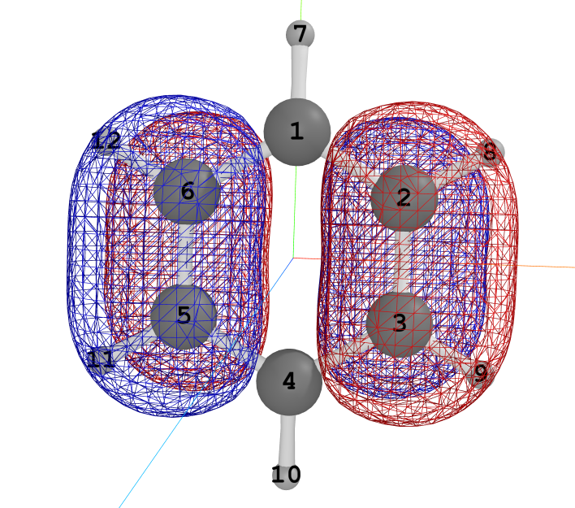

```python
from importlib.metadata import version
print(version('pywfn'))
from datetime import datetime
print(datetime.now())
```

    1.0.17
    2026-07-02 00:04:40.652826
    

# 键的性质

所有的键性质计算器都包含在`pywfn.bondprop`子包下，其中的每一个模块封装了一种类型键性质计算器

其包含的模块有

- `order` 计算各种键级

emm，目前也就只包含计算键级 (lll￢ω￢)

每个模块下都有一个`Calculator`类，实例化时传入要计算的分子即可

## 键级

### Mayer键级
计算所有原子的mayer键级，最经典的键级之一

**计算公式**

$$
BO_{I,J}=\sum _{\mu \in I,\nu \in J}(PS)_{\mu \nu}(PS)_{\nu \mu}
$$

**示例代码**

计算苯环的mayer键级，打印大于0.05的结果


```python
from pywfn.base import Mole
from pywfn.bondprop import order

mole=Mole.from_file('./mols/C6H6.out')
caler=order.Calculator(mole)
omat=caler.mayer()
natm=mole.atoms.len() # 原子的数量
for i in range(0,natm-1):
    for j in range(i+1,natm):
        val=omat[i,j]
        if val<0.05:continue
        print(f"{i+1:>2}-{j+1:>2}:{val:>10.4f}")
```

     1- 2:    1.4533
     1- 4:    0.0980
     1- 6:    1.4533
     1- 7:    0.9305
     2- 3:    1.4533
     2- 5:    0.0980
     2- 8:    0.9305
     3- 4:    1.4533
     3- 6:    0.0980
     3- 9:    0.9305
     4- 5:    1.4533
     4-10:    0.9305
     5- 6:    1.4533
     5-11:    0.9305
     6-12:    0.9305
    

可以看到，相邻C-C之间的键级为1.4533，C-H之间的键级为0.9305，对位的C之间也有微弱的键级0.0980

### Wiberg键级

**示例代码**

计算苯环的wiberg键级，打印大于0.05的结果


```python
from pywfn.base import Mole
from pywfn.bondprop import order

mole=Mole.from_file('./mols/C6H6.out')
caler=order.Calculator(mole)
omat=caler.wiberg()
natm=mole.atoms.len() # 原子的数量
for i in range(0,natm-1):
    for j in range(i+1,natm):
        val=omat[i,j]
        if val<0.05:continue
        print(f"{i+1:>2}-{j+1:>2}:{val:>10.4f}")
```

     1- 2:    1.5025
     1- 3:    0.0601
     1- 4:    0.1169
     1- 5:    0.0601
     1- 6:    1.5025
     1- 7:    0.9047
     2- 3:    1.5052
     2- 4:    0.0601
     2- 5:    0.1173
     2- 6:    0.0588
     2- 8:    0.9040
     3- 4:    1.5025
     3- 5:    0.0588
     3- 6:    0.1173
     3- 9:    0.9040
     4- 5:    1.5025
     4- 6:    0.0601
     4-10:    0.9047
     5- 6:    1.5052
     5-11:    0.9040
     6-12:    0.9040
    

wiberg键级比mayer键级大一些

### 轨道键级

用于判断某个分子轨道中的键是成键还是反键

**示例代码**



苯环的反键轨道


```python
from pywfn.base import Mole
from pywfn.bondprop import order

mole=Mole.from_file('./mols/C6H6.out')
caler=order.Calculator(mole)
omat=caler.order_obt("mayer",20)
natm=mole.atoms.len() # 原子的数量
for i in range(0,natm-1):
    for j in range(i+1,natm):
        val=omat[i,j]
        if abs(val)<0.05:continue
        print(f"{i+1:>2}-{j+1:>2}:{val:>10.4f}")
```

     2- 3:    0.4214
     2- 5:    0.0726
     2- 6:   -0.2488
     3- 5:   -0.2488
     3- 6:    0.0726
     5- 6:    0.4214
    

计算2-6之间、3-5之间是反键轨道，与图像相符

### 方向键级

根据pocv算法，将指定的键的两个原子的原子轨道投影到指定的方向上，得到的投影系数矩阵带入Mayer键级计算公式得到方向键级

**示例代码**


```python
from pywfn.base import Mole
from pywfn.bondprop import order
import numpy as np

mole=Mole.from_file('./mols/C6H6.out')
caler=order.Calculator(mole)
bond=(1,2)
dir_=np.array([0.,0.,1.])
dirs={
    0:[0.,0.,1.],
    1:[0.,0.,1.],
}
omat=caler.pocv(dirs,False,False) # 我们对四个原子的轨道投影到随机的方向
np.sqrt(omat[0,1])
```


    np.float64(0.6836355015203792)


### π键级(pocv)
使用pocv方法计算得到的π键级：将每个原子的p分子轨道投影到其法向量方向上，根据得到的投影系数矩阵带入Mayer键级计算得到π键级

**示例代码**


```python
from pywfn.base import Mole
from pywfn.bondprop import order

mole=Mole.from_file('./mols/C6H6.out')
caler=order.Calculator(mole)
dirs,omat=caler.pi_pocv()
natm=mole.atoms.len() # 原子的数量
for i in range(0,natm-1):
    for j in range(i+1,natm):
        val=omat[i,j]
        if abs(val)<0.05:continue
        print(f"{i+1:>2}-{j+1:>2}:{val:>10.4f}")
print(dirs) # 原子的投影方向
```

     1- 2:    0.6606
     1- 3:    0.0593
     1- 4:    0.3128
     1- 5:    0.0593
     1- 6:    0.6606
     2- 3:    0.6606
     2- 4:    0.0593
     2- 5:    0.3128
     2- 6:    0.0593
     3- 4:    0.6606
     3- 5:    0.0593
     3- 6:    0.3128
     4- 5:    0.6606
     4- 6:    0.0593
     5- 6:    0.6606
    {5: [-0.0, -0.0, 1.0], 2: [0.0, 0.0, 1.0], 1: [0.0, 0.0, 1.0], 0: [-0.0, -0.0, 1.0], 3: [0.0, 0.0, 1.0], 4: [0.0, 0.0, 1.0]}
    

### π键级(mocv)
使用mocv方法计算得到的π键级

**示例代码**


```python
from pywfn.base import Mole
from pywfn.bondprop import order

mole=Mole.from_file('./mols/C6H6.out')
caler=order.Calculator(mole)
stms,atos,omat=caler.pi_mocv()
natm=mole.atoms.len() # 原子的数量
for i in range(0,natm-1):
    for j in range(i+1,natm):
        val=omat[i,j]
        if abs(val)<0.05:continue
        print(f"{i+1:>2}-{j+1:>2}:{val:>10.4f}")
for atm,stm in stms.items():
    print(atm,stm)
print(atos) # 保留原子轨道索引
```

     1- 2:    0.6705
     1- 3:    0.0530
     1- 4:    0.3174
     1- 5:    0.0530
     1- 6:    0.6705
     2- 3:    0.6705
     2- 4:    0.0530
     2- 5:    0.3175
     2- 6:    0.0529
     3- 4:    0.6705
     3- 5:    0.0529
     3- 6:    0.3175
     4- 5:    0.6705
     4- 6:    0.0530
     5- 6:    0.6705
    3 T  ex: (  0.0000  0.0000  1.0000)  |  ey: ( -1.0000  0.0000  0.0000)  |  ez: (  0.0000  1.0000 -0.0000)
    2 T  ex: (  0.0000  0.0000  1.0000)  |  ey: ( -0.5000 -0.8660  0.0000)  |  ez: ( -0.8660  0.5000  0.0000)
    1 T  ex: (  0.0000  0.0000  1.0000)  |  ey: (  0.5000 -0.8660  0.0000)  |  ez: ( -0.8660 -0.5000  0.0000)
    4 T  ex: (  0.0000  0.0000  1.0000)  |  ey: ( -0.5000  0.8660  0.0000)  |  ez: (  0.8660  0.5000 -0.0000)
    5 T  ex: ( -0.0000 -0.0000  1.0000)  |  ey: (  0.5000  0.8660  0.0000)  |  ez: (  0.8660 -0.5000  0.0000)
    0 T  ex: ( -0.0000 -0.0000  1.0000)  |  ey: (  1.0000  0.0000  0.0000)  |  ez: (  0.0000 -1.0000  0.0000)
    [2, 6, 12, 13, 17, 21, 27, 28, 32, 36, 42, 43, 47, 51, 57, 58, 62, 66, 72, 73, 77, 81, 87, 88]
    

### 分解键级
使用`mocv`方法，根据每种键类型所需的原子轨道，将两个原子之间的键级进行拆分

得到四个键级，分别为：σ键级、π键级、δ键级

**示例代码**


```python
from pywfn.base import Mole
from pywfn.bondprop import order

mole=Mole.from_file('./mols/C6H6.out')
caler=order.Calculator(mole)
caler.decom([0,1])
```


    [0.011991834183650428, 0.011991834183650428, 0.011991834183650428]


啊哦，(⊙o⊙)？ 现在算的貌似还不对呢
