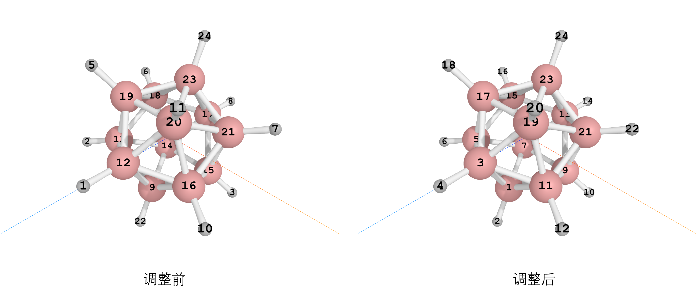

# 调整原子顺序

## 背景

使用高斯建模得到的$B_{12}H_{12}^{2-}$分子的结构上相邻的B-H在原子顺序上不相邻，这就导致分析轨道系数的时候不方便，因此使用pywfn写个脚本来调整原子顺序

## 代码

```py
from pywfn.base import Mole
from pywfn.reader import LogReader
from pywfn.writer import GjfWriter

import numpy as np

path=rf"c:\Users\11032\Desktop\gfile\碳硼烷\B12H12_21_wfn.log"
reader=LogReader(path)
mole=Mole(reader)

map_dick={}

for i,sym in enumerate(mole.syms):
    if sym!="B":continue
    old_dist=100
    map_dick[i]=0
    for j,sym in enumerate(mole.syms):
        if sym!="H":continue
        dist=np.linalg.norm(mole.xyzs[i]-mole.xyzs[j])
        if dist<old_dist:
            map_dick[i]=j
            old_dist=dist

syms=[]
xyzs=[]
for key,val in map_dick.items():
    print(key,val)
    syms.append(mole.syms[key])
    xyzs.append(mole.xyzs[key])
    syms.append(mole.syms[val])
    xyzs.append(mole.xyzs[val])

writer=GjfWriter()
writer.set_syms(syms)
writer.set_xyzs(np.array(xyzs))
writer.set_chk("B12H12")
writer.set_job("m062x 6-311g nosymm pop=full gfinput")
writer.set_charge(-2)
writer.set_multip(1)
writer.save("test.gjf")
```

## 结果


调整之后所有的B-H的原子索引是相邻的了
