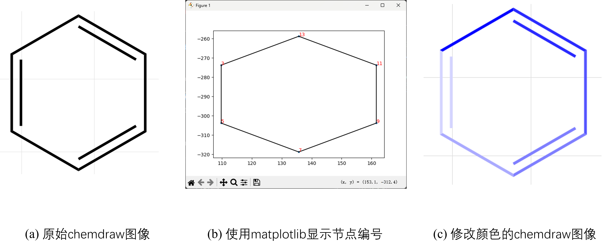

# ChemDraw设置颜色

## 背景

在计算pi键级之后，需要将其映射为chendraw的键的颜色，一根键一根键地改太麻烦了，因此再pywfn中添加了直接设置键颜色的功能

## 代码

```py
from pywfn.tools import xml


# 数值到颜色的映射，数值要处于最大值和最小值之间
def color_map(val, vmin, vmax):
    ratio = (val - vmin) / (vmax - vmin)
    c0 = [1.0, 1.0, 1.0]  # 白色
    c1 = [0.0, 0.0, 1.0]  # 蓝色
    R = c0[0] + (c1[0] - c0[0]) * ratio
    G = c0[1] + (c1[1] - c0[1]) * ratio
    B = c0[2] + (c1[2] - c0[2]) * ratio
    return (R, G, B)


path = r"c:\Users\11032\Desktop\test.cdxml"
tool = xml.Tool(path)
# 1.显示图像
tool.show()
# 2.设置颜色
# 设置数据，原子1、原子2、数值(键级)
data = [
    [3, 5, 1.0],
    [5, 7, 2.0],
    [7, 9, 3.0],
    [9, 11, 4.0],
    [11, 13, 5.0],
    [13, 3, 6.0],
]
for a1, a2, val in data:
    color = color_map(val, 0.0, 6.0)
    tool.set_color((a1, a2), color)
tool.save("new.cdxml")

```

## 结果

如图所示(a)是再chemdraw直接绘制的苯环，全是黑色的。(b)是使用matplotlib绘制的键的节点编号，在代码中可以通过指定键两侧的节点设置键的颜色。(c)是设置颜色之后的chemdraw图像


