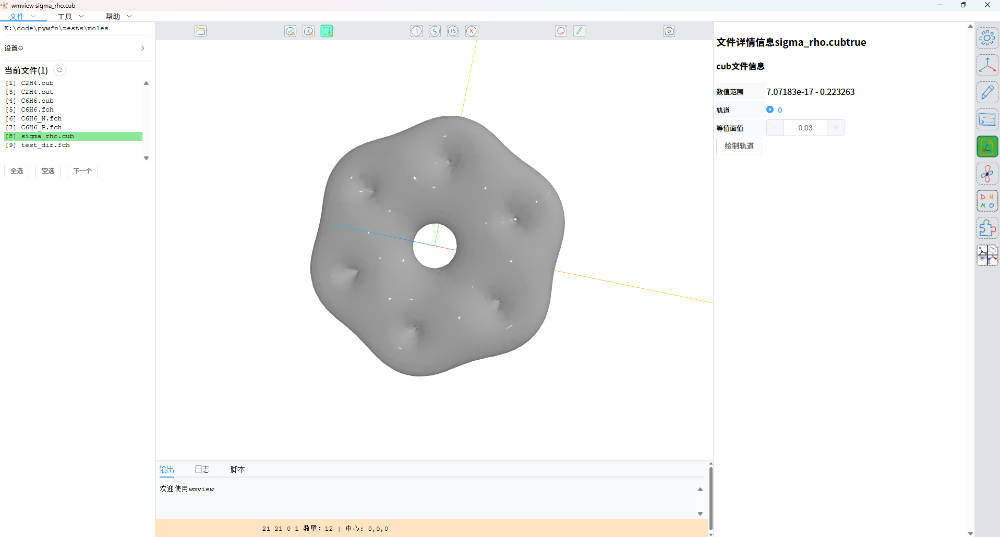

# 任意原子轨道的电子密度

## 背景

虽然大部分时间都是在看$\pi$电子密度，但是有时候还需要能够看任意原子轨道形成的电子密度

## 代码

使用mocv方法计算保留局部坐标系的任意成分的分子轨道，然后计算电子密度，将结果保存为cub文件使用wmview可视化

```py
from pywfn.atomprop import direction
from pywfn.base import Mole
from pywfn.gridprop import CubeGrid, density
from pywfn.orbtprop import obtmat
from pywfn.writer import CubWriter

mole = Mole.from_file(r"c:\Users\11032\Desktop\gfile\pywfn\C6H6.fch")  # 加载分子

dir_caler = direction.Calculator(mole)  # 方向计算器
natm = mole.atoms.len()  # 原子个数
nato = mole.basis.atos.len()
stms = {}
atos = []  # mocv方法用到的参数
ato_syms = mole.basis.atos.syms()
for atm in range(natm):
    stm = dir_caler.LCS(atm)  # 原子的局部坐标系
    stms[atm] = stm
    atos.append(atm)
for i in range(nato):
    ato_sym = ato_syms[i]
    if ato_sym in ["PX"]:
        atos.append(i)
cmat_caler = obtmat.Calculator(mole)  # 分子轨道计算器
cmat_mocv = cmat_caler.mocv(stms, atos)  # 计算mocv方法的分子轨道
mole.set_cmat("raw", cmat_mocv)  # 修改分子轨道为mocv方法的分子轨道

dens_caler = density.Calculator(mole)  # 电子密度计算器
p0, p1 = mole.border()  # 分子边界（包围分子的盒子）
grid_caler = CubeGrid()  # 格点计算器
step = 0.2  # 格点步长
bord = 4.0  # 格点扩展
grid_caler.set_v1(p0, p1, step, bord)  # 设置格点参数
shape, grids = grid_caler.get()  # 格点形状和数值
dens = dens_caler.mol_rho_cm(grids, 0)[0].reshape(1, -1)  # 计算电子密度 [格点数,轨道数]

writer = CubWriter()  # cub文件写入器
writer.read_mole(mole)  # 从分子中读取原子类型和坐标
x0, y0, z0 = p0
writer.set(
    obts=[-1],  # 因为是电子密度，所以轨道序号为-1
    pos0=[x0 - bord, y0 - bord, z0 - bord],  # 真实格点盒子比分子盒子大
    size=shape,  # 格点形状
    step=[step, step, step],  # 格点步长
    vals=dens,  # 格点数值（电子密度）
)
writer.save(r"E:\code\pywfn\tests\moles\sigma_rho.cub")  # 保存为cub文件

```

## 结果



这个示例计算了仅保留了局部坐标系下的*px*和*py*原子轨道，可以看到原子所在的位置的*pz*电子没了，很合理
